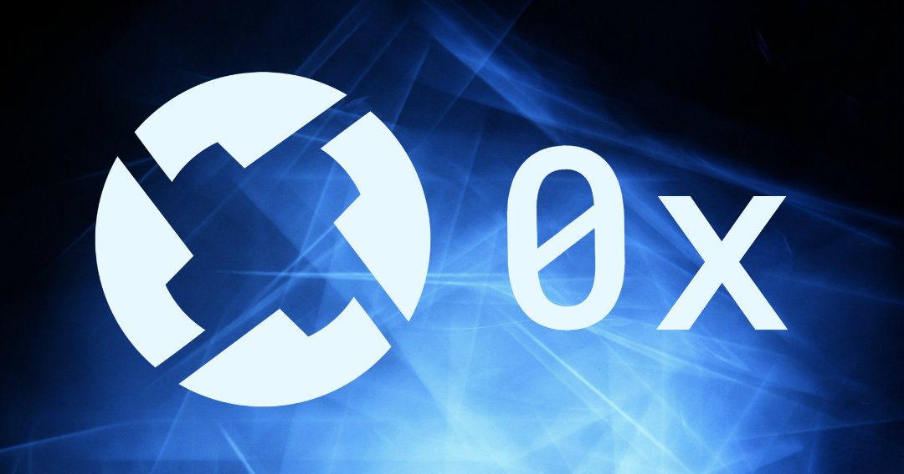

## Table of Contents

## What is 0x Protocol?

0x Protocol is an open-source, decentralized exchange infrastructure built on the Ethereum blockchain. It allows users to trade ERC-20 tokens (a standard for tokens on Ethereum) directly with one another without the need for a centralized intermediary, like a traditional exchange. Essentially, it’s a system that facilitates peer-to-peer trading in a trustless way, meaning you don’t have to rely on a middleman to hold your funds or execute trades.

The protocol provides the underlying framework—think of it as the plumbing—for creating decentralized applications (dApps) or marketplaces where people can swap tokens. It uses smart contracts to handle the rules of trading, ensuring transactions are secure and transparent. Anyone can tap into it, whether they’re building their own trading platform or just swapping tokens through an existing one that uses 0x under the hood. It’s all about enabling flexibility, efficiency, and control over your own assets in the crypto world.

## Why is understanding 0x Protocol useful for algorithmic trading?

Algorithmic traders thrive on speed, efficiency, and access to liquidity. Understanding 0x Protocol opens up new design possibilities for trading strategies that operate in decentralized finance (DeFi) environments. Unlike centralized exchanges that require account creation and impose withdrawal limits or API rate throttling, 0x enables peer-to-peer token trading on Ethereum through smart contracts, allowing traders to execute arbitrage, market making, or statistical trading strategies directly from their wallets.

More importantly, 0x offers composability — its architecture allows integration into other DeFi protocols, such as lending platforms, aggregators, and on-chain order flow networks. This is ideal for constructing multi-leg strategies or liquidity mining bots. Traders can also access off-chain order books via relayers, reducing on-chain gas costs while preserving the finality and transparency of on-chain settlement.

Additionally, understanding 0x helps traders build infrastructure for high-frequency or event-driven trading in crypto markets that operate 24/7. It provides flexibility in designing bots that react to DEX order flow, or that quote liquidity across multiple decentralized venues. This knowledge becomes even more valuable as Ethereum scaling solutions (like rollups) bring latency down and gas costs further decrease, making DEX-based algorithmic trading more competitive with centralized alternatives.

In short, 0x Protocol is not just a tool for DeFi developers — it’s a frontier for quants looking to build fast, permissionless, and capital-efficient trading strategies.

## How does 0x Protocol work?

0x Protocol works by providing a framework of smart contracts on the Ethereum blockchain that enables peer-to-peer token trading without a centralized authority. Here’s a breakdown of how it operates:

At its core, 0x uses an off-chain [order book](/wiki/order-book-trading-strategies) and on-chain settlement system. This hybrid approach keeps things efficient. Users create trade orders—basically instructions saying, “I want to swap this token for that one at this price”—off-chain, meaning outside the blockchain. These orders are then shared through what’s called relayers, which are like decentralized matchmakers. Relayers host these order books and help buyers and sellers find each other, often charging a small fee for the service.

When two parties agree on a trade, the actual swap happens on-chain via Ethereum smart contracts. The 0x smart contracts verify the order details—like making sure the signatures match and the funds are available—then execute the transfer of tokens directly between the users’ wallets. No funds are held by a middleman; they move straight from one user to the other.

The ZRX token ties into this by powering governance (letting holders vote on protocol changes) and sometimes paying relayer fees. The system’s open design also lets developers plug into it, building custom trading apps or integrating 0x into existing platforms. It’s a streamlined way to trade tokens while keeping control in users’ hands and leveraging Ethereum’s security.

## What is the purpose of 0x Protocol?

The purpose of 0x Protocol is to create a standardized, open system for decentralized token trading on the Ethereum blockchain. It aims to make swapping ERC-20 tokens seamless, secure, and accessible without relying on centralized exchanges that can be points of failure—think hacks, outages, or custodial risks. By offering a flexible infrastructure, 0x empowers users to trade directly with each other while keeping control of their own assets.

Beyond just facilitating trades, its goal is to serve as a building block for the broader decentralized ecosystem. It lets developers craft their own trading platforms, marketplaces, or financial tools on top of it, fostering innovation in DeFi (decentralized finance). The protocol also seeks to reduce friction in token exchanges—like high costs or complexity—by combining off-chain efficiency with on-chain trust. Ultimately, 0x is about enabling a more open, interoperable, and user-driven financial landscape in the crypto space.

## Who created 0x Protocol and when?

0x Protocol was created by Will Warren and Amir Bandeali, along with a team of co-founders, in 2016. The project officially launched its initial version in 2017 after raising funds through a token sale for its native ZRX token. Warren and Bandeali, both with backgrounds in engineering and finance, started the initiative under the banner of 0x Labs (initially called ZeroEx, Inc.), a company focused on building decentralized exchange infrastructure. Their vision took shape at a time when Ethereum’s ecosystem was growing, and the need for trustless trading solutions was becoming clear. Since then, the protocol has evolved through community input and multiple upgrades.

## What are the key features of 0x Protocol?

0x Protocol comes with a set of standout features that make it a go-to for decentralized trading on Ethereum. Here’s what sets it apart:

- **Open-Source Framework**: It’s freely accessible, letting anyone use or build on it without permission, fostering a wide range of applications.

- **Peer-to-Peer Trading**: Users swap ERC-20 tokens directly with each other via smart contracts, cutting out centralized custodians.

- **Off-Chain Order Relay**: Orders are created and matched off-chain through relayers, keeping Ethereum gas costs low until the trade is finalized on-chain.

- **On-Chain Settlement**: The actual token swaps happen on Ethereum, ensuring transparency and security through smart contract execution.

- **Relayer System**: Relayers host order books and facilitate trades, adding flexibility and allowing for custom marketplaces with their own fees or interfaces.

- **ZRX Token Integration**: The native token powers governance (voting on protocol updates) and can be used for relayer fees, aligning incentives across the ecosystem.

- **Interoperability**: It’s designed to work with any ERC-20 token, making it a versatile backbone for trading a huge variety of assets.

- **Developer-Friendly**: With modular smart contracts and APIs, devs can easily integrate 0x into dApps, wallets, or bespoke trading platforms.

- **Non-Custodial**: Users keep control of their funds at all times—no depositing into an exchange—reducing risks like hacks or mismanagement.

- **Gas Efficiency**: By handling order matching off-chain, it minimizes blockchain bloat and keeps transaction costs in check compared to fully on-chain alternatives.

- **Upgradability**: The protocol evolves through community governance, ensuring it can adapt to new needs or tech advancements.

- **Liquidity Aggregation**: It supports pooling liquidity across relayers and apps, helping users find better prices and deeper markets.

These features combine to make 0x a robust, flexible tool for decentralized exchange, balancing usability with the ethos of self-sovereignty in crypto.

## What is the ZRX token and its role in the protocol?

The ZRX token is the native [cryptocurrency](/wiki/cryptocurrency) of the 0x Protocol, built as an ERC-20 token on the Ethereum blockchain. It serves two main roles that keep the ecosystem ticking.

First, it’s a governance token. Holders of ZRX can vote on changes or upgrades to the protocol, like tweaking smart contracts or adjusting parameters. This decentralized decision-making ensures the community has a say in how 0x evolves, aligning it with users’ and developers’ needs over time.

Second, ZRX is used for fees in some cases. Relayers—those off-chain services that match buyers and sellers—can charge fees for their role in facilitating trades, and they often accept ZRX as payment. While not mandatory (relayers can set fees in any token), using ZRX ties the token’s utility to the protocol’s activity, creating a practical demand for it.

In short, ZRX acts as both a steering wheel for governance and a fuel for transactions within the 0x ecosystem, incentivizing participation and keeping the protocol decentralized and functional.

## How does 0x Protocol differ from centralized exchanges?

0x Protocol stands apart from centralized exchanges (like Coinbase or Binance) in some fundamental ways, rooted in its decentralized design. Here’s how they differ:

- **Custody of Funds**: Centralized exchanges hold your assets in their wallets, meaning you trust them to keep your funds safe. With 0x, trades happen peer-to-peer via smart contracts, so you keep control of your tokens in your own wallet until the swap occurs—no middleman takes custody.

- **Control and Trust**: Centralized platforms act as intermediaries, managing order books, matching trades, and executing them. They can freeze accounts, restrict withdrawals, or go offline. 0x relies on open smart contracts and relayers, removing that single point of control and letting users trade directly, trustlessly.

- **Order Management**: On centralized exchanges, order books are hosted internally. 0x uses an off-chain order relay system where relayers broadcast orders, keeping costs low, with settlement finalized on-chain. This hybrid approach contrasts with the fully centralized, on-server model.

- **Security Risks**: Centralized exchanges are juicy targets for hackers—think Mt. Gox or more recent breaches. Since 0x doesn’t pool funds in one place, there’s no central honeypot; your security depends on your wallet and Ethereum’s blockchain.

- **Access and Permission**: Centralized platforms require sign-ups, KYC (Know Your Customer) checks, and can limit who gets in based on location or rules. 0x is permissionless—anyone with an Ethereum wallet and internet access can use it or build on it.

- **Transparency**: Centralized exchanges operate behind closed doors; you don’t see the guts of their system. 0x’s smart contracts are open-source, auditable by anyone, and trades are verifiable on Ethereum’s public ledger.

- **Fees and Flexibility**: Centralized exchanges set their own fee structures, often fixed. With 0x, relayers can compete, setting custom fees or even offering free trades, giving users more options.

- **Asset Scope**: Centralized exchanges list specific tokens they choose. 0x supports any ERC-20 token, offering broader trading possibilities without a gatekeeper’s approval.

In essence, 0x flips the script: it’s about user empowerment, decentralization, and openness versus the centralized model’s convenience, speed, but also opacity and reliance on trust.

## What are relayers in the context of 0x Protocol?

In the context of 0x Protocol, relayers are decentralized services or entities that help facilitate trading by managing the off-chain side of the process. They act like matchmakers for buyers and sellers, bridging the gap between creating a trade and executing it on Ethereum.

Here’s what they do: Relayers host and broadcast order [books](/wiki/algo-trading-books)—lists of buy and sell offers (called orders) that users create off-chain. These orders specify what tokens someone wants to trade, how much, and at what price. Since this happens off-chain, it doesn’t clog up Ethereum or rack up gas fees until the trade is ready to settle. Relayers share these orders with the network, often through APIs or user-friendly interfaces like trading apps or websites, so others can browse and pick a deal that works for them.

When a match is found—say, a buyer agrees to a seller’s terms—the relayer doesn’t execute the trade itself. Instead, it hands the baton to Ethereum’s smart contracts, where the swap is finalized on-chain, directly between the users’ wallets. Relayers can charge a fee for their service, often in ZRX or another token, which they set themselves. This makes them a bit like decentralized mini-exchanges, but without holding anyone’s funds.

Think of relayers as the grease in 0x’s wheels: they keep trades efficient and accessible while staying true to the protocol’s non-custodial, decentralized ethos. Anyone can run a relayer, from individuals to businesses, adding flexibility and competition to the ecosystem.

## How does 0x Protocol ensure security and decentralization?

0x Protocol ensures security and decentralization through a combination of its design, Ethereum’s backbone, and community-driven mechanisms. Here’s how it pulls this off:

For **security**:
- **Smart Contracts**: Trades are executed via audited, open-source smart contracts on Ethereum. These contracts enforce rules—like verifying signatures and funds—automatically, reducing human error or manipulation risks. Being public, anyone can review the code for vulnerabilities.
- **Non-Custodial**: Funds stay in users’ wallets until the moment of trade, not pooled in a central account. This eliminates the “hack me” target that centralized exchanges face—no single point holds everyone’s assets.
- **Ethereum’s Security**: 0x leans on Ethereum’s robust network of miners and nodes. A trade’s final settlement is as secure as Ethereum itself, which has a massive, battle-tested infrastructure guarding against attacks.
- **Order Validation**: Before a trade settles, the smart contracts check that the order hasn’t been tampered with (via cryptographic signatures) and that both parties have the tokens they’re promising. No funny business gets through.

For **decentralization**:
- **Open Protocol**: Anyone can use or build on 0x—no gatekeepers or permissions needed. This spreads control across a global pool of users and developers, not a single company.
- **Relayers**: Instead of one central order book, independent relayers host orders off-chain. They’re optional middlemen who don’t control funds, and anyone can run one, preventing a monopoly on trade facilitation.
- **Peer-to-Peer Trades**: The protocol enables direct wallet-to-wallet swaps. No intermediary owns the process; it’s just you, the other trader, and Ethereum’s blockchain.
- **Governance with ZRX**: Token holders vote on protocol changes, distributing decision-making power across the community rather than a top-down authority. This keeps 0x adaptable without a central chokehold.
- **No Single Point of Failure**: Unlike a centralized server that could crash or be shut down, 0x’s reliance on Ethereum and scattered relayers means it keeps running as long as the blockchain does.

By baking security into its smart contracts and decentralization into its structure, 0x avoids the pitfalls of centralized control while leveraging Ethereum’s trustless environment. It’s a system where you’re in charge, and the tech has your back.

## What types of assets can be traded using 0x Protocol?

0x Protocol is built to handle the trading of ERC-20 tokens, which are a widely used standard for assets on the Ethereum blockchain. This means any token that follows the ERC-20 rules can be swapped using 0x, opening up a broad range of asset types. Here’s what that includes:

- **Cryptocurrencies**: Tokens like stablecoins (e.g., USDC, DAI), utility tokens (e.g., Chainlink’s LINK), or governance tokens (e.g., UNI from Uniswap) are all fair game.
- **Wrapped Assets**: Tokens representing other blockchains’ coins, like Wrapped Bitcoin (WBTC), which brings Bitcoin’s value into Ethereum’s ecosystem.
- **DeFi Tokens**: Assets tied to decentralized finance projects, such as lending platform tokens (e.g., AAVE) or yield farming rewards.
- **NFT-Related Tokens**: While 0x itself doesn’t trade ERC-721 or ERC-1155 NFTs directly (those are different standards), some NFT projects issue ERC-20 tokens for governance or fractional ownership, and those can be traded.
- **Synthetic Assets**: Tokens mimicking real-world assets—like stocks, commodities, or fiat currencies—created by platforms like Synthetix (e.g., sETH or sUSD).
- **Custom Tokens**: Literally any ERC-20 token someone creates, from a small project’s coin to a quirky meme token, as long as it’s on Ethereum.

The catch? It’s limited to Ethereum’s ERC-20 universe. You can’t trade native Bitcoin, Solana tokens, or non-Ethereum assets directly—those would need to be “wrapped” into an ERC-20 format first. Since the ERC-20 standard is so popular, though, 0x covers thousands of tokens, from big names to niche experiments, making it a versatile tool for Ethereum-based trading.

## How can developers build on top of 0x Protocol?

Developers can build on top of 0x Protocol by tapping into its open-source smart contracts and tools, using it as a foundation for creating decentralized trading apps or integrating token swaps into existing platforms. Here’s how they can get started and what’s possible:

- **Smart Contracts**: The core of 0x is a set of Ethereum smart contracts (like the Exchange contract) that handle token swaps. Developers can interact with these directly using Solidity or other Ethereum-compatible languages, calling functions to execute trades or query orders. The contracts are well-documented and publicly available.

- **0x API**: For a simpler approach, the 0x API acts as a ready-made gateway. It aggregates liquidity from relayers and other sources, letting devs plug swap functionality into their app with just a few HTTP calls. Want to add a “trade” button to your dApp? This is the quick way.

- **Relayer Creation**: Devs can build their own relayer—a service that hosts off-chain order books. This involves setting up a server to manage orders, broadcast them to users, and optionally charge fees. It’s a deeper dive but lets you craft a custom trading experience with your own branding or rules.

- **SDKs and Libraries**: 0x offers software development kits (like the JavaScript/TypeScript SDK) that streamline integration. These libraries wrap the smart contract calls and API interactions, making it easier to code trading logic into wallets, games, or DeFi tools without reinventing the wheel.

- **Customization**: Since it’s modular, developers can tweak 0x for specific needs—say, building a marketplace for a niche ERC-20 token set, adding a slick UI, or integrating it with other Ethereum protocols like lending or staking.

- **Examples**: Think of a crypto wallet adding a swap feature, a game letting players trade in-game tokens, or a DeFi dashboard pulling in 0x liquidity. Projects like Matcha (a trading aggregator) or Radar Relay started this way.

All you need is Ethereum dev know-how (e.g., Web3.js or Ethers.js), a node connection, and some creativity. The protocol’s open nature means no permission is required—just fork the code, deploy your tweaks, or hook into the live system. Documentation on 0x’s site walks you through it, and the community’s active if you hit snags. It’s a playground for anyone wanting to weave token trading into their Ethereum project.

## What are the current challenges or limitations of 0x Protocol?

The 0x Protocol, while a pioneering infrastructure for decentralized exchange on the Ethereum blockchain, faces several challenges and limitations as of February 24, 2025. Here’s an overview based on its operational design and the broader context of decentralized finance (DeFi):

1. **Scalability Constraints**: The protocol is built on Ethereum, which, despite ongoing upgrades, still struggles with limited throughput. During periods of high network congestion, this can result in slower transaction times and elevated gas fees. These costs can deter users, particularly for smaller trades where fees might outweigh benefits, making the protocol less efficient compared to centralized alternatives during peak times.

2. **Gas Efficiency Trade-offs**: While 0x employs an off-chain order relay with on-chain settlement to reduce gas costs—allowing orders to be matched off-chain before final execution on Ethereum—users still incur gas fees for the settlement step. These fees can spike unpredictably, especially when Ethereum's network is under heavy load, impacting the cost-effectiveness of trades.

3. **Liquidity Fragmentation**: Liquidity in 0x depends heavily on relayers and decentralized liquidity pools. Unlike centralized exchanges with vast, consolidated liquidity, 0x’s decentralized nature means liquidity is spread across various relayers and protocols. This fragmentation can lead to less competitive pricing or difficulty filling large orders, especially for less popular token pairs, limiting its appeal for high-volume traders.

4. **Regulatory Uncertainty**: Operating as a decentralized exchange infrastructure, 0x exists in a gray area of regulatory oversight. The shutdown of its operations by the U.S. Commodities and Futures Trading Commission (CFTC) in September 2023 for functioning as an unregistered exchange—resulting in a $200,000 fine for its developers at ZeroEx—highlights this risk. Ongoing regulatory ambiguity in the DeFi space could hinder adoption or force operational changes, particularly in jurisdictions with strict financial laws.

5. **Security Risks**: While 0x’s smart contracts are open-source and audited, the broader DeFi ecosystem it operates within remains vulnerable to exploits. Potential bugs in smart contracts, though mitigated by audits, or vulnerabilities in integrated dApps could expose users to risks. The decentralized nature also means users bear full responsibility for their security, which can be a barrier for less technical participants.

6. **Competition and Adoption**: The rise of competing protocols like Uniswap, SushiSwap, and 1inch, which offer similar or enhanced liquidity aggregation and user experiences, poses a challenge. Additionally, 0x’s reliance on developer adoption for integration into dApps means its growth is tied to how effectively it competes in an increasingly crowded market. Its hybrid model (off-chain relay, on-chain settlement) may not always outshine fully on-chain alternatives in terms of simplicity or user perception.

7. **Post-Shutdown Adaptation**: Since the CFTC action in 2023, the protocol’s operational status has shifted. While the core smart contracts remain open-source and theoretically usable, the lack of active maintenance (noted as of June 2024) and a diminished community presence suggest practical limitations. Users and developers may hesitate to rely on a protocol no longer officially supported by its founding team, impacting its ecosystem’s vitality.

These challenges reflect a mix of technical, economic, and regulatory hurdles. Despite its innovative approach to peer-to-peer trading and contributions to DeFi, 0x must navigate Ethereum’s evolving infrastructure, intensifying competition, and an uncertain legal landscape to remain relevant. Its future hinges on community governance via ZRX token holders and potential adaptations to address these persistent issues.

## References & Further Reading

[1]: Warren, W., & Bandeali, A. (2017). ["0x: An Open Protocol for Decentralized Exchange on the Ethereum Blockchain."](https://www.exodus.com/assets/docs/zrx-whitepaper.pdf) 0x Protocol Whitepaper.

[2]: Kenselaar, M. (2021). ["Decentralized Finance: The Future of Finance."](https://papers.ssrn.com/sol3/papers.cfm?abstract_id=3711777) Utrecht University Publications.

[3]: Berentsen, A., & Schär, F. (2017). ["A Short Introduction to the World of Cryptocurrencies."](https://papers.ssrn.com/sol3/papers.cfm?abstract_id=3105283) Federal Reserve Bank of St. Louis Review.

[4]: ["DeFi and the Future of Finance"](https://www.amazon.com/DeFi-Future-Finance-Campbell-Harvey/dp/1119836018) by Campbell R. Harvey, Ashwin Ramachandran, and Joey Santoro.

[5]: Schär, F. (2021). ["Decentralized Finance: On Blockchain- and Smart Contract-Based Financial Markets."](https://papers.ssrn.com/sol3/papers.cfm?abstract_id=3571335) Federal Reserve Bank of St. Louis Review, Second Quarter 2021.

[6]: Zetzsche, D. A., Buckley, R. P., & Arner, D. W. (2020). ["Decentralized Finance."](https://papers.ssrn.com/sol3/papers.cfm?abstract_id=3539194) Journal of Financial Regulation.

[7]: Eric Hess (2020). ["All About Algorithmic Trading"](https://www.researchgate.net/publication/378548435_Algorithmic_Trading_and_AI_A_Review_of_Strategies_and_Market_Impact) NASDAQ.