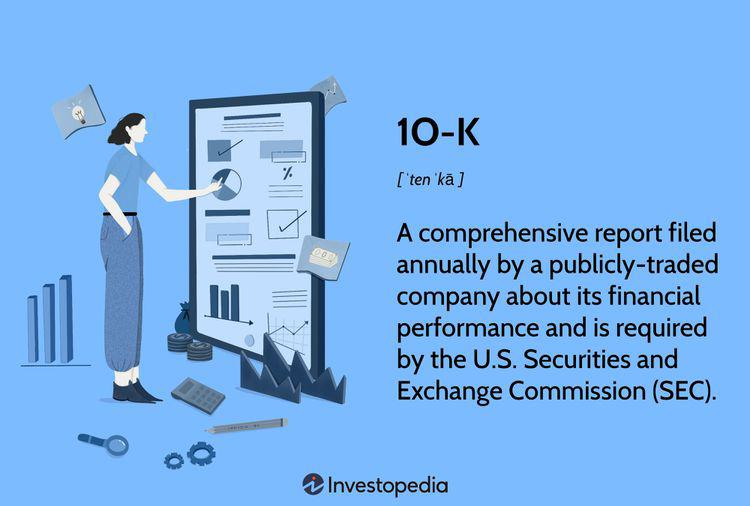

The world of finance is continually advancing, driven by innovations in technology and the need for companies and investors to remain competitive. Central to understanding a company's financial health and performance is the SEC 10-K filing—a comprehensive, annual report required by the U.S. Securities and Exchange Commission for publicly traded companies. This report provides an in-depth overview of a company's financial landscape, offering key insights into its operations, financial condition, market risks, and strategic direction. Such detailed disclosures are indispensable tools for investors seeking to make well-informed investment decisions.

The importance of the 10-K report extends beyond traditional investment analysis, gaining significant relevance in the context of algorithmic trading. Algorithmic trading, which involves using computational algorithms to automate trading decisions, relies heavily on data-driven insights. The 10-K serves as a critical resource, providing the depth of data necessary to develop and refine these trading algorithms, ultimately enhancing their precision and effectiveness.



By understanding the intricacies of the 10-K report, investors can leverage financial information to gain strategic advantages, whether they are engaged in traditional investing or are part of the rapidly evolving field of automated and algorithmic trading. Such knowledge allows for a robust assessment of a company's financial health, helping investors to navigate the complex terrain of financial markets with greater confidence and agility. As the financial sector continues to integrate advanced technologies, mastering the usage of the insights derived from 10-K filings will increasingly become a pivotal factor in achieving sustained investment success.

## Table of Contents

## Understanding the SEC 10-K Filing

The SEC Form 10-K is a crucial annual report mandated by the U.S. Securities and Exchange Commission for companies publicly traded in the United States. This comprehensive document delivers a thorough insight into a company’s financial performance over the fiscal year. The 10-K report serves as an essential tool for investors, analysts, and other stakeholders to evaluate a company's health, strategic direction, and prospects.

The report is structured to provide various layers of information starting from the business overview, which outlines the company's operations, markets, and competitive environment. This section helps investors understand the core activities and strategic positioning of the company within its industry.

Another critical component of the 10-K is the section on risk factors. This segment enumerates potential risks and uncertainties that might impact the company’s future operations and financial results. By revealing various business and market risks, companies can offer investors a more realistic view of challenges that could affect investment outcomes.

A significant portion of the 10-K report is dedicated to financial data, which includes detailed financial statements such as the balance sheet, income statement, cash flow statement, and statement of shareholder’s equity. These statements provide a snapshot of the company’s financial status, including assets, liabilities, revenues, expenses, and cash flows. Historical data within these statements allow investors to analyze trends and patterns in the company’s financial performance.

Supplementary notes accompany the financial statements to offer deeper context and explanations regarding accounting policies, methodologies, and specific line items noted in the primary financial statements. These notes are vital for understanding the nuances of the company’s financial operations and accounting practices.

Management’s discussion and analysis (MD&A) is another key section of the 10-K, where management provides its perspective on the financial results, strategic initiatives, and market conditions. This narrative helps investors evaluate management’s effectiveness and future strategies.

Investors regard the Form 10-K as indispensable for making informed decisions, given its comprehensive nature and in-depth disclosure of a company’s financial and operational standing. Its standardized format ensures consistency and comparability, which is critical when analyzing companies across different sectors. Understanding and analyzing the data and narratives within the 10-K empowers investors to assess the potential risks and rewards of their investment decisions.

## Significance of Financial Disclosure in the 10-K

Financial disclosure within the SEC Form 10-K is an essential component of corporate transparency, providing investors and stakeholders with a comprehensive view of a company’s financial health. This transparency is crucial for fostering investor trust and confidence, which are fundamental pillars of robust and healthy financial markets.

A typical 10-K report encompasses various critical components such as detailed data on revenues, profits, risks, management policies, and the company’s future outlook. For instance, the income statement section highlights the company's revenues and profits, offering insights into its profitability over the past fiscal year. This segment may present figures in a tabular form that outlines income sources and expenses, thereby allowing investors to assess the company's operational efficiency and growth potential.

Furthermore, the section on risk factors is pivotal in enabling investors to understand inherent risks and uncertainties facing the company. This could include market risks, credit risks, or even operational risks, each of which can substantially impact the company's financial stability. Understanding these risks can aid investors in making well-informed risk assessments and investment decisions.

In terms of management policies and future outlooks, the 10-K report provides an overview of strategic initiatives and anticipated market trends that might influence future performance. This information helps investors gauge the company’s strategic direction and potential for long-term growth.

The significance of these financial disclosures extends beyond mere transparency. They ensure compliance with SEC regulations, which is critical for promoting consistency and comparability across different firms. This consistency helps level the playing field, enabling investors to make comparative analyses across industry peers or broader market sectors.

By ensuring that all publicly traded companies adhere to the same rigorous standards of financial disclosure, the 10-K report plays a vital role in maintaining the integrity of financial markets. It equips investors with reliable information necessary to perform thorough due diligence, thus enabling more informed and strategic investment decisions.

## Algorithmic Trading and the Use of the 10-K

Algorithmic trading, or algo trading, refers to the use of complex algorithms to initiate trading decisions based on predefined criteria. Within this framework, the SEC Form 10-K report serves as an invaluable resource by providing a rich dataset of financial information and disclosures. These reports contain quantitative data as well as qualitative insights about a company's operational strategies, risks, and market conditions, making them a critical resource for algorithmic models.

Algorithms employ the extensive data contained within a 10-K report to evaluate a company's financial performance and project potential stock price movements. The key sections of a 10-K, such as the financial statements (including balance sheets, income statements, and cash flow statements), MD&A (management's discussion and analysis), and risk factors, are instrumental for quantitative analysts. By encoding rules from financial theories and statistical models within their algorithms, traders can automate complex analyses to spot opportunities and mitigate risks.

For instance, a trading algorithm might utilize natural language processing (NLP) to extract sentiment from the management's discussion section. By quantifying management's tone—whether optimistic or cautious—traders can integrate sentiment scores into broader trading strategies, potentially correlating positive sentiment with upward stock movement predictions and negative sentiment with downward trends. Combining textual analysis with numerical data leads to more robust prediction models. 

Moreover, key financial metrics derived from the 10-K, such as EBITDA, free cash flow, and earnings per share (EPS), can be mathematically modeled to predict stock valuation changes. Implementing a [machine learning](/wiki/machine-learning) model, one could use these variables as features to predict price movements:

```python
from sklearn.ensemble import RandomForestRegressor
import pandas as pd

# Sample data preparation
features = pd.DataFrame({'EBITDA': [1.2, 1.3, 1.4],
                         'FreeCashFlow': [0.9, 1.0, 1.1],
                         'EPS': [0.5, 0.6, 0.7]})
targets = pd.Series([100, 110, 120])  # Stock price outcomes

# Model training
model = RandomForestRegressor(n_estimators=100)
model.fit(features, targets)

# Prediction
new_data = pd.DataFrame({'EBITDA': [1.5],
                         'FreeCashFlow': [1.2],
                         'EPS': [0.8]})
predicted_price = model.predict(new_data)
print(predicted_price)
```

By automating the analysis of these comprehensive financial disclosures, traders can react more swiftly to market shifts, aiming to capitalize on short-lived opportunities. This transition from manual analysis to automated and data-driven trading strategies offers a competitive advantage in achieving profitable trades.

However, the integration of 10-K data within [algorithmic trading](/wiki/algorithmic-trading) models is not without challenges. Ensuring data accuracy, handling vast data volumes, and maintaining algorithm robustness are essential to leveraging this data effectively. Despite these challenges, the strategic use of 10-K reports in algorithmic trading continues to yield substantial gains and remains a vital component of quantitative investment strategies.

## Challenges and Limitations

The SEC 10-K filing, although comprehensive, poses several challenges and limitations for investors and analysts aiming to extract valuable insights efficiently. One of the primary challenges is the document’s inherent length and complexity, which can be daunting without sufficient financial expertise. Navigating through extensive financial statements, dense tables, and management discussions necessitates a significant level of understanding to interpret the data accurately and efficiently.

A notable limitation within the 10-K is the inclusion of forward-looking statements. While these projections are relevant for assessing potential company directions and strategies, they are often based on estimates and assumptions. These speculative elements require careful scrutiny, as they can significantly impact investment decisions if taken at face value without critical analysis. Investors must consider the assumptions underlying these statements and how changes in market conditions or company performance could affect outcomes.

Moreover, investors need to be aware of potential biases or selective disclosures. Companies may present information in a manner that highlights their strengths while downplaying weaknesses or risks. This practice requires investors to maintain a critical perspective, looking beyond the figures to understand the broader context. Comparing disclosures across different financial periods or against industry benchmarks can offer a more balanced view.

For those utilizing 10-K data in algorithmic trading, several nuances warrant consideration. Although algorithms can process vast amounts of data quickly, they rely heavily on the quality and structure of input data. If forward-looking statements or selective disclosures skew these inputs, the algorithms might not predict stock movements accurately. Ensuring that algorithms incorporate robust analytical frameworks to adjust or compensate for these potential biases can mitigate risks and enhance decision-making accuracy.

In sum, while the SEC 10-K filing is a treasure trove of information critical for investment analysis and strategy formulation, understanding its inherent challenges and limitations is crucial. Mastering the art of dissecting and interpreting 10-K data can prevent missteps and contribute to more informed and strategic investment decisions.

## Conclusion

The SEC 10-K filing remains an indispensable resource for investors, providing a comprehensive overview of a company's financial health and operational status. As financial markets embrace technological advancements, combining 10-K insights with algorithmic trading strategies has emerged as a compelling approach for enhancing investment performance. By integrating detailed financial disclosures into algorithmic trading models, investors can achieve a nuanced understanding of market dynamics, thereby optimizing their trading strategies.

Understanding how to effectively utilize 10-K data is essential for both traditional and algorithmic investors. Traditional investors can benefit from the in-depth analysis that 10-K reports offer, enabling them to make informed decisions based on a thorough assessment of a company's revenue streams, risk factors, and management policies. On the other hand, algorithmic investors can automate the extraction and analysis of key financial indicators from 10-K filings, allowing them to develop and execute data-driven strategies with increased speed and precision.

The ever-evolving nature of financial markets necessitates a proactive approach to information gathering and analysis. Mastering the intersection of 10-K filings and advanced trading technologies can provide investors with a competitive edge, driving more strategic and informed investment decisions. As new technologies continue to reshape the trading landscape, leveraging the rich dataset within 10-K reports will be crucial for sustained investment success in an increasingly competitive market.

## References & Further Reading

[1]: ["Form 10-K"](https://www.sec.gov/search-filings) - U.S. Securities and Exchange Commission

[2]: Palepu, K. G., Healy, P. M., & Peek, E. (2019). ["Business Analysis and Valuation: IFRS Edition Text and Cases."](https://books.google.com/books/about/Business_Analysis_and_Valuation_Using_Fi.html?id=IDT6DwAAQBAJ) Cengage Learning.

[3]: "Fundamentals of Algorithmic Trading" by Benjamin Graham

[4]: Jordan, J. V., & Tobiner, A. (2010). ["Quantitative Equity Portfolio Management: Modern Techniques and Applications."](https://www.taylorfrancis.com/books/mono/10.1201/9781420010794/quantitative-equity-portfolio-management-edward-qian-eric-sorensen-ronald-hua) McGraw-Hill Education.

[5]: ["Algorithmic Trading: Winning Strategies and Their Rationale"](https://books.google.com/books/about/Algorithmic_Trading.html?id=_-zc3SK2vrYC) by Ernest P. Chan