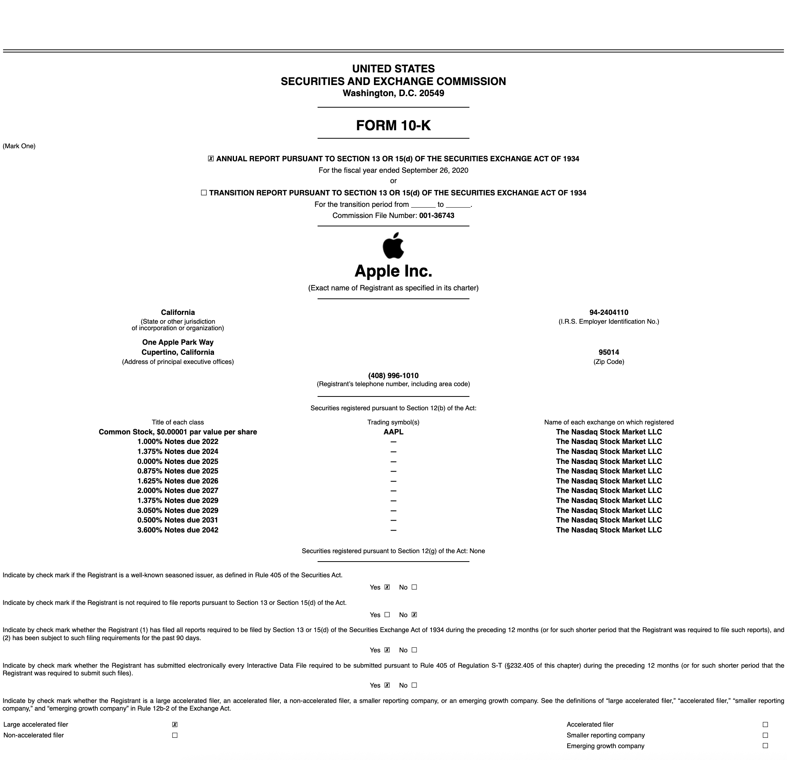
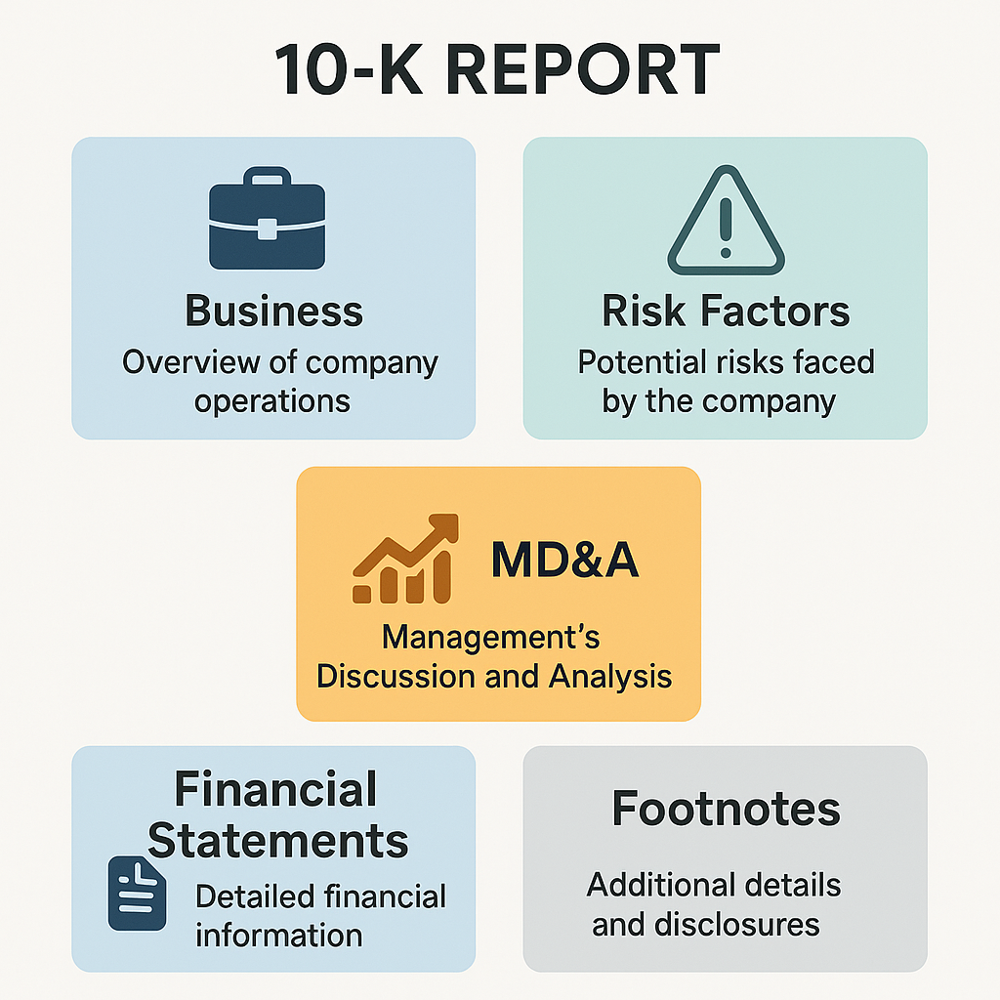
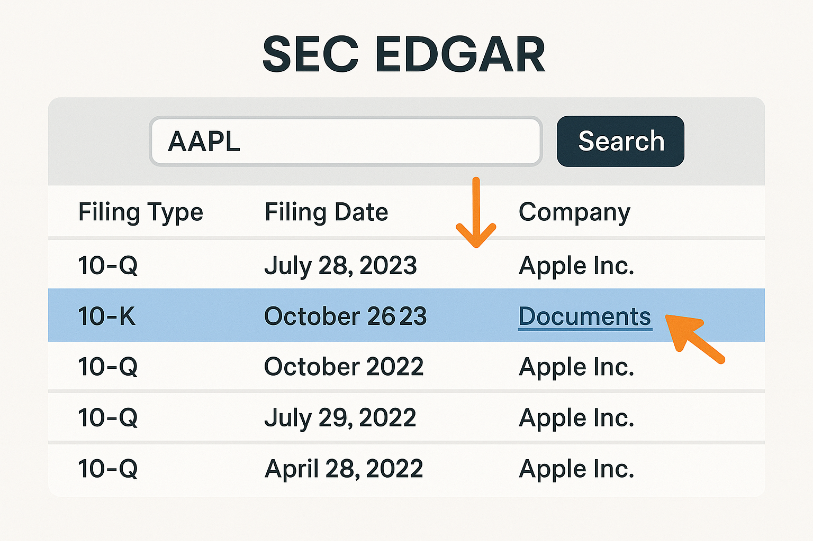
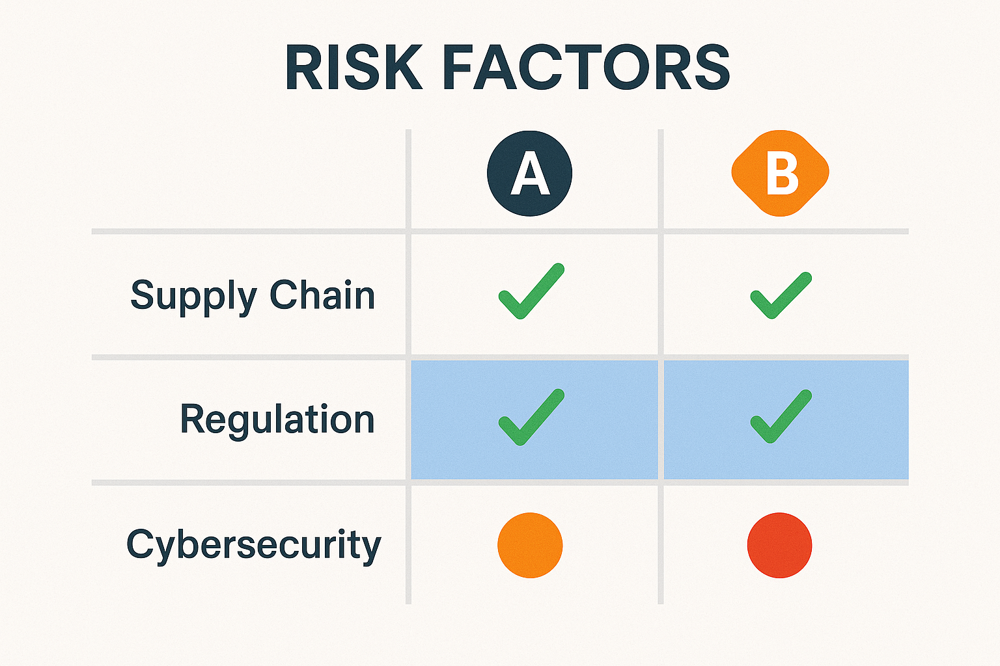
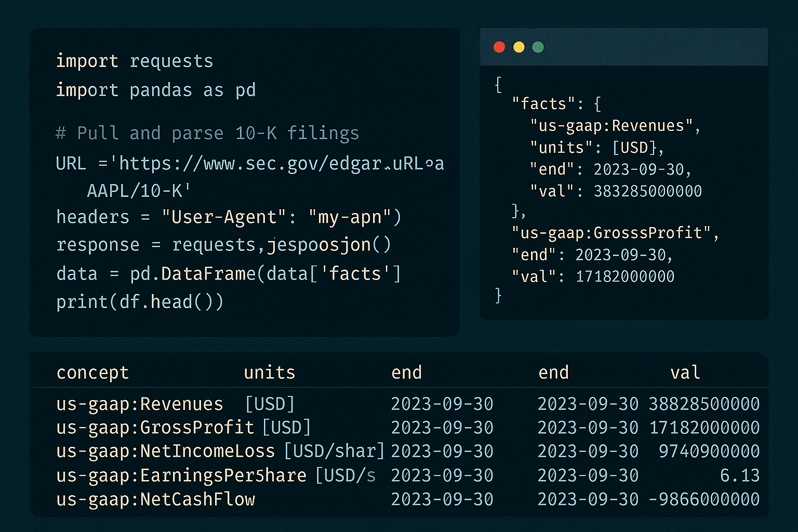

## Table of Contents

## What Is a 10-K Report?

A **Form 10-K** is an annual report that U.S. public companies must file with the Securities and Exchange Commission (SEC). It provides a comprehensive overview of a company’s business, financial performance, and risks for the fiscal year. Although often simply called an “annual report,” the 10-K is a specific regulatory filing distinct from the glossy shareholder reports companies may send to investors. In essence, the 10-K is the authoritative source for detailed information about a company’s operations and financial results, intended to give investors, analysts, and the public a complete picture of the company’s condition.




**Who uses 10-Ks?**

A broad audience relies on 10-K filings, including retail investors researching stocks, finance students learning to analyze companies, professional analysts and portfolio managers conducting due diligence, and data analysts building financial models. The 10-K’s standardized structure and audited data make it a critical tool for **investing decisions, academic research, and financial modeling**. Even legendary investors like Warren Buffett are known to read hundreds of 10-Ks to understand businesses.

Companies must file the 10-K shortly after their fiscal year ends (typically within 60 to 90 days, depending on company size). The report is extensive (often hundreds of pages) and includes both qualitative descriptions and quantitative financial statements. It is prepared by the company (with input from management, legal, and accounting teams) and includes an auditor’s report certifying the financial statements. Because the SEC mandates specific disclosures, all 10-Ks follow a similar **structured format**. This consistency helps readers navigate any company’s 10-K once they are familiar with the layout.

Below, we’ll dive deeper into **the structure of a 10-K**, explain how to interpret each major section, provide practical examples of how 10-K information is used in analysis, and outline how to access 10-K filings (manually via SEC EDGAR or programmatically via APIs and tools). We’ll also introduce some techniques for parsing 10-K data (including Python and natural language processing methods) for those looking to analyze reports at scale.

## Structure of a 10-K: Key Sections Explained



Every 10-K report is organized into several **parts** and **items** as defined by SEC regulations. The major components include:

* **Part I: Business and Risk Overview** – Contains Item 1 **Business**, Item 1A **Risk Factors**, and other introductory items.
* **Part II: Financial Performance** – Contains Item 7 **Management’s Discussion & Analysis (MD\&A)** and Item 8 **Financial Statements**, among other financial disclosures.
* **Part III: Management & Governance** – Contains details often incorporated from the proxy statement, such as executive compensation and corporate governance (Items 10–14).
* **Part IV: Exhibits and Signatures** – Includes Item 15, which lists **exhibits, financial statement schedules**, and the signatures of officers and directors.

Let’s break down the **key sections** of a 10-K and what you can learn from each:

### Item 1 – Business

The Business section provides a description of the company’s operations and organizational structure – essentially “who they are and what they do.” This includes details on the company’s **products and services, business model, subsidiaries, markets of operation, and competitive environment**. Companies may discuss their industry, regulatory environment, seasonality of business, and key resources (like intellectual property or supply chains). In recent years, companies also include discussion of **human capital** (workforce and culture) as required by updated regulations.

This section is a starting point for understanding the company’s fundamental **business model and strategy**. Look for descriptions of the company’s principal revenue streams and geographic regions. Key points to glean include:

* *Revenue generation:* How does the company make money? (e.g., major product lines or services)
* *Growth strategy:* What are the company’s goals and strategic priorities?
* *Competitive landscape:* Who are the main competitors and what differentiates this company?
* *Operational details:* Any significant assets (like facilities in Item 2 **Properties**) or dependencies that are mentioned.

If you’re new to the company, read the Business section closely to ensure you understand the core operations. For example, **Microsoft’s Business section** in its 10-K outlines how the company has shifted toward cloud computing and subscription services in the past decade, reflecting a strategic transformation. If a company’s business model is unclear to you even after reading this section, that could be a red flag – as some experts say, *“if you don’t understand the business, you might want to avoid investing”*.

### Item 1A – Risk Factors

The Risk Factors section is a list of all significant risks the company believes it faces. These can include **market and economic risks, industry-specific challenges, regulatory and legal risks, operational hazards, financial risks, cybersecurity threats, and more**. The risks are generally described in detail, often in bullet or paragraph form, and **usually ordered by relative importance** (with the most critical risks first). Companies tend to include both company-specific risks and broader risks (like general economic downturns) that could affect future results.

For investors and analysts, this section is crucial for **identifying what could go wrong** with the investment. Key considerations:

* The **ordering** of risk factors can signal which issues management deems most serious. For example, if a technology company lists *cybersecurity* as its first risk, that indicates a primary concern.
* Many risk factors use boilerplate language (legal wording) and may appear similar across companies (e.g., most companies mention competition and macroeconomic conditions). Focus on anything unique or specific in the wording that might indicate a particularly acute risk.
* Changes year-over-year in this section are telling. If a new risk appears or a risk moves higher in priority, it may reflect emerging issues. (For instance, after 2020, many companies added pandemic-related risks that were absent before.)

**Practical tip:** Don’t be overwhelmed by the length of this section – even though it can span many pages. Read it for a **holistic understanding of vulnerabilities**. Are there regulatory risks (like dependence on government contracts or pending legislation)? Is the business heavily reliant on one customer or supplier? For example, **Apple’s 10-K risk factors** include the dependence on third-party manufacturers in Asia; this highlights a supply chain concentration risk that analysts would factor into their evaluation of Apple’s operational stability. Investors sometimes summarize risk factors into categories (strategic, financial, operational, etc.) to assess which areas pose the greatest threat to the company’s outlook.

### Item 7 – Management’s Discussion and Analysis (MD\&A)

The MD\&A is management’s narrative analysis of the company’s financial results and condition. In this section, management **discusses the past year’s performance** in detail, often comparing financial results to the prior year (or multiple years) and explaining the causes of major changes. The MD\&A gives context to the numbers: management will highlight things like revenue growth drivers, expense fluctuations, profitability, cash flow, and liquidity positions. It also often discusses **trends and forward-looking information**, such as known events or uncertainties that could affect future performance. (Forward-looking statements in MD\&A are accompanied by cautionary language that they are not guarantees.)

The MD\&A is one of the most insightful sections because it provides the story behind the financial statements. Key things to look for:

* **Management’s explanations:** Do they clearly explain why revenue, expenses, or margins changed? For example, a MD\&A might attribute a 10% sales increase to higher volumes in Asia and new product launches – information you wouldn’t get just from the income statement.
* **Operating metrics:** Sometimes management includes non-financial metrics (like customer counts, same-store sales, user growth, etc.) to contextualize performance.
* **Outlook and strategy:** Look for any discussion of the coming year’s focus, or how management is addressing challenges. While not explicit forecasts, MD\&As can hint at future plans or concerns (e.g., “management is closely monitoring supply chain disruptions and has increased inventory levels to mitigate risk”).
* **Consistency and tone:** Seasoned readers compare the tone of MD\&A over years. Is management overly optimistic or do they acknowledge headwinds frankly? A sudden change in tone (more cautionary language, for instance) could signal upcoming difficulties.

This section allows management to “tell their story in their own words”. For example, if a company had a weak year, the MD\&A should explain the reasons (perhaps market conditions or specific one-time events) and what management is doing in response. Always remember that while the financial statements are audited, the MD\&A is **management’s perspective** – it is subject to their spin or emphasis. Still, the SEC requires that MD\&A include certain discussions (like any known trends or uncertainties) to prevent management from ignoring major issues. Pay attention to any mention of “critical accounting estimates” as well, which often appears in MD\&A – this highlights areas where management judgment significantly affects the numbers (such as revenue recognition timing, impairments, etc.).

### Item 8 – Financial Statements and Supplementary Data

This section contains the company’s **audited financial statements** and accompanying notes. Typically included are:

* **Income Statement** (also called Statement of Operations or Profit & Loss) – showing revenue, expenses, and profit for the year.
* **Balance Sheet** – a snapshot of assets, liabilities, and equity at year-end.
* **Cash Flow Statement** – showing cash inflows and outflows from operating, investing, and financing activities.
* **Statement of Shareholders’ Equity** – reconciliation of equity accounts over the year.
* **Notes to Financial Statements** – detailed disclosures explaining the accounting policies and providing granular data (e.g. breakdown of revenue by segment, details of debt, commitments and contingencies, etc.).
* **Auditor’s Report** – the independent auditor’s opinion on the financial statements, which is usually an “unqualified” (clean) opinion if everything is in order. The auditor may also opine on the effectiveness of internal controls if required (Section 404 of Sarbanes-Oxley).

Often, 10-K financial statements provide **three years** of comparative income data and two years of balance sheet data (SEC rules require 2-3 years in most cases). Supplementary data might include unaudited quarterly results or additional schedules.

The financial statements are the quantitative heart of the 10-K. They allow analysts to evaluate the company’s **financial health, performance trends, and ratios**. Key uses include:

* **Ratio analysis:** You can calculate profitability margins (gross margin, net margin), liquidity ratios (current ratio), leverage ratios (debt-to-equity), and efficiency metrics directly from these statements.
* **Trend analysis:** By looking at the multi-year figures, you can see growth rates in revenue, earnings, etc., and identify trends (steady growth, volatility, improvement or deterioration in margins).
* **Segment and geographic data:** The notes will often break out revenue and profit by business segment or region. For example, Apple’s financial statement notes show net sales by product category (iPhone, Mac, services, etc.) and by geographic segment. Analysts use this to determine which segments are driving growth or facing challenges.
* **Cash flow examination:** The cash flow statement reveals how the company generates and uses cash – e.g., is cash flow from operations sufficient to cover capital expenditures? A company might show accounting profits but poor cash generation, which would be a concern.
* **Footnote insights:** Always read the footnotes. They contain crucial details such as breakdown of debt maturities, lease obligations, pension liabilities, revenue recognition policies, legal contingencies, and accounting changes. For instance, the revenue recognition note might detail how the company defines “segments” and give a granular breakdown of sales by segment or product, which is vital for modeling each segment’s performance.

Because the financials are audited, they carry a high level of credibility. A quick check is to see the auditor’s opinion – an *“unqualified” opinion (no reservations)* is what you want to see. If there are any flags like a “going concern” warning (auditor expressing doubt about the company’s ability to continue business), that’s extremely important. Also, item 9A (Controls and Procedures) in Part II will state whether any material weaknesses in financial reporting were found.

**Note:** Previously, 10-Ks also included an **Item 6: Selected Financial Data**, which was a 5-year summary of key financial figures. As of 2021, the SEC no longer requires this section (it was eliminated to reduce redundancy). Some companies still voluntarily provide a five-year summary in their annual reports, but if you don’t see an Item 6 in a recent 10-K, that is normal under the updated rules.

### Other Items in the 10-K

Beyond the big sections above, a full 10-K contains several other items, some of which are administrative or only relevant in specific situations:

* **Item 1B – Unresolved Staff Comments:** If the SEC had any significant comments on previous filings that are still unresolved, they would be disclosed here. For most companies, this is often “None” – if not, it may be worth reading to see what issues regulators raised.
* **Item 2 – Properties:** A listing of the company’s principal physical properties (facilities, offices, mines, factories, etc.). Useful if you need to know the tangible footprint of the business (e.g., number of stores or production sites).
* **Item 3 – Legal Proceedings:** Summary of major pending legal matters or lawsuits involving the company. Any material litigation should be noted here (details often in the footnotes too). Pay attention if the company is involved in big lawsuits or regulatory investigations, as these can have financial impacts.
* **Item 4 – Mine Safety Disclosures:** Required only for mining companies (mandated disclosure of mine safety violations). This will be irrelevant for most companies outside extractive industries.
* **Item 5 – Market for Registrant’s Stock and Related Matters:** Information about the company’s stock trading (exchanges, ticker symbol), number of shareholders, dividend policy, and any recent sales of unregistered securities or purchases of its own stock. Often includes a line graph comparing the company’s stock performance to a broad market index over the last 5 years (some companies include this as a performance chart).
* **Item 7A – Quantitative and Qualitative Disclosures about Market Risk:** Typically an extension of MD\&A focusing on market risks such as interest rate risk, foreign currency risk, commodity price risk, etc., and often includes quantitative information about exposures (e.g., a table showing the impact of a 1% interest rate move on earnings). This is especially relevant for financial companies or others with significant financial instrument exposure.
* **Item 9 – Changes in and Disagreements with Accountants:** Disclosure if the company changed its independent auditor or had disagreements with them on accounting matters. Ideally, this is empty – any reported disagreement can be a red flag about financial reporting issues.
* **Item 9A – Controls and Procedures:** Management’s assessment of internal controls over financial reporting (and auditor’s attestation for larger companies). If material weaknesses are reported, it signals that the financial reporting might have risks.
* **Part III (Items 10–14):** These cover details on directors and officers, their compensation (detailed breakdown of CEO and top executives’ pay), ownership of shares by significant shareholders and management, and certain transactions. Most companies incorporate Part III by reference to the **proxy statement** (meaning the 10-K will say these items are provided in the proxy filed later). If you’re interested in corporate governance or pay practices, you may need to check the proxy statement. In the 10-K summary, you might just see a note that says “See Proxy Statement for Item 10-14 information.” For a quick view: Item 10 covers directors and governance, Item 11 executive compensation, Item 12 major shareholders, Item 13 certain relationships and related transactions (e.g., related-party deals), Item 14 auditor fees.
* **Part IV (Item 15): Exhibits, Financial Schedules, and Signatures:** This is the last part, listing all **exhibits** attached to the 10-K (such as significant contracts, the list of subsidiaries, consent of auditors, certifications by the CEO/CFO as required by Sarbanes-Oxley (Section 302 and 906 certifications), etc.). It also includes the signatures of the company’s CEO, CFO, directors, and other required officers, certifying the report.

Understanding this structure lets you **navigate any 10-K more efficiently**. For example, if you specifically care about financial numbers, you might jump straight to Item 8 and the footnotes; if you’re concerned about new risks, you focus on Item 1A, and so on. Seasoned readers develop a routine of which sections to read in depth versus skim (e.g., some may quickly pass over Items 2 and 3 if nothing noteworthy, but never skip Items 1A or 7). With practice, you’ll get better at zeroing in on the information you need.

## How to Access 10-K Reports (SEC EDGAR, Websites, and Data Platforms)

**1. SEC EDGAR website (Manual access):**

The primary source for all 10-K filings is the SEC’s EDGAR database, which is freely available to the public. You can access it through the SEC’s website.



To find a 10-K on EDGAR, follow these steps:

* Go to **SEC.gov** and click on the “**Company Filings**” link (often on the homepage) or use the search bar at the top of the page.
* In the EDGAR search page, enter the company’s **name or ticker symbol** and search.
* The results will show a list of filings. Look for entries labeled **“10-K”** in the “Form Type” column. (Tip: there are filters or tabs to show only Annual Reports to find 10-Ks and 10-Qs easily.)
* Click the desired **10-K filing**. This will bring up the filing detail page, which contains documents filed. Typically you’ll see the main **10-K document** (in HTML or PDF format) and various exhibits.
* Open the main 10-K document. You can choose the HTML version for quick browsing or the PDF if you prefer that format (if provided). Many 10-Ks are now filed as **HTML with inline XBRL**, which appear as a web page. You can save or print it from your browser.

On EDGAR, you might also notice forms like **10-K/A** – these are amendments to a previously filed 10-K (for example, to correct an error or add missing info). Be sure you’re looking at the correct version (usually the latest filing date, unless you need to see an older one).

**2. Company investor relations sites:**

Most publicly traded companies also post their financial filings on their **Investor Relations (IR)** websites. Often under sections titled “SEC Filings” or “Annual Reports,” you can find the 10-K. This can be convenient – for example, Apple’s investor site provides a direct link to its annual report on Form 10-K. These are the same documents filed with the SEC, but the company’s site might offer them in PDF form or as part of an annual report package. Using the company’s site can sometimes be easier if you’re already there looking for shareholder materials. However, remember that the official source is always EDGAR – the company site is essentially a secondary host.

**3. Financial data platforms and libraries:**

Many financial platforms aggregate or provide access to SEC filings. For example, websites like Yahoo Finance or Google Finance may provide links to a company’s 10-K under a “Financials” or “SEC Filings” section. There are also free resources like **AnnualReports.com** that compile annual reports (including 10-Ks) for many companies. Professional terminals/databases (Bloomberg, Refinitiv Eikon, FactSet, etc.) allow subscribers to pull up 10-K filings quickly as well. If you have access to a university or corporate finance library, they might provide tools to search filings by keyword or download data.

**4. Programmatic access via SEC APIs:**

If you’re a developer or power user wanting to **download or analyze many 10-Ks**, the SEC provides APIs for EDGAR. Notably, the SEC’s **EDGAR JSON API** allows retrieval of a company’s entire filing history in machine-readable form. For example, you can fetch a JSON file of all filings for a company using its CIK (Central Index Key, the unique ID EDGAR uses for each entity). The URL format is:

```
https://data.sec.gov/submissions/CIK##########.json
```

where `##########` is the 10-digit CIK (including leading zeros). This JSON includes metadata (company name, tickers, etc.) and lists recent filings with their dates and links. By parsing this, one can programmatically find the latest 10-K or any filing.

The SEC also offers **XBRL-based APIs** for financial data. For instance, the **Company Facts API** can return all standardized financial facts (like revenue, net income, etc.) for a given company as reported in their 10-K/10-Q filings. There’s also a **Company Concept API** to get all data points for a specific financial metric (taxonomy concept) for one company, and an **XBRL Frames API** to get a specific metric across all companies for a given period. These APIs let developers extract data like financial statements without manual scraping. The best part is that these APIs are public and do not require an API key (though you should include a User-Agent header in your requests).

In summary, **for one-off access** use the SEC’s EDGAR web interface or the company’s site; **for bulk or advanced access**, use SEC APIs or third-party data services. All public 10-K filings from the mid-1990s onward are accessible electronically, so you have a rich archive at your fingertips. And remember, **the EDGAR database is the go-to source** – it’s timely and complete.

## Using 10-K Information for Analysis and Modeling

The information in a 10-K is extremely valuable for various types of financial analysis and modeling. Here are some practical examples of how specific items from a 10-K can be used:

* **Revenue breakdown and segment data for forecasting:** Analysts often build models projecting a company’s future revenue and profits. The 10-K’s detailed breakdown of revenue by product line or business segment is a starting point for these forecasts. For example, Apple’s 10-K reveals revenue by category (iPhone, Mac, Services, etc.) and by geographic segment. If you know iPhone sales grew 10% last year and Services grew 20%, you might model those segments separately going forward (perhaps assuming different growth rates for each segment). Segment information also lets you evaluate **profitability by segment** if the company discloses operating income per segment (common in the footnotes for conglomerates). This can support a sum-of-the-parts valuation or identify which parts of the business are driving value. **Example:** Microsoft’s 2022 10-K reported that its “Intelligent Cloud” segment revenue grew significantly (reaching about \$111.6 billion, up 22% year-over-year). An analyst would note that cloud services are a growth driver and might project that segment to continue outpacing others, influencing overall revenue projections and investment thesis (as indeed happened, with Azure and cloud services becoming a larger share of Microsoft’s business).

* **Risk disclosures in investment decisions and risk management:** The Risk Factors (Item 1A) inform both qualitative assessment and sometimes quantitative risk modeling. Investors use this section to identify **major threats** to a company’s future earnings or even existence. For instance, if a 10-K emphasizes risks about regulatory changes, an investor might demand a higher margin of safety or discount rate in valuation due to that political risk. Alternatively, analysts might incorporate scenario analysis: “What if this risk materializes?” The language in risk factors can also be mined for sentiment or frequency of certain concerns. Some portfolio managers track if, say, “competition” is mentioned more times this year than last, under the theory that increasing discussion of competition might foreshadow margin pressure. On the risk management side, a bank might read peer banks’ risk factors to ensure they haven’t overlooked a risk (like a new cybersecurity threat) in their own risk assessments. **Example:** In 2022, many companies added explicit risk factors about supply chain disruptions. An investor comparing companies could see which ones are more vulnerable (e.g., one company’s 10-K might reveal reliance on a single supplier in Asia – a key risk if that supplier encounters problems). This might affect decisions like how to weight that stock in a portfolio or how to hedge that risk (perhaps by also investing in companies that would benefit if that risk hurts the first company).



* **Management’s outlook and qualitative discussion for modeling assumptions:** The MD\&A often contains forward-looking commentary that, while not a formal guidance, provides clues to a company’s future. Analysts will parse the MD\&A for statements about future expenses, planned capital expenditures, or market conditions. For example, if management states that they expect raw material costs to continue rising or plan a **significant increase in capital spending next year**, an analyst would incorporate that into forecasts (perhaps modeling lower gross margins or higher cash outflows for CapEx accordingly). Similarly, management might discuss seasonality or one-time events (e.g., a pandemic impact, or a recent acquisition) – the analyst will adjust the financial model to normalize for those effects or to project the post-acquisition results. The MD\&A basically helps model the **story** behind the numbers. It’s also used in **credit analysis**: if a company is facing liquidity issues, management’s discussion of how they plan to refinance debt or their access to credit lines is crucial for projecting whether the company can meet its obligations.

* **Financial statements for ratio analysis and valuation:** The 10-K’s financial statements provide the raw data for nearly all fundamental analysis. For equity valuation models like DCF (Discounted Cash Flow), you derive cash flow projections from the income statement and balance sheet data (e.g., starting with net income, adjusting for non-cash charges and working capital from the cash flow statement). For comparative valuation (P/E ratios, EV/EBITDA, etc.), you take earnings, EBITDA, and other metrics straight from the 10-K or compute them from 10-K data. Ratios such as return on equity (ROE) or debt-to-EBITDA are computed using 10-K figures to assess profitability and leverage. **Example:** A credit analyst might use the 10-K to calculate a company’s interest coverage ratio (EBIT/Interest). If the ratio is low, that could signal risk of default, affecting the company’s bond rating and the interest rate it pays. In modeling, if that analyst sees the company plans to issue more debt (perhaps mentioned in MD\&A or subsequent events), they could project that ratio forward to evaluate future credit risk.

* **Using footnote details for adjustments and insights:** Sophisticated analysis often requires digging into the footnotes. For instance, lease obligations used to be off-balance-sheet items (prior to new accounting rules) – an analyst would gather future lease payment data from the commitments footnote and adjust debt calculations to account for operating leases. Another example is pension obligations: the pension footnote provides the funded status of the pension plan and the assumptions used. If a company’s pension is deeply underfunded, an analyst might factor in higher future contributions (affecting cash flows) or a potential liability. **Segment profitability** from the footnotes can inform decisions like which segment might be spun off or needs improvement. Footnotes on revenue recognition might detail how the company accounts for long-term contracts – important for understanding the quality of earnings (are they booking revenue very aggressively?). All these pieces help refine a financial model to be more accurate and to better capture the company’s economics.

* **Comparing 10-Ks across companies:** When doing a comparative analysis (say, picking a stock in an industry), analysts will often **benchmark** companies’ metrics side by side. The 10-K ensures apples-to-apples data because all companies must follow similar GAAP accounting. You might create a spreadsheet of key figures (revenue, margins, growth rates, debt levels, etc.) extracted from each peer’s 10-K. This helps identify who is outperforming (higher growth or margins), who carries more risk (higher debt, more aggressive accounting flags), and so on. Moreover, risk factor sections can be compared: if one company lists a risk that others don’t, it might indicate something unique (either a unique challenge or perhaps that the others haven’t disclosed it, which could be a red flag). This comprehensive view supports better investment or credit decisions by providing **context** – numbers in isolation mean little without industry context.

In summary, a 10-K is **the foundation for fundamental analysis**. Whether you’re an investor valuing a stock, a banker evaluating a loan, or a data scientist looking for textual sentiment signals, the 10-K offers the content you need. Real-world modeling almost always starts by pulling numbers and narratives from the latest 10-K (and 10-Qs) and then layering additional insight or forecasts on top.

By thoroughly understanding the 10-K, you gain the ability to not only crunch the numbers but also grasp the story of the business – which is invaluable for making informed decisions.

## Tools and Methods for Parsing and Analyzing 10-Ks



For those who want to go beyond reading individual reports and instead **analyze 10-Ks at scale or extract specific data automatically**, there are numerous tools and techniques available. Here are some approaches:

* **Python libraries for downloading filings:** Several Python packages simplify the process of fetching 10-Ks from EDGAR. For example, the `secedgar` library (open source) can download a batch of filings given a company ticker or CIK. Another package, `sec-api`, provides an interface (with an API key) to query and download filings and even specific sections. Using such libraries saves you from manually dealing with HTTP requests and EDGAR’s directory structure. For instance, one can use `sec-api`’s extractor to directly pull the text of Item 1A (Risk Factors) or Item 7 (MD\&A) from a given 10-K URL in a single call. This is extremely useful if you want to, say, compare the risk factor texts of many companies or run sentiment analysis on MD\&As.

* **Web scraping with requests/BeautifulSoup:** If you prefer a do-it-yourself approach, Python’s `requests` and `BeautifulSoup` (or other HTML parsing libraries) can be used to fetch the raw HTML of a 10-K and parse it. The challenge is that 10-K HTML files don’t have consistent structure or reliable HTML IDs for sections (some do have anchors like `<a name="ITEM_7">` but it varies). Nevertheless, one strategy is to search the text of the HTML for the section headers (e.g., find the string “Item 1A. Risk Factors” and then extract everything until “Item 1B” starts). This requires careful string parsing or regex. Simpler, you might convert the entire HTML to text and then use text processing to isolate sections. **Note:** HTML filings often contain a lot of extraneous formatting, so cleaning the text (removing HTML tags, tables, etc.) is needed. This can get tricky – which is why using existing APIs or the structured data approach can be easier.

* **SEC EDGAR APIs and JSON data:** As mentioned, the SEC’s new APIs provide a structured way to get data. For example, you can programmatically get a list of the latest filings and their URLs, then download the 10-K files. You could also use the **Inline XBRL data** that comes embedded in newer filings to extract financial statement line items in a structured way (XBRL tags identify each figure). The SEC’s **Inline XBRL viewer** on their site lets you see financial data in spreadSheet form, and the same data is accessible via the API. For quantitative analysis of financials across companies, using the **company facts API** (which aggregates all XBRL-reported values) can be very powerful – it’s essentially a way to get an *instant dataset* of a company’s financial history for each line item. For example, rather than manually pulling revenue from each 10-K, you can query the API for the “Revenue” concept for that company and get a JSON of all annual (and quarterly) reported revenues.

* **Example – fetching filings via Python:** Below is a simple example using Python’s `requests` to access EDGAR data. This code fetches a company’s submissions JSON (using Apple Inc.’s CIK as an example) and prints the filing dates of its recent 10-Ks:

```python
import requests, json

cik = "0000320193"  # Apple's CIK
url = f"https://data.sec.gov/submissions/CIK{cik}.json"
headers = {"User-Agent": "YourName/YourApp"}  # SEC requires a descriptive User-Agent
response = requests.get(url, headers=headers)
data = response.json()

# Find and print dates of recent 10-K filings
forms = data['filings']['recent']['form']
dates = data['filings']['recent']['filingDate']
for form, date in zip(forms, dates):
    if form == "10-K":
        print("10-K filed on", date)
```

Running this would output something like: `10-K filed on 2022-10-28` (among other filings) for Apple. From the JSON, one can also retrieve the EDGAR **accession number** or document links to download the actual filing. This demonstrates how with a few lines of code, you can systematically collect filing information instead of searching manually.

* **Natural Language Processing (NLP) on 10-K text:** The textual sections of 10-Ks (especially Item 1A Risk Factors and Item 7 MD\&A) are a goldmine for NLP analysis. Researchers and quantitative investors have developed techniques to **measure sentiment**, readability, and thematic content in annual reports. For example:

  * *Sentiment analysis:* Using a specialized finance sentiment dictionary (like the Loughran-McDonald word lists, which categorize words as positive, negative, uncertain, litigious, etc. in a financial context) to score the tone of a 10-K. A very negative tone in MD\&A might correlate with poor future stock returns (as some studies have found).
  * *Readability metrics:* Calculating the reading difficulty (e.g., Fog Index or average sentence length). An extremely complex, jargon-laden 10-K might indicate obfuscation. Some investors prefer companies that communicate clearly and consistently.
  * *Topic modeling:* Using algorithms to identify topics discussed in Risk Factors or MD\&A. For instance, one could track how often topics like “cybersecurity” or “trade tariffs” appear in the risk factors of companies over time – useful for macro trend analysis or identifying which firms are exposed to certain risks.
  * *Change analysis:* Comparing the text of this year’s 10-K to last year’s to find what changed. This can be done with diff tools or algorithms, and it often highlights subtle updates in language that could be important (e.g., a new risk factor, or a section of MD\&A that was expanded).

Many open-source libraries (such as **NLTK**, **spaCy**, or **gensim**) can be used to tokenize text, remove stopwords, and perform these analyses. There are also higher-level tools like `sec-api` which can directly give you the cleaned text of sections (making it easier to feed into NLP pipelines). Keep in mind the size of data: a single 10-K could be 50,000+ words, so analyzing hundreds of them requires efficient code and often some cloud computing resources or a good local setup.

* **Data extraction to structured formats:** If you want to extract tabular data from 10-K (like the financial statements or tables in the footnotes), Python’s **pandas** library has a `read_html` function that can often parse HTML tables into DataFrame objects. Similarly, PDF parsing libraries (like **pdfplumber** or **PyPDF2**) can extract text from PDF filings if you find something only in the PDF. However, PDFs can be tricky due to formatting. It’s usually easier to stick to the EDGAR HTML or to use the XBRL data. The SEC’s move to Inline XBRL for all companies (mandated from 2021 onward) means that every number in the financial statements is tagged and machine-readable. Tools like the open-source **Arelle** can parse XBRL filings and give you the data in CSV or JSON form, which is very handy for populating databases or spreadsheets.

**Important:** When scraping EDGAR directly, **always use a polite User-Agent and throttle your requests** to avoid overloading the SEC servers (and to avoid getting blocked). The SEC asks for a User-Agent that identifies your application. For large-scale data gathering, consider using the SEC’s **bulk data** downloads (they provide daily index files and quarterly bulk ZIPs of filings, as well as nightly JSON ZIPs for the API data).

By using these tools and methods, analysts and developers have created numerous applications: from alert systems that flag certain words in filings, to investment models that trade based on linguistic analysis of filings, to academic research studying how disclosure language affects markets. If you’re inclined to dig into data science or programming, the 10-K offers a playground of structured and unstructured data to explore.

Thus the 10-K can be fully leveraged for financial analysis. Its structured format helps readers systematically evaluate a company, and its rich detail rewards those who invest the time to read and/or parse it thoroughly. Whether you’re a student doing a project, an investor deciding on a stock, or a data analyst crunching dozens of filings, understanding how to interpret and access 10-K reports is a fundamental skill in the world of finance. Armed with the guidance above, you should be well-equipped to extract value from these indispensable documents and make more informed decisions based on them.


## References & Further Reading

[1]: ["Form 10-K"](https://www.sec.gov/search-filings) - U.S. Securities and Exchange Commission

[2]: Palepu, K. G., Healy, P. M., & Peek, E. (2019). ["Business Analysis and Valuation: IFRS Edition Text and Cases."](https://books.google.com/books/about/Business_Analysis_and_Valuation_Using_Fi.html?id=IDT6DwAAQBAJ) Cengage Learning.

[3]: "Fundamentals of Algorithmic Trading" by Benjamin Graham

[4]: Jordan, J. V., & Tobiner, A. (2010). ["Quantitative Equity Portfolio Management: Modern Techniques and Applications."](https://www.taylorfrancis.com/books/mono/10.1201/9781420010794/quantitative-equity-portfolio-management-edward-qian-eric-sorensen-ronald-hua) McGraw-Hill Education.

[5]: ["Algorithmic Trading: Winning Strategies and Their Rationale"](https://books.google.com/books/about/Algorithmic_Trading.html?id=_-zc3SK2vrYC) by Ernest P. Chan