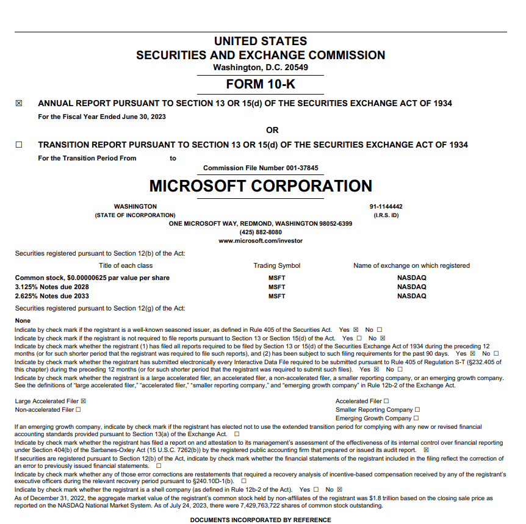

## Table of Contents

## What is a 10-K report?

A 10-K report is an annual filing that publicly traded companies in the United States are required to submit to the Securities and Exchange Commission (SEC). It’s essentially a comprehensive overview of a company’s financial performance and operations for the past year. Think of it as a detailed “state of the union” for the business, intended to give investors and regulators a clear picture of how the company is doing.

It typically includes things like the company’s financial statements—balance sheets, income statements, cash flow statements—along with a management discussion and analysis where executives explain the numbers and outline risks or challenges. You’ll also find details about the company’s business model, market competition, and sometimes legal issues or executive compensation. It’s a meaty document, often running dozens or even hundreds of pages, and it’s a key resource for anyone trying to understand a company’s health beyond the headlines or press releases.

Companies file it within 60 to 90 days after their fiscal year ends, depending on their size, and it’s publicly available through the SEC’s EDGAR database.

## Why is the 10-K report important for investors?

The 10-K report is a goldmine for investors because it’s one of the most reliable, detailed, and standardized sources of information about a company’s financial health and operations. Unlike earnings calls or press releases, which can be polished with a bit of spin, the 10-K is a legally mandated document where companies have to lay it all out—warts and all—under strict SEC rules. That means it’s less likely to be sugarcoated, making it a crucial reality check.

For starters, it gives investors a deep dive into the numbers—revenue, profits, debts, and cash flow—through audited financial statements. This helps you see if a company’s making money, burning through cash, or drowning in liabilities. The management discussion and analysis section is another big deal; it’s where execs have to explain what’s driving those numbers, flag risks like lawsuits or market shifts, and sometimes hint at what’s coming down the pike. It’s like getting a peek into their heads.

Beyond the finances, the 10-K spells out the company’s business strategy, competitors, and industry challenges. This context helps investors figure out if the company’s positioned to grow or if it’s facing headwinds that could tank the stock. It also lists things like executive pay and insider stock ownership, which can signal how aligned leadership is with shareholders.

Since it’s filed annually and consistent across companies, investors can compare apples to apples—say, how one tech giant’s margins stack up against another’s. For anyone serious about [picking](/wiki/asset-class-picking) stocks or managing risk, skipping the 10-K is like trying to navigate without a map. It’s not sexy, but it’s where the real story lives.

## Who is required to file a 10-K report? 

In the United States, any company that’s publicly traded and meets certain criteria set by the Securities and Exchange Commission (SEC) is required to file a 10-K report. Specifically, this applies to companies with securities—like stocks or bonds—listed on U.S. stock exchanges, such as the NYSE or Nasdaq, or those that have registered their securities with the SEC under the Securities Exchange Act of 1934. 

The key trigger is having more than $10 million in assets and a class of equity securities held by either 2,000 or more shareholders—or 500 shareholders if they’re not accredited investors (basically, folks who meet certain income or net-worth thresholds). Once a company crosses these lines, it’s considered a “public company” in the SEC’s eyes and has to file the 10-K annually, no exceptions.

There are a few flavors of filers, though. Big players—so-called “large accelerated filers” with a market cap over $700 million—have to file within 60 days of their fiscal year-end. Mid-tier “accelerated filers” (market cap between $75 million and $700 million) get 75 days, while smaller companies, or “non-accelerated filers,” have 90 days. Smaller reporting companies and emerging growth companies might get some leeway with simplified disclosures, but they still have to file.

Private companies, on the other hand, are off the hook—they don’t trade on public markets, so no 10-K for them. Foreign companies trading in the U.S. might file something similar, like a 20-F, but that’s a different beast. Bottom line: if a company’s shares are in the hands of the public and it’s big enough to matter, the SEC wants that 10-K on its desk.

## Where can I find a company’s 10-K report?  

You can find a company’s 10-K report in a few straightforward places, with the most direct being the U.S. Securities and Exchange Commission’s (SEC) EDGAR database. EDGAR—short for Electronic Data Gathering, Analysis, and Retrieval—is a free, searchable online system hosted at sec.gov. Just head to the site, click on the “Filings” section, and use the “Company Filings” search. Type in the company’s name or ticker symbol (like “AAPL” for Apple), hit enter, and you’ll get a list of all its SEC filings. Look for the “10-K” under the filing type—it’ll be labeled clearly with the date it was submitted. You can view it online, download it as a PDF, or dig into the raw data if you’re feeling nerdy.

Most companies also post their 10-Ks on their own websites, usually in the “Investors” or “Investor Relations” section—look for tabs like “SEC Filings” or “Financial Reports.” It’s not required, but bigger firms like Microsoft or Tesla do it for convenience. If you’re after a specific one, searching “[company name] investor relations 10-K” on Google usually pulls it up fast.

Other spots include financial platforms like Yahoo Finance, Bloomberg, or MarketWatch, which often link to 10-Ks under a company’s profile—though they might summarize or require a subscription for full access. Libraries or university databases might have them too, if you’re near one with business resources.

The SEC’s EDGAR is the gold standard since it’s primary source material, straight from the regulator.

## What are the main sections of a 10-K report?  

A 10-K report is broken down into several key sections, each serving a specific purpose to give a full picture of a company’s operations and financial standing. While the exact layout can vary slightly depending on the company, the SEC mandates a standard structure under Regulation S-K, so most 10-Ks follow a predictable format. Here’s the rundown of the main sections you’ll typically find:

1. **Business (Item 1)**  
   This is the “who we are” part. It covers what the company does—its products, services, and markets—along with how it makes money. You’ll get details on the industry it operates in, key customers (if they’re big enough to matter), and sometimes its supply chain or competitive landscape. It’s like the company’s elevator pitch, but with more meat.

2. **Risk Factors (Item 1A)**  
   Here’s where they spill the beans on what could go wrong—economic downturns, lawsuits, regulatory changes, cyberattacks, you name it. It’s a laundry list of potential headaches, written to warn investors (and cover the company’s legal bases). Some risks are generic, others are specific to the business.

3. **Selected Financial Data (Item 6)**  
   This is a snapshot of five years’ worth of key financial stats—like revenue, net income, and total assets. It’s a quick way to spot trends or red flags without diving into the full [books](/wiki/algo-trading-books). Smaller companies might skip this under certain exemptions, though.

4. **Management’s Discussion and Analysis of Financial Condition and Results of Operations (MD&A, Item 7)**  
   The MD&A is the heart of the 10-K for many investors. Management explains the numbers—what drove revenue up or down, how they’re handling costs, and whether they’ve got enough cash to keep the lights on. It’s their chance to narrate the story behind the data and flag future risks or opportunities.

5. **Financial Statements and Supplementary Data (Item 8)**  
   This is the nitty-gritty: audited balance sheets, income statements, cash flow statements, and statements of shareholders’ equity, usually covering two or three years. Notes to these statements unpack the details—accounting methods, debt terms, or one-off expenses. It’s dense but critical for number-crunchers.

6. **Controls and Procedures (Item 9A)**  
   Here, the company talks about its internal checks—like how it ensures the books aren’t cooked. It includes management’s take on the effectiveness of these controls and, for bigger firms, an auditor’s opinion on them.

7. **Directors, Executive Officers, and Corporate Governance (Item 10)**  
   This introduces the top brass—board members and execs—with bios and sometimes their pay (though compensation details might spill into Item 11). It also covers governance policies, like board independence or ethics codes.

8. **Executive Compensation (Item 11)**  
   A deep dive into what the CEO, CFO, and other bigwigs earn—salary, bonuses, stock awards, perks. It’s a hot topic for investors watching how aligned execs are with shareholder interests.

9. **Security Ownership of Certain Beneficial Owners and Management (Item 12)**  
   This shows who owns big chunks of the company—think major shareholders (like institutional investors) and how much stock the insiders (execs and directors) hold. It’s a clue to who’s got skin in the game.

10. **Exhibits and Financial Statement Schedules (Item 15)**  
    The back-end stuff: a list of attachments like contracts, bylaws, or extra financial schedules. It’s not always thrilling, but it can include gems like loan agreements or merger docs.

There are other bits—like legal proceedings (Item 3) or market risk disclosures (Item 7A)—but these are the heavy hitters. The 10-K’s table of contents will guide you, and companies tweak the order or emphasis based on their story.

## How often is a 10-K report filed?  

A 10-K report is filed once a year by public companies in the United States. It’s an annual requirement tied to the end of a company’s fiscal year, which doesn’t always match the calendar year—some firms might end their fiscal year in June or September, for example, depending on their industry or history. The SEC sets deadlines for submission based on the company’s size: large accelerated filers (market cap over $700 million) have 60 days after their fiscal year-end, accelerated filers ($75 million to $700 million) get 75 days, and smaller non-accelerated filers have 90 days. So, while it’s filed annually, the exact timing varies by company.

That said, the 10-K isn’t the only report companies file. They also submit 10-Q reports quarterly—three times a year—to cover the quarters outside the annual filing, but those are less detailed. The 10-K stands out as the big, comprehensive yearly update.

## What’s the difference between a 10-K and a 10-Q report?  

The 10-K and 10-Q are both SEC filings that public companies use to report their financial performance, but they differ in scope, frequency, and depth. Here’s how they stack up:

**Frequency**:  
- A 10-K is filed once a year, covering the company’s full fiscal year. It’s the big annual wrap-up.  
- A 10-Q comes out three times a year, at the end of each of the first three fiscal quarters. The fourth quarter gets rolled into the 10-K, so no separate 10-Q for that one.

**Depth and Detail**:  
- The 10-K is the heavy hitter—think of it as the full encyclopedia. It’s got everything: detailed financial statements (balance sheet, income statement, cash flow), management’s analysis (MD&A), risk factors, business overview, executive pay, governance, and more, all audited by an external firm for accuracy. It’s a deep dive into the company’s entire year and its broader context.  
- The 10-Q is lighter and more focused—like a quarterly check-in. It includes unaudited financial statements and a shorter MD&A, updating investors on the latest quarter’s results and any big changes since the last filing. It skips a lot of the 10-K’s extras, like risk factors or governance details, unless something major pops up.

**Purpose**:  
- The 10-K gives investors a comprehensive, audited snapshot of the company’s health and strategy over the past year, plus a look at long-term risks and trends. It’s the go-to for big-picture analysis.  
- The 10-Q keeps investors in the loop between annual filings, offering a quicker, less polished update on how things are trending. It’s more about short-term performance and material changes.

** Deadlines**:  
- 10-K deadlines vary by company size: 60, 75, or 90 days after fiscal year-end for large accelerated, accelerated, and non-accelerated filers, respectively.  
- 10-Qs are due faster—40 days after the quarter ends for large and accelerated filers, or 45 days for smaller ones—since they’re less complex.

**Audit Status**:  
- The 10-K’s financials are audited, meaning an independent accountant has vetted them for accuracy, which adds credibility.  
- The 10-Q’s numbers are unaudited, prepared by the company itself, so they’re quicker but less scrutinized.

In short, the 10-K is the deep, yearly dive—broad, audited, and foundational—while the 10-Q is the leaner, quarterly pulse check, keeping things current. Investors use both: the 10-K for the big decisions, the 10-Q to spot shifts along the way.

## How can I read and understand the financial statements in a 10-K?  

Reading and understanding a 10-K financial statement can feel overwhelming at first, but once you break it down, it’s a lot more approachable. A 10-K is an annual report filed by public companies with the SEC, and it gives you a detailed look at their financial health and operations. The key is to focus on the main sections and know what to look for. Here’s a step-by-step guide to help you get started:

First, find the 10-K. You can get it from the company’s investor relations website or the SEC’s EDGAR database—just search the company name or ticker symbol. Once you’ve got it, don’t let the length scare you; not every page is critical. Zoom in on these core parts:

1. **Business Overview (Item 1)**  
   This section tells you what the company does, how it makes money, and what markets it operates in. It’s not financial data yet, but it sets the stage so you understand the context for the numbers later. Skim it to get a sense of their operations and any big risks they mention.

2. **Risk Factors (Item 1A)**  
   Here’s where they list what could go wrong—lawsuits, competition, economic downturns, etc. It’s not numbers, but it’s useful for spotting potential red flags that might hit the finances down the road.

3. **Management’s Discussion and Analysis (MD&A, Item 7)**  
   This is a goldmine. The company’s leadership explains how they did over the past year, what affected their performance, and what they expect moving forward. Look for trends—like if revenue’s growing but profits aren’t—and any one-time events (e.g., a big lawsuit settlement) that skew the numbers. It’s their story behind the data.

4. **Financial Statements (Item 8)**  
   This is the meat of the 10-K. You’ll find three main statements here, plus the notes:

   - **Income Statement**: Shows revenue, expenses, and profit (or loss) over the year. Start with revenue (top line) to see how much money’s coming in, then check operating income to gauge core business profitability. Net income (bottom line) includes everything—taxes, interest, one-offs. Compare these to prior years for trends.
   - **Balance Sheet**: A snapshot of what the company owns (assets), owes (liabilities), and what’s left for shareholders (equity) at year-end. Look at cash levels, debt, and working capital (current assets minus current liabilities) to see if they’re liquid or stretched thin.
   - **Cash Flow Statement**: Tracks cash in and out. It’s split into operating (day-to-day business), investing (e.g., buying equipment), and financing (e.g., issuing stock or paying debt). Positive operating cash flow is a good sign—they’re making money from their core work. Watch if they’re burning cash or relying on loans.

   The **notes** to these statements are crucial. They explain accounting methods, break down big numbers (like debt terms or revenue sources), and flag anything unusual. If something looks off—say, a huge profit jump—check the notes for clarity.

5. **Auditor’s Report (Item 8)**  
   An independent auditor says whether the numbers seem legit. An “unqualified” opinion is standard and good. Anything else (e.g., “qualified” or “adverse”) is a warning sign.

## What risks are disclosed in a 10-K report?  

A 10-K report, filed annually with the U.S. Securities and Exchange Commission (SEC), includes a section where companies disclose risks that could materially affect their business, financial condition, or stock performance. These risks vary by company and industry, but they generally fall into several common categories. 

Companies typically outline operational risks, like supply chain disruptions, labor shortages, or reliance on key customers or suppliers. Financial risks might include debt levels, [liquidity](/wiki/liquidity-risk-premium) concerns, or exposure to [interest rate](/wiki/interest-rate-trading-strategies) fluctuations. Legal and regulatory risks often cover potential lawsuits, compliance with environmental laws, or changes in government policy. Market risks could involve competition, shifts in consumer demand, or economic downturns. Many also highlight cybersecurity threats, such as data breaches or system failures, and external factors like natural disasters or geopolitical instability. If the company operates globally, currency exchange rates or trade restrictions might get a mention too.

The idea is to give investors a heads-up about anything that could derail the company’s plans or profitability. These disclosures are usually written in cautious, broad language to cover all bases—think of it as a corporate "things could go wrong" list. For a specific company’s 10-K, you’d see risks tailored to its situation, like a tech firm warning about R&D setbacks or a manufacturer flagging raw material costs.

## How do I analyze management’s discussion and analysis (MD&A) in a 10-K?  

Analyzing the Management’s Discussion and Analysis (MD&A) in a 10-K is about digging into how the company’s leadership explains their financial performance, operations, and future outlook. It’s their chance to narrate the numbers from the financial statements and give context, so you’re looking for clarity, consistency, and what they might be glossing over. Here’s how to approach it:

First, focus on the big picture they’re painting. Management will break down revenue, costs, and profitability—check if their explanations match the financial data. Are they attributing growth to something concrete like new product sales, or leaning on vague terms like “market conditions”? Look at how they compare this year to last year; trends in revenue or expenses should make sense given their story.

Next, zero in on their discussion of risks and challenges. They’ll often cross-reference the risk section, but in MD&A, they might hint at what’s keeping them up at night—like a big customer cutting orders or rising debt payments. See if they’re proactive about it (e.g., “we’ve secured new suppliers”) or just stating the problem. Vague optimism without specifics can be a red flag.

Pay attention to liquidity and capital resources too. They’ll explain how they’re funding operations—cash flow, loans, or stock sales—and whether they can cover obligations. If they’re tight on cash but downplay it, that’s worth noting. Cross-check this with the balance sheet and cash flow statement.

Look for forward-looking statements—predictions about sales, costs, or market trends. They’ll hedge with “may” or “could,” but it’s your clue to their confidence. Are they banking on something shaky, like a regulatory change? Compare it to industry news or competitors’ outlooks if you can.

Tone matters. Dry, factual prose is standard, but excessive jargon or cheerleading (“unprecedented opportunities!”) might mean they’re dodging tough truths. Also, watch for what’s missing—silence on a known issue (say, a lawsuit or product flop) can speak volumes.

Finally, skim past reports if you can get them. Has their story shifted? A sudden pivot from “we’re thriving” to “tough times ahead” without clear reasons could signal trouble.

## Can I use a 10-K report to compare companies in the same industry?  

Yes, you can absolutely use 10-K reports to compare companies in the same industry—it’s one of the best ways to see how they stack up. Since 10-Ks follow a standardized format, you’ve got a consistent baseline to look at financials, strategies, and risks side-by-side. Here’s how to make it work:

Start with the financial statements—Income Statement, Balance Sheet, and Cash Flow Statement. Compare revenue growth, profit margins, and expenses like cost of goods sold or R&D spending. A retailer might show tight margins but high [volume](/wiki/volume-trading-strategy), while a competitor leans on premium pricing. Check debt levels and cash reserves too; one company drowning in loans while another’s flush with cash tells you about resilience.

The Management’s Discussion and Analysis (MD&A) is gold for comparison. See how each explains their performance—say, two tech firms facing chip shortages. One might brag about securing supply chains, the other might dodge the issue. Look at their outlooks too; if one predicts a sales boom and the other’s cautious, that’s a clue to their positioning.

Risk factors are another angle. Industry-wide risks (like regulation or competition) should pop up in both, but the emphasis matters. If one flags cybersecurity as a top worry and the other barely mentions it, they might differ in exposure or preparedness. Company-specific risks—like a key patent expiring—can show unique vulnerabilities.

Business and operations sections reveal strategy. Two automakers might both make EVs, but one’s investing heavily in batteries while the other’s outsourcing. Market share data or customer concentration (e.g., “10% of sales from one client”) can highlight competitive edges or weaknesses.

Caveats: Accounting methods might differ slightly (e.g., how they depreciate assets), so adjust for that. Size matters too—a giant like Apple and a smaller rival won’t be apples-to-apples. Timing’s also key; 10-Ks come out annually, so check filing dates to ensure you’re comparing the same period.

## What are some red flags to look for in a 10-K report?

Spotting red flags in a 10-K report is about catching signs that something’s off—whether it’s financial strain, management dodging reality, or risks piling up. Here’s what to watch for:

In the financial statements, look for shrinking revenue or profit margins without a solid explanation—especially if peers are growing. A spike in debt or dwindling cash reserves can signal trouble, particularly if cash flow from operations is negative while they’re burning through borrowings or stock sales to stay afloat. Weird jumps in “other” expenses or one-time gains propping up earnings? Dig deeper; those can mask underlying issues.

The Management’s Discussion and Analysis (MD&A) is a hotspot for spin. Vague excuses like “challenging conditions” without specifics—or dodging big problems like lawsuits or lost contracts—are warning signs. If they overhype future growth but skip how they’ll get there (no new products, no cost cuts), it’s fluff. Compare this year’s MD&A to last year’s; a sudden shift from rosy to grim with no clear trigger might mean they’ve been papering over cracks.

Risk factors can raise alarms too. Boilerplate risks are normal, but if they quietly add something major—like “we might lose our biggest customer” or “regulators are sniffing around”—that’s a flare. Downplaying known industry headaches (say, supply chain woes everyone’s facing) while peers are upfront can hint at denial or worse.

Footnotes are where skeletons hide. Watch for off-balance-sheet liabilities (like big leases or shady partnerships), frequent accounting changes, or restated past results—those scream inconsistency or fudging. A pile of “goodwill” from acquisitions that’s not paying off could mean overpayment or write-downs looming.

Auditor’s report matters. An “unqualified opinion” is standard, but qualifiers or a “going concern” warning (doubts they’ll survive 12 months) is a neon red flag. Even a switch in auditors can hint at disagreements over the books.

Tone’s a subtle tell. Overly rosy language (“unmatched potential!”) paired with grim numbers, or silence on obvious setbacks, suggests management’s out of touch or hiding something. And if related-party transactions—like deals with the CEO’s cousin—pop up, question the fairness.

## What is the use of the 10-K in algorithmic trading?

Algorithmic trading, or algo trading, refers to the use of complex algorithms to initiate trading decisions based on predefined criteria. Within this framework, the SEC Form 10-K report serves as an invaluable resource by providing a rich dataset of financial information and disclosures. These reports contain quantitative data as well as qualitative insights about a company's operational strategies, risks, and market conditions, making them a critical resource for algorithmic models.

Algorithms employ the extensive data contained within a 10-K report to evaluate a company's financial performance and project potential stock price movements. The key sections of a 10-K, such as the financial statements (including balance sheets, income statements, and cash flow statements), MD&A (management's discussion and analysis), and risk factors, are instrumental for quantitative analysts. By encoding rules from financial theories and statistical models within their algorithms, traders can automate complex analyses to spot opportunities and mitigate risks.

For instance, a trading algorithm might utilize natural language processing (NLP) to extract sentiment from the management's discussion section. By quantifying management's tone—whether optimistic or cautious—traders can integrate sentiment scores into broader trading strategies, potentially correlating positive sentiment with upward stock movement predictions and negative sentiment with downward trends. Combining textual analysis with numerical data leads to more robust prediction models. 

Moreover, key financial metrics derived from the 10-K, such as EBITDA, free cash flow, and earnings per share (EPS), can be mathematically modeled to predict stock valuation changes. Implementing a [machine learning](/wiki/machine-learning) model, one could use these variables as features to predict price movements:

```python
from sklearn.ensemble import RandomForestRegressor
import pandas as pd

# Sample data preparation
features = pd.DataFrame({'EBITDA': [1.2, 1.3, 1.4],
                         'FreeCashFlow': [0.9, 1.0, 1.1],
                         'EPS': [0.5, 0.6, 0.7]})
targets = pd.Series([100, 110, 120])  # Stock price outcomes

# Model training
model = RandomForestRegressor(n_estimators=100)
model.fit(features, targets)

# Prediction
new_data = pd.DataFrame({'EBITDA': [1.5],
                         'FreeCashFlow': [1.2],
                         'EPS': [0.8]})
predicted_price = model.predict(new_data)
print(predicted_price)
```

By automating the analysis of these comprehensive financial disclosures, traders can react more swiftly to market shifts, aiming to capitalize on short-lived opportunities. This transition from manual analysis to automated and data-driven trading strategies offers a competitive advantage in achieving profitable trades.

However, the integration of 10-K data within [algorithmic trading](/wiki/algorithmic-trading) models is not without challenges. Ensuring data accuracy, handling vast data volumes, and maintaining algorithm robustness are essential to leveraging this data effectively. Despite these challenges, the strategic use of 10-K reports in algorithmic trading continues to yield substantial gains and remains a vital component of quantitative investment strategies.


## References & Further Reading

[1]: ["Form 10-K"](https://www.sec.gov/search-filings) - U.S. Securities and Exchange Commission

[2]: Palepu, K. G., Healy, P. M., & Peek, E. (2019). ["Business Analysis and Valuation: IFRS Edition Text and Cases."](https://books.google.com/books/about/Business_Analysis_and_Valuation_Using_Fi.html?id=IDT6DwAAQBAJ) Cengage Learning.

[3]: "Fundamentals of Algorithmic Trading" by Benjamin Graham

[4]: Jordan, J. V., & Tobiner, A. (2010). ["Quantitative Equity Portfolio Management: Modern Techniques and Applications."](https://www.taylorfrancis.com/books/mono/10.1201/9781420010794/quantitative-equity-portfolio-management-edward-qian-eric-sorensen-ronald-hua) McGraw-Hill Education.

[5]: ["Algorithmic Trading: Winning Strategies and Their Rationale"](https://books.google.com/books/about/Algorithmic_Trading.html?id=_-zc3SK2vrYC) by Ernest P. Chan

[6]: [SEC.gov | Search Filings](https://www.sec.gov/search-filings) - Enjoy free public access to millions of informational documents filed by publicly traded companies and others in the SEC's Electronic Data Gathering, Analysis, and Retrieval (EDGAR) system

[7]: [SEC.gov | EDGAR Full Text Search](https://www.sec.gov/edgar/search/) - The new EDGAR advanced search gives you access to the full text of electronic filings since 2001

[8]: [SEC.gov | Latest Filings](https://www.sec.gov/cgi-bin/browse-edgar?action=getcurrent) - View real-time filings as submitted, including daily filings by form type within the past week

[9]: [SEC.gov | CIK Lookup](https://www.sec.gov/search-filings/cik-lookup) - A search engine to find Central Index Key numbers assigned by the SEC to corporate or individual filers

[10]: [SEC.gov | EDGAR Search Assistance](https://www.sec.gov/search-filings/edgar-search-assistance) - Tutorials and resources to help users locate filings, conduct research, and retrieve specific information in EDGAR

[11]: [SEC.gov | EDGAR Application Programming Interfaces](https://www.sec.gov/search-filings/edgar-application-programming-interfaces) - RESTful data APIs including the submissions history by filer and the XBRL data from financial statements