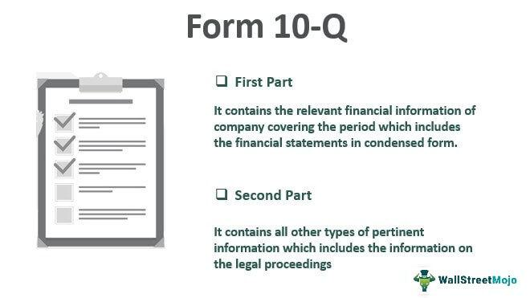

Financial reporting is a cornerstone of informed investment and trading decisions, offering investors, analysts, and traders critical insights into a company’s financial health and operational performance. These reports serve as authoritative documents that encapsulate a company’s revenue generation, expense allocations, risk assessments, and future outlooks. Given their comprehensive nature, they inform a wide array of financial activities, from fundamental analysis to complex trading strategies.

Among these financial disclosures, the 10-K Wrap plays a significant role. Unlike the traditional 10-K, which is a comprehensive annual report filed to the SEC detailing a company’s financial performance, the 10-K Wrap is a more user-friendly version that highlights key elements of the traditional report for stakeholders. It serves as a bridge between the detailed, often dense information found in full regulatory filings and the need for a digestible summary that can be used by a broader audience, including investors, analysts, and corporate decision-makers. The 10-K Wrap is primarily produced as a communications tool that aligns with the interests of shareholders and potential investors, emphasizing critical aspects of business operations, financial outcomes, executive insights, and strategic goals.



In recent years, the synthesis of 10-K Wrap summaries with algorithmic trading has emerged as an innovative intersection of traditional financial analysis and modern technology. Algorithmic trading, which employs automated and pre-programmed trading instructions to execute orders based on statistical insights, benefits greatly from nuanced financial data. The qualitative aspects, such as management discussions and strategic insights found in the 10-K Wrap, can be converted into quantitative signals, enabling algorithms to make informed trading decisions.

The goals of this article are to explore the crucial components embedded in the 10-K Wrap and to understand how they can be leveraged within algorithmic trading operations. By dissecting the elements of the 10-K Wrap and examining its application in algo trading, the article aims to provide valuable insights for traders and investors.

## Table of Contents

## Understanding the 10-K Wrap

The 10-K Wrap serves as a comprehensive summary of a company's annual 10-K filing, providing key insights and enhancing the way investors and analysts interpret financial information. The primary purpose of the 10-K Wrap is to bridge the gap between the highly detailed and extensive 10-K report mandated by the Securities and Exchange Commission (SEC) and the more narrative-driven traditional annual reports. 

#### Differences between Traditional Annual Reports and 10-K Wraps

Traditional annual reports are generally designed to communicate a company's performance and strategic direction to its shareholders, with a focus on storytelling and engagement. They often include colorful layouts, photographs, and feature-length content that highlight a company's achievements and future aspirations. In contrast, the 10-K Wrap is more concise and operates as a supplement to the official 10-K filing. It distills the essential elements of the 10-K into an accessible format that facilitates quicker analysis and comprehension. 

While the traditional annual report may emphasize branding and narrative, the 10-K Wrap focuses on presenting the financial health and operational results of the company in a more straightforward manner. The Wrap retains crucial quantitative data while also summarizing strategic initiatives, management discussions, and financial outcomes.

#### Components of a 10-K Wrap

A 10-K Wrap generally includes several key components that enhance its usefulness to stakeholders. These components often consist of a summary of financial results, management's discussion and analysis (MD&A), strategic business insights, and potentially additional qualitative elements such as letters from executives or vision statements. 

The financial results section provides a snapshot of the company's performance, often including key financial ratios and metrics derived from the 10-K. The MD&A offers context for these numbers, elaborating on factors that influenced financial outcomes. Strategic insights might encompass information about market trends, competitive positioning, and future outlooks. The qualitative content serves to humanize the data, giving investors a sense of management's priorities and corporate objectives.

#### Legal Requirements for 10-K Wrap Submissions

Unlike the formal 10-K filings, which are subject to stringent SEC regulatory requirements, the 10-K Wrap is not legally mandated. However, companies that choose to produce the 10-K Wrap must ensure that the information presented is consistent with the SEC filing, as any discrepancies could lead to legal or regulatory scrutiny. The Wrap must accurately represent the company's performance and outlook as described in the 10-K, and any supplementary content should not contradict the official document.

#### Usage by Investors and Analysts

Investors and analysts utilize the 10-K Wrap to quickly assess a company's financial health and strategic direction. The succinct nature of the Wrap makes it an efficient tool for analyzing critical financial data without wading through the exhaustive details of the full 10-K. This allows stakeholders to make informed decisions more rapidly, integrating both quantitative data and qualitative insights into their evaluations. 

In summary, the 10-K Wrap complements the SEC-mandated 10-K filing by providing a streamlined, digestible overview of a company's performance and strategy. Its adoption illustrates a shift towards more accessible and actionable financial disclosure methodologies.

## Key Elements of a 10-K Wrap

The 10-K Wrap is a refined addendum to the standard SEC-mandated 10-K filing, serving to enhance the presentation and comprehension of a company's financial position and operational insights for investors. It encompasses various components that collectively offer a nuanced view of the company's performance and strategic outlook.

A primary component of the 10-K Wrap is the company's financial results, which include key performance metrics and financial statements. These results provide a snapshot of the company's financial health, encompassing income statements, balance sheets, and cash flow statements. Such detailed financial data are crucial for investors and analysts to assess the profitability, [liquidity](/wiki/liquidity-risk-premium), and solvency of a company.

Another crucial part of the 10-K Wrap is the Management's Discussion and Analysis (MD&A). This section delivers management’s perspective on the financial results, operational conditions, and potential risks and opportunities facing the company. It includes qualitative insights and explanations that help contextualize the numerical data, shedding light on the underlying causes of financial outcomes and future strategic directions.

Strategic insights within the Wrap further guide investors on the company's long-term vision and competitive strategies. This may involve discussions on market trends, innovation plans, competitive positioning, and other strategic initiatives that define the company’s trajectory.

Qualitative content, such as shareholder letters and corporate objectives, plays a significant role in providing transparency and narrative to the company's operations. Shareholder letters often reflect personal communication from the CEO or board chair, offering direct insights into the company’s ethos, achievements, and challenges. Corporate objectives outlined in the Wrap help clarify strategic priorities and expected milestones, fostering alignment between management and investors.

The presentation and production of a 10-K Wrap are tailored to enhance readability and engagement, distinguishing it from the typical regulatory filings. The design usually incorporates visuals such as charts, graphs, and infographics, which facilitate the rapid understanding of complex data. The format is often structured to highlight key insights and achievements attractively, ensuring clear communication and accessibility for investors who might not have the time or expertise to analyze exhaustive SEC filings.

In conclusion, the 10-K Wrap serves as an essential tool for financial communication, integrating quantitative data with qualitative insights and strategic narratives in a well-presented format. This approach empowers investors to make informed decisions by providing a comprehensive understanding of a company’s financial health and strategic foresight.

## Integrating 10-K Wraps in Algorithmic Trading

Algorithmic trading, known as algo trading, involves leveraging computer algorithms to execute trades based on pre-defined criteria with minimal human intervention. It relies heavily on data—both quantitative and qualitative—to make informed trading decisions quickly and efficiently. Quantitative data traditionally includes historical price or [volume](/wiki/volume-trading-strategy) data, while qualitative data can come from various financial reports, including the 10-K Wrap.

10-K Wraps, though primarily qualitative in nature, are increasingly significant for algo trading due to their comprehensive insights into a company's financial performance and strategic direction. By extracting, analyzing, and converting these qualitative insights into quantitative signals, algorithms can enhance trading models' predictive accuracy.

The application of 10-K Wraps in trading algorithms begins with natural language processing (NLP). Using NLP, algorithms can parse shareholder letters, management discussions, and corporate objectives within a 10-K Wrap to identify sentiment trends, strategic shifts, or significant risk factors. For example, an NLP model might score the sentiment of a CEO's letter to shareholders as positive, negative, or neutral based on the language used. Python libraries such as NLTK or spaCy can be employed for these tasks:

```python
import spacy
from textblob import TextBlob

# Load model
nlp = spacy.load("en_core_web_sm")

# Define a sample shareholder letter
text = "The company's performance this year surpassed all expectations, with unprecedented growth in all sectors."

# Analyze sentiment
doc = nlp(text)
blob = TextBlob(doc.text)
sentiment = blob.sentiment.polarity  # Outputs a score between -1 and 1

print("Sentiment Score:", sentiment)
```

Once sentiment and qualitative assessments are quantified, the resulting data can feed into algo trading models. Such models often rely on a combination of [fundamental analysis](/wiki/fundamental-analysis) derived from the 10-K Wrap and technical indicators to devise trading strategies. One example of a trading strategy utilizing 10-K Wrap data might involve a sentiment analysis-driven decision tree, where positive sentiment and upward financial trends trigger buy signals, while negative sentiment prompts sell signals.

Moreover, algo traders may integrate [machine learning](/wiki/machine-learning) models that predict stock movements by training on historical 10-K Wrap data in conjunction with market data. A support vector machine (SVM) can, for instance, be trained to classify stocks into 'buy' or 'sell' categories based on the extracted features from the wraps:

```python
from sklearn import svm
from sklearn.model_selection import train_test_split

# Sample dataset (features derived from 10-K Wrap analysis)
X = [...]  # Feature vectors (e.g., sentiment scores, financial ratios)
y = [...]  # Labels (buy/sell)

# Split dataset
X_train, X_test, y_train, y_test = train_test_split(X, y, test_size=0.3)

# Train SVM model
model = svm.SVC()
model.fit(X_train, y_train)

# Predict
predictions = model.predict(X_test)
```

As this field evolves, the challenge remains in accurately capturing nuanced qualitative data within 10-K Wraps, and ensuring the trading models can adapt to the ever-changing market context. By doing so, traders can leverage insights from 10-K Wraps to refine their strategies and stay competitive in an increasingly data-driven marketplace.

## Challenges and Risks in Using 10-K Wrap for Algo Trading

Using 10-K Wraps in [algorithmic trading](/wiki/algorithmic-trading) poses several challenges and risks. A primary concern is the potential for data inaccuracies and misinterpretation. The accuracy of these documents is paramount, as they influence trading decisions and strategies. Errors in reporting or in the processing of 10-K data can lead to incorrect analysis, potentially resulting in significant financial losses. Interpretation challenges arise due to the complex language and varied presentation styles used in 10-K Wraps. Algorithms must effectively parse and understand these documents to generate accurate trading signals.

Another challenge relates to the timing and retrospective nature of 10-K Wrap data. Since these reports are typically released quarterly or annually, the data they contain might not reflect current market conditions. This lag can impair the responsiveness of trading strategies to dynamic market environments. Traders relying on 10-K Wrap analysis could potentially react slower to market shifts compared to those using real-time data.

There are also regulatory and ethical considerations when automating trades based on 10-K disclosures. Regulatory bodies such as the SEC provide guidelines on the use of financial disclosures to ensure fair market practice and transparency. Automated systems must comply with these regulations to avoid penalties. Ethical concerns arise from the potential for exploiting proprietary information, where traders might gain an unfair advantage by using advanced algorithms to parse non-public insights from 10-K Wraps faster than human investors.

Mitigation strategies are crucial to address these risks. Employing technological solutions, such as natural language processing (NLP) and machine learning, can enhance the accuracy of document analysis and interpretation. These technologies enable the extraction of relevant insights by deciphering complex financial narratives. Machine learning models can be trained to detect patterns and anomalies, further refining the trading signals derived from 10-K Wraps.

Data integration is another mitigation strategy, where 10-K Wrap data is combined with other real-time datasets to create more comprehensive trading models. This integration can bridge the gap between past disclosures and current market conditions, providing a more holistic view of investment opportunities. Employing robust data validation techniques also ensures the quality and accuracy of input data, reducing the risk of misinformation influencing trading decisions.

Developing an adaptable algorithmic framework that can adjust to new regulations and ethical standards is also essential. This involves continuous monitoring and updating of systems to align with legal requirements and best practices in the trading industry.

## Conclusion

The ongoing evolution of financial reporting continues to shape trading practices, particularly through the integration of 10-K Wrap insights into algorithmic trading models. The 10-K Wrap provides a condensed and strategically focused summary of a company's comprehensive 10-K filing, offering both qualitative and quantitative insights that can be invaluable for trading algorithms.

One key advantage of incorporating 10-K Wrap data into algorithmic trading is its ability to enhance model precision through the extraction of qualitative insights such as management discussions and strategic objectives. These components can be converted into quantitative signals using natural language processing (NLP) techniques, enabling algorithms to identify sentiment, predict future performance, and execute trades based on this enhanced dataset.

As financial disclosures evolve, the gap between traditional financial reporting and real-time data consumption narrows, heralding an era where machine learning models can further refine data interpretation. Moreover, the integration of [artificial intelligence](/wiki/ai-artificial-intelligence) in financial analysis will support more predictive and adaptive trading strategies, potentially improving investment outcomes by reacting swiftly to financial disclosures.

For traders and investors seeking to leverage 10-K Wrap data, several recommendations emerge. Firstly, developing robust NLP and machine learning models to accurately interpret qualitative information can offer a competitive edge. Secondly, ensuring data processing systems are equipped to handle potential discrepancies in reporting is vital for maintaining the integrity of trading strategies. Finally, establishing a strong feedback loop to continuously refine and validate algorithmic models against market performance data can significantly enhance the reliability of predictions.

In conclusion, the convergence of financial reporting and algorithmic trading underscores the need for adaptive and data-driven strategies. By harnessing the insights provided by 10-K Wraps, investors and traders can tap into a rich source of information, optimizing their decision-making processes in increasingly complex financial markets.

## References & Further Reading

1. Securities and Exchange Commission. "Form 10-K." U.S. Securities and Exchange Commission, https://www.sec.gov/fast-answers/answersreada10khtm.html.

2. Financial Accounting Standards Board. "Understanding Annual Reports and Financial Statements." https://www.fasb.org/jsp/FASB/Page/SectionPage&cid=1176156324237.

3. Li, Feng, "Annual report readability, current earnings, and earnings persistence." Journal of Accounting and Economics, vol. 45, no. 2-3, 2008, pp. 221-247. doi:10.1016/j.jacceco.2008.02.003.

4. Kogan, Shimon, et al. "Predicting Risk from Financial Reports with Regression." Proceedings of the North American Chapter of the Association for Computational Linguistics - Human Language Technologies, 2009, pp. 272–280. 

5. Engle, Robert. "The Econometrics of Ultra-High-Frequency Data." Econometrica, vol. 68, no. 1, 2000, pp. 1-22.

6. Hendershott, Terrence, et al. "Algorithmic Trading and Information." SSRN Electronic Journal, 2009. doi:10.2139/ssrn.1472050. 

7. Jaimungal, Sebastian, and Tomasz Zariphopoulou. "Algorithmic Trading: Turnover, Clients and Risk Management." Quantitative Finance, vol. 15, no. 4, 2015, pp. 671-684. doi:10.1080/14697688.2014.946500.

8. Chan, Ernest P. "Algorithmic Trading: Winning Strategies and Their Rationale." Wiley, 2013.

9. Howard, Louis W., and Sikka, Pawan Kumar. "Evolution of Financial Disclosures and Algorithmic Trading." Journal of Financial Markets and Portfolio Management, vol. 34, no. 4, 2018, pp. 287-310. doi:10.1007/s11408-018-0319-2.

10. Scholtes, Sebastian. "Strategies for Integrating Qualitative Insights into Quantitative Models Using Financial Disclosures." Financial Analysts Journal, vol. 72, no. 3, 2016, pp. 36-52. 

### Suggested Further Readings

11. Kirkpatrick, Charles D., and Dahlquist, Julie R. "Technical Analysis: The Complete Resource for Financial Market Technicians." (2nd ed.). FT Press, 2011.

12. Aldridge, Irene. "High-Frequency Trading: A Practical Guide to Algorithmic Strategies and Trading Systems." Wiley, 2013.

13. Hull, John C. "Options, Futures, and Other Derivatives." (10th ed.). Pearson, 2017.

14. Pardo, Robert. "The Evaluation and Optimization of Trading Strategies." (2nd ed.). Wiley, 2008.

15. Angrist, Joshua D., and Jörn-Steffen Pischke. "Mostly Harmless Econometrics: An Empiricist's Companion." Princeton University Press, 2009.

