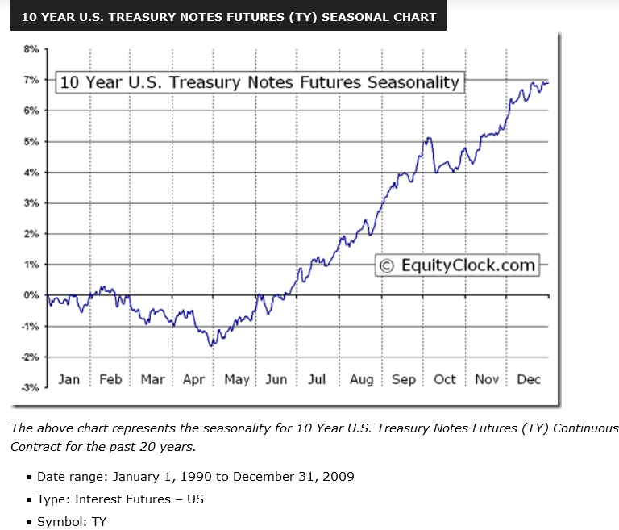

## Table of Contents

## What is the 10-Year Treasury Bond Yield?  

The 10-Year Treasury Bond Yield is the rate of return, expressed as a percentage, that investors earn if they buy a U.S. Treasury bond with a 10-year maturity and hold it until it matures. It’s essentially the interest rate the U.S. government pays to borrow money from investors for a decade. Treasury bonds are issued by the U.S. Department of the Treasury, and the yield fluctuates based on market demand, economic conditions, and investor sentiment. It’s a key benchmark for gauging the overall health of the economy and influences everything from mortgage rates to corporate borrowing costs. When you hear about "the yield" in financial news, it’s often this one they’re talking about.

## How is the 10-Year Treasury Bond Yield calculated?  

Mathematically, the yield on a bond can be calculated using the following basic formula for yield to maturity (YTM), which estimates the annual return on a bond if held until maturity: 

$$
YTM = \frac{C + \frac{F - P}{n}}{\frac{F + P}{2}}
$$

where $C$ is the annual coupon payment, $F$ is the face value of the bond, $P$ is the price of the bond, and $n$ is the number of years to maturity.

The 10-year Treasury yield is closely monitored as an indicator of the economy's overall direction. A rising yield suggests investors expect stronger economic growth and possibly higher inflation, prompting central banks to raise interest rates to contain inflationary pressures. Conversely, a declining yield may reflect anticipation of slower economic growth, leading investors to seek the safety and predictability of government bonds.

## Why is the 10-Year Treasury Yield important to the economy?  

The 10-Year Treasury Yield is a big deal for the economy because it acts like a pulse check for financial markets and influences a ton of other rates. Since it’s tied to U.S. government debt, which is considered super safe, it sets a baseline for what people expect to earn on low-risk investments. When the yield goes up, borrowing costs—like mortgage rates or business loans—tend to rise too, slowing down spending and investment. When it drops, borrowing gets cheaper, which can juice up economic activity. It also signals what investors think about the future: a rising yield might mean they expect growth or inflation, while a falling yield could hint at worries about a slowdown. Basically, it’s a domino that nudges everything from housing to stocks to jobs.

## What does the 10-Year Treasury Yield tell us about interest rates?  

The 10-Year Treasury Yield is like a mirror reflecting what’s happening with interest rates across the board. It shows the market’s expectations for where rates are headed over the next decade, blending in factors like inflation forecasts and economic growth vibes. Since it’s a benchmark, other interest rates—like those for mortgages, car loans, or corporate bonds—often move in sync with it, usually adding a premium for extra risk. If the yield climbs, it suggests investors think rates will rise, maybe because the Federal Reserve is tightening policy or inflation’s heating up. If it falls, it could mean expectations of lower rates, often tied to economic cooling or Fed easing. It’s not the whole story, but it’s a loud hint about the direction of borrowing costs.

## Where can I find the current 10-Year Treasury Yield?  

You can find the current 10-Year Treasury Yield through several reliable sources online. The U.S. Department of the Treasury’s website offers daily updates on Treasury yields, including the 10-year, under their "Interest Rate Statistics" section—look for the "Daily Treasury Par Yield Curve Rates." Another solid option is the Federal Reserve Bank of St. Louis’s FRED database, where you can track the "Market Yield on U.S. Treasury Securities at 10-Year Constant Maturity" with real-time and historical data. Financial news sites like Bloomberg, CNBC, or MarketWatch also provide up-to-the-minute yields, often with charts and analysis. For a quick glance, even trading platforms like Investing.com or Yahoo Finance post the latest figures.

## How does the Federal Reserve influence the 10-Year Treasury Yield?  

The Federal Reserve influences the 10-Year Treasury Yield indirectly through its monetary policy moves, even though it doesn’t directly set this rate—the market does. When the Fed adjusts the federal funds rate (the short-term rate banks charge each other), it ripples out. If the Fed hikes rates to cool inflation, short-term yields rise, and investors often demand higher returns on longer-term bonds like the 10-year, pushing its yield up. If the Fed cuts rates to boost the economy, short-term yields drop, and the 10-year yield might fall too, though not always in lockstep.

The Fed also plays a bigger game with bond buying or selling, known as quantitative easing (QE) or tightening. During QE, it scoops up Treasuries, driving prices up and yields down (since price and yield move opposite). When it unwinds those purchases, yields can climb as supply floods back. Plus, the Fed’s signals—like hints about future rate hikes or cuts—shape investor expectations, nudging the 10-year yield before any action even happens. It’s a dance between Fed policy and market mood, with the yield as the scorecard.

## What’s the relationship between the 10-Year Treasury Yield and inflation?  

The 10-Year Treasury Yield and inflation are tangled up like dance partners—they move together, but not always in perfect step. When inflation rises, investors expect higher prices to eat into their bond returns, so they demand a higher yield to compensate for that lost purchasing power. This pushes the 10-year yield up. On the flip side, when inflation cools off, that pressure eases, and yields can drop since investors don’t need as big a buffer.

It’s not just current inflation that matters, though—expectations play a huge role. If markets think inflation will climb over the next decade (say, from Fed policy or economic growth), the yield ticks up to reflect that. You can see this in the "breakeven rate" (the gap between regular 10-year yields and inflation-protected Treasury yields), which hints at what investors bet inflation will average. But if deflation looms—rare but nasty—yields can tank as investors pile into safe bonds, caring less about returns than preserving cash. It’s a push-pull between real returns and inflation vibes.

## How does the yield affect stock and bond markets?  

The 10-Year Treasury Yield shakes up both stock and bond markets because it’s a yardstick for value and risk. For bonds, it’s direct: when the yield rises, existing bond prices drop (since price and yield move opposite), making older, lower-yielding bonds less attractive. New bonds get issued at higher rates, so investors shift cash there. When the yield falls, older bonds with higher rates gain value, and new ones offer less return.

Stocks feel it too, but it’s messier. Higher yields can pull money out of stocks—why bet on risky companies when safe Treasuries pay more? Growth stocks, like tech, get hit hardest since their future profits look less juicy compared to rising rates. Value stocks, with steadier cash flows, might hold up better. Lower yields, though, make stocks more appealing—borrowing’s cheap, and bond returns look meh, so investors chase equities for growth. It also messes with company costs: higher yields mean pricier loans, squeezing profits, while lower yields ease that pressure. It’s a tug-of-war between safety and opportunity across both markets.

## What is a yield curve, and how does the 10-Year Treasury fit into it?  

A yield curve is a graph plotting the yields of Treasury securities—like bills, notes, and bonds—against their maturities, from short-term (say, 3 months) to long-term (up to 30 years). It shows what you’d earn holding each to maturity, and its shape tells a story about the economy. Normally, it slopes upward: longer maturities offer higher yields to reward you for tying up your money longer and facing more uncertainty.

The 10-Year Treasury Yield is a star player on this curve, sitting smack in the middle of the maturity range. It’s a key benchmark—often compared to shorter yields (like the 2-year) or longer ones (like the 30-year)—to gauge market vibes. If the 10-year yield is way above the 2-year, the curve’s steep, hinting at growth expectations. If it’s below, you get an inverted curve, a classic recession warning since it suggests investors expect rates to fall later. The 10-year’s spot on the curve makes it a go-to for reading economic tea leaves, tying short-term moves to long-term bets.

## Why do investors consider the 10-Year Treasury a "safe haven"?  

Investors see the 10-Year Treasury as a "safe haven" because it’s backed by the U.S. government, which has a rock-solid reputation for never defaulting on its debt—think of it as the gold standard of creditworthiness. That full faith and credit promise means you’re almost guaranteed to get your money back, plus interest, no matter how wild the economy gets. In shaky times—like stock market crashes, geopolitical chaos, or recessions—people flock to it, trading riskier bets like stocks for something steady. Its 10-year term also strikes a sweet spot: long enough to lock in a decent yield, short enough to avoid massive inflation or rate swings. Plus, it’s super liquid—you can buy or sell it fast. When panic hits, it’s the financial equivalent of a bunker.

## How can I use the 10-Year Treasury Yield to predict economic trends?  

The 10-Year Treasury Yield is a crystal ball for economic trends if you know what to watch. First, track its direction: a rising yield often signals optimism—investors expect growth or inflation, so they demand higher returns. A falling yield can scream caution, hinting at a slowdown or recession fears as people pile into safe bets. The yield curve’s your next clue—compare the 10-year to shorter yields like the 2-year. A steepening curve (10-year much higher) suggests expansion ahead; an inverting curve (10-year below 2-year) has nailed recessions about 12-18 months out, like clockwork since the ‘70s.

Look at inflation vibes too: if the 10-year jumps alongside rising consumer prices or wage growth, it’s betting on heat in the economy. Pair it with Fed signals—rate hikes can push yields up, cuts drag them down—and you’ve got a policy pulse. Even stock-bond shifts help: high yields tanking [growth stocks](/wiki/growth-stocks) might mean a pivot to tighter conditions. It’s not foolproof—geopolitical shocks or Fed surprises can blur the picture—but trending it over weeks or months, alongside jobs data or GDP, gives you a solid hunch on where things are headed.

## What historical events have caused significant changes in the 10-Year Treasury Yield?

Historical events have often jolted the 10-Year Treasury Yield, reflecting shifts in economic confidence, policy, and global stability. Here’s a rundown of some key moments that sent it soaring or plunging:

The 1970s stagflation mess, with oil shocks from the 1973 OPEC embargo and 1979 Iranian Revolution, spiked inflation and pushed yields up hard—hitting double digits by the early ‘80s as investors demanded more to offset rising prices. Then came Fed Chair Paul Volcker’s brutal rate hikes starting in 1979, jacking up short-term rates to crush inflation. The 10-year yield peaked near 15% in 1981, a wild high reflecting that chaos.

The 1987 Black Monday stock crash flipped things. Investors fled to Treasuries for safety, driving yields down fast—dropping from around 10% to below 9% in weeks as bond prices surged. The Dot-Com Bubble’s burst in 2000 had a similar vibe: economic uncertainty and a flight to safety shaved yields from 6.7% in January to 5% by year-end.

The 9/11 attacks in 2001 cratered yields further. With markets reeling, the Fed slashed rates, and the 10-year fell from 5% to 3.5% by late 2002 as investors sought refuge. The 2008 Financial Crisis was even crazier—yields plunged from 4% in mid-2008 to 2.1% by December as the Fed unleashed quantitative easing and panic drove demand for safe assets.

Brexit in 2016 rattled global markets too. After the UK voted to leave the EU, uncertainty sent the 10-year yield to a record low of 1.37% in July, as investors worldwide piled into U.S. bonds. Fast-forward to the COVID-19 pandemic in 2020: yields tanked again, hitting 0.5% in August as lockdowns crushed growth expectations and the Fed went all-in on stimulus.

More recently, 2022’s inflation surge—highest since the ‘80s—saw yields climb from 1.5% to over 4% as the Fed hiked rates aggressively to tame prices. Each of these swings tied back to fear, policy shifts, or economic upheaval, showing how the 10-year yield acts like a seismograph for the world’s financial tremors.

## References & Further Reading

[1]: Adrian, T., Crump, R. K., & Moench, E. (2013). ["Pricing the Term Structure with Linear Regressions."](https://www.newyorkfed.org/medialibrary/media/research/staff_reports/sr340.pdf) Journal of Financial Economics.

[2]: Cartea, Á., Jaimungal, S., & Penalva, J. (2015). ["Algorithmic and High-Frequency Trading."](https://assets.cambridge.org/97811070/91146/frontmatter/9781107091146_frontmatter.pdf) Cambridge University Press.

[3]: Duffie, D. (2010). ["Asset Price Dynamics with Slow-Moving Capital."](https://www.darrellduffie.com/uploads/1/4/8/0/148007615/duffieafapresidentialaddress2010.pdf) The Journal of Finance.

[4]: Fabozzi, F. J. (2004). ["The Handbook of Fixed Income Securities."](https://www.amazon.com/Handbook-Fixed-Income-Securities-Ninth/dp/1260473899) McGraw-Hill.

[5]: Grinold, R. C., & Kahn, R. N. (2000). ["Active Portfolio Management: A Quantitative Approach for Producing Superior Returns and Controlling Risk."](https://www.amazon.com/Active-Portfolio-Management-Quantitative-Controlling/dp/0070248826) McGraw-Hill.