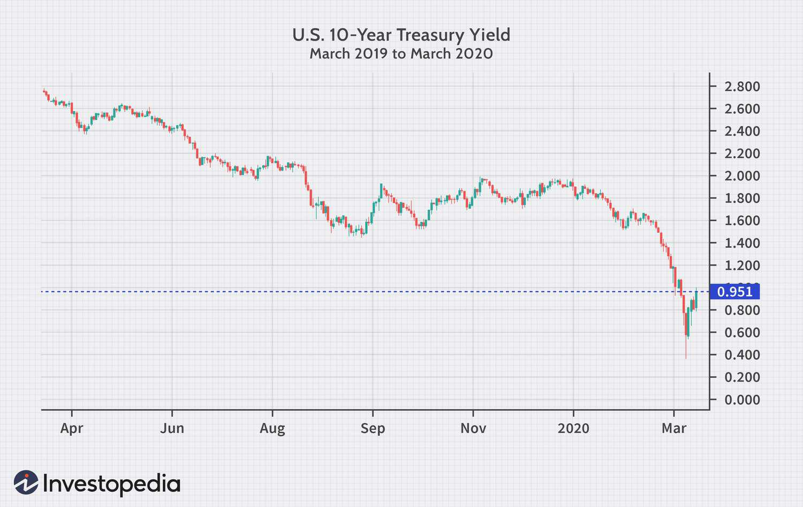

## Table of Contents

## What is a 10-Year US Treasury Note?  

A 10-Year US Treasury Note is a debt security issued by the U.S. Department of the Treasury with a 10-year maturity. It’s basically the government borrowing money from investors, promising to pay it back in a decade with interest along the way. These notes pay a fixed interest rate, called the coupon, every six months until maturity, when you get the full principal (or face value) back. They’re sold in increments of $100, with a minimum buy-in typically around $1,000 if you’re going through TreasuryDirect, though auction minimums can vary. Backed by the U.S. government’s credit, they’re considered one of the safest investments out there, making them a go-to for banks, pension funds, and anyone wanting steady returns without much risk. The “10-year yield” you hear about? That’s tied to these notes, reflecting what they return if held to maturity, and it’s a big deal in finance.

## How does the 10-Year Treasury Note differ from other Treasury securities?  

The 10-Year Treasury Note stands apart from other Treasury securities mainly by its maturity and purpose, fitting snugly between short- and long-term options. The U.S. Treasury issues three main types: Treasury bills (T-bills), Treasury notes (T-notes), and Treasury bonds (T-bonds). T-bills are short-term, maturing in a year or less—think 4 weeks, 13 weeks, up to 52 weeks—with no coupon payments; you buy them at a discount and get the face value at maturity. T-bonds stretch long-term, typically 20 or 30 years, paying semi-annual interest like notes but locking your money up longer.

The 10-Year T-Note, though, hits that mid-range sweet spot: 10 years to maturity, with fixed semi-annual coupon payments, offering a balance of decent yield and manageable time commitment. Unlike T-bills, it pays interest along the way, not just at the end. Compared to T-bonds, it’s less exposed to decades of rate swings or inflation erosion, making it more liquid and popular for trading. All are backed by the U.S. government, but the 10-year’s versatility—used as a benchmark for everything from mortgages to corporate bonds—gives it a starring role the others don’t quite match.

## What determines the price of a 10-Year Treasury Note?  

The price of a 10-Year Treasury Note is driven by supply, demand, and a tug-of-war between interest rates and investor sentiment in the open market. It’s issued at auctions by the Treasury with a set face value (say, $1,000) and a fixed coupon rate—determined by bidding from big players like banks and funds. After that, it trades on the secondary market, where its price bounces around daily.

Here’s the kicker: price and yield move opposite. When interest rates rise—say, from Fed hikes or inflation fears—newer notes offer higher coupons, so older ones with lower rates lose appeal. Their prices drop to make their effective yield competitive. If rates fall, those older, higher-coupon notes get pricier since they beat new issues. Market vibes matter too: economic uncertainty or stock sell-offs boost demand for safe Treasuries, pushing prices up (and yields down). Supply tweaks—like the Treasury issuing more debt—can nudge prices down if the market’s flooded. It’s a dance of expectations, policy, and safety-seeking cash.

## Why do investors buy 10-Year Treasury Notes?  

Investors buy 10-Year Treasury Notes for a mix of safety, steady income, and strategic plays. First off, they’re backed by the U.S. government, which has a flawless track record of paying up—default risk is basically zero. That makes them a rock-solid haven when stocks tank or global chaos hits. They also pay a fixed coupon every six months, giving predictable cash flow—great for retirees, pension funds, or anyone wanting reliable returns without sweating market swings.

The 10-year term strikes a balance: long enough to lock in a decent yield, short enough to dodge the wilder risks of 30-year bonds, like inflation eating returns. Plus, they’re super liquid—you can sell them fast on the secondary market. Banks and institutions grab them to meet regulatory needs or hedge other bets, while traders watch the yield as an economic pulse. Some even play the price game, buying low when rates spike, hoping to sell high if rates drop. It’s a go-to for stability with a side of flexibility.

## How is the yield on a 10-Year Treasury Note calculated?  

The yield on a 10-Year Treasury Note is calculated based on its price, coupon rate, and time to maturity, reflecting the total return you’d get if you held it until it matures. At its simplest, it’s the annualized return, factoring in the semi-annual interest payments (the coupon) and any gain or loss from the price you paid versus its $1,000 face value at maturity.

Here’s how it works: the coupon rate—set at issuance—determines the fixed interest (say, 3% on $1,000 = $30 yearly, or $15 every six months). If you buy the note at par ($1,000), the yield equals the coupon rate, 3%. But in the secondary market, the price shifts. If you pay $950, you still get $30 yearly plus $50 back at maturity (the difference to $1,000), spread over 10 years. That bumps your yield above 3%—closer to 3.4%—since you’re [earning](/wiki/earning-announcement) more relative to your cost. If you pay $1,050, your yield drops below 3%—maybe 2.7%—because you’re losing $50 at maturity.

The exact math uses a formula called yield to maturity (YTM), solving for the rate that equates the present value of all future cash flows (coupons plus principal) to the current price. It’s a bit of algebra, often crunched by financial calculators or apps, but the gist is: lower price, higher yield; higher price, lower yield. Market quotes—like the “10-year yield” you see—typically reflect this YTM for notes trading that day.

## Where can I buy a 10-Year Treasury Note?  

You can buy a 10-Year Treasury Note in a few straightforward ways, depending on whether you want it fresh or pre-owned. For brand-new notes, head to TreasuryDirect.gov, the U.S. Treasury’s online platform. You set up an account, link a bank, and bid at auctions—non-competitive bids guarantee you some at the going rate, with a $100 minimum. Auctions happen several times a year, often in February, May, August, and November, with reopenings in between.

Want one right now? Hit the secondary market through a broker—think Fidelity, Vanguard, Charles Schwab, or any major bank with a trading arm. You’ll buy existing notes from other investors, priced by market conditions, with minimums as low as $1,000 (sometimes less, depending on the broker). Fees vary, so check that fine print. Banks occasionally offer them too, though usually through their investment desks.

For big players or indirect exposure, Treasury-focused mutual funds or ETFs (like iShares’ IEF) bundle 10-year notes, tradable on exchanges like stocks. Pick your path—direct from the source, via a broker, or bundled—based on how hands-on you want to be. As of February 25, 2025, those options are all live; TreasuryDirect or a quick broker search will show current auctions or prices.

## What role does the 10-Year Treasury Note play in the economy?  

The 10-Year Treasury Note is a heavyweight in the economy, acting as both a financial anchor and a signal flare. Its yield is the go-to benchmark for setting borrowing costs across the board—think mortgage rates, car loans, and corporate bonds—which ripple out to affect how much people and businesses spend or invest. When its yield climbs, borrowing gets pricier, cooling off housing or expansion plans; when it drops, cheap credit can spark action, like homebuying or company growth.

It’s also a pulse-check for investor confidence. Since it’s ultra-safe, a rush to buy notes (pushing yields down) often screams economic worry—think recessions or market crashes. A sell-off (yields up) can signal optimism or inflation bets. The Fed watches it too, using its moves to gauge how policy—like rate hikes or bond-buying—lands in the real world. Plus, banks and insurers lean on it to balance their [books](/wiki/algo-trading-books), while its spot on the yield curve (compared to shorter or longer terms) hints at growth or slowdowns ahead. It’s less a player, more a mirror and a mover rolled into one.

## How does the Federal Reserve affect the 10-Year Treasury Note?  

The Federal Reserve shapes the 10-Year Treasury Note’s fate indirectly through its policy toolkit, even though it doesn’t set the yield—the market does that. When the Fed tweaks the federal funds rate (what banks charge each other overnight), it ripples out. Rate hikes lift short-term yields, making investors demand more from the 10-year to stay competitive, pushing its yield up. Rate cuts do the opposite, easing short-term rates and often dragging the 10-year yield down as borrowing looks cheaper.

Then there’s the Fed’s bond playbook: quantitative easing (QE) or tightening. In QE, it buys heaps of Treasuries, including 10-year notes, pumping demand and driving prices up (yields down). When it unwinds—like in 2018 or 2022—selling or letting bonds mature floods supply, nudging prices down and yields up. The Fed’s jawboning matters too: hints of future hikes or easing shift expectations, moving the 10-year yield before any action hits. Say the Fed signals inflation-fighting in 2025; yields might jump as markets brace. It’s a chain reaction—policy sets the vibe, markets price the note.

## What’s the relationship between the 10-Year Treasury Note and mortgage rates?  

The 10-Year Treasury Note and mortgage rates are tight-knit, moving together like shadows thanks to their shared roots in long-term borrowing costs. The note’s yield is a benchmark for lenders setting rates, especially for 30-year fixed mortgages. Why? Both reflect investor views on interest rates and inflation over a decade-plus horizon, and the 10-year’s safety makes it a baseline—mortgage rates typically sit a couple percentage points higher to cover risk and profit.

When the 10-year yield rises—say, from Fed hikes or growth optimism—banks bump up mortgage rates to match, since their funding costs climb and they need to keep returns attractive. If the yield drops—like during a flight to safety or Fed easing—mortgage rates tend to fall, making loans cheaper. It’s not a perfect lockstep; housing demand, credit risk, or mortgage-backed securities can tweak the spread (usually 1.5-2% above the 10-year). But check any chart: when the 10-year yield spiked to 4% in 2022, 30-year mortgages topped 6%. It’s the starting line lenders eye before adding their own sauce.

## How does the 10-Year Treasury Note fit into the yield curve?  

The 10-Year Treasury Note is a linchpin in the yield curve, anchoring the middle of the maturity spectrum and serving as a key reference point. The yield curve plots yields of Treasury securities—like bills (under a year), notes (1-10 years), and bonds (over 10 years)—against their time to maturity. Typically, it slopes upward, with longer terms offering higher yields to compensate for added risk and uncertainty over time.

The 10-year note sits at the 10-year mark, bridging short-term vibes (like the 2-year note) and long-term bets (like the 30-year bond). Its yield is a go-to for sizing up economic health. A steep curve—where the 10-year yield towers over the 2-year—hints at growth ahead, as investors expect rising rates. A flat or inverted curve, where the 10-year dips near or below the 2-year, flags recession risks, signaling expectations of rate cuts. It’s watched obsessively: the 2-year/10-year spread inverting in 2022 spooked markets for a reason. The 10-year’s mid-range perch makes it a crystal ball for balancing now versus later.

## What are the risks of investing in a 10-Year Treasury Note?  

The 10-year U.S. Treasury Note, while often considered a pillar of safety in investment portfolios, is not without its risks. Understanding these risks is essential for investors looking to balance their portfolios effectively.

Firstly, the returns on 10-year Treasury Notes are generally lower compared to more volatile, high-yield investments such as stocks or corporate bonds. This lower yield is a trade-off for the perceived safety of the investment, as these notes are backed by the U.S. government. However, the limited return potential may not satisfy investors seeking more aggressive growth, particularly in bullish market conditions.

Inflation poses a significant risk to the real returns on 10-year Treasury Notes. While the notes offer a fixed interest payment, the purchasing power of these returns can be eroded by inflation over time. If inflation rates increase, the real value of both the interest payments and the principal repayment at maturity may decrease. For example, if the nominal [interest rate](/wiki/interest-rate-trading-strategies) on a T-note is 2% but the inflation rate is 3%, the real interest rate is actually negative, standing at -1%. This can be calculated using the formula: 

$$
\text{Real Interest Rate} = \text{Nominal Interest Rate} - \text{Inflation Rate}
$$

Interest rate risk is another critical [factor](/wiki/factor-investing) to consider. Treasury Notes have a fixed interest rate, and their prices are inversely related to market interest rates. Therefore, if market interest rates rise, the value of existing 10-year Treasury Notes will typically decline, because newer issues will offer higher yields. This price sensitivity to interest rate changes is often measured using duration, a calculation that approximates the percentage change in price for a 1% change in yield. Longer maturities tend to have higher durations, thus being more sensitive to interest rate fluctuations.

## How have historical events impacted the 10-Year Treasury Note’s yield?

Historical events have sent the 10-Year Treasury Note’s yield on a rollercoaster, reflecting economic shocks, policy shifts, and investor panic. In the late 1970s, the oil crises—OPEC’s 1973 embargo and Iran’s 1979 revolution—fueled stagflation, driving inflation sky-high. The yield soared past 15% by 1981 as investors demanded more to offset price spikes, amplified by Fed Chair Volcker’s rate hikes to choke inflation.

The 1987 Black Monday crash flipped the script. Stocks tanked 22% in a day, and investors rushed to Treasuries, dropping the 10-year yield from 10% to under 9% fast as prices surged. The Dot-Com Bust in 2000 saw it slide from 6.7% to 5% by year-end, with tech wreckage pushing cash to safety. Post-9/11 in 2001, uncertainty and Fed rate cuts sank it further, hitting 3.5% by 2002.

The 2008 Financial Crisis was a gut punch—yields crashed from 4% to 2.1% by December as Lehman collapsed and the Fed unleashed QE, gobbling notes to prop up markets. Brexit’s 2016 shockwave sent it to a record low of 1.37% in July, with global jitters piling into U.S. debt. The 2020 COVID-19 pandemic cratered it to 0.5% in August, as lockdowns and Fed stimulus drowned yields in safe-haven demand.

Then, 2022’s inflation surge—worst since the ‘80s—flipped it again. Yields jumped from 1.5% to over 4% as the Fed hiked rates to tame prices. Each lurch tied to fear, policy, or economic upheaval, making the 10-year yield a live wire for history’s big moments.

## References & Further Reading

[1]: Bergstra, J., Bardenet, R., Bengio, Y., & Kégl, B. (2011). ["Algorithms for Hyper-Parameter Optimization."](https://dl.acm.org/doi/10.5555/2986459.2986743) Advances in Neural Information Processing Systems 24.

[2]: ["Advances in Financial Machine Learning"](https://www.amazon.com/Advances-Financial-Machine-Learning-Marcos/dp/1119482089) by Marcos Lopez de Prado

[3]: ["Evidence-Based Technical Analysis: Applying the Scientific Method and Statistical Inference to Trading Signals"](https://www.amazon.com/Evidence-Based-Technical-Analysis-Scientific-Statistical/dp/0470008741) by David Aronson

[4]: ["Machine Learning for Algorithmic Trading"](https://github.com/stefan-jansen/machine-learning-for-trading) by Stefan Jansen

[5]: ["Quantitative Trading: How to Build Your Own Algorithmic Trading Business"](https://www.amazon.com/Quantitative-Trading-Build-Algorithmic-Business/dp/1119800064) by Ernest P. Chan

[6]: [10-Year US Treasury Note: What It Is and Investment Advantages](https://www.investopedia.com/terms/1/10-yeartreasury.asp)

[7]: [Treasury Notes](https://treasurydirect.gov/marketable-securities/treasury-notes/) — TreasuryDirect

[8]: [10-Year US Treasury Note](https://corporatefinanceinstitute.com/resources/fixed-income/10-year-us-treasury-note/) - Definition and Examples

[9]: [TMUBMUSD10Y | U.S. 10 Year Treasury Note Overview | MarketWatch](https://www.marketwatch.com/investing/bond/tmubmusd10y?countrycode=bx)

[10]: [US10Y: U.S. 10 Year Treasury - Stock Price, Quote and News](https://www.cnbc.com/quotes/US10Y) - CNBC

[11]: [10-Year T-Note Overview - CME Group](https://www.cmegroup.com/markets/interest-rates/us-treasury/10-year-us-treasury-note.html)

[12]: [10-Year US Treasury Note: What It Is And How To Buy | Bankrate](https://www.bankrate.com/investing/how-to-buy-10-year-us-treasury-note/)

[13]: [10-Year Treasury Bond Yield: What It Is and Why It Matters](https://www.investopedia.com/articles/investing/100814/why-10-year-us-treasury-rates-matter.asp)

[14]: [US 10 Year Treasury Yield](https://www.investing.com/rates-bonds/u.s.-10-year-bond-yield) - Investing.com

[15]: [Ultra 10-Year U.S. Treasury Note Overview](https://www.cmegroup.com/markets/interest-rates/us-treasury/ultra-10-year-us-treasury-note.html) - CME Group