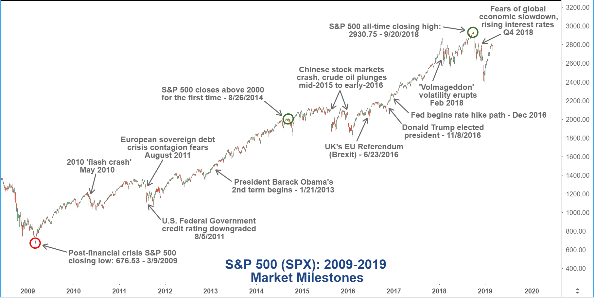

Algorithmic trading, often referred to as algo trading, has experienced substantial transformation over the past century, markedly altering the landscape of financial markets. Initially characterized by manual processes, the evolution of technology, particularly the advent of computers and more recently artificial intelligence, has enabled the creation of complex trading algorithms. These developments have allowed market participants to automate trading strategies to a large extent, thereby enhancing execution speed and efficiency.

A considerable portion of algo trading development has been influenced by cyclical market conditions, notably bull and bear markets. Bull markets, identified by prolonged periods of rising stock prices, and bear markets, defined by a decline of at least 20% from recent highs, have consistently required traders to recalibrate their strategies. This adaptability is crucial in optimizing returns during bullish periods and mitigating losses when markets recede.



Moreover, macroeconomic factors such as inflation and interest rates have been paramount in shaping algo trading strategies. Periods of high inflation generally exert downward pressure on bonds, while benefiting commodities, necessitating a shift in asset allocation and trading tactics. Interest rate shifts affect market liquidity and investment allocation, prompting traders to adjust their algorithms accordingly.

To further refine trading strategies, practitioners often employ in-sample and out-of-sample analyses. In-sample analysis involves testing trading strategies on historical data to identify patterns and viability, whereas out-of-sample analysis applies these strategies to new, unseen data to gauge predictive performance. The balance between these methodologies is essential in fine-tuning algorithms for diverse market conditions.

Looking forward, the role of machine learning and artificial intelligence continues to grow in algorithmic trading. These technologies allow algorithms to process vast amounts of data efficiently, thereby enhancing prediction accuracy and execution velocity. Future trends suggest that innovations like blockchain and quantum computing will further reshape the algo trading landscape. Regulatory evolutions will also necessitate that trading systems remain adaptive and compliant, ensuring robust trading environments.

Understanding the historical market cycles, economic conditions, and technological advancements provides critical insights necessary for crafting effective algorithmic trading strategies. As financial markets continue their complex ebb and flow, leveraging past insights to forecast future movements remains invaluable in optimizing trading outcomes.

## Table of Contents

## The Early History of Algorithmic Trading

Algorithmic trading began to gain traction in the early 20th century, with the development of initial forms of trading algorithms for stock exchanges. These early systems, however, were predominantly manual and involved significant human intervention. Traders relied on rudimentary strategies that could be considered algorithmic by today's standards, such as following moving averages or other statistical indicators, but the execution of trades was largely manual. 

As technology advanced, the scope of [algorithmic trading](/wiki/algorithmic-trading) broadened. The pivotal moment came in the latter half of the 20th century with the introduction of computers, which paved the way for more sophisticated trading models. Computers enabled the automation of complex calculations and the handling of vast datasets, allowing traders to implement strategies at speeds and accuracies that were previously unattainable. This technological shift marked a transition from basic, manually executed algorithms to more intricate systems capable of automatic execution.

The proliferation of electronic trading systems in the 1970s and 1980s further catalyzed the evolution of algorithmic trading. For instance, the New York Stock Exchange (NYSE) introduced the Designated Order Turnaround (DOT) system in the 1970s, which automated trade execution and routing. This era witnessed the rise of program trading, where computers were used to execute large stock orders based on predefined criteria, significantly impacting market dynamics.

Throughout this period, innovations in technology consistently drove the development and refinement of trading algorithms. The rise of personal computing in the 1980s further democratized access to algorithmic trading, enabling more market participants to develop and deploy automated trading strategies. By the end of the 20th century, algorithmic trading had shifted from manual interventions to complex, computer-driven strategies, setting the stage for the more advanced techniques seen today.

## Market Cycles: Bull and Bear Markets

Identifying bull and bear markets over the last century involves a comprehensive analysis of stock market performance. Bull markets are typically defined by a sustained rise in stock prices, often linked to increasing investor confidence, growing economic strength, or a combination of both. Conversely, bear markets are identified by a decline of at least 20% from peak stock prices, usually accompanied by widespread pessimism and economic downturns.

## Characteristics of Bull Markets

Bull markets are driven by a positive feedback loop where rising stock prices encourage more investment, subsequently leading to further price increases. During such periods, traders often employ algorithms designed to capitalize on upward price trends by optimizing buying decisions and maximizing returns. Algorithms may analyze historical data alongside real-time price movements to identify optimal entry and [exit](/wiki/exit-strategy) points, leveraging [momentum](/wiki/momentum) indicators and trend lines.

## Characteristics of Bear Markets

Bear markets, however, pose unique challenges as prices plummet and [volatility](/wiki/volatility-trading-strategies) spikes. Algorithms during these periods are frequently adjusted to mitigate losses, often utilizing strategies such as short selling or adopting more conservative, capital-preserving approaches. Algorithms might [factor](/wiki/factor-investing) in indicators such as moving averages crossing downward or shifts in market sentiment indicators to trigger risk reduction mechanisms.

## Algorithmic Adaptation to Market Cycles

To effectively adapt to these cycles, traders continually refine algorithms to ensure they are capable of responding to both exuberant bull phases and the cautious nature of bear phases. This requires incorporating predictive models that can evaluate historical data patterns, anticipate potential reversals, and adjust strategies accordingly. Algorithms may incorporate [machine learning](/wiki/machine-learning) techniques to better analyze market conditions and improve predictive accuracy, thus allowing traders to dynamically alter their strategies in response to market shifts.

The ability to rapidly adjust trading strategies is crucial, as lingering in a bear market with a bull-market-oriented strategy could lead to significant losses. Conversely, a bear-market strategy maintained into a rebounding market might miss out on potential gains. By understanding these paradigms, algorithmic traders aim to optimize their response to cyclical market behaviors, maximizing returns while minimizing risks.

## Inflation Trends and Interest Rates

Inflation and interest rates have played a pivotal role in shaping financial market cycles and, consequently, algorithmic trading strategies. Asset performance is intrinsically linked to these economic factors, with varying impacts across asset classes.

High inflation periods typically disadvantage fixed-income securities, particularly bonds. Inflation erodes the purchasing power of future cash flows, leading to a decline in bond prices. For example, if the inflation rate ($i$) increases, the bond yield ($Y$) is likely to rise to compensate investors for decreased purchasing power, thus lowering bond prices ($P$):

$$
P = \frac{C}{(1+Y)^t} + \frac{F}{(1+Y)^T}
$$

where $C$ is the annual coupon payment, $F$ is the face value of the bond, and $t$ and $T$ represent time periods.

Conversely, commodities may benefit during inflationary times as their prices often rise with general price levels, acting as a hedge against inflation. This presents opportunities for algorithmic trading strategies that are programmed to capitalize on commodity price movements.

Interest rate cycles significantly influence market dynamics, reflected in [liquidity](/wiki/liquidity-risk-premium) levels and asset allocation. Rising interest rates, implemented to curb inflation or stabilize the economy, generally result in decreased market liquidity and higher borrowing costs. This shift often causes investors to reallocate funds from equities to fixed-income investments, where the returns may become relatively more attractive due to increased yields. Algorithmic trading systems need to incorporate [interest rate](/wiki/interest-rate-trading-strategies) changes to adjust their allocation strategies accordingly.

In contrast, falling interest rates typically aim to spur economic activity by lowering borrowing costs. This environment tends to boost liquidity and encourage investment in equities and riskier asset classes, offering algorithmic traders opportunities to exploit growth prospects. By effectively integrating interest rate trends into their models, algorithmic traders can enhance their ability to predict market movements and optimize portfolio performance.

## The Impact of Economic Events

Major economic events have profoundly influenced market cycles, impacting trading strategies and necessitating adaptive responses from traders. The Great Depression (1929-1939), one of the most severe global economic downturns, led to a dramatic contraction in economic activity and a substantial decline in stock prices. This period underscored the limitations of existing trading models and prompted the need for more sophisticated risk management strategies. Traders who were able to quickly adapt their algorithms to mitigate losses were better positioned to survive the downturn.

The oil crises of the 1970s, which included the 1973 oil embargo and the 1979 Iranian revolution, led to skyrocketing oil prices and rampant inflation. These shocks to the global economy illustrated the necessity for algorithms that could incorporate macroeconomic indicators and geopolitical factors into trading decisions. During these periods, commodities became a focal point for traders, with many adjusting their algorithms to capitalize on the volatility in the energy markets, highlighting the importance of flexibility and responsiveness in trading models.

Financial bubbles, such as the dot-com bubble of the late 1990s and the housing bubble leading up to the 2008 financial crisis, further demonstrate the impact of economic events on market cycles. These bubbles, characterized by rapid price increases followed by sharp declines, tested the resilience of trading algorithms. Traders were forced to recalibrate their models to detect the unsustainable growth patterns characteristic of bubbles, aiming to exit positions before the inevitable crash. The capacity to integrate signals of overvaluation and market sentiment became critical for predictive accuracy.

Python, as a programming language, provides powerful tools for adapting algorithms quickly in response to such economic shifts. For example, traders can utilize libraries like Pandas for data manipulation and Matplotlib for visualization to swiftly analyze and react to market data:

```python
import pandas as pd
import matplotlib.pyplot as plt

# Sample code to calculate moving averages and plot them
def plot_moving_averages(stock_prices, short_window=20, long_window=100):
    signals = pd.DataFrame(index=stock_prices.index)
    signals['price'] = stock_prices
    signals['short_mavg'] = stock_prices.rolling(window=short_window, min_periods=1).mean()
    signals['long_mavg'] = stock_prices.rolling(window=long_window, min_periods=1).mean()

    plt.figure(figsize=(14, 7))
    plt.plot(signals['price'], label='Price')
    plt.plot(signals['short_mavg'], label=f'Short {short_window}-Day MA')
    plt.plot(signals['long_mavg'], label=f'Long {long_window}-Day MA')
    plt.title('Stock Price and Moving Averages')
    plt.legend()
    plt.show()

# Example usage with sample data
# stock_prices = pd.Series([fetch historical stock data])
# plot_moving_averages(stock_prices)
```

In crisis scenarios, the ability to quickly adjust these parameters and interpret real-time data streams is essential for algorithmic traders to manage risk and seize opportunities. This agility allows traders to weather the volatility brought about by major economic events, making adaptive algorithms a cornerstone of successful trading strategies.

## In-Sample vs. Out-of-Sample Analysis

In-sample and out-of-sample analyses are crucial components in the development and validation of algorithmic trading strategies. In-sample analysis involves using historical data to construct models that identify patterns and optimize trading algorithms. During this phase, data is segmented to test strategy performance on historical observations, allowing for the refinement and adjustment of parameters to maximize returns or minimize risk. This internal testing ensures that the model performs well under historical conditions, often represented through back-testing procedures.

In contrast, out-of-sample analysis is used to verify a strategy's predictive power and robustness in real-world scenarios. This phase evaluates the model on data that was not previously seen during the in-sample testing. By applying the algorithm to new, unseen data, out-of-sample analysis assesses the model's ability to generalize and perform effectively under current market conditions. This step is essential for mitigating overfitting, where a strategy might appear successful on historical data but fails to maintain performance on new data.

Balancing these approaches is fundamental to refining algorithmic trading strategies. A well-devised strategy will show consistent performance in both in-sample and out-of-sample testing, indicating that the model is both accurate and generalizable. This balance ensures that traders are not misled by favorable historical performance that does not translate into future success. By carefully dividing data into distinct in-sample and out-of-sample periods, traders can test the temporal stability of their strategies and adapt them according to changing market dynamics.

In practice, the workflow might include:

1. **Data Segmentation**: Split historical market data into two datasets, such as 70% for in-sample testing and 30% for out-of-sample testing.

2. **Model Development**: Use the in-sample data to develop the trading strategy, optimizing parameters to improve performance measures such as Sharpe ratio, maximum drawdown, or other risk-return metrics.

3. **Back-testing**: Implement the model on the in-sample data to assess its historical effectiveness.

4. **Out-of-Sample Testing**: Apply the model to out-of-sample data to evaluate its predictive power in unseen market conditions.

5. **Iterative Refinement**: Revise the model based on out-of-sample performance, revisiting in-sample tests as necessary to ensure robustness.

This dual approach of in-sample and out-of-sample testing creates a comprehensive framework to develop robust algo trading strategies that are not only tailored to past market conditions but are also equipped for future fluctuations. This methodology ensures strategies are well-grounded in historical patterns while remaining adaptable to new economic factors and market events.

## Machine Learning and Artificial Intelligence

Recent advancements in [artificial intelligence](/wiki/ai-artificial-intelligence) (AI) and machine learning (ML) have drastically improved the adaptability of algorithmic trading to fluctuating market conditions. These technologies empower trading algorithms to process and learn from extensive datasets, enhancing both prediction accuracy and execution speed. The application of AI and ML in trading involves various techniques, including supervised learning, unsupervised learning, and [reinforcement learning](/wiki/reinforcement-learning), each serving distinct purposes within the trading ecosystem.

Supervised learning algorithms, such as linear regression, decision trees, and neural networks, are trained on historical market data to predict future price movements or asset performance. For instance, a simple linear regression model could be used to predict a stock's price based on historical price data and other relevant market variables. By feeding the algorithm data where the output (stock price) is known, the model learns to establish a relationship between the inputs (market variables) and outputs, which it uses to make future predictions.

Unsupervised learning, on the other hand, helps identify patterns or groupings within market data without predefined labels. Techniques like clustering and principal component analysis (PCA) allow trading systems to detect intricate structures, such as market regimes or correlations between different assets. For example, clustering can be used to categorize stocks into different segments based on their historical performance, enabling more focused trading strategies.

Reinforcement learning, a third approach, has gained prominence for its ability to handle sequential decision-making processes, making it particularly suited for trading scenarios. Here, algorithms are designed to make a series of decisions (such as buy, sell, or hold) and are rewarded based on the profitability of their strategies over time. By simulating a market environment, reinforcement learning can help algorithms optimize their trading strategies through trial and error, ultimately refining decision-making to maximize returns.

The integration of [deep learning](/wiki/deep-learning) has further advanced trading algorithms, especially in processing unstructured data such as news articles, social media, or sentiment analysis. Deep neural networks, particularly convolutional neural networks (CNNs) and recurrent neural networks (RNNs), are adept at identifying non-linear patterns and temporal dependencies, which are common in financial markets. These networks analyze non-traditional data sources alongside historical price data, providing a more comprehensive understanding of market dynamics.

AI and ML also play a vital role in enhancing trade execution. Algorithms are now capable of executing orders with minimal delay and optimal pricing by considering factors such as market impact, liquidity, and volatility. Machine learning models like support vector machines (SVM) or gradient boosting can be instrumental in optimizing order execution strategies by predicting short-term price movements or assessing order flow to minimize slippage.

In summary, AI and ML technologies are transforming algorithmic trading by enabling more informed, precise, and timely trading decisions. The ability to learn from vast amounts of data, adapt to ever-changing market conditions, and execute trades strategically has positioned them as critical tools for traders aiming to stay competitive in today's high-speed financial markets.

## Future Trends in Algorithmic Trading

Emerging technologies are poised to significantly transform algorithmic trading, with blockchain and quantum computing at the forefront of this evolution. Blockchain technology, known for its decentralized ledger system, offers increased transparency and security in trading operations. By ensuring a tamper-proof transaction history, blockchain can enhance trust and efficiency in financial markets. This feature is particularly valuable for clearing and settlement processes, potentially reducing the risk of fraud and the need for intermediaries. Furthermore, decentralized finance (DeFi) platforms, built on blockchain, are creating novel trading opportunities that algorithmic systems are beginning to explore.

Quantum computing presents another exciting prospect by providing computational power exponentially greater than classical computers. This capability can revolutionize complex data analysis and optimization problems intrinsic to trading strategies. Quantum algorithms, such as Shor's and Grover's, can potentially solve market prediction and portfolio optimization tasks far more efficiently than traditional methods. For instance, a quantum algorithm could quickly calculate the risk and return profiles of various asset combinations, leading to more informed and timely trading decisions.

Regulatory changes are also a critical factor shaping the future landscape of algorithmic trading. With increasing scrutiny on market practices, algorithms need to be designed not only for performance but also for regulatory compliance. The implementation of regulations like the Markets in Financial Instruments Directive II (MiFID II) in Europe has established stringent requirements for transparency and reporting. This necessitates adaptive algorithmic strategies capable of monitoring compliance in real-time, ensuring adherence to evolving legal standards.

Algorithm developers are beginning to integrate these considerations into the core of their trading systems. They are utilizing artificial intelligence and machine learning to enhance compliance features, enabling algorithms to dynamically adjust to new regulations. For instance, natural language processing (NLP) can be employed to continuously analyze regulatory announcements and modify trading protocols accordingly.

In summary, the amalgamation of blockchain and quantum computing technologies with regulatory considerations is setting the stage for a new era in algorithmic trading. Future trading strategies will need to not only leverage technological advancements for enhanced performance but also maintain fluency with regulatory expectations to thrive in increasingly complex financial markets.

## Conclusion

Understanding historical market cycles offers critical insights essential for crafting robust algorithmic trading strategies. The historical intersection of economic indicators such as bull and bear markets, inflation trends, and interest rate shifts has illustrated their profound impact on asset performance and trade outcomes. By examining these elements of past cycles, traders and strategists can anticipate market movements, identify opportunities, and devise responses to potential challenges.

It's critical to leverage both in-sample and out-of-sample analyses. This dual approach allows traders to derive patterns and back-test strategies based on historical data while validating these strategies against current market conditions to ensure their adaptability and effectiveness. This comprehensive understanding and testing can uncover vulnerabilities and strengths in trading models, facilitating more agile responses to market volatility.

Moreover, the integration of machine learning and artificial intelligence has significantly advanced the agility and precision of algo trading. These technologies analyze vast datasets, offering improved prediction accuracy and execution speed, thereby enhancing the ability to respond to historical analogs in modern market scenarios.

The continued study of historical trends can also inform future forecasting models, enabling the identification of signals that precede market shifts. By integrating insights from past cycles with innovations like blockchain and quantum computing, algorithmic trading can be adapted to meet evolving regulatory landscapes and technology advancements. These informed strategies help mitigate risks and create pathways to capitalize on favorable market conditions, securing a competitive edge in increasingly dynamic trading environments.

## References & Further Reading

[1]: Bergstra, J., Bardenet, R., Bengio, Y., & Kégl, B. (2011). ["Algorithms for Hyper-Parameter Optimization."](https://dl.acm.org/doi/10.5555/2986459.2986743) Advances in Neural Information Processing Systems 24.

[2]: ["Advances in Financial Machine Learning"](https://resources.caih.jhu.edu/textbooks/Resources/_pdfs/Advances_In_Financial_Machine_Learning.pdf) by Marcos Lopez de Prado

[3]: ["Evidence-Based Technical Analysis: Applying the Scientific Method and Statistical Inference to Trading Signals"](https://www.amazon.com/Evidence-Based-Technical-Analysis-Scientific-Statistical/dp/0470008741) by David Aronson

[4]: ["Machine Learning for Algorithmic Trading"](https://github.com/stefan-jansen/machine-learning-for-trading) by Stefan Jansen

[5]: ["Quantitative Trading: How to Build Your Own Algorithmic Trading Business"](https://books.google.com/books/about/Quantitative_Trading.html?id=j70yEAAAQBAJ) by Ernest P. Chan