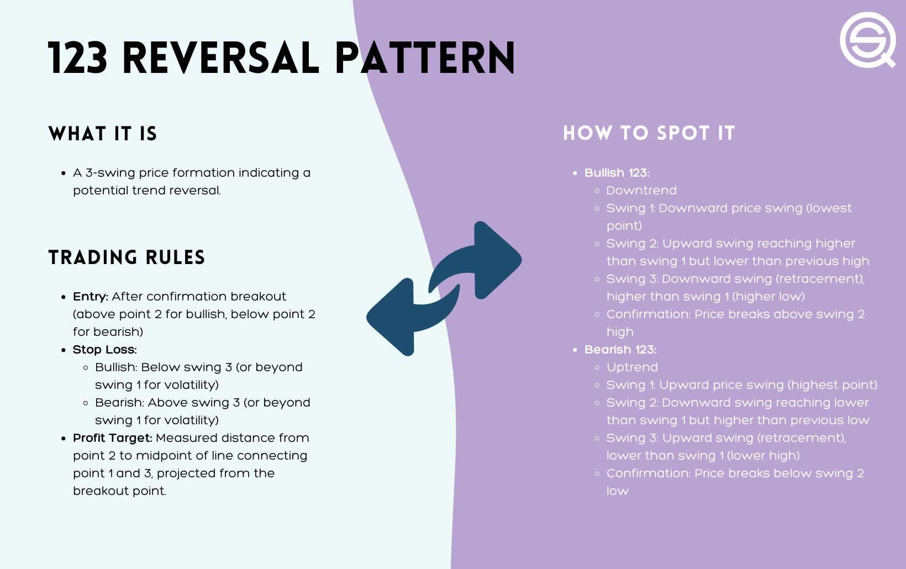
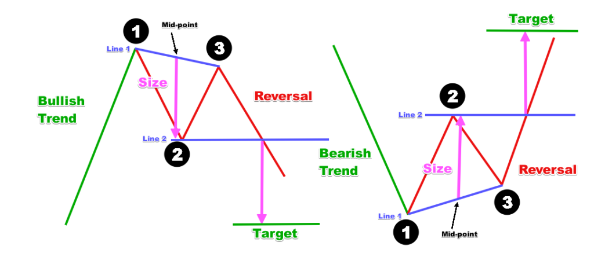

## Table of Contents

## What is the 1-2-3 Pattern Reversal Strategy?

The 1-2-3 Pattern Reversal Strategy is a technical analysis method used by traders to identify potential trend reversals in financial markets, such as stocks, forex, or cryptocurrencies. It’s a simple yet effective pattern that highlights a shift in momentum, signaling the end of an existing trend (uptrend or downtrend) and the start of a new one in the opposite direction. Traders value it for its structured approach, which provides clear entry, stop-loss, and take-profit levels, making it accessible for beginners while adaptable for seasoned traders.

The pattern consists of three key points—labeled 1, 2, and 3—that form on a price chart. In a bullish (uptrend) reversal, it typically emerges after a downtrend: Point 1 is the lowest low (the bottom), Point 2 is a higher high (a corrective rally), and Point 3 is a higher low (a pullback that doesn’t breach Point 1). The reversal is confirmed when the price breaks above Point 2, indicating buyers have taken control. Conversely, in a bearish (downtrend) reversal after an uptrend, Point 1 is the highest high, Point 2 is a lower low, and Point 3 is a lower high, with the breakdown below Point 2 signaling seller dominance.

This strategy hinges on the idea that markets don’t move in straight lines—trends weaken, consolidate, and reverse through testable levels. By mapping these points, traders can anticipate where momentum shifts, using the breakout (or breakdown) past Point 2 as the trigger to enter a trade. It’s often paired with additional tools like support/resistance, volume, or indicators (e.g., RSI or moving averages) to boost reliability, but at its core, it’s a visual pattern rooted in price action, making it versatile across markets and timeframes.

## How does the 1-2-3 pattern form on a price chart?



The 1-2-3 pattern forms on a price chart as a sequence of three distinct price movements that signal a potential trend reversal. It emerges naturally from the ebb and flow of market sentiment, reflecting a shift from one dominant trend to its opposite. Here’s how it takes shape, step-by-step, in both bullish and bearish scenarios:

### Bullish 1-2-3 Pattern (Reversal from Downtrend to Uptrend)
1. **Point 1 – The Extreme**: After a sustained downtrend, the price reaches its lowest low, marking the bottom of the move. This is where selling pressure exhausts itself, and buyers begin to step in.
2. **Point 2 – The Correction**: The price rallies upward from Point 1, forming a higher high. This corrective move shows initial buying interest but isn’t strong enough to confirm a full reversal yet—it’s often a short-term bounce or profit-taking by sellers.
3. **Point 3 – The Pullback**: The price retraces downward from Point 2 but doesn’t fall below Point 1, creating a higher low. This pullback tests the strength of buyers; if Point 1 holds as support, it suggests the downtrend is losing steam. The pattern completes when the price breaks above Point 2, confirming the reversal as buyers overpower sellers.

### Bearish 1-2-3 Pattern (Reversal from Uptrend to Downtrend)
1. **Point 1 – The Extreme**: Following an uptrend, the price hits its highest high, the peak where buying momentum fades and sellers start to emerge.
2. **Point 2 – The Correction**: The price drops from Point 1, forming a lower low. This decline indicates initial selling pressure but doesn’t yet prove the uptrend is over—it could be a dip or profit-taking by buyers.
3. **Point 3 – The Pullback**: The price rebounds upward from Point 2 but doesn’t exceed Point 1, establishing a lower high. This tests the resolve of sellers; if Point 1 resists as resistance, it shows the uptrend is weakening. The pattern finalizes when the price breaks below Point 2, confirming the bearish reversal as sellers take control.

### Visual Formation
On the chart, the pattern resembles a zigzag:
- In a bullish setup, it looks like a shallow "W" shape, with Point 1 at the bottom, Point 2 as a peak, and Point 3 as a higher dip before the breakout above Point 2.
- In a bearish setup, it’s an inverted "M" shape, with Point 1 at the top, Point 2 as a trough, and Point 3 as a lower peak before the breakdown below Point 2.

The formation relies on price action testing key levels: Point 1 as the trend’s extreme, Point 2 as a counter-move, and Point 3 as a confirmation zone. The breakout (or breakdown) past Point 2 is the critical trigger, showing the market has committed to the new direction. It’s a organic process driven by buyers and sellers battling for dominance, making it a universal pattern across assets and timeframes.

## What are the key components of the 1-2-3 pattern?

The 1-2-3 pattern is defined by a concise set of key components that work together to signal a trend reversal. These elements are rooted in price action and provide traders with a structured framework to identify, validate, and act on the pattern. Here are the core components:

1. **Point 1 – The Pivot or Extreme**  
   - This is the starting point of the pattern, representing the end of the prevailing trend. In a bullish reversal (after a downtrend), it’s the lowest low; in a bearish reversal (after an uptrend), it’s the highest high. It marks the peak of momentum in the original direction before the shift begins.

2. **Point 2 – The Correction or Counter-Move**  
   - This is the first reaction against the prior trend. In a bullish setup, it’s a higher high formed as the price rallies from Point 1; in a bearish setup, it’s a lower low as the price drops from Point 1. It reflects an initial challenge to the trend—buyers stepping in during a downtrend or sellers emerging in an uptrend—but isn’t yet conclusive.

3. **Point 3 – The Pullback or Test**  
   - This is the retracement from Point 2, forming a higher low in a bullish pattern or a lower high in a bearish pattern. It tests the strength of the emerging reversal: in a bullish case, it shows buyers defending above Point 1; in a bearish case, it shows sellers holding below Point 1. Point 3 must not breach Point 1, as that would invalidate the pattern.

4. **Breakout/Breakdown Level (Point 2 Threshold)**  
   - The critical confirmation line is the price level of Point 2. In a bullish 1-2-3, the pattern activates when the price breaks above Point 2, signaling buyer dominance. In a bearish 1-2-3, it triggers when the price breaks below Point 2, indicating seller control. This breakout (or breakdown) is the actionable signal for traders.

These four components—Points 1, 2, 3, and the breakout/breakdown level—form the backbone of the pattern. They create a visual structure (a "W" for bullish, an "M" for bearish) that captures the transition from trend exhaustion to reversal. While additional tools like volume or indicators can enhance analysis, these price-based elements alone define the 1-2-3 pattern’s identity and function.

## Why is the 1-2-3 pattern considered a reversal signal?

The 1-2-3 pattern is considered a reversal signal in technical analysis because it reflects a shift in market momentum and sentiment, often indicating that a trend is losing strength and about to change direction. This pattern typically appears after a prolonged uptrend or downtrend and consists of three key points:

1. **Point 1**: The peak (in an uptrend) or trough (in a downtrend) that marks the end of the existing trend. It’s the highest or lowest point before the reversal begins.
2. **Point 2**: A pullback or correction against the prevailing trend, showing the first sign of weakening momentum. In an uptrend, this is a lower low; in a downtrend, it’s a higher high.
3. **Point 3**: A failed attempt to continue the original trend, where the price moves back toward Point 1 but doesn’t surpass it. This failure confirms that the trend is running out of steam.

The reversal is signaled when the price breaks a key level—typically the high of Point 2 in a downtrend reversal (bearish to bullish) or the low of Point 2 in an uptrend reversal (bullish to bearish). This breakout suggests that buyers or sellers who were driving the original trend are exhausted, and the opposing force is gaining control. Traders see this as a reliable setup because it combines price action (the three points) with a clear confirmation (the breakout), making it a structured way to spot trend exhaustion and reversal potential.

## What timeframes work best for the 1-2-3 reversal strategy?

The best timeframes for the 1-2-3 reversal strategy depend on your trading style, goals, and how much time you can dedicate, but the pattern works across multiple timeframes because it’s rooted in price action. Here’s a breakdown of what tends to work well and why:

- **Short-Term (1-Minute to 15-Minute Charts)**: These are great for day traders or scalpers looking to catch quick reversals. The 1-2-3 pattern can form fast in volatile markets like forex (e.g., EUR/USD) or crypto. The upside is frequent setups; the downside is noise—false signals are more common due to random price spikes. Beginners might find these tricky, but if you’re comfortable with fast decisions and tight stops, they can work. Pair them with higher volume for confirmation.

- **Medium-Term (30-Minute to 4-Hour Charts)**: This is the sweet spot for most traders, especially swing traders or those new to the pattern. These timeframes smooth out some of the noise from shorter charts while still offering actionable setups within a day or two. They’re ideal for markets like stocks or major forex pairs, where trends develop clearly, and the breakout at Point 2 has more reliability. A 1-hour chart, for example, balances clarity and opportunity without requiring constant screen time.

- **Long-Term (Daily to Weekly Charts)**: Position traders or those with a longer horizon (weeks to months) thrive here. The 1-2-3 pattern on a daily chart can signal major trend reversals, like a stock bottoming out after a downtrend. These setups are slower to form but often more reliable because they filter out short-term fluctuations. They suit traders who prefer bigger moves and can wait for confirmation, like a strong close above Point 2’s high on a daily candle.

**Which is “best”?**
- If you’re a beginner, start with **1-hour or 4-hour charts**. They give you time to spot the pattern, think through the setup, and avoid getting whipsawed by noise.
- For active traders, **15-minute to 1-hour** strikes a good balance between frequency and reliability.
- Long-term traders should stick to **daily charts** for meatier reversals with higher conviction.

The key is consistency—pick one timeframe that fits your schedule and stick with it to learn the pattern’s quirks. Also, test it with your market of choice; a 1-2-3 on a 4-hour S&P 500 chart might behave differently than on a 4-hour Bitcoin chart due to volatility and liquidity. Adjust based on what you see working.

## How do you confirm the validity of a 1-2-3 pattern?

Confirming the validity of a 1-2-3 pattern comes down to checking a few key elements that show the reversal is legit and not just random price wiggles. Here’s how to solidify your confidence:

1. **Clear Trend Beforehand**: The pattern needs a defined uptrend or downtrend leading into Point 1. Without a strong prior move, it’s just noise, not a reversal. Look back—do you see consistent higher highs and lows (uptrend) or lower highs and lows (downtrend)? If it’s choppy or sideways, the pattern’s less reliable.

2. **Well-Defined Points**: Each point should stand out. Point 1 is the trend’s peak or trough. Point 2 is a solid pullback—ideally at least 25-50% of the move to Point 1, though this varies by market. Point 3 should test toward Point 1 but fail clearly, stopping short of breaking it. If Point 3 overshoots or the points blur together, it’s shaky.

3. **Breakout Confirmation**: The pattern isn’t complete until the price breaks Point 2’s level—above the high in a downtrend reversal (bearish to bullish) or below the low in an uptrend reversal (bullish to bearish). Wait for a strong close beyond this level, not just a wick poking through. A candle closing decisively past Point 2 shows real intent.

4. **Volume Support**: Check the volume on the breakout. Rising volume as the price crosses Point 2’s level backs up the move—buyers or sellers are stepping in with force. If volume’s flat or dropping, it could be a fakeout. Not all platforms or markets make volume easy to read (like spot forex), so skip this if it’s unavailable.

5. **Context with Support/Resistance**: Look at the bigger picture. Does the pattern align with key levels—like a rejection at a resistance line for an uptrend reversal, or a bounce off support for a downtrend reversal? If Point 3 coincides with a Fibonacci retracement (e.g., 50% or 61.8%) or a moving average, it adds weight.

6. **Momentum Divergence (Optional)**: If you use indicators like RSI or MACD, check for divergence. Say it’s an uptrend reversal: Point 1 hits a new high, but RSI makes a lower high. That hints momentum’s fading, boosting the pattern’s odds. It’s not required, but it’s a nice bonus.

**Red Flags to Watch**:
- If the breakout stalls right after crossing Point 2 and reverses, it’s suspect—could be a trap.
- Tiny price moves between points (e.g., a 5-pip pullback in forex) lack conviction; bigger ranges are better.
- No follow-through after the breakout means the trend might not be done.

In practice, wait for the breakout past Point 2 with a strong candle and some volume kick, then see if the price keeps going. Test it historically on your chart first—scroll back, mark the points, and see how often it plays out. That builds your gut feel for what’s valid.

## What are common mistakes traders make when using the 1-2-3 pattern?

The 1-2-3 pattern is used to spot trend reversals: Point 1 is the high or low of the trend, Point 2 is the retracement (support or resistance), and Point 3 is a failed retest of Point 1, signaling a potential breakout. Traders mess this up in some pretty consistent ways. Here’s a rundown of common mistakes:

1. **Misidentifying the Pattern**  
   Traders often jump the gun, labeling something a 1-2-3 before it’s fully formed. For instance, they might call a minor pullback Point 2 without confirming it’s a legit support or resistance level. The pattern needs a clear trend first—Point 1 as the peak or trough—followed by a strong retracement to Point 2, and then a weaker move to Point 3. Rushing this risks trading noise instead of a real reversal.

2. **Ignoring the Trend Context**  
   A big one. The 1-2-3 works best at the end of a strong trend, but traders try forcing it in choppy, sideways markets. Without a defined uptrend or downtrend leading to Point 1, the pattern’s unreliable—Point 2 might just be random support or resistance, not a reversal pivot. Checking higher timeframes can help avoid this.

3. **Bad Entry Timing**  
   Traders often enter too early, like right at Point 3, without waiting for confirmation. The pattern’s signal comes when price breaks the Point 2 level—say, a support level in a bullish 1-2-3—after forming Point 3. Jumping in before that breakout is a gamble, and they get burned if the trend resumes instead.

4. **Neglecting Volume**  
   Volume’s a clue to the pattern’s strength, but plenty of traders ignore it. In a valid 1-2-3, volume often drops from Point 1 to Point 2, then picks up as price breaks Point 2. Low volume on the breakout? It’s a red flag the reversal might fail—traders miss this and get stuck in a fakeout.

5. **Overlooking Support/Resistance Strength**  
   Since Point 2 is a key level—acting as support in a bullish setup or resistance in a bearish one—traders mess up by not checking its history. If Point 2 isn’t a tested level with prior price action backing it, the pattern’s shaky. They’ll trade a weak pivot and wonder why it collapses.

6. **Poor Risk Management**  
   Even with a solid 1-2-3, traders botch the execution. They set stop-losses too tight (like just below Point 3 instead of Point 1) or skip them entirely, thinking the pattern’s a sure thing. When it fails—and it does sometimes—they take bigger losses than necessary. The reward-to-risk ratio gets ignored too; they chase tiny targets instead of letting the trade run to the next major level.

7. **Confirmation Bias**  
   Traders fall in love with the pattern and see it everywhere, even when it’s a stretch. They’ll tweak the rules—like accepting a sloppy Point 3 that doesn’t quite fit—just to justify a trade. This ties back to misidentification but comes from wanting it to work rather than letting the chart prove itself.

If you’re using the 1-2-3, pairing it with other tools like moving averages or RSI can filter out some of these traps. Ever run into any of these yourself, or are you just digging into the pattern now?

## How does volume analysis enhance the 1-2-3 reversal strategy?

Volume analysis adds a layer of conviction to the 1-2-3 reversal strategy by revealing the strength—or weakness—behind the price movements at each point. The pattern itself—Point 1 as the trend’s extreme, Point 2 as the retracement (support or resistance), and Point 3 as the failed retest—is a framework, but volume tells you if the market’s actually committed to the reversal. Here’s how it plays out:

At **Point 1**, you’re at the peak of a trend—say, a high in an uptrend. Volume’s often high here because it’s the climax of buying (or selling in a downtrend). Think of it as the last gasp of momentum: lots of traders piling in before exhaustion sets in. If volume’s weak at Point 1, the trend might not be ripe for reversing, so the whole setup’s suspect.

Then comes **Point 2**, the retracement. Volume typically drops off as price pulls back to this support or resistance level. Why? It’s a pause—fewer traders are active, and the move’s more about profit-taking or hesitation than aggressive reversal. Low volume here is normal and even desirable; it shows the trend’s losing steam without signaling a full counter-move yet. But if volume spikes at Point 2, watch out—it could mean strong opposition (like buyers defending support), which might complicate the pattern or hint at a failed reversal.

**Point 3** is the pivot—price tries to retest Point 1 but fails. Volume here should be lower than at Point 1. That’s key: it shows the original trend’s players (buyers in an uptrend, sellers in a downtrend) are running out of gas. Weak volume at Point 3 confirms the lack of conviction to push past Point 2’s level again. If volume’s high instead, it’s a red flag—could mean the trend’s still got legs, and the reversal’s a dud.

The real magic happens on the **breakout** past Point 2. For a bullish 1-2-3, price drops to Point 3, then rises above Point 2’s resistance. For a bearish setup, it climbs to Point 3, then falls below Point 2’s support. Volume should spike here—higher than at Point 3, ideally matching or exceeding Point 1. This surge shows new players jumping in, confirming the reversal’s got traction. Without that volume kick, the breakout’s shaky; it might just be a fakeout with no follow-through.

So, volume enhances the strategy by acting like a lie detector. High volume at Point 1 sets the stage, low volume at Point 2 and 3 reveals fading momentum, and a volume surge on the Point 2 breakout seals the deal. Skip this analysis, and you’re guessing—volume turns the 1-2-3 from a sketch into a story. Ever tried tracking volume with this pattern, or are you looking to test it out?

## What are the trading rules for the 1-2-3 pattern

Executing the 1-2-3 trading strategy effectively requires adherence to well-defined entry, stop-loss, and target rules to manage risk and optimize potential returns. 

To initiate a trade using the 1-2-3 pattern, an entry is made after confirming a price breakout beyond Pivot 2. The breakout serves as an indicator that the current trend has lost momentum and a reversal is likely. It is crucial for traders to verify that the breakout is not a false signal by looking for additional confirmations, such as increased trading [volume](/wiki/volume-trading-strategy) or aligning signals from other technical indicators.

The placement of stop-loss orders is strategic and is set at Pivot 3. This helps to protect against potential losses from unsuccessful reversals. By setting the stop-loss at Pivot 3, traders ensure that their risk is limited to the portion of the price movement that suggests the reversal might fail.

For determining profit targets, traders can estimate the potential price movement by measuring the distance between significant swing points, such as Pivot 1 and Pivot 2. This measured distance provides a projection which, when added to the breakout level at Pivot 2, offers an expected price target. The formula to calculate the target price could be expressed as:

$$
\text{Target Price} = \text{Breakout Level at Pivot 2} + (\text{Price at Pivot 1} - \text{Price at Pivot 2})
$$

For a thoroughly robust trading plan, these rules should be adaptable to different market conditions and assets. Variability in asset characteristics and market environments can significantly affect the pattern's success rate. Traders should consider factors such as asset [volatility](/wiki/volatility-trading-strategies), market [liquidity](/wiki/liquidity-risk-premium), and broader economic indicators when tailoring their strategy for a particular trading situation. 

For example, in Python, a basic framework to apply these rules might look as follows:

```python
def calculate_target_price(breakout_level, pivot1_price, pivot2_price):
    return breakout_level + (pivot1_price - pivot2_price)

def execute_trade(current_price, breakout_level, stop_loss_level, target_price):
    if current_price > breakout_level:  # Condition for trade entry
        buy_price = current_price
        print(f"Trade entered at: {buy_price}")
        print(f"Stop Loss set at: {stop_loss_level}")
        print(f"Target set at: {target_price}")
```

In summary, the implementation of the 1-2-3 pattern trading rules requires clarity and flexibility, ensuring that they perform across varying market structures and enhance the strategy's robustness.

## How to backtest the 1-2-3 pattern?

Backtesting is essential to determine the viability of the 1-2-3 pattern in real-world trading. The process involves a systematic analysis of historical data to evaluate how the pattern performs across different market conditions, particularly focusing on key assets like gold, which has historically shown promising results in pattern analysis.

Our [backtesting](/wiki/backtesting) procedure began by cataloging instances of the 1-2-3 pattern on historical price charts of various assets. The specific focus was on identifying bullish reversals, where the pattern is predictive of a potential upward [trend following](/wiki/trend-following) a downtrend. The success of these reversals was quantified by the ability to achieve profitable exits after pattern identification and entry.

To refine our backtesting outcomes, several parameter tweaks were implemented. The entry point was marked by a breakout beyond Pivot 2, and the stop-loss was strategically positioned at Pivot 3 to minimize potential losses from failed reversals. The profit target was calculated using the measured distance between Pivot 1 and Pivot 2, projected from the breakout level for estimating [exit](/wiki/exit-strategy) positions.

```python
# Sample Python code for backtesting the 1-2-3 pattern
import pandas as pd
import numpy as np

def identify_123_pattern(data):
    # Data should have columns 'High', 'Low', 'Close'
    pattern_points = []
    for i in range(2, len(data)-1):
        if data['High'][i-2] < data['High'][i-1] > data['High'][i] and data['Low'][i-1] < data['Low'][i]:
            Pivot1 = data['High'][i-1]
            Pivot2 = data['Low'][i]
            Pivot3 = data['Low'][i+1] if data['Low'][i+1] < Pivot1 else None
            if Pivot3:
                pattern_points.append((i, Pivot1, Pivot2, Pivot3))
    return pattern_points

def backtest_123(data, pattern_points):
    results = []
    for (i, P1, P2, P3) in pattern_points:
        breakout = data.index[data['Close'][i:] > data['Close'][i]][0]
        if breakout and data['Close'][breakout] > P1:
            results.append({'Entry': data.index[i], 'Exit': breakout, 'Profit': data['Close'][breakout] - P2})
    return pd.DataFrame(results)

# Example usage
# data = pd.read_csv('asset_data.csv', parse_dates=True, index_col='Date')
# patterns = identify_123_pattern(data)
# results = backtest_123(data, patterns)
# print(results)
```

Testing on different assets revealed that unique adjustments were sometimes necessary to accommodate specific market conditions and volatility levels, demonstrating the versatility of the 1-2-3 pattern. These adjustments could involve altering the sensitivity of the breakout criteria or the distances used into calculating projection targets.

The aggregated results from our backtests suggest that the 1-2-3 pattern is adaptable and can be optimized for better success rates. This implies opportunities for customization, which traders can exploit to tailor the pattern to their particular trading style or market of choice. Moreover, the use of supplementary indicators and data-driven approaches can further enhance the strategic implementation of the 1-2-3 pattern, improving the probability of successful trades.

## How can advanced traders combine the 1-2-3 pattern with other technical indicators?

To enhance the efficacy of the 1-2-3 pattern in trading, traders can integrate additional technical indicators, such as the Relative Strength Index (RSI) and volume. These indicators can provide supplementary confirmation of reversal signals, helping to filter out false positives that might arise solely from the pattern itself. For instance, a bullish divergence in RSI, where the RSI creates higher lows while the price makes lower lows, can strengthen the case for a potential bullish reversal suggested by a completed 1-2-3 pattern.

Trend analysis tools are also valuable in refining the application of the 1-2-3 pattern. Moving averages, trend lines, and the Moving Average Convergence Divergence (MACD) indicator can corroborate reversal signals. For instance, a crossover of price above a key moving average might bolster confidence in an upward reversal identified by a 1-2-3 pattern in a downtrend.

Moreover, employing a combination of techniques such as trailing stops can maximize gains from successful trades. Trailing stops allow traders to lock in profits as the trade becomes favorable, adjusting the stop-loss levels according to market movements. Here's a simple Python example of how a trailing stop might be implemented:

```python
def trailing_stop(entry_price, current_price, stop_distance):
    stop_loss = entry_price - stop_distance
    if current_price > entry_price:
        stop_loss = max(stop_loss, current_price - stop_distance)
    return stop_loss

# Example usage
entry_price = 100
current_price = 110
stop_distance = 5
new_stop_loss = trailing_stop(entry_price, current_price, stop_distance)
print(f"New Stop Loss: {new_stop_loss}")
```

Sharing insights with other traders and participating in trading communities can lead to innovative ideas and improvements. Collaborative discussions often highlight nuances and alternate approaches, fostering diversified thinking and problem-solving techniques.

Continuous learning and testing remain critical for staying effective with the 1-2-3 pattern in an evolving market. Backtesting strategies on historical data and forward-testing on paper accounts can unveil practical insights and adaptabilities required for various asset classes or market conditions. As the market dynamics change, ongoing refinement and enhancements of the pattern, coupled with comprehensive strategy checks, are essential to maintain its reliability and success over time.


## References & Further Reading

[1]: Bergstra, J., Bardenet, R., Bengio, Y., & Kégl, B. (2011). ["Algorithms for Hyper-Parameter Optimization."](https://papers.nips.cc/paper/4443-algorithms-for-hyper-parameter-optimization) Advances in Neural Information Processing Systems 24.

[2]: ["Advances in Financial Machine Learning"](https://www.amazon.com/Advances-Financial-Machine-Learning-Marcos/dp/1119482089) by Marcos Lopez de Prado

[3]: ["Evidence-Based Technical Analysis: Applying the Scientific Method and Statistical Inference to Trading Signals"](https://www.amazon.com/Evidence-Based-Technical-Analysis-Scientific-Statistical/dp/0470008741) by David Aronson

[4]: ["Machine Learning for Algorithmic Trading"](https://github.com/stefan-jansen/machine-learning-for-trading) by Stefan Jansen

[5]: ["Quantitative Trading: How to Build Your Own Algorithmic Trading Business"](https://books.google.com/books/about/Quantitative_Trading.html?id=j70yEAAAQBAJ) by Ernest P. Chan