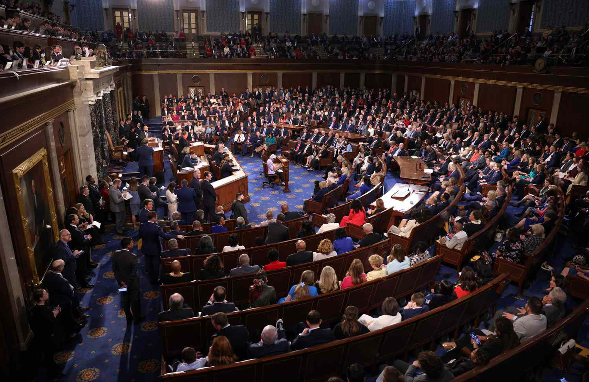

In this article, we explore the intersections between constitutional law, the debt ceiling, the 14th Amendment, and algorithmic trading. The debt ceiling functions as a critical financial mechanism, designed to limit the amount the United States government can borrow. This mechanism was intended to ensure fiscal responsibility, but it has also become a focal point of political contention. A significant aspect of this debate involves the constitutionality of the debt ceiling under the 14th Amendment of the U.S. Constitution. Particularly, Section 4 of the 14th Amendment asserts that the validity of the public debt of the United States shall not be questioned, leading to discussions about whether this implies the executive branch has the authority to bypass Congress to meet debt obligations.

Algorithmic trading, a sophisticated financial practice leveraging complex algorithms and high-speed data processing to execute financial decisions, could be influenced by these constitutional debates. Market stability and predictability, crucial elements for algorithmic trading, may be affected by economic and legal uncertainties surrounding the debt ceiling. As algorithms are designed to respond to financial trends, sudden shifts due to legal disputes or changes in debt management could impact their performance and market outcomes.



Analyzing the legal and financial implications of these interconnected elements is vital for navigating the intricate economic landscape. A thorough understanding helps investors, policymakers, and economists anticipate potential shifts, allowing for more informed decision-making. This synthesis of constitutional law and financial strategies highlights the broader impact of legal debates on the economy and financial markets.

## Table of Contents

## Understanding the Debt Ceiling and the 14th Amendment

The debt ceiling is a statutory limit on the amount of money that the United States government is authorized to borrow to meet its existing legal obligations. Enshrined initially in the Second Liberty Bond Act of 1917, the debt ceiling was conceived to provide more flexibility in funding World War I without requiring constant congressional approval for each issuance of debt. Since then, it has become a significant tool in fiscal policy, ostensibly aimed at controlling federal debt levels and maintaining economic stability.

The legal framework surrounding the debt ceiling intersects with the United States Constitution, particularly the 14th Amendment. Section 4 of this amendment states, "The validity of the public debt of the United States, authorized by law... shall not be questioned." This clause, originally intended to address Civil War debts, has become central to contemporary debates about the debt ceiling's constitutionality. Some legal scholars and politicians argue that it implies an obligation on the government to meet its debt obligations, regardless of the debt ceiling.

The juxtaposition of these laws—statutory debt limits and constitutional safeguards—has spawned significant legal discourse. The primary question is whether the executive branch has the authority to circumvent Congress through unilateral action to ensure the government meets its debt obligations without breaching the debt ceiling. This debate gained prominence during various administrations facing potential default due to congressional gridlock.

Critics of bypassing the debt ceiling argue that doing so undermines the legislative branch's constitutional power of the purse, which is essential for democratic oversight of public finances. Proponents, however, suggest that a rigid interpretation of the debt ceiling that risks default may contravene the 14th Amendment's intention to uphold the nation's fiscal credibility. This legal ambiguity becomes more pronounced as the United States approaches debt limits without congressional consensus, leading to discussions about potential executive action that remains unchartered and contentious in legal, economic, and political arenas.

## Legal Interpretations and Precedents

Courts have historically avoided making direct rulings on the constitutionality of the United States debt ceiling, reflecting the complexity and sensitivity of this issue. A key case often cited in discussions of the debt ceiling is Perry v. United States, 294 U.S. 330 (1935). This case dealt with the abrogation of the gold clause in U.S. government bonds, which had implications for the government's ability to manage its debt. While the Supreme Court in Perry acknowledged the inviolability of the public debt, it did not conclusively resolve the broader question of whether the President can unilaterally raise the debt ceiling under the 14th Amendment.

Section 4 of the 14th Amendment, which states that "the validity of the public debt of the United States, authorized by law, shall not be questioned," serves as the constitutional foundation for debates over debt management. Some legal scholars argue that this clause potentially empowers the executive branch to ensure that public debt obligations are met, even in the absence of Congressional approval for raising the debt ceiling. However, this interpretation remains contentious.

The absence of definitive court rulings on this issue leaves legal scholars divided. One school of thought suggests that the President could invoke the 14th Amendment to continue servicing the nation's debt, citing the prevention of a constitutional crisis. Conversely, others argue that such an action would encroach upon Congressional powers delineated in Article I, Section 8 of the Constitution, which grants Congress the sole authority "to borrow money on the credit of the United States."

Despite the lack of judicial resolution, the ongoing scholarly debate underscores the complexities involved in interpreting the interaction between the 14th Amendment and legislative powers over financial matters. The absence of clear legal precedent means that any attempt to address these issues through judicial intervention could lead to significant constitutional ramifications and alter the balance of powers between the legislative and executive branches.

## Current Debates on Debt Ceiling and Presidential Powers

The suspension of the debt ceiling until January 2025 provides a temporary reprieve for policymakers and financial markets, averting immediate concerns over potential default and fiscal instability. This suspension came as a result of intense negotiations aimed at preventing the United States from exceeding its statutory limit on borrowing, a measure that offers temporary relief but does not address the core issues of national debt and fiscal policy.

As the political climate evolves with the upcoming 2024 elections, a renewed focus is expected on the constitutional debate surrounding the debt ceiling and the extent of presidential powers. Central to this debate is the question of whether the President of the United States can unilaterally determine the validity of public debt under the 14th Amendment's Section 4, which asserts that the "validity of the public debt of the United States, authorized by law, shall not be questioned."

The possibility of a president taking independent executive action to address debt obligations, circumventing Congress, remains contentious. Proponents argue that such action may be justified to prevent a default, thus upholding the credibility and financial obligations of the United States. Opponents, however, caution that this could lead to an overreach of executive power, setting a precedent that may challenge the system of checks and balances foundational to American governance.

These debates are particularly critical in light of the potential consequences of inaction or miscalculation in handling the debt ceiling. Should executive power be exercised unilaterally in this context, it may establish a significant legal precedent, influencing future fiscal policy and the interplay between the legislative and executive branches.

As the expiration of the current debt ceiling suspension approaches, the discussions surrounding presidential powers and debt management strategies will likely intensify. Stakeholders including legal scholars, policymakers, and financial analysts must remain attentive to these developments, which will have far-reaching implications on national economic stability and governance.

## Algorithmic Trading: Impact of Legal and Financial Changes

Algorithmic trading, a sophisticated method of executing financial transactions using automated and complex algorithms, depends heavily on market stability. Any fluctuation or uncertainty in key economic mechanisms, such as the debt ceiling, can significantly affect the performance and outcomes of [algorithmic trading](/wiki/algorithmic-trading). The debt ceiling, which is essentially a cap set by Congress on how much the government is allowed to borrow, introduces a layer of uncertainty to financial markets when debates about its adjustment arise. Such debates can lead to concerns over the U.S. government's ability to meet its financial obligations, causing market [volatility](/wiki/volatility-trading-strategies).

For algorithmic trading systems, which are designed to react in milliseconds to market signals, such uncertainty can lead to rapid adjustments in trading strategies. These systems often rely on historical data and predefined rules to make purchase or sale decisions. When the debt ceiling becomes a subject of intense political negotiation or uncertainty, it introduces potential risks that algorithms must account for, often resulting in increased trading [volume](/wiki/volume-trading-strategy) and volatility.

For example, when news around the debt ceiling suggests a potential impasse or delay in raising the ceiling, the market could interpret this as a risk of default. This perception can cause a ripple effect, influencing asset prices across the board. As a result, algorithmic trading systems might adjust by selling off assets perceived to be high-risk, or conversely, buying up lower-risk assets, depending on the rules encoded within the algorithms.

Changes in policies regarding the debt ceiling can also influence economic forecasts and interest rates. A prolonged or unresolved debate might lead to a downgrade of U.S. creditworthiness, impacting the interest rates and yields on government securities. Algorithmic traders, who often deal with large volumes and thin margins, might have to recalibrate their models to accommodate rising costs of capital or shifting yield curves. The impact is not merely limited to stocks or government bonds; it can extend to derivatives, foreign exchange rates, and commodities, indicating a wide-ranging influence on various asset classes.

In conclusion, algorithmic trading systems must be adaptable to political and economic changes, such as those surrounding the debt ceiling. Advanced [machine learning](/wiki/machine-learning) models and real-time data analysis can help traders anticipate and react to these changes efficiently, preserving the stability and profitability of automated trading systems. However, the inherent unpredictability of political decision-making around the debt ceiling presents an ongoing challenge for developers and operators of these systems.

## Potential Economic and Market Implications

Uncertainty surrounding the debt ceiling and the potential for a default on national debt can result in significant market instability. Economic markets thrive on predictability, and the absence of clarity can lead to heightened volatility. This volatility poses challenges particularly for algorithmic trading—a sophisticated method of executing trades using pre-programmed sets of rules based on various financial and economic indicators.

Algorithmic traders and investors must carefully evaluate potential market shifts arising from legal ambiguities and financial uncertainties. When faced with potential disruptions like a debt ceiling crisis, algorithmic models, which often rely on historical data and assume a degree of market stability, might not perform as anticipated. This unpredictability calls for the integration of adaptive mechanisms capable of responding to abrupt market changes. 

For instance, consider an algorithm designed to trade based on the stability of the U.S. Treasury yield curve, a critical indicator of economic certainty. In the event of debt ceiling-induced instability, yields could suddenly fluctuate, causing the algorithm to trigger a cascade of buy or sell orders. This sequence could exacerbate market volatility. To mitigate such risks, algorithmic traders might employ machine learning techniques to better anticipate and adapt to abnormal market conditions.

Here's a simplified example of incorporating machine learning into an algorithmic trading strategy using Python:

```python
from sklearn.ensemble import RandomForestRegressor
import numpy as np

# Synthetic dataset representing market indicators
X_train = np.array([[1], [2], [3], [4], [5]])
y_train = np.array([1.1, 2.2, 3.1, 4.0, 5.3])

# Train a Random Forest model to predict market conditions
model = RandomForestRegressor(n_estimators=100)
model.fit(X_train, y_train)

# Predict future market conditions based on new indicator values
X_new = np.array([[6]])
predicted_market_condition = model.predict(X_new)

print("Predicted Market Condition:", predicted_market_condition)
```

In this code snippet, a Random Forest Regressor model is trained to adapt to changing market indicators, thus aiding traders in making informed decisions amidst uncertainties. 

Besides deploying adaptable algorithms, traders might reconsider their risk management practices by diversifying portfolios or employing hedging strategies to mitigate potential losses. Uncertainty in debt management can also lead to shifts in investor confidence, altering capital flows and affecting global economic dynamics.

In conclusion, understanding the ramifications of legal and economic alterations surrounding the debt ceiling is essential for algorithmic traders to navigate potential market disruptions efficiently. By proactively adapting to legal uncertainties, they can maintain robust trading strategies even amidst financial unpredictability.

## Conclusion

The intersection of constitutional law and financial mechanisms, such as the debt ceiling, exerts a substantial influence on algorithmic trading. Algorithmic trading systems, driven by algorithms that demand stable inputs and predictable financial conditions, are susceptible to fluctuations induced by legal and financial changes. As legal debates continue over the constitutionality of the debt ceiling, especially in relation to the 14th Amendment, clarity in legal guidelines is expected to evolve, subsequently informing economic strategies and policies. The potential for these legal outcomes to impact market stability is significant, given that algorithmic trading inherently relies on market predictability.

Therefore, the continuous evolution of legal discourse in this area is crucial for investors and policymakers, who must remain vigilant to the shifting landscape. Legal clarity could either stabilize or unsettle markets, affecting algorithmic trading dynamics. Policymakers, in particular, need awareness of how legal decisions might create new market parameters, necessitating preemptive strategic adjustments. Investors, on the other hand, need to anticipate potential market volatilities that could arise from these judicial developments. Understanding the implications of constitutional interpretations and legislative changes on economic frameworks remains essential for navigating future financial terrains effectively.

## References & Further Reading

[1]: Balkin, J. M. (2010). ["The Constitution in the National Surveillance State."](https://scholarship.law.umn.edu/cgi/viewcontent.cgi?article=1520&context=mlr) The Yale Law Journal. This provides insights into constitutional discussions relevant to national issues including debt.

[2]: Bowsher, G.T. (1991). ["The Debt Limit: History and Recent Increases."](https://fas.org/publication/debt_limit/) Congressional Research Service. Offers a comprehensive historical perspective on the debt ceiling.

[3]: ["Algorithmic Trading: Winning Strategies and Their Rationale"](https://www.wiley.com/en-us/Algorithmic+Trading%3A+Winning+Strategies+and+Their+Rationale-p-9781118460146) by Ernest P. Chan. This book covers the impact of market changes on algorithmic trading.

[4]: Sunstein, C. R. & Vermuele, A. (2014). ["The Law of 'Not Now': When Agencies Defer Decisions."](https://www.researchgate.net/profile/C-Sunstein/publication/290730683_The_Law_of_Not_Now_When_Agencies_Defer_Decisions/links/56ede5ac08ae4b8b5e746498/The-Law-of-Not-Now-When-Agencies-Defer-Decisions.pdf) University of Chicago Law Review. Discusses legal deferments which can relate to discussions on presidential powers.

[5]: ["Perry v. United States, 294 U.S. 330 (1935)."](https://supreme.justia.com/cases/federal/us/294/330/) U.S. Supreme Court Case. An important legal precedent related to debt obligations under U.S. constitutional law.