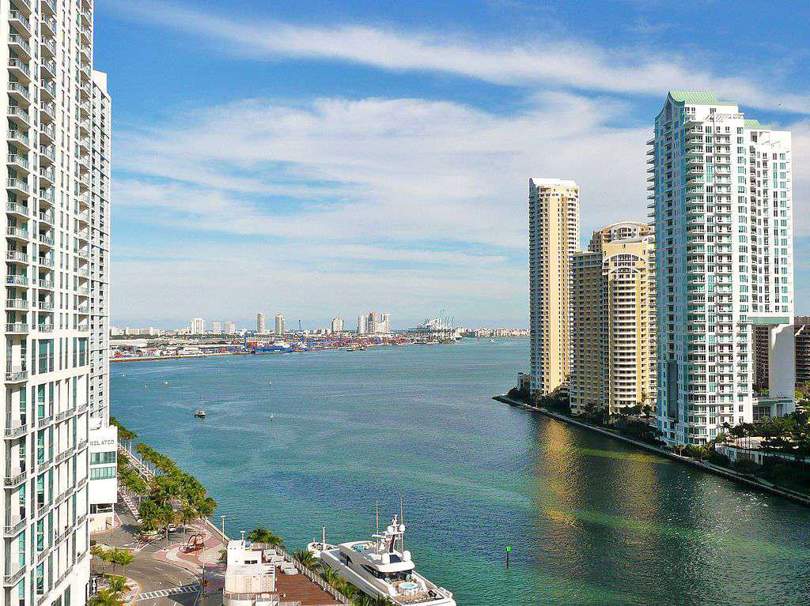

The concept of the 18-hour city represents a growing trend in urban development where the city remains active for 18 hours out of the day, offering a balanced blend of vibrant urban life and tranquility. This model contrasts with the traditional 9-to-5 cities, which typically have a bustling daytime economy that quiets down in the evening, and 24-hour cities, which are characterized by relentless activity across all hours. 18-hour cities have emerged to reflect changing urban lifestyles and preferences, catering to a diverse population seeking both dynamism and relaxation within their living environments.

These urban areas are gaining importance within contemporary urban planning and investment landscapes. They present an opportunity for sustainable growth, aligning closely with increasing demands for livability without the perpetual noise and congestion of a city that never sleeps. By maintaining an active yet not overwhelming rhythm of life, 18-hour cities attract a mix of residents, including families, professionals, and retirees, all looking for a community that supports a flexible pace of life.



This article aims to explore the unique characteristics that define 18-hour cities, shedding light on the balance they strike between active urban life and spaces for tranquility. We will examine the advantages these cities offer, such as economic diversification and resilience, alongside the challenges they encounter, including issues with infrastructure and community engagement. Additionally, we will analyze the investment opportunities presented by this emerging urban model, considering real estate, infrastructure, and cultural sectors as potential areas of growth. By understanding the dynamics underpinning 18-hour cities, stakeholders can appreciate their potential as liveable, sustainable, and economically vibrant urban environments.

## Table of Contents

## Understanding the 18-Hour City

An 18-hour city is an emerging urban model characterized by its active lifestyle for approximately 18 hours a day. This city model balances the bustling activity of larger metropolises and the tranquility typical of smaller, traditional urban areas. Unlike 24-hour metropolises that remain vibrant round-the-clock or 9-to-5 cities that exhibit peak activity solely during standard working hours, 18-hour cities sustain a high level of activity from early morning until late evening. This blend allows for a dynamic environment conducive to both work and leisure without the perpetual bustle of a 24-hour city.

Key characteristics define the allure and functionality of 18-hour cities. A notable feature is mixed-use development, which integrates residential, commercial, and leisure spaces within close proximity. This urban planning approach fosters vibrant communities by ensuring that living spaces, workplaces, and recreational venues coexist in a single area, thus reducing commute times and encouraging local economic activity.

Efficient transportation systems are another hallmark of 18-hour cities. They enable quick and easy commutes, supporting the seamless movement of people across the city during its active hours. By prioritizing accessible and reliable public transit options, these cities enhance the quality of life for their residents and appeal to tourists and investors.

Cultural richness also plays a pivotal role in defining an 18-hour city. A variety of cultural attractions, such as museums, theaters, and music venues, are readily available, offering residents and visitors diverse and engaging experiences. Additionally, a thriving culinary scene, characterized by an array of dining options ranging from street food to fine dining, further enhances the city's vibrancy and appeal.

Contrasting 18-hour cities with their 24-hour and 9-to-5 counterparts reveals significant differences. While 24-hour cities, like New York City or Tokyo, never sleep and provide nonstop activity, this constant buzz can lead to overcrowding, noise, and elevated living costs. Conversely, 9-to-5 cities typically experience a lull outside business hours, which can reduce the vibrancy and limit the social and economic opportunities outside of traditional work hours. An 18-hour city strikes a balance between these extremes, providing a dynamic yet manageable pace of life and work, creating a harmonious blend of activity and relaxation tailored to contemporary urban lifestyles.

## Characteristics of 18-Hour Cities

The concept of an 18-hour city revolves around its dynamic nature, characterized by its seamless blend of residential, commercial, and recreational spaces, often encapsulated within mixed-use developments. These developments are crucial for fostering vibrant communities, as they integrate living, working, and leisure spaces, enabling residents to enjoy a high quality of life without the need for extensive commuting. Mixed-use developments often include a combination of housing, offices, retail outlets, and leisure facilities, allowing for a sustainable urban ecosystem where people can efficiently navigate their daily lives.

Efficient transportation systems play a pivotal role in enhancing the accessibility and connectivity in 18-hour cities. These systems are designed to facilitate quick commutes, linking various parts of the city with ease. This is typically achieved through the integration of public transit options such as buses, trams, and subways, as well as bicycle lanes and pedestrian-friendly pathways. Efficient transportation not only reduces travel time and enhances convenience for residents, but also contributes to decreased traffic congestion and lower environmental impact, which is essential for sustainable urban growth.

Cultural and culinary attractions significantly contribute to the vibrancy of 18-hour cities. Such cities host a diverse array of cultural institutions, including museums, theaters, and galleries, which enrich the cultural fabric and appeal of the city. Culinary scenes in 18-hour cities are similarly diverse, offering a range of local and international cuisines that reflect the multicultural character of the urban population. These attractions serve as focal points for social interaction and community engagement, promoting a lively urban atmosphere that attracts both residents and visitors alike.

In summary, the characteristics of 18-hour cities, defined by mixed-use developments, efficient transportation systems, and a rich cultural and culinary environment, collectively contribute to their appeal as vibrant and sustainable urban spaces. These elements work synergistically to enhance the quality of life for city dwellers while supporting efficient and environmentally-friendly urban development.

## Benefits and Appeal of 18-Hour Cities

## Benefits and Appeal of 18-Hour Cities

18-hour cities represent a compelling urban model that strikes a balance between economic vitality and sustainable development. Central to their appeal is economic diversification, which is achieved through a blend of industries and activities that are active from early morning to late at night. This diversification fosters economic resilience, as it reduces reliance on a single industry and enables adaptability to economic changes or downturns. Such cities often attract a variety of businesses, ranging from technology firms to creative industries and retail spaces, making them less susceptible to economic shocks.

Sustainable urban development in 18-hour cities offers numerous advantages. These urban areas often prioritize environmental sustainability, embracing eco-friendly practices and green infrastructure. This commitment to sustainability not only enhances the living environment but also contributes to long-term economic efficiency by reducing energy consumption and waste. Implementing efficient public transport systems and promoting walkability further diminishes the reliance on automobiles, thus lowering carbon emissions and promoting healthier lifestyles.

Enhanced quality of life is a significant draw for both residents and investors. The vibrancy of 18-hour cities, characterized by a thriving cultural scene and diverse culinary offerings, enriches the everyday experience of inhabitants. Residents enjoy access to a range of amenities and services beyond the typical working hours, contributing to a well-balanced lifestyle that integrates work, leisure, and community engagement. For investors, the lively atmosphere and growing demand for residential and commercial spaces make these cities attractive investment destinations. The continuous influx of young professionals and families seeking dynamic urban environments ensures steady real estate demand and potential appreciation in property values.

In summary, the economic diversification, sustainable development strategies, and enhanced quality of life in 18-hour cities not only make them robust and adaptable urban areas but also attractive places for residents and lucrative opportunities for investors.

## Challenges in Developing 18-Hour Cities

Developing 18-hour cities presents unique challenges that must be addressed to ensure their sustainable growth and attractiveness. These challenges include regulatory, financing, and community engagement issues that must be tackled through adaptive policies and practices.

Regulatory challenges in 18-hour cities often involve zoning laws and urban planning regulations that are not conducive to the mixed-use developments typically associated with such cities. Traditional zoning laws may segregate areas by specific use, such as residential, commercial, or industrial, which can conflict with the needs of 18-hour cities for integrated spaces that combine living, working, and leisure. To overcome these regulatory hurdles, city planners and policymakers need to advocate for more flexible zoning regulations that support mixed-use development and encourage a vibrant urban environment.

Financing is another significant challenge, as the investment required to develop an 18-hour city is substantial. These cities often need to retrofit existing infrastructure to accommodate extended hours of operation, necessitating investment in transportation, utilities, and public services. Public-private partnerships can be a viable solution to finance these developments, offering a collaborative approach that shares risk and rewards between municipalities and private investors.

Community engagement is crucial in developing 18-hour cities to ensure that the needs and preferences of residents are met. However, engaging a diverse urban population with varying interests can be challenging. Implementing participatory planning processes, where community members have a say in the development projects, can help in aligning development goals with community interests. Digital platforms and tools can facilitate these engagements, offering accessible channels for feedback and collaboration.

Infrastructure strain is another critical issue. As cities extend their operational hours, public infrastructure such as transportation systems, electricity grids, and water supply networks must cope with increased demand. To address these challenges, cities can embrace smart city technologies that enhance the efficiency of infrastructure systems. For example, implementing intelligent transportation systems can optimize traffic flow and reduce congestion, thereby alleviating strain on services.

Gentrification is a concern in 18-hour cities, often resulting from increased investments and rising property values, potentially displacing long-standing residents. To mitigate gentrification effects, cities can introduce policies that promote affordable housing and protect the rights of current residents. Incentive programs for developers who include affordable housing units in new constructions can help maintain demographic diversity and equity.

Adaptive policies and sustainable practices are essential to overcoming these challenges. Encouraging policies that support innovation in urban development, investing in resilient infrastructure, and fostering inclusive community participation can pave the way for successful 18-hour cities. Sustainable urban planning must prioritize not only economic growth but also the environmental and social well-being of its inhabitants, ensuring that cities remain livable and thriving places for all.

## Investment Opportunities in 18-Hour Cities

Investment opportunities in 18-hour cities are gaining attention as these urban models continue to evolve, catering to the needs of both residents and investors. These cities, active for 18 hours a day, facilitate a balance between vibrant activity and periods of tranquility, making them attractive to a diverse range of stakeholders.

One of the most promising investment areas lies in real estate, particularly in mixed-use developments. These developments combine residential, commercial, and recreational spaces, fostering a sense of community and enhancing the overall livability of urban areas. This integration not only supports economic diversification but also aligns with sustainable urban growth by minimizing commute times and promoting pedestrian-friendly environments. Renovation of historic buildings also presents a significant opportunity, as these structures can be repurposed for modern use while preserving the cultural identity of the city.

Infrastructure investment is crucial for 18-hour cities to maintain their efficiency and connectivity. Developing efficient transport systems, including public transit and cycling networks, is essential. These systems facilitate accessibility and quick commutes, reducing the reliance on private vehicles and contributing to a reduction in urban congestion and pollution.

Cultural and gastronomic offerings are vital components of the 18-hour city model, and investment in these sectors can significantly enhance a city's appeal. Supporting local arts, entertainment venues, and diverse dining experiences attract both residents and tourists, contributing to a thriving local economy. In gastronomy, an emphasis on local and sustainable food options can resonate well with the growing consumer preference for sustainability.

Technology plays a pivotal role in advancing the growth and innovation of 18-hour cities. Investments in smart city technologies can empower these cities to manage resources more efficiently, from energy and water systems to traffic management. Smart technologies can also improve service delivery and enhance residents' quality of life through innovations such as IoT devices, automated public services, and real-time data analytics.

Tourism is another sector with considerable investment potential. 18-hour cities are increasingly seen as travel destinations, thanks to their vibrant atmospheres that do not compromise on residential peace. Investments aimed at enhancing tourist experiences, such as upgrading infrastructure around key attractions and building eco-friendly accommodations, can result in sustainable tourism growth.

In conclusion, investments in real estate, infrastructure, culture, gastronomy, technology, and tourism directly align with the growth and innovation needs of 18-hour cities. These investments not only enhance the attractiveness and functionality of the cities but also contribute significantly to their economic resilience and sustainability. By focusing on these strategic areas, stakeholders can ensure the continued prosperity and adaptability of 18-hour cities in an ever-evolving urban landscape.

## Examples of 18-Hour Cities

Austin, Nashville, and Portland serve as quintessential examples of 18-hour cities in the United States, each characterized by unique qualities that make them attractive destinations for investment and urban innovation.

**Austin, Texas**  
Austin stands out with its robust economy anchored in technology and innovation, often dubbed "Silicon Hills" due to the presence of major tech companies such as Dell, Apple, and IBM. The city's vibrant live music scene, epitomized by events like South by Southwest (SXSW) and Austin City Limits, is central to its cultural allure. Austin's investment appeal is further bolstered by its reputation for relatively affordable real estate compared to larger tech hubs like San Francisco, making it an attractive option for both startups and established firms. The city has been pivotal in influencing urban trends, particularly with its efforts in promoting sustainable development and green spaces, reflecting a balanced integration of nature within urban settings.

**Nashville, Tennessee**  
Known as "Music City," Nashville's identity is deeply rooted in its rich musical heritage, with the country music industry serving as a critical economic driver. The city's growth is supported by its burgeoning healthcare, education, and tourism sectors, providing a diversified economic base. Nashville's investment potential is pronounced through its historic renovation projects and mixed-use developments, attracting investors looking for long-term growth opportunities. The city's ability to blend traditional culture with modern amenities has set a precedent for urban regeneration, influencing nationwide urban development trends.

**Portland, Oregon**  
Portland is renowned for its commitment to environmental sustainability and its progressive urban planning initiatives. The city's extensive public transportation network, eco-friendly policies, and emphasis on bike lanes contribute to its reputation as a green city. Portland's culinary and craft beer scenes are significant draws, enhancing its cultural landscape. The city has been a leader in adopting policies that encourage urban density while maintaining a high quality of life, influencing urban trends towards more pedestrian-friendly and sustainable city designs. Portland's real estate market, characterized by a mix of new developments and historic buildings, presents intriguing investment opportunities, appealing to those interested in sustainable and community-focused projects.

In summary, Austin, Nashville, and Portland exemplify the 18-hour city model through their diversified economies, unique cultural fabrics, and strategic urban planning. Their influence is evident in emerging urban trends such as the prioritization of sustainability, cultural preservation, and economic diversification, making them compelling case studies for investors and urban planners alike.

## Algorithmic Trading in Urban Planning

Algorithmic trading, a strategy largely associated with financial markets, involves using algorithms to automate decision-making processes based on data analysis. This approach is increasingly being applied to urban planning and real estate investment. By utilizing data-driven insights, urban planners and investors can foster more efficient and responsive city development strategies.

In urban planning, data-driven decision-making allows for the analysis of vast amounts of data to identify patterns, trends, and opportunities that may not be immediately obvious through traditional methods. For instance, algorithms can analyze factors such as population density, traffic flow, energy consumption, and social media interactions to inform infrastructure planning. This comprehensive analysis supports more efficient land use, transportation networks, and resource allocation, enhancing the livability and sustainability of cities.

One application of algorithmic principles in real estate investment is the identification of emerging neighborhoods with high growth potential. Algorithms can process historical data, economic indicators, and social trends to forecast areas that might experience a surge in demand. By anticipating these trends, investors can strategically position themselves to capitalize on the appreciation of property values.

Additionally, algorithmic approaches can optimize urban growth strategies through technology integration. For instance, smart city technologies, such as IoT sensors and Geographic Information Systems (GIS), generate real-time data on urban conditions. This data can be processed by algorithms to optimize resource management, reduce congestion, and improve public services, aligning with the city's development goals and fostering sustainable urban environments.

Python, a preferred programming language in data science, offers tools like Pandas for data manipulation and Scikit-learn for implementing [machine learning](/wiki/machine-learning) models. These tools can aid in developing algorithms for urban planning initiatives. Consider the following Python snippet that uses Scikit-learn to predict property price trends in a city based on historical data:

```python
from sklearn.model_selection import train_test_split
from sklearn.linear_model import LinearRegression
import pandas as pd

# Load dataset containing property sales data
data = pd.read_csv('property_sales.csv')

# Define features and target variable
features = data[['location_score', 'transport_score', 'historical_growth']]
target = data['property_price']

# Split the data into training and test sets
X_train, X_test, y_train, y_test = train_test_split(features, target, test_size=0.2, random_state=42)

# Create and train the model
model = LinearRegression()
model.fit(X_train, y_train)

# Predict future property prices
predictions = model.predict(X_test)
print(predictions)
```

This code provides a basic framework for predicting property prices based on various urban indicators, demonstrating how data-driven approaches can enhance investment strategies.

In summary, the integration of [algorithmic trading](/wiki/algorithmic-trading) principles into urban planning and real estate provides a substantial advantage in today's data-rich environment. By leveraging data-driven insights, decision-makers can foster more adaptive, efficient, and sustainable urban growth.

## The Future of 18-Hour Cities

The evolution of 18-hour cities is likely to continue in response to changing urban needs and societal behaviors. As populations grow and urbanization trends persist, 18-hour cities offer an adaptable model that balances the dynamic activities of a 24-hour metropolis with the tranquility often associated with smaller communities. One of the key trends anticipated in the development of these cities is the integration of technological and infrastructural innovations, aimed at creating sustainable environments that cater to diverse populations.

**Innovations and Sustainable Practices**

Advancements in technology will play a critical role in shaping the future of 18-hour cities. Smart city technologies, such as the Internet of Things (IoT), [artificial intelligence](/wiki/ai-artificial-intelligence) (AI), and data analytics, will facilitate more efficient management of urban resources. Implementing smart transportation systems can optimize traffic flow, reduce congestion, and lower carbon emissions. Moreover, sustainable building practices, including green infrastructure and energy-efficient designs, will be crucial in mitigating the environmental impact of urban expansion.

The focus on sustainability will also emphasize renewable energy sources, water conservation techniques, and waste reduction methods. By integrating these practices, 18-hour cities can reduce their ecological footprint while promoting healthier urban environments. The adoption of circular economy principles—where materials are reused and recycled—will further promote sustainability, reducing the demand for new resources and minimizing waste.

**Community Engagement and Demographic Adaptability**

Engaging community stakeholders will be essential in ensuring that 18-hour cities develop in ways that meet the needs of their residents. Participatory planning processes, where residents have a voice in decisions affecting their neighborhoods, can enhance social cohesion and foster a sense of community ownership. Platforms that allow for public feedback and collaboration with local governments will enable more responsive and inclusive urban planning.

Demographic adaptability will also be a prominent focus in the evolution of 18-hour cities. As urban populations grow increasingly diverse, these cities must accommodate various cultural preferences and lifestyle needs. This adaptability will require flexible urban designs that can evolve over time and provide a range of housing, workspaces, and recreational facilities. Cities that embrace cultural diversity and offer amenities that cater to different age groups, ethnicities, and income levels are likely to thrive.

The prediction for 18-hour cities involves a blend of technological, sustainable, and societal strategies aimed at creating vibrant and resilient urban environments. As the demand for livable cities continues to rise, 18-hour cities can position themselves at the forefront of innovative urban planning by adopting practices that harmonize growth, sustainability, and community well-being.

## Conclusion

The emergence of the 18-hour city as a modern urban model reflects a significant evolution in understanding urban spaces' functionality and livability. These cities, active for extended periods beyond the conventional 9-to-5 rhythm, present a compelling balance between economic vitality and quality of life. By offering mixed-use developments and efficient transportation systems, 18-hour cities create environments that cater to cultural richness and diverse social interactions, distinguishing themselves from bustling 24-hour metropolises, which often face overstimulation issues, and the limited engagement of 9-to-5 cities.

Innovative urban planning is crucial to the sustainability and resilience of 18-hour cities. The integration of sustainable practices—ranging from eco-friendly infrastructure to community-centered initiatives—ensures these urban areas remain adaptable to demographic shifts and evolving economic landscapes. The successful implementation of these strategies requires collaboration among various stakeholders, including city planners, investors, and local communities, emphasizing a shared commitment to creating urban environments conducive to long-term prosperity and ecological responsibility.

Stakeholders are encouraged to channel investments strategically, focusing on sustainable and mixed-use developments that bolster economic resilience while catering to the diverse needs of residents. As 18-hour cities continue to evolve, investing in technological advancements, cultural amenities, and efficient transit solutions will be pivotal to maintaining their allure. Prospective investments should align with a vision that accommodates growth and innovation, fostering urban landscapes that support inclusive, sustainable futures. By embracing this holistic approach, stakeholders can significantly contribute to transforming 18-hour cities into vibrant hubs that adequately adjust to new urban trends and challenges.

## References & Further Reading

[1]: Florida, R. (2017). ["The New Urban Crisis: How Our Cities Are Increasing Inequality, Deepening Segregation, and Failing the Middle Class—and What We Can Do About It."](https://archive.org/details/newurbancrisisho0000flor) Basic Books.

[2]: Leinberger, C. B., & Lynch, P. (2014). ["Foot Traffic Ahead: Ranking Walkable Urbanism in America's Largest Metros."](https://nacto.org/wp-content/uploads/2016/02/1_Leinberger-Lynch-Foot-Traffic-Ahead_2014.pdf) Smart Growth America.

[3]: Glaeser, E. L. (2011). ["Triumph of the City: How Our Greatest Invention Makes Us Richer, Smarter, Greener, Healthier, and Happier."](https://www.researchgate.net/publication/227372197_Triumph_of_the_City_How_Our_Greatest_Invention_Makes_Us_Richer_Smarter_Greener_Healthier_and_Happier_-_By_Edward_Glaeser) Penguin Press.

[4]: White, D. R. (2016). ["18-Hour Cities 2016: Defining The Next Generation of Opportunities."](https://www.franchisetimes.com/article_archive/18-hour-cities-emerge-as-hot-spots/article_28939700-81ce-592f-a718-f6f9a78624d8.html) Urban Land Institute.

[5]: Grant, J. L. (2002). ["Mixed Use in Theory and Practice: Canadian Experience with Implementing a Planning Principle."](https://www.researchgate.net/publication/235363384_Mixed_Use_in_Theory_and_Practice_Canadian_Experience_with_Implementing_a_Planning_Principle) Urban Studies, 39(5-6), 953-977.