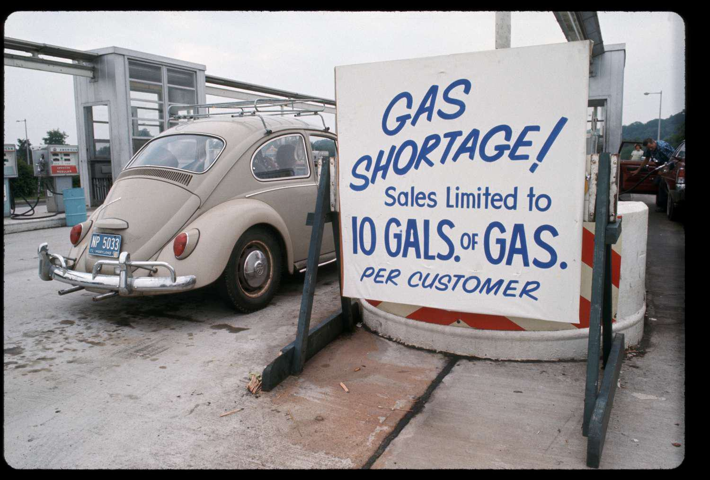

The 1973 energy crisis marked a significant turning point in global economic and political landscapes, primarily instigated by the oil embargo imposed by the Organization of the Petroleum Exporting Countries (OPEC). This embargo was a direct response to geopolitical conflicts, specifically related to the U.S. support for Israel during the Yom Kippur War. As a result, oil prices skyrocketed, sending shockwaves through economies worldwide. Nations struggled to cope with the sudden and severe economic disruptions triggered by this scarcity and price hike, underscoring their deep dependency on oil.

The ramifications of the crisis extended beyond immediate economic hardships, affecting political relations and prompting a reevaluation of energy policies. This article aims to dissect the underlying causes and cascading effects of the 1973 oil crisis while examining the pivotal role of OPEC. The influence of such historical events continues to resonate today, particularly in the domain of advanced technological innovations like algorithmic trading. These historical insights offer valuable understanding relevant to analyzing current energy markets and trading strategies.



By exploring the linkages between past events and contemporary financial mechanisms, we can gain a comprehensive perspective on how historical precedents shape modern finance. Algorithmic trading, a product of such evolutionary learnings, highlights the need for rapid adaptability in response to market fluctuations, echoing challenges faced during historical crises. Through recognizing these interconnections, market participants can develop informed strategies, enhancing readiness for future economic and energy-related upheavals.

## Table of Contents

## The 1973 Oil Crisis: A Historical Overview

The 1973 oil crisis was a significant geopolitical event that reshaped the global economic landscape. It began in October 1973 when Arab members of the Organization of the Petroleum Exporting Countries (OPEC) initiated an oil embargo. This strategic move was a direct response to the political and military support provided by the United States to Israel during the Yom Kippur War, a conflict involving Israel and a coalition of Arab states led by Egypt and Syria. The primary objective of the embargo was to use oil as a political instrument to pressure countries perceived as allies of Israel, thereby seeking a shift in their foreign policies towards the Middle East.

Consequently, the embargo led to a considerable reduction in oil supply to several Western countries, including the United States, Japan, and the Netherlands. The supply cutbacks triggered an alarming increase in oil prices, with the cost of [crude oil](/wiki/crude-oil) skyrocketing from around $3 per barrel to nearly $12 per barrel within months. This fourfold increase in prices caused significant disruptions to global economies that were heavily reliant on oil, highlighting their vulnerabilities to sudden supply shortages.

The economic repercussions of the embargo were profound. Many countries faced inflationary pressures as the high cost of oil translated into increased production costs and consumer prices. Economies that lacked alternative energy resources or the means to quickly adapt to reduced oil supplies experienced severe contractions. This period marked a pivotal moment where the risk of dependency on a single energy source became alarmingly evident and underscored the influential power wielded by OPEC in international markets.

The oil crisis of 1973 revealed the fragile interdependencies between geopolitics and global economic stability. The swift and dramatic effect of the embargo prompted countries to reconsider their energy policies, laying the groundwork for future efforts aimed at diversifying energy sources and enhancing energy independence. The situation also served as a catalyst for rethinking national and international strategies to mitigate the impact of similar crises in the future.

## OPEC's Role and Its Impact on Global Markets

OPEC, the Organization of the Petroleum Exporting Countries, emerged as a formidable entity in global markets, particularly during the 1973 energy crisis. Formed in 1960, OPEC was initially created to coordinate and unify petroleum policies among member countries, ensuring the stabilization of oil markets. By the early 1970s, OPEC began asserting significant influence over oil pricing and production policies, challenging the control previously held by multinational oil companies, often referred to as the "Seven Sisters."

Prior to the 1973 crisis, OPEC members were gradually nationalizing their oil assets and aiming to gain greater control over their natural resources. This shift set the stage for the organization's decisive actions during the Yom Kippur War in October 1973. In response to U.S. support for Israel, Arab members of OPEC, led by Saudi Arabia, initiated an oil embargo against the United States and other nations perceived as pro-Israel. This embargo not only drastically curtailed oil supplies but also showcased OPEC's collective power to influence global politics and economics.

The embargo had far-reaching impacts on global trade balances, inflation rates, and economic growth. Oil prices quadrupled from approximately $3 to nearly $12 a barrel between October 1973 and March 1974. As oil-importing nations faced soaring energy costs, they grappled with trade deficits and inflation, leading to economic slowdowns and recessionary pressures. Developed countries, particularly in the West, experienced high inflation rates alongside rising unemployment, a phenomenon termed "stagflation."

OPEC's actions during the crisis underscored the strategic importance of energy policy and catalyzed a significant reevaluation of energy dependence among oil-importing countries. In pursuit of greater energy independence, many nations began investing in alternative energy sources, diversifying their energy portfolios, and promoting energy conservation measures. The crisis also spurred the establishment of strategic petroleum reserves, aimed at buffering against future oil supply disruptions.

Overall, the 1973 oil crisis highlighted the leverage OPEC could wield through oil as a political instrument. It underscored the necessity for countries to develop more resilient and diversified energy strategies to counter the geopolitical risks associated with oil dependency. This period marked a pivotal transformation in the global energy landscape, influencing both policy and economic frameworks in the ensuing decades.

## Economic and Societal Effects of the Energy Crisis

The 1973 energy crisis profoundly impacted both the economies and societies of Western countries, manifesting in several ways that extended beyond immediate financial turmoil. One of the most significant outcomes was the spike in inflation rates. The sharp increase in oil prices exerted upward pressure on the cost of goods and services, as oil was crucial for transportation and production processes. This inflationary shock was coupled with a steep rise in unemployment, as businesses grappled with increased operational costs and decreased consumer spending power, leading to cutbacks and job losses.

In response to the crisis, governments worldwide adopted various measures aimed at mitigating the immediate impacts and preventing future vulnerabilities. Fuel rationing became a common practice, attempting to manage scarce resources more effectively. Additionally, there was a notable shift towards seeking alternative energy sources. This pivot was driven by the need to reduce dependence on OPEC oil and to ensure greater energy security. The crisis spurred research and investment in sectors like nuclear, solar, and wind energy, laying the groundwork for future advancements in renewable energy technologies.

The societal impacts of the crisis were equally significant. The reduction in automobile use was prompted by both necessity and policy, as individuals sought to minimize costs and governments encouraged reduced fuel consumption. This period marked a growing interest in fuel-efficient vehicles, as manufacturers and consumers alike prioritized fuel economy to safeguard against future price shocks.

Awareness of energy conservation became prevalent, altering consumer behavior and leading to policy initiatives focused on reducing energy waste. Efficiency standards for vehicles, appliances, and industrial processes were introduced, emphasizing the importance of sustainability. This heightened consciousness also catalyzed broader discussions on environmental stewardship and sustainable development.

Long-term strategic measures were also instituted in the wake of the crisis. Many countries established strategic petroleum reserves to buffer against future supply disruptions, providing a mechanism to stabilize oil markets and national economies in times of turmoil. Furthermore, the crisis fostered international cooperation in energy policies, as nations recognized the interconnected nature of energy markets and the benefits of collective energy security strategies.

In summary, the 1973 energy crisis acted as a catalyst for substantial economic and societal changes, prompting immediate responses and laying the foundation for future shifts towards energy independence and sustainability. These developments continue to influence policy and consumer behavior in the present day.

## Algorithmic Trading: A Modern Financial Innovation

Algorithmic trading, a hallmark of modern financial markets, employs sophisticated computer algorithms to execute trades based on predetermined parameters. This technology has fundamentally reshaped the landscape of trading by enhancing both the speed and the [volume](/wiki/volume-trading-strategy) of trading activities. Traditional trading methods, which relied heavily on manual inputs and human decision-making, have been largely supplanted by algorithm-driven operations that can perform trades in milliseconds.

The origins of [algorithmic trading](/wiki/algorithmic-trading) can be traced back to the need for rapid adaptation to market dynamics. Financial markets are inherently volatile, and the ability to swiftly respond to fluctuations is crucial. Algorithmic trading algorithms can process vast amounts of market data in real-time, identifying patterns and executing trades faster than any human. For instance, simple strategies could involve moving average crossovers, while more complex algorithms may apply [machine learning](/wiki/machine-learning) to predict future price movements based on historical data.

One of the key advantages of algorithmic trading is its capacity to exploit minor price discrepancies between markets. This process, known as [arbitrage](/wiki/arbitrage), involves algorithms searching for and acting on price differences across different exchanges. The speed at which these algorithms operate allows traders to benefit from these small variances before they are corrected by the market, yielding potentially significant profits.

Moreover, algorithmic trading is particularly beneficial in volatile market environments, similar to those experienced during historical energy crises. The rapid fluctuations in prices created by such crises can provide fertile ground for algorithms designed to operate under volatile conditions. During these periods, algorithms can adjust strategies almost instantly, optimizing for gains while mitigating potential losses.

The relevance of algorithmic trading extends beyond individual traders to encompass institutional investors who manage large portfolios. By employing these algorithms, they can execute large volumes of trades without causing severe market impact, a tactic known as slicing. This minimizes the cost and risk of their operations, ensuring smoother execution compared to traditional methods.

Overall, the integration of algorithmic trading into financial markets epitomizes the evolution of trading mechanisms in response to the increasing complexities and demands for efficiency in modern finance. Through its ability to analyze data and execute trades at unprecedented speeds, algorithmic trading continues to influence trading strategies and reshape the operations of global markets.

## The Intersection of Historical Crises and Modern Trading Technology

The 1973 oil crisis serves as an illuminating case in understanding the impact of geopolitical events on global markets. For traders and investors today, historical crises such as this provide critical insights into market behavior and inform the development of algorithms used in modern trading systems.

Algorithmic trading relies heavily on the analysis of historical data to enhance trading decisions. By examining past market responses, such as those during the 1973 oil crisis, algorithms can be crafted to anticipate and respond to similar conditions of instability. Algorithms work by processing vast amounts of historical data, identifying patterns, and executing trades at high speed, thus thriving in environments marked by [volatility](/wiki/volatility-trading-strategies).

For instance, during the oil crisis, sudden shifts in oil prices led to drastic volatility in global markets. Modern trading algorithms could leverage historical price volatility data to predict similar disruptions and capitalize on the rapid price changes. Python, a widely used programming language in finance, can be employed to develop such trading strategies. Here's a simple illustration of how historical data might be used in an algorithmic trading context:

```python
import numpy as np
import pandas as pd
from sklearn.linear_model import LinearRegression

# Simulating historical price data
np.random.seed(0)
dates = pd.date_range('1973-01-01', periods=100, freq='D')
price_data = np.random.normal(loc=100, scale=5, size=(100,))

# Creating a DataFrame
df = pd.DataFrame(data={'Date': dates, 'Price': price_data})

# Calculating moving averages
df['MA10'] = df['Price'].rolling(window=10).mean()

# Simple linear regression model to predict next day price
model = LinearRegression()
X = np.arange(len(df)).reshape(-1, 1)
y = df['Price'].values

# Fitting the model
model.fit(X[:-1], y[:-1])

# Predicting the next day price
predicted_price = model.predict([[len(df)]])

print(f"Predicted next day price: {predicted_price[0]:.2f}")
```

The predictability of market reactions based on historical precedence is a crucial element in designing resilient trading strategies. During the oil crisis, market actors who were able to anticipate OPEC's influence and adapt quickly were better positioned to mitigate losses or even capitalize on the situation.

Incorporating lessons from past crises into algorithmic models helps traders not only to enhance performance but also to prepare for future uncertainties. Understanding how markets have historically reacted to geopolitical events allows for the creation of algorithms designed to manage risk and exploit opportunities amid market fluctuations. This approach ensures that trading strategies are robust, adaptable, and capable of navigating volatile market environments effectively.

## Conclusion

The 1973 oil crisis exemplifies the complex interplay between geopolitics and global economic systems. The decisions made by the Organization of the Petroleum Exporting Countries (OPEC) during this period had far-reaching effects on both political and economic structures worldwide. OPEC's strategic use of oil as a political tool demonstrated the organization's influence in shaping not only energy markets but also global economic policies.

As financial markets continue to evolve, algorithmic trading has become a crucial innovation, reflecting the demand for rapid and efficient trading solutions. This advancement allows market participants to swiftly respond to dynamic market conditions, a lesson underscored by the volatility experienced during events like the oil crisis. Algorithmic trading illustrates how technology can adapt to support market stability and improve trading outcomes, leveraging historical patterns to anticipate future movements.

By applying the insights gained from past crises, traders and policymakers can enhance their ability to navigate the complexities of today's markets. The study of historical geopolitical and economic challenges, such as the 1973 oil crisis, provides a valuable framework for developing robust and adaptable strategies. Preparing for future energy and economic disruptions necessitates learning from these precedents to construct resilient financial systems. Such preparedness is critical in minimizing the impacts of potential crises and ensuring the sustainability of global markets.

## References & Further Reading

[1]: Sampson, Anthony. ["The Seven Sisters: The Great Oil Companies and the World They Shaped."](https://archive.org/details/seven-sisters-oil) Bantam Books, 1981.

[2]: Yergin, Daniel. ["The Prize: The Epic Quest for Oil, Money & Power."](https://www.amazon.com/Prize-Epic-Quest-Money-Power/dp/1439110123) Free Press, 1991.

[3]: Hamilton, James D. "What is an Oil Shock?" Journal of Econometrics, vol. 113, no. 2, 2003, pp. 363-398. doi:10.1016/S0304-4076(02)00212-X.

[4]: Adelman, M.A. ["The World Petroleum Market."](https://archive.org/details/worldpetroleumma0000adel) MIT Press, 1972.

[5]: Gately, Dermot. "A Ten-Year Retrospective: OPEC and the World Oil Market." Journal of Economic Literature, vol. 22, no. 3, 1984, pp. 1100-1114.

[6]: Malkiel, Burton G. ["A Random Walk Down Wall Street: The Time-Tested Strategy for Successful Investing."](https://www.amazon.com/Random-Walk-Down-Wall-Street/dp/0393358380) W.W. Norton & Company, 1973.

[7]: Kissinger, Henry. ["Crisis: The Anatomy of Two Major Foreign Policy Crises."](https://www.amazon.com/Crisis-Anatomy-Foreign-Policy-Crises/dp/0743249119) Simon & Schuster, 2003.

[8]: Linden, Henry R. "The Evolution of Oil as a Political and Strategic Commodity." Annual Review of Energy, vol. 6, 1981, pp. 25-47. doi:10.1146/annurev.eg.06.110181.000325.