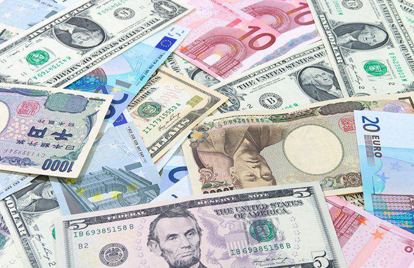

## Table of Contents

## What was the 1979 Energy Crisis?

The 1979 Energy Crisis was a big problem that happened because there wasn't enough oil. It started when Iran had a revolution and stopped sending oil to other countries. This made the price of oil go up a lot, and people had to wait in long lines to get gas for their cars. It was hard for everyone because oil is used to make electricity and to run cars and factories.

Because of the crisis, many countries started looking for other ways to get energy. They tried to use less oil and find new sources like wind and solar power. The crisis made people realize that they needed to be more careful with how they used energy. It also led to changes in laws and policies to make sure there would be enough energy in the future.

## What were the main causes of the 1979 Energy Crisis?

The main cause of the 1979 Energy Crisis was the Iranian Revolution. In 1979, Iran went through a big change where the government was overthrown. This revolution caused a lot of chaos, and as a result, Iran stopped exporting oil. Iran was one of the biggest oil producers in the world, so when they stopped sending oil, it created a shortage. This shortage made the price of oil go up a lot, which affected countries all over the world.

Another reason for the crisis was that many countries depended too much on oil from the Middle East. When Iran stopped exporting oil, it showed how risky it was to rely on just a few countries for such an important resource. Also, some countries had used up a lot of their own oil and didn't have enough left. This made the situation worse because they had to buy more oil from other places, which drove up the demand and the price even more.

Overall, the 1979 Energy Crisis was caused by a mix of political problems in Iran and a heavy reliance on oil from the Middle East. It made people realize they needed to find other sources of energy and use less oil to avoid similar problems in the future.

## How did the Iranian Revolution contribute to the 1979 Energy Crisis?

The Iranian Revolution in 1979 was a big reason for the 1979 Energy Crisis. The revolution happened because people in Iran wanted to change their government. When the revolution started, it caused a lot of chaos and fighting. Because of this, Iran had to stop sending oil to other countries. Iran was one of the biggest oil producers in the world, so when they stopped, it created a big problem. There wasn't enough oil for everyone, and this made the price of oil go up a lot.

This oil shortage affected many countries because they depended on oil from Iran. People had to wait in long lines to get gas for their cars, and it was hard for factories and businesses to keep running. The high price of oil made everything more expensive. The crisis showed everyone that relying on oil from just a few places was risky. It made countries start looking for other ways to get energy, like using wind and solar power, and trying to use less oil overall.

## What impact did the 1979 Energy Crisis have on global oil prices?

The 1979 Energy Crisis made global oil prices go up a lot. When Iran stopped sending oil because of the revolution, there wasn't enough oil to go around. This made the price of oil jump from about $14 a barrel at the start of 1979 to over $30 a barrel by the end of the year. That's more than double! People and businesses had to pay a lot more for oil, and this made everything more expensive.

Because of the high oil prices, people had to find other ways to get energy. Countries started looking into using less oil and finding new sources like wind and solar power. The crisis showed everyone that depending too much on oil from just a few places was risky. It made governments change their laws and policies to make sure they wouldn't run into the same problem again.

## How did the 1979 Energy Crisis affect the United States?

The 1979 Energy Crisis hit the United States hard. When Iran stopped sending oil, it made gas prices go way up. People had to wait in long lines at gas stations, and sometimes they couldn't even get gas for their cars. This made everything more expensive, like food and other things that needed to be moved around by trucks. It was tough for families because they had to spend more money just to get by.

The crisis also made the U.S. government start thinking about using less oil and finding other ways to get energy. They started looking into things like wind and solar power. The government made new rules to help save energy and to make sure there would be enough in the future. The crisis showed everyone that relying too much on oil from other countries was risky, so the U.S. tried to become more independent with its energy.

## What were the economic consequences of the 1979 Energy Crisis worldwide?

The 1979 Energy Crisis had big economic effects all over the world. When Iran stopped sending oil because of their revolution, it made the price of oil go up a lot. This meant that everything that used oil, like cars and factories, became more expensive to run. Countries that depended a lot on oil from Iran had to pay more for it, which made their economies struggle. People and businesses had to spend more money on energy, and this led to higher prices for everything else too. In some places, people had to wait in long lines just to get gas for their cars, which made life harder for everyone.

Because of the crisis, many countries started looking for other ways to get energy. They tried to use less oil and find new sources like wind and solar power. This shift helped some economies in the long run by making them less dependent on oil from the Middle East. However, at the time, the high oil prices caused inflation and slowed down economic growth in many places. Governments had to make new rules and policies to deal with the crisis and to make sure they wouldn't run into the same problem again. Overall, the 1979 Energy Crisis showed the world how important it is to have different sources of energy and to use them wisely.

## How did different countries respond to the 1979 Energy Crisis?

Different countries had to find ways to deal with the 1979 Energy Crisis because there wasn't enough oil. In the United States, people had to wait in long lines to get gas for their cars, and the government started looking for other ways to get energy. They tried to use less oil and started looking into things like wind and solar power. The government also made new rules to help save energy and make sure there would be enough in the future. Other countries did similar things, trying to use less oil and find new energy sources to avoid problems like this in the future.

In Europe, countries also faced higher oil prices and had to find ways to cope. Many European countries started energy conservation programs to use less oil. They encouraged people to turn off lights and use less heat. Some countries even started looking into nuclear power as another way to get energy. In Japan, the government pushed for more energy-efficient cars and buildings to save oil. They also started looking into renewable energy like solar and wind power. Overall, the crisis made countries all over the world realize they needed to be more careful with how they used energy and to find new ways to get it.

In the Middle East, countries like Saudi Arabia and other oil producers saw their income go up because of the higher oil prices. They used this money to build up their economies and invest in other areas. However, they also knew that relying too much on oil was risky, so some started looking into diversifying their economies. In developing countries, the high oil prices made life harder because everything became more expensive. Many of these countries had to borrow money to pay for the oil they needed, which led to more economic problems. Overall, the 1979 Energy Crisis made countries all over the world rethink their energy policies and look for new ways to become more energy independent.

## What long-term effects did the 1979 Energy Crisis have on energy policy?

The 1979 Energy Crisis changed how countries thought about energy. Before the crisis, many countries depended a lot on oil from the Middle East. But when Iran stopped sending oil, it showed everyone that relying on just a few countries for oil was risky. So, countries started making new rules to use less oil and find other ways to get energy. They began to look into things like wind, solar, and nuclear power. Governments also made laws to encourage people to save energy and to make cars and buildings more energy-efficient. These changes helped countries become less dependent on oil and more able to handle energy problems in the future.

In the long run, the crisis made countries think about their energy future more carefully. They realized they needed to have different sources of energy to avoid big problems like the 1979 crisis. This led to more research and investment in renewable energy. Countries also started working together more to share energy resources and technology. The crisis also made people more aware of how important it is to use energy wisely. Overall, the 1979 Energy Crisis pushed the world towards using more sustainable energy and being more prepared for future energy challenges.

## How did the 1979 Energy Crisis influence the development of alternative energy sources?

The 1979 Energy Crisis made people and governments around the world think more about using other types of energy instead of just oil. When Iran stopped sending oil because of their revolution, it caused a big problem. Oil prices went up a lot, and people had to wait in long lines to get gas. This made everyone realize that relying on oil from just a few countries was risky. So, countries started looking into other ways to get energy. They began to invest more in things like wind, solar, and nuclear power. These are called alternative energy sources because they can be used instead of oil.

Because of the crisis, governments made new rules to encourage people to use less oil and to try out these new energy sources. They gave money to companies to research and develop wind turbines, solar panels, and nuclear power plants. Over time, this helped make these alternative energy sources cheaper and easier to use. The crisis also made people more aware of the need to save energy and use it more wisely. In the long run, the 1979 Energy Crisis helped push the world towards using more sustainable energy and being better prepared for future energy problems.

## What role did OPEC play during the 1979 Energy Crisis?

OPEC, which stands for the Organization of the Petroleum Exporting Countries, played a big role during the 1979 Energy Crisis. OPEC is a group of countries that produce a lot of the world's oil. When Iran stopped sending oil because of their revolution, it made the world short on oil. OPEC tried to help by sending more oil to other countries, but they couldn't send enough to make up for what Iran wasn't sending. This made the price of oil go up a lot because there still wasn't enough oil to go around.

OPEC also had to deal with other problems during the crisis. Some countries in OPEC wanted to keep oil prices high because they were making a lot of money from it. But other countries wanted to send more oil to help lower prices and make things easier for everyone. In the end, OPEC couldn't agree on what to do, so oil prices stayed high. This made the 1979 Energy Crisis last longer and caused more problems for countries all over the world.

## How did the 1979 Energy Crisis affect international relations and geopolitics?

The 1979 Energy Crisis changed how countries worked together and made new tensions between them. When Iran stopped sending oil because of their revolution, it made the price of oil go up a lot. Countries that depended on oil from Iran had to find other places to get it. This made some countries get closer to others that could give them oil. But it also made some countries argue and fight over who should get the oil that was left. The crisis showed everyone that relying on oil from just a few places was risky, so countries started looking for other ways to get energy and tried to be less dependent on oil from the Middle East.

The crisis also made some countries in the Middle East more powerful because they had a lot of oil. Countries like Saudi Arabia made a lot of money from the high oil prices. They used this money to help their own countries grow and to have more say in what happened in the world. But it also made other countries worried about how much power these oil-rich countries had. The 1979 Energy Crisis made countries think more about their energy future and how they could work together to avoid big problems like this in the future. It pushed them to find new ways to get energy and to be more independent.

## What lessons were learned from the 1979 Energy Crisis that are still relevant today?

The 1979 Energy Crisis taught us a lot about how important it is to not rely too much on oil from just a few countries. When Iran stopped sending oil, it made the price of oil go up a lot and caused big problems for everyone. This showed that depending on oil from the Middle East was risky. So, countries started looking for other ways to get energy, like using wind, solar, and nuclear power. They also tried to use less oil by making cars and buildings more energy-efficient. These lessons are still important today because we still need to find different ways to get energy and not depend too much on oil.

Another lesson from the 1979 Energy Crisis is that working together can help solve big energy problems. Countries had to find new ways to share oil and energy resources during the crisis. This made them realize that they needed to cooperate more to avoid similar problems in the future. Today, countries still work together to share energy technology and resources. They also make rules to encourage using less oil and more renewable energy. By learning from the 1979 Energy Crisis, we can be better prepared for future energy challenges and use energy in a smarter way.

## References & Further Reading

[1]: Hamilton, J. D. (2011). ["Historical Oil Shocks."](https://www.nber.org/papers/w16790) University of California, San Diego.

[2]: Lopez de Prado, M. (2018). ["Advances in Financial Machine Learning."](https://www.amazon.com/Advances-Financial-Machine-Learning-Marcos/dp/1119482089) Wiley.

[3]: Aronson, D. (2007). ["Evidence-Based Technical Analysis: Applying the Scientific Method and Statistical Inference to Trading Signals."](https://www.amazon.com/Evidence-Based-Technical-Analysis-Scientific-Statistical/dp/0470008741) Wiley.

[4]: Chan, E. P. (2009). ["Quantitative Trading: How to Build Your Own Algorithmic Trading Business."](https://github.com/ftvision/quant_trading_echan_book) Wiley.

[5]: Jansen, S. (2020). ["Machine Learning for Algorithmic Trading."](https://github.com/stefan-jansen/machine-learning-for-trading) Packt Publishing.