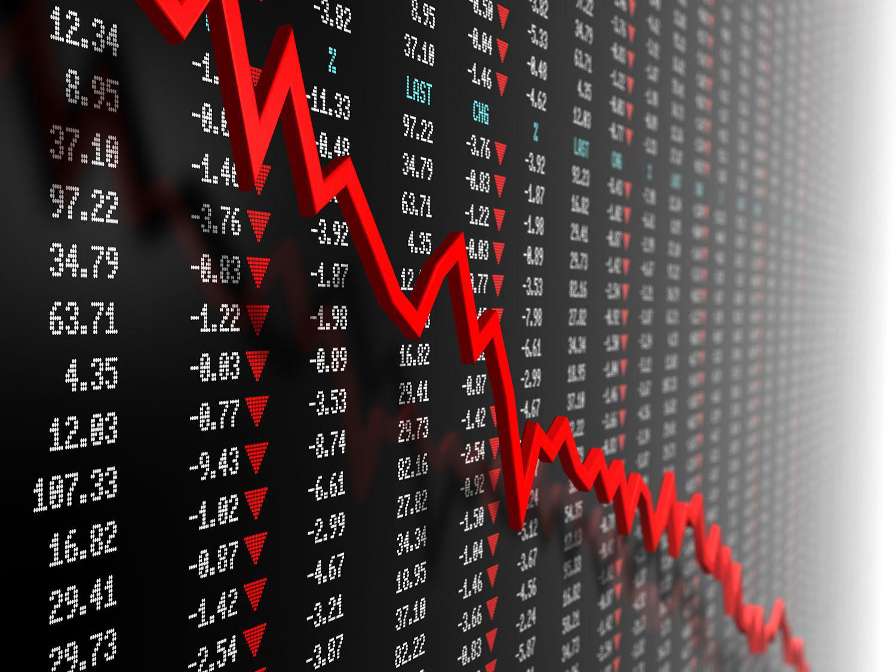

The 1980 silver market crash, commonly known as Silver Thursday, stands as one of the most influential events in the history of financial markets. This dramatic episode was characterized by a precipitous rise and subsequent collapse in silver prices, primarily driven by attempts at market manipulation. Central to this tumultuous period were the Hunt brothers, Nelson Bunker Hunt and William Herbert Hunt, who embarked on an endeavor to corner the silver market. Their actions pushed silver prices to astonishing levels before ultimately triggering a substantial economic downfall.

Throughout this article, we will examine the 1980 silver bubble, the factors that precipitated its crash, and the intricate details of its progression. The analysis will include the strategic maneuvers employed by the Hunt brothers and the resulting impact on both national and global financial systems. In the aftermath of these events, market regulations and trading practices underwent significant changes, which will be discussed in depth.

The article will also draw a parallel with the contemporary landscape of commodities trading, highlighting the role of algorithmic trading. Unlike the manual trades of the past, today's markets operate with high-frequency trading algorithms, which have both enhanced market efficiency and introduced new challenges, such as flash crashes and potential system vulnerabilities.

By dissecting the 1980 silver crash and its aftermath, this exploration endeavors to shed light on the inherent volatility present in commodities markets. The aim is to extract enduring lessons on the importance of regulatory oversight in maintaining market integrity and stability, particularly as technology continues to transform the financial landscape. Through a comprehensive analysis, we aspire to offer valuable insights for both current market participants and regulators, underscoring the critical need for transparent and robust financial practices.

## Table of Contents

## The Rise of the Silver Bubble

In the late 1970s, the Hunt brothers, notably Nelson Bunker Hunt and William Herbert Hunt, identified silver as a strategic asset capable of hedging against inflation and the depreciating US dollar. Their conviction was driven by prevailing economic conditions, including rampant inflation and currency instability, which fueled a surge in demand for tangible assets. The Hunts, along with other investors, began to accumulate silver, aiming to leverage the metal's perceived stability and potential for value retention.

The Hunts' strategy involved purchasing vast quantities of physical silver while simultaneously engaging in the futures market. By 1980, the Hunts had amassed control over approximately 200 million ounces of silver. This massive accumulation not only reflected their commitment to their investment beliefs but also exerted considerable influence on the market dynamics. Their activities led to a dramatic price escalation, causing silver prices to skyrocket from approximately $6 per ounce in early 1979 to peaks exceeding $50 per ounce by January 1980.

This exponential increase in silver prices was predominantly driven by speculative buying, which was further amplified by growing fears of a potential shortage. The notion of scarcity, whether real or perceived, played a crucial role in fueling investor excitement and attracting additional speculative investments to the market. As prices continued to surge, it became evident that the silver market was experiencing a bubble, characterized by heightened [volatility](/wiki/volatility-trading-strategies) and speculative fervor.

## The Hunt Brothers' Strategy

The Hunt brothers, Nelson Bunker Hunt and William Herbert Hunt, employed a multifaceted strategy in their attempt to monopolize the silver market during the late 1970s and early 1980s. At the core of their approach was the extensive acquisition of both physical silver and silver futures contracts. By amassing large quantities of physical silver, they aimed to exert significant influence over supply dynamics, hoping to create a scarcity that would bolster prices further.

Financing their aggressive strategy heavily depended on leveraged funds. The Hunts utilized their existing silver assets as collateral to secure massive loans, enabling them to make additional purchases. This high degree of leverage increased their market exposure significantly, allowing them to control an estimated 200 million ounces of silver by 1980. Their substantial market presence drove up silver prices, initially creating lucrative paper profits but also setting the stage for volatility.

Despite the initial gains, their strategy began to draw attention from market observers and regulatory bodies. Concerns arose over the potential manipulative effects their actions had on the silver market, resulting in heightened scrutiny. Regulatory entities like the Commodity Futures Trading Commission (CFTC) became involved, noting the chaotic conditions of the market that the Hunts' buying frenzy was fostering. This scrutiny eventually led to the introduction of measures such as increased margin requirements and trading limits, designed to mitigate the destabilizing effects the Hunts' activities had unleashed. These regulatory interventions played a pivotal role in compelling the Hunts to start liquidating their extensive silver holdings, which precipitated the dramatic market crash that followed.

## The Silver Market Crash of 1980

The rapid unwinding of the silver market in March 1980 was precipitated by significant regulatory changes that compelled the Hunt brothers to cease their aggressive silver acquisitions. The Commodity Exchange (COMEX) intervened by substantially raising margin requirements, which are the minimum amounts of equity that investors must hold in their margin accounts to trade, specifically aimed at curbing speculative excess. This increase imposed a financial strain on the Hunt brothers, who had heavily leveraged their positions.

Moreover, COMEX imposed trading limits that restricted the [volume](/wiki/volume-trading-strategy) of silver futures contracts that any single entity could hold. These regulatory adjustments directly impacted the Hunt brothers' ability to continue purchasing and holding large quantities of silver, forcing them to begin liquidating their vast holdings. This liquidation was not due to market sentiment but was rather a forced action resulting from the new regulatory constraints.

As the Hunts started to sell off their silver, the market experienced a precipitous drop in prices. From a peak of around $50 per ounce in January 1980, silver prices plummeted to below $11 per ounce by March 1980. This dramatic decline was exacerbated by widespread panic among investors, who rushed to sell their positions to avert further losses, thus intensifying the downward [momentum](/wiki/momentum).

The crash had immediate ramifications, both economically and psychologically. Investors, who had entered the market driven by the speculative frenzy, faced substantial financial losses, while the market's volatility prompted a loss of confidence in the broader commodities markets. These events underscored the risks associated with excessive leverage and market manipulation, highlighting the importance of regulatory oversight in maintaining market stability.

## Impact and Immediate Aftermath

The immediate impact of the 1980 silver market crash was profound, leaving the Hunt brothers facing catastrophic financial losses. Their extensive investments, primarily funded through borrowed capital, left them unable to cover the increased margin calls once the market turned against them. As silver prices plummeted from $50 per ounce to below $11, the value of their holdings diminished drastically, resulting in billions of dollars in losses. The repercussions of the crash were not confined to the Hunts; it sent shockwaves through the broader financial markets.

The turmoil extended well beyond silver, with the instability spilling over into other commodity markets. The sharp and sudden decline in silver prices triggered concerns among investors and financial institutions that had significant exposure to the commodity. Many entities found themselves over-leveraged, having relied heavily on borrowed funds to finance their positions in not only silver but also other related assets. This over-leveraging led to substantial financial strain, as plummeting asset values threatened the solvency of numerous investors.

Financial institutions, faced with significant defaults and [liquidity](/wiki/liquidity-risk-premium) crunches, were compelled to re-evaluate their risk management strategies. The crisis underscored the vulnerability of financial systems to highly speculative and leveraged trading practices. It highlighted the necessity for better risk assessment and more robust margin requirements to prevent excessive borrowing that could destabilize markets. Consequently, the crash acted as a catalyst for financial introspection, prompting a widespread reassessment of lending practices and risk management protocols to safeguard against similar financial upheavals in the future.

## Long-term Consequences and Market Reforms

In the aftermath of the 1980 silver market crash, significant regulatory changes were implemented to mitigate the risks of market manipulation and excessive speculation in futures trading. The Commodity Futures Trading Commission (CFTC), established to oversee and regulate the derivatives markets, played a pivotal role in instituting these reforms.

One of the key measures enacted by the CFTC was the introduction of position limits on futures contracts. These limits were designed to prevent any single trader or group of traders, as was the case with the Hunt brothers, from controlling an excessive portion of the market. By capping the number of contracts that any individual or entity could hold, the CFTC aimed to reduce the potential for market manipulation and ensure a more balanced and competitive trading environment.

In addition to position limits, the CFTC increased its oversight and surveillance of the commodities markets. Enhanced monitoring and reporting requirements were established to provide greater transparency and facilitate the early detection of irregular trading activities. The CFTC also worked closely with other regulatory bodies, both domestically and internationally, to bolster cooperation and information sharing, recognizing the interconnected nature of global financial markets.

These regulatory reforms were pivotal in reshaping market operation norms, providing a framework aimed at preserving market integrity and stability. The emphasis on transparency and accountability sought to restore confidence among investors and market participants, ensuring that the markets functioned efficiently and fairly.

The legacy of these reforms extends to the development of modern trading systems, where automated and [algorithmic trading](/wiki/algorithmic-trading) practices require robust regulatory oversight to balance innovation with market protection. By learning from past market events, regulatory bodies continue to adapt and refine their frameworks, striving to maintain a stable and resilient financial landscape in an ever-evolving trading environment.

## Algorithmic Trading and Modern Commodities Markets

Algorithmic trading, an automated approach to executing trades using pre-programmed instructions, has become a cornerstone of modern commodities markets. Unlike the manual trading practices prevalent during the 1980 silver crash, algorithmic trading leverages computational algorithms to analyze vast datasets and execute trades at speeds and frequencies humans cannot match. This shift has significantly improved market efficiency by reducing transaction costs and increasing liquidity. However, it has introduced new challenges, notably the emergence of flash crashes and potential market distortions.

Flash crashes are sudden, severe price declines occurring within minutes, often triggered by rapid-fire algorithmic trading. These incidents highlight the risk of feedback loops where algorithms react to each other's actions, exacerbating price swings. A notable example is the "Flash Crash" of May 6, 2010, when the Dow Jones Industrial Average plummeted nearly 1,000 points within minutes before quickly recovering. Such events have prompted regulators and market participants to examine the role of algorithms in reinforcing volatility during periods of market stress.

The lessons from historical market disruptions like the 1980 silver crash underscore the importance of designing robust algorithmic trading strategies. Algorithms must incorporate safeguards to prevent aggressive positioning that could destabilize the market. This involves implementing dynamic position limits, volatility controls, and ensuring compliance with regulatory standards to maintain market integrity.

Additionally, advances in [machine learning](/wiki/machine-learning) and [artificial intelligence](/wiki/ai-artificial-intelligence) have further transformed algorithmic trading, enabling more sophisticated strategies capable of adapting to changing market conditions. These technologies can identify complex patterns and correlations in data that were previously undetectable, allowing traders to anticipate market movements more accurately.

The development of algorithmic trading systems requires careful consideration of past market events, reinforcing the necessity for transparency and rigorous risk management. By understanding the causes and effects of market fluctuations, such as those seen during the 1980 silver crash, traders and financial institutions can develop strategies that not only exploit market inefficiencies but also contribute to market stability. Balancing innovation with prudent regulation remains essential to harness the benefits of algorithmic trading while mitigating its inherent risks.

## Conclusion

The 1980 silver crash serves as a powerful reminder of the inherent dangers associated with market manipulation and the critical need for robust regulatory frameworks. This historic event highlighted the vulnerabilities in the financial system, where unchecked speculation and attempts to corner the market can lead to dramatic economic consequences. The actions of the Hunt brothers, who attempted to dominate the silver market through aggressive accumulation of physical silver and futures contracts, eventually culminated in a catastrophic market crash. This incident underscores the necessity for transparent market operations and the enforcement of prudent financial practices.

The lessons learned from the 1980 silver crash have enduring relevance, particularly as we navigate increasingly complex financial markets driven by rapid technological advancements. The modern trading environment, now heavily dominated by algorithmic trading, presents both opportunities for enhanced market efficiency and new risks, such as flash crashes and unintended market distortions. Striking a balance between fostering innovation and maintaining regulation is essential to safeguard market stability. Regulatory bodies face the ongoing challenge of adapting to technological changes while ensuring that markets operate in a fair and transparent manner. As financial technologies evolve, it remains crucial to integrate these lessons from the past to develop stronger regulatory measures that protect market participants and uphold the integrity of global financial systems.

## References & Further Reading

[1]: ["The Great Silver Bubble"](https://www.amazon.com/Great-Silver-Bubble-Coronet-Books/dp/0340330333) - NPR article discussing the Hunt brothers and the silver market manipulation.

[2]: Greenberger, M. (2020). [“Too Bigger to Fail: The Historic Collapse of the Hunt Brothers’ Silver Manipulation Scheme and Its Continuing Impact on Market Regulation”](https://newrepublic.com/post/189669/big-business-trump-inauguration-donations). University of Maryland Francis King Carey School of Law.

[3]: ["Crisis and Chaos: Are Your Algorithms Prepared?"](https://cyberir.mit.edu/site/algorithms-and-influence-artificial-intelligence-and-crisis-decision-making/) by Financial Stability Board - Discusses the impact of algorithmic trading on financial stability.

[4]: Edwards, M. B., & Edwards, L. R. (1984). ["The Silver Bears"](https://www.semanticscholar.org/paper/A-temperature-dependent-dispersion-equation-for-Edwards-Lawrence/e65c777c28a523190f29c13a32cf6bc9a6615ab2) - A detailed account of silver manipulation in the 1980s.

[5]: ["The Economic and Financial Crises in the Aftermath of the Hunt Silver Bubble"](https://www.hks.harvard.edu/centers/mrcbg/programs/growthpolicy/aftermath-financial-crises) by the Economic History Review.