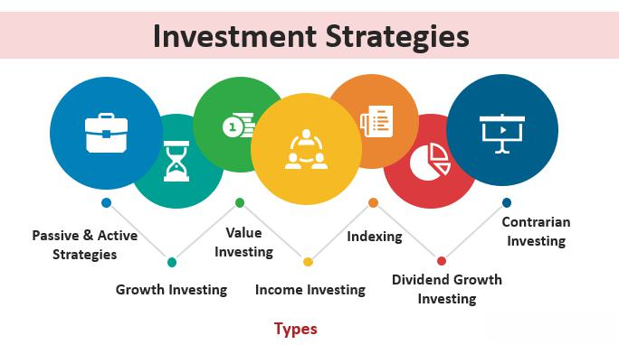

## Table of Contents

The **2% rule** is a risk management strategy in trading that dictates a trader should risk no more than 2% of their total trading capital on any single trade. In the context of **algorithmic trading**, this rule serves as a simple but effective guideline for **position sizing** and capital preservation. By capping the potential loss per trade at 2% of the portfolio, traders aim to limit drawdowns and survive extended losing streaks without **blowing up** their account. This article provides a comprehensive overview of the 2% rule, including its theoretical foundations in risk management and portfolio theory, as well as practical aspects of implementation. Both the mathematical formulation and a coding example (using Python’s Backtrader framework with PWB Toolbox data) are included to illustrate how algorithmic traders can apply the 2% rule in practice.

## The 2% Rule in Risk Management and Portfolio Theory

In trading and portfolio management, controlling risk is as important as seeking returns. The 2% rule has become a widely cited **risk management strategy** because it helps ensure no single position can dramatically harm the overall portfolio. Limiting each trade’s risk to 2% of capital embodies the principle of **capital preservation** — even if a trade goes wrong, only a small, fixed fraction of the account is lost. This approach aligns with foundational ideas in portfolio theory: namely, diversification of risk and avoiding catastrophic losses.

**Drawdown Control:** By never risking more than 2% on one trade, a trader can withstand multiple consecutive losses without running out of capital. For example, if each trade risks 2% of equity, even 10 losing trades in a row would leave roughly 81% of the starting capital (since \$(1-0.02)^{10} \approx 0.817\$). In contrast, taking oversized risks (say 10% per trade) could devastate an account in a string of losses. The 2% cap thus limits the impact of any **losing streak** and lowers the probability of ruin. In quantitative terms, if \$C\_0\$ is the initial capital, after \$N\$ consecutive losing trades the remaining capital would be:

$C_N \;=\; C_0 \times (1 - 0.02)^N$

This exponential decay is much milder than if a higher fraction were risked each time. The rule’s focus on small incremental risk helps traders adhere to the **Law of Large Numbers** – ensuring that no single outcome dominates the results, so the trading edge (if the strategy has one) can play out over many trials.

**Risk vs. Reward Trade-off:** From a **portfolio theory** perspective, the 2% rule is a heuristic that keeps risk per trade at a fixed, low level, which tends to reduce portfolio volatility. While modern portfolio theory often deals with optimizing position sizes based on volatility, covariance, and expected returns, the 2% rule offers a straightforward alternative: a constant fraction allocation per trade based on risk. It doesn’t require complex math to implement, yet it naturally scales position sizes with account value and trade risk. By using a percentage, the position sizing is **dynamic** – as the account grows or shrinks, the dollar amount at risk adjusts proportionally. This contrasts with fixed-dollar risk strategies and ties into the idea of **fractional Kelly betting** in a simplified form (Kelly’s criterion would often allocate a fraction of capital based on edge; 2% is a common conservative choice regardless of edge). Some experienced traders even consider 2% to be a *maximum* risk, suggesting new or highly active strategies might use 1% or less per trade for additional safety. Keeping risk per trade low helps maintain a smoother equity curve, which in turn can improve the **Sharpe ratio** of a strategy by avoiding large volatility swings due to single trades.

**Survival and Capital Preservation:** A key tenet in trading is to survive to trade another day. By enforcing a small risk per trade, the 2% rule ensures that even a series of bad trades won’t **wipe out** the account. This is crucial for algorithmic traders who execute many trades; it only takes one uncontrolled loss to erase months of profits. As Dr. Alexander Elder (who popularized the rule) notes, never risking more than 2% on a position means **stop-loss** orders must be used to cap the downside. The rule is often paired with Elder’s *6% rule*, which limits total losses in a month to 6% – another layer of protection against drawdowns. Together, such rules enforce discipline at both the trade level and the portfolio level. While the 2% threshold itself is somewhat arbitrary, it has proven effective across many trading styles as a balance between caution and efficient use of capital. In essence, it treats trading as a marathon, not a sprint, aligning with the portfolio management goal of long-term growth with controlled risk.

## Calculating Position Size Using the 2% Rule

Implementing the 2% rule involves calculating the appropriate **position size** for each trade based on the trader’s account size and the trade’s stop-loss distance. The core idea is that the *money at risk* on the position (position size multiplied by the price difference between entry and stop-loss) should equal 2% of the account. To determine how many shares or contracts to trade, one can use the formula:

$\text{PositionSize} \;=\; \frac{0.02 \times \text{Account Value}}{\text{Risk per Unit}}$

Where *Risk per Unit* is the loss incurred **per share** (or per contract) if the trade hits the stop-loss. This is calculated as the difference between the entry price and the stop price (for a long position; for shorts, it would be entry minus stop in absolute terms). By rearranging, this formula comes directly from: $\text{Risk per Trade} = 0.02 \times \text{Account Value} = \text{Risk per Unit} \times \text{PositionSize}.$

In practice, the calculation works as follows:

1. **Determine 2% of Capital:** Calculate the maximum capital you can risk. For an account of size \$C\$, this is \$0.02 \times C\$. For example, with a \$50,000 account, 2% risk is \$1,000. This \$1,000 is the *risk capital* for the trade.
2. **Set Stop-Loss Price:** Define your entry price and a logical stop-loss exit price for the trade. The difference (for a long trade, \$\text{entry price} - \text{stop price}\$) is the *risk per share*. For instance, if you plan to buy a stock at \$100 and set a stop-loss at \$95, then the risk per share is \$5.
3. **Compute Position Size:** Divide the risk capital by the risk per share to get the number of shares. Using the above numbers, \$1,000 risk capital divided by \$5 per share = 200 shares. This would be the position size. It ensures that if the price falls to \$95 and triggers the stop, the loss is \$5 \* 200 = \$1,000 (which is 2% of the portfolio). If the division doesn’t result in a whole number, traders typically round down to the nearest whole share or contract to stay under the 2% cap.
4. **Place the Trade and Stop:** Execute the trade with the calculated size, and immediately place a stop-loss order at the predetermined stop price. The stop order enforces the 2% rule by capping the loss on that trade. *(In practice, one must also account for factors like slippage or gap risk – a stop-loss may not always fill exactly at the stop price during fast markets – but the 2% rule still provides a baseline for normal conditions.)*

As a concrete example, consider an account with \$25,000. Following the 2% rule means risking at most \$500 on any trade. Suppose an algorithm identifies an entry in **Tesla (TSLA)** at \$225 with a logical stop level at \$195. The risk per share is \$30. Using the formula: \$500 / \$30 ≈ 16.67, which means the strategy should take at most 16 shares (rounding down). If the trade hits the stop-loss at \$195, the loss would be roughly \$480, just under the \$500 limit (2% of 25k). This example illustrates how the 2% rule translates into position sizing in practice and ensures that the loss remains within acceptable bounds.

Crucially, this methodology requires identifying a stop-loss for every trade *before* entering the position. The trader (or algorithm) must decide where the trade thesis is invalidated (e.g., a technical support level, a percentage drop, or a [volatility](/wiki/volatility-trading-strategies)-based stop) to quantify the risk per unit. The position size formula only holds if a stop price is in place; without a stop, the potential loss per share is unbounded (making the 2% rule impossible to enforce). Thus, the 2% rule goes hand-in-hand with disciplined use of stop-loss orders and careful trade planning. As the trade progresses, one may adjust the stop (trailing it upward for a long position to lock in profit), but the initial risk at entry is what the 2% calculation is based on. By consistently applying this calculation, traders impose a uniform risk profile across different trades, whether one stock is high-priced and volatile or another is low-priced and stable – the position sizes will differ, but each trade risks the same fixed percentage of the portfolio.

## Implementing the 2% Rule in Algorithmic Trading

In **[algorithmic trading](/wiki/algorithmic-trading)**, strategies are executed by code, which makes it straightforward to incorporate the 2% rule into every trade decision. The algorithm can be programmed to automatically calculate position sizes using the account value and the intended stop-loss distance on each potential entry. This systematic enforcement removes human emotion from the equation and ensures that risk management is uniformly applied. Many trading systems include position sizing as a key component of the strategy logic or as a separate money management module.

To implement the 2% rule, an algorithmic trader needs to ensure the following steps are integrated into their strategy code:

* **Portfolio Value Access:** The algorithm must keep track of the current account equity (including cash and unrealized P/L on open trades). Risk is typically calculated based on current equity (portfolio value), so that the 2% in absolute terms adapts over time.
* **Signal and Stop Determination:** For each trade signal generated by the strategy, determine the entry price and a stop-loss price. The stop can be set using various techniques – for example, a fixed percentage drop, a recent swing low/high, or an indicator like the Average True Range (ATR) to account for volatility. Volatility-based stops are common in algorithmic strategies, as they adjust to the asset’s risk profile (wider stops for more volatile instruments).
* **Position Size Calculation:** Using the formula described earlier, compute the quantity to trade. In code, this might look like `size = int((0.02 * portfolio_value) / (risk_per_share))`. It’s important to use an integer size that does not exceed the allowed risk. The algorithm should also include checks to handle cases where the calculated size is zero (e.g., if the stop distance is extremely large relative to account size, the trade might be skipped as it’s too risky).
* **Order Placement with Stops:** Submit the entry order with the calculated size, and concurrently place a stop-loss order at the stop price. In many trading platforms, this can be done with **bracket orders** or by sending the stop order as soon as the entry is executed (linking the stop order to the entry order). This ensures that if the trade goes against the strategy, it will automatically exit with a controlled loss. For example, if going long, the algorithm will place a sell stop order 2% below the entry in terms of capital risk. By automating this, the algorithm consistently adheres to the 2% maximum loss without relying on manual intervention.
* **Multiple Positions Management:** If the algorithm can hold multiple positions simultaneously, the 2% rule typically applies per position. However, the trader should also monitor aggregate risk. For instance, if several positions are highly correlated (say, multiple tech stocks), a single market event could trigger all their stop-losses at once. In such cases, while each trade risked 2%, the combined loss could be more. Advanced risk management might include a check on total exposure – this is where Elder’s 6% rule or similar portfolio-wide limits come into play. An algorithm could, for instance, refuse new trades if the sum of current at-risk capital exceeds a threshold like 6% of the portfolio.
* **Performance and Optimization:** One advantage of algorithmic implementation is the ability to backtest how the 2% rule affects performance. Traders can simulate their strategy with and without the 2% risk cap to see its impact on drawdowns, CAGR, Sharpe ratio, etc. Generally, introducing the rule will reduce drawdowns and volatility at the cost of sometimes trading smaller sizes (which might marginally reduce absolute returns if the strategy has a high edge). Many find this trade-off worthwhile for the improved **risk-adjusted returns** and peace of mind.

It is worth noting that the 2% rule is a heuristic guideline, not a law of nature. Different strategies and assets might benefit from different risk-per-trade settings. For example, very high-frequency trading strategies might use much smaller per-trade risk (far below 1%), because they make thousands of trades and a 2% hit on each could still compound quickly. Conversely, a long-term investment algorithm with very high conviction on each trade might use slightly higher than 2% in some cases, although few professional risk managers would exceed 5% risk on any single position. In all cases, the principle remains: choose a risk percentage that keeps worst-case scenarios tolerable. The 2% figure has simply emerged as a popular compromise between safety and efficient use of capital.

## Backtrader Example: 2% Risk Per Trade Strategy

To illustrate how an algorithmic trader might implement the 2% rule, consider a simple example using the **Backtrader** Python framework (a popular open-source library for [backtesting](/wiki/backtesting) trading strategies). We will use historical financial data from the **PWB Toolbox** (Papers With Backtest Toolbox), which is a library that provides curated datasets for developing and testing trading algorithms. In this example, the strategy will use a basic indicator for entry and will size each position according to the 2% rule, automatically calculating the number of shares to buy such that the potential loss is 2% of the portfolio.

**Setup:** We assume the PWB Toolbox is installed (providing access to historical price data) and Backtrader is installed. We fetch daily stock data (e.g., Apple Inc. **AAPL**) for a given period and feed it into Backtrader. Then we define a strategy that uses the 2% risk rule for position sizing. For simplicity, the strategy will enter a long position when the price crosses above its 50-day moving average and exit (via stop) if the price falls a certain amount (here using ATR for stop distance). The key part is computing the `size` for `self.buy()` based on the 2% risk formula. Below is a simplified code example:

```python
import backtrader as bt
import pwb_toolbox.datasets as pwb_ds

# Load sample historical data (daily prices for AAPL) using PWB Toolbox
data_df = pwb_ds.get_pricing(['AAPL'], start_date="2018-01-01", end_date="2020-12-31")
data = bt.feeds.PandasData(dataname=data_df)  # convert DataFrame to Backtrader data feed

class TwoPercentRuleStrategy(bt.Strategy):
    params = dict(risk_perc=0.02)  # 2% risk per trade
    
    def __init__(self):
        self.atr = bt.indicators.ATR(self.data, period=14)  # ATR indicator for volatility-based stop
    
    def next(self):
        if not self.position:  # only enter if no current position
            # Entry signal: price crosses above 50-day moving average
            sma50 = bt.indicators.SMA(self.data, period=50)
            if self.data.close[0] > sma50[0]:
                # Calculate risk per share (stop loss at 2*ATR below current price)
                entry_price = self.data.close[0]
                stop_price = entry_price - 2 * self.atr[0]
                risk_per_share = entry_price - stop_price
                # Calculate position size so that (risk_per_share * size) ≈ 2% of portfolio value
                risk_amount = self.broker.get_value() * self.p.risk_perc
                size = risk_amount // risk_per_share  # use integer number of shares
                if size > 0:
                    # Place buy order with calculated size
                    buy_order = self.buy(size=size)
                    # (Optional) Place stop-loss order linked to the buy order for risk management
                    self.sell(size=size, exectype=bt.Order.Stop, price=stop_price, parent=buy_order)

# Set up backtesting engine
cerebro = bt.Cerebro()
cerebro.broker.set_cash(100000.0)                # starting capital $100,000
cerebro.adddata(data)
cerebro.addstrategy(TwoPercentRuleStrategy)
cerebro.run()
```

In this code:

* We use `pwb_toolbox.datasets.get_pricing` to load historical price data for AAPL. The returned `data_df` is converted to a Backtrader `PandasData` feed.
* The strategy `TwoPercentRuleStrategy` computes the 50-day Simple Moving Average (SMA) and uses a crossover above this SMA as a buy signal (this is just for demonstration purposes; one could use any entry logic).
* When a buy signal occurs, it calculates the current ATR (14-day Average True Range) as a measure of volatility. We decide our stop-loss will be 2 \* ATR below the entry price (a common technique to account for volatility in setting stops).
* The `risk_per_share` is then `2 * ATR` (since if price drops that much, the trade is stopped out). We calculate `risk_amount` as 2% of current portfolio value (`broker.get_value()` gives the current account equity). Dividing `risk_amount` by `risk_per_share` yields the tentative position size. We use floor division (`//`) to get an integer number of shares that does not exceed the risk (this ensures we don't slightly violate the 2% due to a fractional share).
* A buy order is placed with that position size. Immediately after, a stop-loss order is placed at `stop_price`, linked to the buy (using `parent=buy_order`), so that if the price falls to the stop, the position is automatically closed. The stop order ensures the loss on this trade will be about 2% of the portfolio (assuming normal market conditions without slippage or gap beyond the stop).

When running this backtest, Backtrader will simulate the trades. Each trade’s size will be adjusted to keep risk at \~2% of the then-current account value. Over time, as the account value changes, the position sizes will scale accordingly. If the strategy is successful and the account grows, the 2% in absolute terms becomes larger, allowing slightly bigger positions (compounding the gains). If the strategy hits a rough patch and equity falls, the trade sizes shrink, reducing further risk exposure – a natural stabilizing effect.

This example demonstrates the mechanics of coding the 2% rule. In more complex scenarios, one could create a custom **Sizer** in Backtrader to handle this calculation (Backtrader allows custom sizers that determine order size automatically). In fact, the concept of risking a percentage of equity on a trade is sometimes called a **Percent Risk** sizer. The key challenge is that the sizer needs to know the stop-loss distance; in Backtrader’s design, sizers don’t inherently know about stop prices. A common approach, as shown above, is to calculate size within the strategy where both entry signal and stop level are known, or to pass the stop distance to a custom sizer via strategy parameters. Some traders prefer writing the logic directly in the strategy for clarity.

## Conclusion

The 2% rule is a fundamental risk management tool that algorithmic traders can use to achieve long-term survival and steady growth. By limiting the **risk per trade** to a small fraction of capital, traders avoid catastrophic losses and build resilience against inevitable drawdowns. From a practical standpoint, the rule forces a disciplined approach: every trade is planned with a predefined [exit](/wiki/exit-strategy) (stop-loss) and a position size that keeps losses manageable. This creates a consistent framework where wins and losses have a proportional impact on the portfolio, making equity curves smoother and reducing emotional stress.

For algorithmic traders, the 2% rule is relatively easy to implement in code and can be applied across a variety of strategies and asset classes. It essentially automates the **position sizing** decision, allowing the trading algorithm to focus on signal generation and execution while the risk per trade remains capped. Incorporating the 2% rule into backtesting and live trading helps in **preventing significant drawdowns** and keeps the strategy within a tolerable risk envelope. It also complements other aspects of portfolio management; for instance, if combined with diversification, it ensures that even if multiple positions go wrong, each is small enough that the total hit is not irrecoverable.

Traders should take away that effective **risk management** often matters more than the specific trade entry or indicator. A mediocre strategy with sound risk control can outperform a brilliant strategy that lacks it. The 2% rule is one of those time-tested guidelines that has proven its worth in trading lore. However, it’s not a one-size-fits-all number – more conservative traders or strategies with lower win rates may choose a 1% rule or 0.5% rule, whereas others might edge slightly higher if justified by their system’s performance metrics. The exact percentage can be tailored, but the underlying principle remains: **never bet the farm on one trade**. By adopting the 2% rule, algorithmic traders align themselves with a risk-aware philosophy that favors consistent, sustainable returns over risky windfalls. In summary, the 2% rule helps algorithmic strategies to remain robust under pressure, preserve capital through losing periods, and ultimately thrive by letting the law of large numbers and a sound trading edge work over time.


## References & Further Reading

[1]: [Backtrader — How to determine the size of an operation. The 2% rule.](https://medium.com/quant-factory/backtrader-how-to-determine-the-size-of-an-operation-the-2-rule-ed05f7612236) | by Xavier Escudero | Quant Factory | Medium  

[2]: [Trading for a Living](https://sobrief.com/books/trading-for-a-living) | Summary, Quotes, FAQ, Audio  

[3]: [The 2% Rule Money Management: Boost Profits and Minimize Risks](https://www.quantifiedstrategies.com/the-2-rule-money-management/) | QuantifiedStrategies.com  

[4]: [5 Expert Traders on The Importance Of Risk Management](https://enlightenedstocktrading.com/5-expert-traders-on-risk-management/) | Enlightened Stock Trading  

[5]: [Position sizing and risk management. The 2% rule and 6% rule](https://community.portfolio123.com/t/position-sizing-and-risk-management-the-2-rule-and-6-rule/23478) | Portfolio123 Community  

[6]: [How To Reduce Risk With Optimal Position Size](https://www.investopedia.com/articles/trading/09/determine-position-size.asp) | Investopedia  

[7]: [GitHub - paperswithbacktest/pwb-toolbox](https://github.com/paperswithbacktest/pwb-toolbox) | The toolbox for developing systematic trading strategies