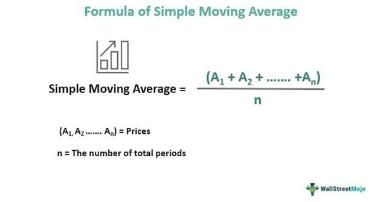

The world of trading is bustling with various tools and strategies. Among them, the 200-day Simple Moving Average (SMA) stands out as a fundamental tool for technical analysts. This moving average helps traders and investors identify market trends by smoothing out price fluctuations, offering a clearer picture of the market's direction. The 200-day SMA is specifically valued for its ability to filter out short-term market volatility, providing a stable reference point to assess an asset's long-term trajectory.

This article provides insights into the calculation and application of the 200-day SMA in algorithmic trading, a domain where automated decision-making is pivotal. It unravels the potential of the 200-day Moving Average as an asset in trend analysis and its significance as a component within algo trading strategies. For traders, understanding these characteristics and the practical implications of the 200-day SMA can significantly enhance their trading decisions, ensuring they are better equipped to navigate market dynamics.



Engaging with this concept is fundamental for any trader or analyst seeking to optimize their strategy and maintain a strategic advantage. Leveraging such an indicator within the framework of algorithmic models augments one's ability to react and adapt to the evolving market landscape, underlining the importance of the 200-day SMA in achieving trading success.

## Table of Contents

## Understanding the 200-Day Simple Moving Average

The 200-day Simple Moving Average (SMA) is a widely utilized technical indicator in the field of trading, offering insights into the broader price trends of securities. It calculates the average closing price of a security over the past 200 trading days, providing a smoothed representation of price movements. This smoothing effect is particularly beneficial for traders seeking to identify overarching trends amid daily price volatilities.

This long-term moving average is an invaluable tool for discerning the general direction of an asset's price trend. Specifically, when a security's price sustains levels above the 200-day SMA, it is often interpreted as being in an uptrend. Conversely, if the price remains below the 200-day SMA, it may signal a downtrend. This binary interpretation forms a fundamental component of many trading strategies, as it allows traders to make educated predictions about future price movements.

The 200-day SMA serves as a critical threshold in trading strategies, acting as a significant line of resistance or support. Traders frequently monitor interactions between the price and the 200-day SMA to gain insights into potential market reversals or the continuation of existing trends. For example, a security moving above its 200-day SMA might suggest emerging bullish momentum, while a drop below could indicate bearish sentiment.

In both manual and automated trading systems, the 200-day SMA is integral due to its capacity to filter out short-term market "noise." In manual trading, it aids traders in making informed decisions, while in automated trading, it can be programmed into algorithms to trigger buy or sell actions based on predefined conditions. The incorporation of the 200-day SMA into [algorithmic trading](/wiki/algorithmic-trading) strategies underscores its importance, offering a quantitative basis for executing trades. 

The wide acceptance and application of the 200-day SMA in various trading models demonstrate its robustness as a tool for analyzing price trends. Its simplicity and effectiveness in highlighting long-term trends make it a staple for traders and technical analysts alike.

## Calculating the Simple Moving Average

To calculate a simple moving average (SMA), begin by collecting the closing prices of a security over a chosen timeframe. The chosen period reflects the trader's goal, with a 200-day period being favored for long-term market analysis. To compute the SMA:

1. Sum the closing prices of the security over the specified period. For the 200-day SMA, this would involve adding the closing prices for the past 200 days.
2. Divide the total by the number of periods (in this case, 200).

Mathematically, the calculation can be expressed as:

$$
\text{SMA} = \frac{P_1 + P_2 + \ldots + P_n}{n}
$$

Where $P_1, P_2, \ldots, P_n$ represent the individual closing prices for each of the past $n$ days, and $n$ stands for the number of days, which is 200 in this context.

This computation yields an average that smooths out the short-term fluctuations in price, facilitating the identification of general market trends. For instance, if the closing prices of a stock over the past 5 days are $100, $102, $104, $103, and $105, the SMA for these 5 days would be:

$$
\text{SMA} = \frac{100 + 102 + 104 + 103 + 105}{5} = 102.8
$$

While manual calculations provide insight into the process, numerous trading platforms and financial websites automate this task. These tools can continuously update the SMA, presenting it as a line on price charts. This automation enables traders to place greater emphasis on data analysis and strategic decision-making rather than on performing calculations. Python offers a straightforward way to compute the SMA using libraries such as Pandas, as shown below:

```python
import pandas as pd

# Sample closing prices data
data = {'Closing Price': [100, 102, 104, 103, 105]}
df = pd.DataFrame(data)

# Calculate 5-day SMA
df['SMA'] = df['Closing Price'].rolling(window=5).mean()
print(df)
```

This example illustrates computing a 5-day SMA, showcasing the ease and efficiency offered by programming solutions, which are scalable to 200 days for practical trading scenarios.

## Importance and Application in Trading

The 200-day Simple Moving Average (SMA) is a pivotal tool in the analysis of long-term market trends and is frequently seen as a line of support or resistance. This characteristic offers traders crucial decision points, especially when the market showcases a clear upward or downward [momentum](/wiki/momentum). In trending markets, the 200-day SMA aids participants in maintaining alignment with prevailing market directions, effectively acting as a litmus test for trend verification.

One of the most significant applications of the 200-day SMA is observed during crossovers with shorter moving averages, like the 50-day SMA. These crossover events are highly regarded as they often precede potential shifts in market sentiment. The 'golden cross' occurs when a shorter-term moving average, such as the 50-day SMA, rises above the 200-day SMA, signaling bullish conditions or the beginning of an upward trend. Conversely, a 'death cross' happens when the shorter-term moving average falls below the 200-day SMA, indicating bearish conditions or the inception of a downtrend. Traders widely monitor these patterns, as they are frequently accompanied by significant trading [volume](/wiki/volume-trading-strategy) and market activity, underscoring their importance in forecasting potential market directions.

In the context of algorithmic trading, the 200-day SMA's utility is augmented when combined with other technical indicators. Traders can leverage programming languages like Python to integrate the 200-day SMA into automated trading systems, allowing for systematic evaluation and execution of trades based on pre-set rules. For instance, Python libraries such as Pandas can be utilized to calculate moving averages efficiently, as shown in the following snippet:

```python
import pandas as pd

# Assuming 'data' is a Pandas DataFrame with a 'Close' column containing price data
data['SMA_200'] = data['Close'].rolling(window=200).mean()

# Identifying crossover points between 50-day SMA and 200-day SMA
data['SMA_50'] = data['Close'].rolling(window=50).mean()
data['Golden_Cross'] = (data['SMA_50'] > data['SMA_200']) & (data['SMA_50'].shift(1) <= data['SMA_200'].shift(1))
data['Death_Cross'] = (data['SMA_50'] < data['SMA_200']) & (data['SMA_50'].shift(1) >= data['SMA_200'].shift(1))
```

Incorporating the 200-day SMA within an algorithmic framework enables traders to respond swiftly to market movements, executing trades automatically when crossover conditions are met. This automation minimizes the emotional element in trading and allows for consistent strategy application.

Overall, embracing the 200-day SMA as part of a broader trading strategy, particularly in conjunction with other indicators, enhances the robustness of trading systems. Traders aim to harness its predictive capacity by combining historical price patterns with real-time data, improving the likelihood of successful market engagements.

## 200-Day SMA vs. Exponential Moving Average (EMA)

The 200-day Simple Moving Average (SMA) and the Exponential Moving Average (EMA) are both fundamental tools used by traders to analyze market trends, yet they have distinct characteristics that set them apart. The primary difference between the two lies in how they treat price data over time. While the SMA considers all data points over a specified period with equal weight, the EMA assigns greater importance to more recent prices and therefore responds more swiftly to changes in price.

The formula for the Simple Moving Average for $n$ periods is:

$$
\text{SMA} = \frac{\sum_{i=1}^{n} P_i}{n}
$$

where $P_i$ represents the closing price at the $i_{th}$ day. The 200-day SMA thus involves calculating the mean of the last 200 closing prices.

In contrast, the Exponential Moving Average is calculated using:

$$
\text{EMA}_t = P_t \cdot \left(\frac{2}{n+1}\right) + \text{EMA}_{t-1} \cdot \left(1 - \frac{2}{n+1}\right)
$$

where $P_t$ is the price at time $t$, and $n$ is the number of days in the moving average. This recursive formula shows how the EMA gives more weight to the latest price data.

Traders often choose the EMA in rapidly changing markets because it can capture price movements and potential reversals more quickly compared to the SMA. This sensitivity can be particularly useful for short-term trading strategies, where timely decision-making is crucial.

Despite the EMA's responsiveness, the 200-day SMA remains integral for long-term investors. Its ability to identify and confirm long-term trends provides a stable reference line, serving as a significant support or resistance level. Many institutional traders use the 200-day SMA as a benchmark to gauge the market's general direction over extended periods.

Balancing the strengths of both averages can be advantageous. Strategies that incorporate both SMAs and EMAs can offer traders a more nuanced perspective on market conditions. For example, employing a dual-moving average crossover strategy, where a short-term EMA crosses a long-term SMA, can signal momentum shifts. This combination can be particularly valuable for algorithmic traders aiming to establish a comprehensive understanding of both short-term fluctuations and long-term trends.

In conclusion, while each type of moving average has its unique benefits, effectively using them together can enhance the depth of market analysis, aiding traders in making more informed trading decisions.

## Challenges and Considerations

Moving averages such as the Simple Moving Average (SMA) are fundamental to technical analysis but come with inherent limitations; primarily, they are lagging indicators. This means they are based on past price data and might not immediately reflect sudden market changes. When traders rely on the 200-day SMA exclusively, they may delay responses to new market conditions and miss out on potential opportunities or risk unplanned losses. 

In range-bound markets where prices fluctuate within narrow limits, the 200-day SMA may provide misleading signals. For instance, if the market does not exhibit a clear trend, the SMA might oscillate near current prices, reducing its effectiveness in identifying support or resistance levels. In such scenarios, traders risk making decisions based on inconclusive data.

Thus, it is generally advisable to complement the 200-day SMA with other technical analysis tools and methodologies to achieve balanced trading strategies. Indicators such as the Relative Strength Index (RSI), MACD (Moving Average Convergence Divergence), or volume data can provide additional context to price movements observed through the SMA. This multi-faceted approach allows traders to confirm signals and make more informed decisions, thereby minimizing risk.

Moreover, some critics propose that SMAs, due to their popularity, contribute to the self-fulfilling prophecy phenomenon in trading. When many traders watch the same indicator, such as the 200-day SMA, and act uniformly upon it—buying or selling when the price crosses this line—it reinforces movements that would not otherwise occur. Understanding this can help traders anticipate these movements and adjust their strategies proactively.

Overcoming the challenges associated with the 200-day SMA requires integrating it into a broader trading strategy, which may include algorithmic trading systems. For example, coding a trading algorithm in Python:

```python
import pandas as pd

def calculate_200day_sma(data):
    """
    Calculate the 200-day SMA for the given price data.

    :param data: pandas DataFrame with a 'Close' column for closing prices.
    :return: pandas Series representing the 200-day SMA.
    """
    return data['Close'].rolling(window=200).mean()

def make_trading_decision(data):
    """
    Make trading decisions based on the 200-day SMA strategy.

    :param data: pandas DataFrame with closing prices and calculated 200-day SMA.
    :return: str, 'Buy', 'Sell', or 'Hold'
    """
    current_price = data['Close'].iloc[-1]
    sma_200 = data['200day_SMA'].iloc[-1]

    if current_price > sma_200:
        return "Buy"
    elif current_price < sma_200:
        return "Sell"
    else:
        return "Hold"

# Sample data loading and SMA calculation omitted for brevity
```

By algorithmically incorporating the 200-day SMA alongside other indicators into trading systems, traders can create responsive and diversified strategies that mitigate individual indicator limitations. Thus, realizing the potential and navigating the challenges of SMAs ultimately enables the development of robust and adaptive trading approaches.

## Conclusion

The 200-day Simple Moving Average (SMA) serves as a crucial component in the strategies of many traders and technical analysts. Its primary function is to smooth out price data, thus offering a clear depiction of long-term market trends. This ability allows traders to make informed decisions, identifying the strategic points to enter or [exit](/wiki/exit-strategy) trades, which helps in constructing robust and effective trading strategies.

In algorithmic trading, the significance of the 200-day SMA extends further due to its integration into automated systems. These systems can execute trades with precision based on pre-defined market conditions derived from the 200-day SMA, thus providing a systematic approach to trading. Through automation, traders can consistently apply the insights gathered from the 200-day SMA, ensuring that emotional biases are minimized and trading strategies remain consistent.

It's important to acknowledge that while the 200-day SMA is a powerful tool, it does come with certain limitations. As a lagging indicator, it might not promptly react to sudden market changes, which emphasizes the need for its use in conjunction with other technical indicators and market analysis techniques. By doing so, traders can enhance the likelihood of successful trading outcomes, balancing the strengths of the SMA with contemporaneous market information.

Applying the 200-day SMA effectively involves integrating it with various analytical tools, ensuring a comprehensive approach to strategic trading. By embracing the insights provided in this article, traders can wield the 200-day SMA as a vital element in their trading toolkit, enhancing their ability to navigate market complexities and capitalize on potential opportunities.

## References & Further Reading

[1]: ["Technical Analysis Explained: The Successful Investor's Guide to Spotting Investment Trends and Turning Points"](https://www.amazon.com/Technical-Analysis-Explained-Fifth-Successful/dp/0071825177) by Martin J. Pring

[2]: Murphy, J. J. (1999). ["Technical Analysis of the Financial Markets: A Comprehensive Guide to Trading Methods and Applications."](https://archive.org/details/technicalanalysi0000murp) New York Institute of Finance.

[3]: ["Algorithmic Trading: Winning Strategies and Their Rationale"](https://books.google.com/books/about/Algorithmic_Trading.html?id=WAlFDwAAQBAJ) by Ernie Chan

[4]: Wilder, J. W. (1978). ["New Concepts in Technical Trading Systems."](https://archive.org/details/newconceptsintec00wild) Trend Research.

[5]: ["The Little Book of Common Sense Investing: The Only Way to Guarantee Your Fair Share of Stock Market Returns"](https://www.amazon.com/Little-Book-Common-Sense-Investing/dp/1119404509) by John C. Bogle