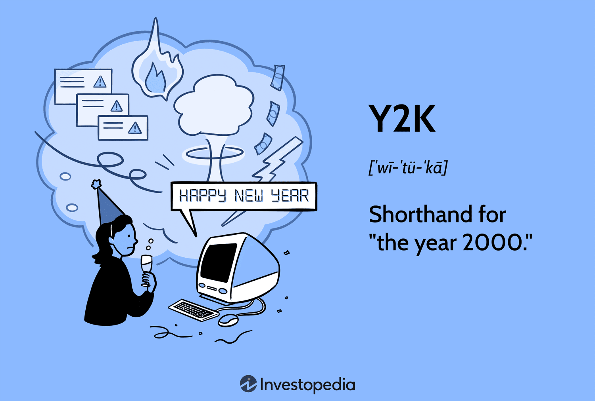

The dawn of the year 2000 marked an era of significant fear and uncertainty due to the Millennium Bug, commonly known as Y2K. This bug stemmed from the widespread practice of abbreviating four-digit years to two digits in computer systems, a space-saving strategy dating back to the early days of computing. As 1999 turned into 2000, this shortcut threatened to confuse systems that might interpret the new year as 1900 instead, potentially causing errors in date calculations and data processing.

The pervasive apprehension surrounding Y2K spanned various sectors, raising concerns about the potential for massive disruptions in critical areas like banking, government operations, and trading systems. The financial world, highly dependent on accurate date-driven operations, feared algorithmic trading systems could falter, leading to erroneous trade signals and settlement failures. Such potential hiccups highlighted the interconnectedness of global financial networks, where even minor glitches could precipitate significant market volatility.

Despite extensive preparation and the establishment of dedicated readiness initiatives, the question persists: how much of the Y2K panic was justified? In retrospect, analyzing the outcomes of Y2K provides valuable insights and underscores key lessons for handling future technological challenges. Notably, it serves as a case study in risk perception versus reality, reminding industries of the importance of vigilance and collaborative efforts in safeguarding against technological vulnerabilities.

## Table of Contents

## The Origin of the Y2K Bug

Y2K, or the "Millennium Bug," originated from a common practice in early computer programming where years were represented using only two digits instead of four. This practice, adopted to save precious and expensive memory space, was pervasive across legacy systems built in the mid-20th century. Consequently, years were stored as "YY" instead of "YYYY," which became problematic as the calendar approached the year 2000. When the year rolled over from 1999 to 2000, computers interpreting the year "00" could mistakenly read it as 1900.

This oversight was not merely theoretical; it posed real operational challenges. In particular, industries dependent on legacy systems found themselves needing to verify and update their software to ensure Y2K compliance. Failure to do so risked miscalculations, incorrect date processing, or overall system failures—each with potentially significant repercussions.

The financial industry, including sectors like algorithmic trading, was acutely aware of the dangers Y2K presented due to its heavy reliance on date-specific operations. Trading systems used algorithms that necessitated precise date and time calculations to execute trades, predict market trends, and settle transactions. The fear was that algorithmic trading systems might generate erroneous signals, miss trading opportunities, or disrupt settlements if the date read incorrectly as 1900 instead of 2000.

As a result, there was a concerted effort across the industry to review and revise systems, applying patches and updates where necessary. Companies and financial institutions engaged in extensive testing protocols to ensure that their systems could correctly transition into the new millennium without operational disruptions.

## Impact on Algorithmic Trading

Algorithmic trading in 2000 faced considerable risk from the Y2K bug, primarily because many trading algorithms relied heavily on accurate date and time calculations to function correctly. The transition from December 31, 1999, to January 1, 2000, presented a unique challenge due to the two-digit date representation commonly used in software systems. This coding practice meant that the year 2000 could be misinterpreted as 1900, leading to potential failures in algorithms that depended on chronological data for decision-making.

Traders were particularly concerned that incorrect date calculations could lead to erroneous trade signals. For example, an algorithm designed to execute trades based on patterns observed over the past years could fail if the year changed unexpectedly to 1900. Similarly, settlement systems, which ensure that the transfer of securities and funds between parties concludes without error, relied on precise date management. Any inaccuracies here could jeopardize the completion of millions of transactions with the potential for extensive financial loss.

The interconnectedness of global financial systems exacerbated these concerns. Even minor glitches could cascade through the network, triggering far-reaching market reactions. For trading houses operating on the principle of high-frequency trading, where large volumes of trades are executed in fractions of a second, even the slightest error could translate into substantial financial discrepancies and losses.

To circumvent these potential issues, comprehensive testing and updates to trading systems became imperative. Financial institutions embarked on thorough audits of their codebases, meticulously updating date formats and rigorously testing algorithms under simulated Y2K conditions. These preventive measures aimed to ensure that trading algorithms could accurately process dates post-2000 without malfunction.

The development of contingency plans formed another critical aspect of preparation. These plans included regular backups, fallbacks to manual trading operations, and enhanced monitoring of systems to promptly detect and address any anomalies during the transition period. This proactive stance minimized risk, ensuring the stability and reliability of trading systems well into the new millennium. Through such extensive preparation, the potential disruptive impact of Y2K on [algorithmic trading](/wiki/algorithmic-trading) was largely mitigated.

## Preventive Measures Taken

The approach to mitigating the risks associated with the Y2K bug involved significant investments and coordinated efforts across various sectors. Businesses worldwide allocated billions of dollars to overhauling their computer systems and ensuring compliance with Y2K standards. These upgrades were aimed at preventing any disruptions that might occur due to the incorrect interpretation of date data as the calendar shifted from December 31, 1999, to January 1, 2000.

Countries implemented legislative measures to promote transparency and coordination in addressing Y2K concerns. In the United States, the Year 2000 Information and Readiness Disclosure Act was enacted. This legislation encouraged the sharing of information regarding Y2K readiness efforts while providing certain legal protections, fostering a cooperative environment for tackling the issue.

Financial institutions, particularly those engaged in trading, were acutely aware of the potential impacts of Y2K failures. To address these concerns, trading houses and exchanges around the globe took on extensive collaborations. These financial entities worked cohesively to ensure cross-compatibility between different systems, which was crucial for maintaining seamless operations during the transition. Inter-agency cooperation was of paramount importance, given the interconnected nature of financial markets.

The comprehensive remediation efforts undertaken included a series of software updates and rigorous system tests. These updates ensured that both current and legacy systems could accurately process dates beyond the year 1999. Furthermore, contingency planning played a significant role in these preparations. Organizations developed robust action plans to quickly rectify any unforeseen issues that might arise, thereby safeguarding market fluidity during the critical period of the millennium change.

Overall, the preventive measures taken ahead of Y2K attest to the importance of strategic investment in technology, inter-company collaboration, and legislative support to avert the risks associated with large-scale technological transitions. These efforts not only helped avert potential crises but also set a precedent for managing future technological challenges effectively.

## The Reality of Y2K in Trading

The arrival of the year 2000, anticipated with widespread concern due to the Millennium Bug, ultimately unfolded with minimal disruption in the financial and trading sectors. Financial institutions, particularly those engaged in algorithmic trading, had braced for complications arising from incorrect date calculations that could potentially disrupt operations. However, the anticipated chaos was largely averted, thanks to rigorous preparation and substantial investment in IT infrastructure.

Leading up to the millennium, companies and financial organizations invested billions of dollars in preventive measures, overhauling systems and ensuring their Y2K compliance. This proactive approach significantly mitigated the risks associated with the Y2K bug. Critical infrastructure updates and exhaustive testing protocols were established to ensure trading systems could handle the transition without errors. These efforts proved crucial in maintaining stability during the date change.

For algorithmic trading, which relies heavily on precise date-based operations for executing trades, the transition to the year 2000 was largely uneventful. This smooth transition was largely attributed to the extensive system checks and contingency planning undertaken prior to Y2K. Traders and financial institutions conducted comprehensive testing of their algorithms and trading platforms to identify any potential vulnerabilities. This preemptive strategy ensured that algorithmic trading continued without major incidents, safeguarding market integrity and preventing disruptions.

Furthermore, the Y2K experience underscored the necessity of technological flexibility and robust contingency strategies. The scare led to a heightened awareness of the importance of maintaining adaptable systems capable of weathering unforeseen challenges. Financial markets benefited from the reinforced infrastructure and newfound emphasis on readiness, setting a precedent for future technological issues.

Overall, the reality of Y2K in trading demonstrated that while initial fears were largely unfounded, the steps taken to address potential issues significantly contributed to the seamless transition experienced in financial markets worldwide. The event reinforced the importance of continuous investment in technology and risk management practices, ensuring the robustness and adaptability of trading systems against a backdrop of evolving digital threats.

## Lessons Learned

Y2K demonstrated the critical need for forward-thinking and proactive risk management in technological systems. The looming threat of the Millennium Bug catalyzed significant collaborative efforts across various industries and nations. This unprecedented level of cooperation laid the foundation for managing future global technological challenges. Governments, businesses, and IT experts joined forces, sharing data and strategies to preempt potential disruptions, setting a standard for future responses to cybersecurity and infrastructural vulnerabilities.

For the algorithmic trading sector, Y2K proved to be a watershed moment. The extensive preparations undertaken to address the Y2K issue led to enhanced infrastructure and improved compliance systems. Trading algorithms, which depend heavily on precise date and time calculations, were thoroughly tested and revised to prevent errors. As a result, trading systems were fortified against future glitches. This increased resilience has helped algorithmic trading adapt to subsequent technological shifts, such as the rise of high-frequency trading.

The Y2K event underscored the importance of continuous technological audits and updates to safeguard against unforeseen disruptions. Organizations learned the necessity of maintaining up-to-date software and hardware to prevent vulnerabilities. Regular audits of technological systems became vital, ensuring they are equipped to handle date transitions and other potential anomalies. The Y2K experience has influenced modern practices, where routine checks and updates are integral to managing technological infrastructures effectively. This systematic approach to risk management has become a cornerstone of contemporary IT strategy, helping organizations stay ahead in an ever-evolving digital landscape.

## Conclusion

The Y2K saga remains a fascinating study in risk perception versus reality. At the threshold of the new millennium, concerns about the Millennium Bug's potential impact on various critical infrastructures, especially in financial markets and algorithmic trading, were at the forefront of global discourse. Despite the widespread anxiety, the fears did not manifest on a large scale. The extensive preparations undertaken across industries ensured that critical systems continued to function smoothly.

Industries are now better equipped to manage future technological challenges owing to the valuable insights gained during Y2K. The global collaboration witnessed among sectors to address the Y2K problem set a precedent for future joint efforts in tackling technological risks. Enhanced infrastructure and compliance systems, particularly within algorithmic trading, were developed in response to the event, contributing to greater resilience.

Ultimately, Y2K serves as a reminder of how technology-related fears can drive substantial advancements and innovations. The event highlighted the necessity for rigorous preparedness, continuous technological audits, and updates as safeguards against potential disruptions. Its legacy lies in demonstrating how the anticipation of technological failure can catalyze positive change and foster an environment of proactive improvement and adaptability.

## References & Further Reading

[1]: ["Time Bomb 2000! What the Year 2000 Computer Crisis Means to You!"](https://archive.org/details/timebomb2000what0000your) by Edward Yourdon and Jennifer Yourdon.

[2]: ["Y2K: The Day the World Didn't End"](https://en.wikipedia.org/wiki/Year_2000_problem) by Peter A. Freeman.

[3]: NeSmith, D. S. (2002). ["The Y2K Bug, Globalization, and Crisis Communication."](https://www.researchgate.net/scientific-contributions/D-Scott-NeSmith-77244788) in Challenges of Crisis Communication.

[4]: ["The Y2K Computer Scam"](https://www.discovermagazine.com/technology/was-the-y2k-bug-real-or-a-hoax) by Allan R. Morton.

[5]: ["The Lessons of the Y2K Crisis: Catching Up with an Old Threat."](https://santanaviews.com/how-we-narrowly-survived-y2k-4fd2cf02399a) by Bridget Duffy.