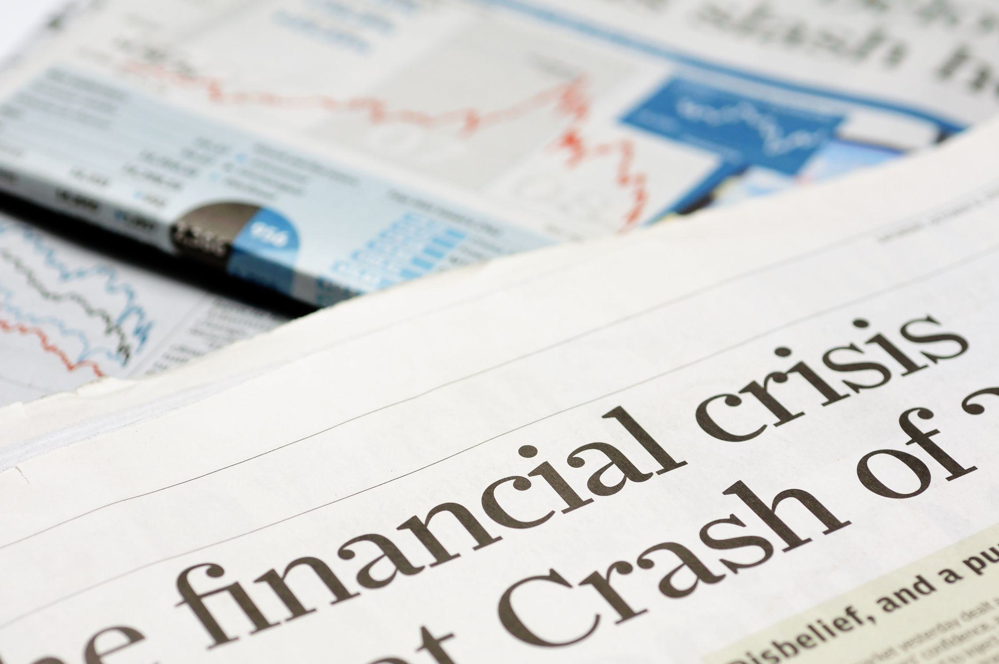

## Table of Contents

## What was the 2008 Financial Crisis?

The 2008 Financial Crisis was a major economic problem that started in the United States but affected the whole world. It began because many banks and financial companies made risky loans, especially for buying houses. These loans were often given to people who couldn't afford them. When people couldn't pay back these loans, the value of houses dropped a lot, and many banks lost a lot of money. This caused a big panic, and banks stopped lending money to each other and to people.

Because banks weren't lending money, many businesses couldn't get the money they needed to keep running. This led to a lot of businesses closing and many people losing their jobs. Governments around the world had to step in to help their economies. They spent a lot of money to save banks and to help people who lost their jobs. The crisis showed that the financial system needed better rules to stop such big problems from happening again.

## Who were the key leaders involved in the 2008 Financial Crisis?

In the United States, President George W. Bush was in charge when the 2008 Financial Crisis started. He and his team, including Treasury Secretary Henry Paulson, worked on a plan to help banks. Paulson, who used to work at a big bank called Goldman Sachs, came up with the idea for the government to buy bad loans from banks. This plan was called the Troubled Asset Relief Program (TARP). It was a big deal because it used a lot of taxpayer money to help banks, and it was very controversial.

When Barack Obama became president in 2009, he and his team continued to deal with the crisis. His Treasury Secretary, Timothy Geithner, and the head of the Federal Reserve, Ben Bernanke, played big roles in trying to fix the economy. They worked on more programs to help banks and to get people back to work. Around the world, leaders like Gordon Brown in the UK and Angela Merkel in Germany also had to deal with the crisis and make plans to help their countries.

The crisis was a tough time for everyone, and these leaders had to make hard choices. They had to balance helping the banks with helping everyday people who were losing their jobs and homes. It was a time when people really looked to their leaders to find a way out of the mess.

## What roles did these leaders play during the crisis?

When the 2008 Financial Crisis hit, President George W. Bush and his Treasury Secretary Henry Paulson were in charge in the United States. They came up with the Troubled Asset Relief Program (TARP), which used taxpayer money to buy bad loans from banks. This was a big and controversial plan because it meant the government was spending a lot to help banks. Paulson, who used to work at Goldman Sachs, thought this was the best way to stop the crisis from getting worse. Their goal was to keep the banks from failing and to keep the economy from collapsing completely.

When Barack Obama became president in 2009, he and his team took over dealing with the crisis. His Treasury Secretary, Timothy Geithner, and the head of the Federal Reserve, Ben Bernanke, worked on more plans to help the economy. They tried to make sure banks could lend money again and that people could get back to work. Around the world, leaders like Gordon Brown in the UK and Angela Merkel in Germany also had to handle the crisis. They made their own plans to help their countries' economies and to support people who were struggling. All these leaders had to make tough choices to try and fix the big problems caused by the financial crisis.

## How did the actions of these leaders impact the financial crisis?

The actions of President George W. Bush and his Treasury Secretary Henry Paulson had a big impact on the 2008 Financial Crisis. They created the Troubled Asset Relief Program (TARP), which used taxpayer money to buy bad loans from banks. This helped stop the banks from failing completely and kept the economy from getting even worse. TARP was controversial because it used a lot of public money to help banks, but it was seen as necessary to prevent a total collapse of the financial system.

When Barack Obama became president, he and his team, including Treasury Secretary Timothy Geithner and Federal Reserve Chairman Ben Bernanke, continued to work on fixing the economy. They made more plans to help banks lend money again and to help people get back to work. Around the world, leaders like Gordon Brown in the UK and Angela Merkel in Germany also took actions to support their countries' economies. These leaders' efforts helped to slowly recover from the crisis, but it took a long time and a lot of hard work to get things back on track.

## What were the major decisions made by these leaders during the crisis?

When the 2008 Financial Crisis started, President George W. Bush and his Treasury Secretary Henry Paulson made a big decision to create the Troubled Asset Relief Program (TARP). TARP used taxpayer money to buy bad loans from banks. This was a controversial move because it meant using a lot of public money to help banks, but they thought it was the only way to stop the banks from failing completely. Their goal was to keep the economy from collapsing even more.

When Barack Obama became president in 2009, he and his team, including Treasury Secretary Timothy Geithner and Federal Reserve Chairman Ben Bernanke, continued working on the crisis. They made more plans to help banks start lending money again and to help people get back to work. They knew it would take a lot of time and effort to fix the problems caused by the crisis, but they kept trying different ways to make things better.

Around the world, leaders like Gordon Brown in the UK and Angela Merkel in Germany also made important decisions to help their countries. They came up with their own plans to support their economies and help people who were struggling. All these leaders had to make tough choices to try and fix the big problems caused by the financial crisis, and their efforts helped the world slowly recover.

## How did the public and media perceive the actions of these leaders?

The public and media had mixed feelings about the actions of these leaders during the 2008 Financial Crisis. Many people were angry and upset because they felt the government was using their tax money to help big banks that had made bad decisions. They thought it was unfair that the banks got help while many people were losing their jobs and homes. The media often talked about this and criticized the leaders for bailing out the banks. Some people felt that the leaders were not doing enough to help regular people who were struggling.

On the other hand, there were also people who understood that the leaders had to do something to stop the economy from getting even worse. They saw TARP and other plans as necessary steps to keep the whole financial system from collapsing. The media sometimes showed this side too, explaining that without these actions, things could have been much worse. Still, the decisions made by these leaders were very controversial, and many people continued to debate whether they did the right thing.

## What were the criticisms and defenses of these leaders' actions?

Many people criticized the leaders for using taxpayer money to help big banks during the 2008 Financial Crisis. They thought it was wrong that banks got help while many people lost their jobs and homes. People were angry because they felt the banks had made bad choices and should not be bailed out. The media often talked about this and said the leaders were not doing enough for regular people. Some people felt that the leaders were more worried about saving the banks than helping those who were really struggling.

On the other hand, some people defended the leaders' actions. They said that without helping the banks, the whole economy could have collapsed, making things even worse for everyone. They thought that the Troubled Asset Relief Program (TARP) and other plans were necessary to keep the financial system from falling apart completely. Even though these actions were controversial, some people believed that the leaders had to make tough choices to stop a bigger disaster. The media sometimes showed this side too, explaining that the leaders were trying to prevent a total economic meltdown.

## How did the policies and decisions of these leaders affect the global economy?

The policies and decisions made by leaders during the 2008 Financial Crisis had a big impact on the global economy. In the United States, President George W. Bush and his team decided to use taxpayer money to help banks through the Troubled Asset Relief Program (TARP). This helped stop the banks from failing completely, which could have made the economy much worse. But it also made a lot of people angry because they felt it was unfair to help banks while many people were losing their jobs and homes. Around the world, leaders like Gordon Brown in the UK and Angela Merkel in Germany also made plans to help their own countries. These efforts helped keep the global economy from collapsing, but it took a long time for things to get better.

When Barack Obama became president, he and his team, including Treasury Secretary Timothy Geithner and Federal Reserve Chairman Ben Bernanke, continued to work on fixing the economy. They made more plans to help banks lend money again and to help people get back to work. These actions were important because they helped the global economy start to recover. But the recovery was slow, and many people still felt the effects of the crisis for years. Overall, the leaders' decisions helped prevent a complete economic disaster, but they were controversial and led to a lot of debate about what was the best way to handle the crisis.

## What were the long-term effects of the leaders' decisions on financial regulations?

The leaders' decisions during the 2008 Financial Crisis led to big changes in financial regulations around the world. In the United States, the Dodd-Frank Act was passed in 2010. This law was meant to stop another big financial crisis from happening. It made new rules for banks, like making them keep more money on hand and setting up a special group to watch over big financial companies. The idea was to make sure banks would be safer and less likely to cause another crisis. Other countries also made changes to their rules to try and keep their financial systems safer.

These new regulations had a big impact on how banks and financial companies worked. They had to be more careful with the risks they took, and they had to follow more rules. This made the financial system more stable, but it also made it harder for banks to make big profits like they did before the crisis. Some people thought the new rules were good because they made the economy safer, but others worried that they might slow down the economy by making it harder for businesses to get loans. Overall, the leaders' actions during the crisis led to a more careful and regulated financial world.

## How did the leadership styles of these individuals influence their crisis management?

The leadership styles of the key figures during the 2008 Financial Crisis played a big role in how they managed the situation. President George W. Bush and his Treasury Secretary Henry Paulson acted quickly when the crisis started. They decided to use taxpayer money to help banks through the Troubled Asset Relief Program (TARP). Paulson, who used to work at a big bank, was very focused on fixing the financial system fast. He believed that helping the banks was the best way to stop the economy from collapsing completely. Their approach was seen as bold and necessary by some, but it also made a lot of people angry because they thought it was unfair to help banks while many people were struggling.

When Barack Obama became president, he and his team, including Treasury Secretary Timothy Geithner and Federal Reserve Chairman Ben Bernanke, took a more careful and detailed approach to managing the crisis. They worked on more plans to help banks lend money again and to get people back to work. Obama and his team tried to balance helping the banks with helping regular people who were affected by the crisis. They knew it would take a long time to fix everything, so they were patient and worked on many different solutions. Their leadership style helped the economy slowly recover, but it also led to a lot of debate about what was the best way to handle the crisis.

## What lessons can be learned from the leadership during the 2008 Financial Crisis?

One big lesson from the leadership during the 2008 Financial Crisis is the importance of acting quickly when things go wrong. President George W. Bush and his Treasury Secretary Henry Paulson moved fast to help the banks with the Troubled Asset Relief Program (TARP). They thought that helping the banks was the best way to stop the economy from getting even worse. But their quick actions also made a lot of people angry because they felt it was unfair to help banks while many people were losing their jobs and homes. This shows that leaders need to balance acting fast with thinking about how their decisions affect everyone.

Another lesson is the value of taking a careful and detailed approach to fixing big problems. When Barack Obama became president, he and his team, including Treasury Secretary Timothy Geithner and Federal Reserve Chairman Ben Bernanke, worked on many plans to help the economy recover. They tried to help banks lend money again and to get people back to work. They knew it would take a long time to fix everything, so they were patient and worked on different solutions. Their approach helped the economy slowly get better, but it also led to a lot of debate about what was the best way to handle the crisis. This shows that leaders need to be patient and think about all the different ways to solve a problem.

## How have these leaders' careers and reputations been affected post-crisis?

After the 2008 Financial Crisis, the careers and reputations of the key leaders were affected in different ways. President George W. Bush left office at the end of his term and did not run for office again. Many people were still upset about TARP and how he handled the crisis, so his reputation was hurt. Henry Paulson, who was his Treasury Secretary, went back to the private sector and worked on writing books about the crisis. Some people respected him for his quick actions, but others thought he helped the banks too much.

Barack Obama and his team, like Timothy Geithner and Ben Bernanke, worked hard to fix the economy after the crisis. Obama was re-elected in 2012, which shows that many people thought he did a good job. Geithner and Bernanke also got a lot of attention for their work on the crisis. Geithner became the president of Warburg Pincus, a big investment company, and Bernanke wrote books and gave speeches about the economy. Their reputations were mixed because some people thought they helped the economy recover, but others felt they didn't do enough for regular people.

## Where Are They Now? The Post-Crisis Trajectories of Financial Figures

After the 2008 financial crisis, the key figures who played significant roles during the turmoil have transitioned to various influential positions, continuing to shape global financial policies and practices.

### Henry Paulson

Henry Paulson, who served as the U.S. Treasury Secretary during the crisis, became known for his pivotal role in advocating for the Troubled Asset Relief Program (TARP). Following the crisis, Paulson transitioned to a role in academia and policy advocacy. He founded the Paulson Institute at the University of Chicago in 2011, which focuses on fostering economic growth and environmental sustainability between the United States and China. Paulson has also authored several [books](/wiki/algo-trading-books), including "On the Brink: Inside the Race to Stop the Collapse of the Global Financial System," offering insights into the crisis' management and his experiences.

### Ben Bernanke

Ben Bernanke, as the Federal Reserve Chairman during the crisis, was instrumental in implementing quantitative easing measures to stabilize the economy. After stepping down from the Federal Reserve in 2014, Bernanke joined the Brookings Institution as a Distinguished Fellow in Residence with the Economic Studies Program. His work at Brookings involves research on monetary policy and financial regulation. In 2022, Bernanke was awarded the Nobel Prize in Economic Sciences, alongside Douglas W. Diamond and Philip H. Dybvig, for their research on banks and financial crises. His publications, like "The Courage to Act: A Memoir of a Crisis and Its Aftermath," continue to contribute to discussions on central banking and economic policy.

### Timothy Geithner

Timothy Geithner, who succeeded Paulson as Treasury Secretary in 2009, was deeply involved in the government's response to the financial crisis, focusing on stabilizing the banking system. After leaving public office in 2013, Geithner pursued a career in the private sector, joining the private equity firm Warburg Pincus as President. He has written a book titled "Stress Test: Reflections on Financial Crises," reflecting on his tenure at the Treasury and the lessons learned from the crisis. Geithner's work and public speeches continue to influence discourse on financial resilience and crisis management.

These leaders, through their ongoing public and private endeavors, publications, and participation in global economic discussions, continue to impact financial policies and practices. Their efforts focus on achieving economic stability, enhancing understanding of financial crises, and fostering international cooperation.

## References & Further Reading

[1]: Alexander, C. & Sheedy, E. (2010). "The 2008 Global Financial Crisis: An Introduction". In *Risk Management Review*.

[2]: U.S. Government Publishing Office. (2010). ["Dodd-Frank Wall Street Reform and Consumer Protection Act."](https://www.govinfo.gov/app/details/COMPS-9515) Public Law 111-203.

[3]: Bernanke, B. S. (2017). ["The Courage to Act: A Memoir of a Crisis and Its Aftermath."](https://www.amazon.com/Courage-Act-Memoir-Crisis-Aftermath/dp/0393353990) W. W. Norton & Company.

[4]: Paulson, H. (2010). ["On the Brink: Inside the Race to Stop the Collapse of the Global Financial System."](https://link.springer.com/article/10.1057/be.2010.33) Business Plus. 

[5]: Geithner, T. (2015). ["Stress Test: Reflections on Financial Crises."](https://www.amazon.com/Stress-Test-Reflections-Financial-Crises/dp/0804138613) Crown.

[6]: Lopez de Prado, M. (2018). ["Advances in Financial Machine Learning."](https://www.amazon.com/Advances-Financial-Machine-Learning-Marcos/dp/1119482089) Wiley.

[7]: "Li, D. X. "On Default Correlation: A Copula Function Approach." Journal of Fixed Income 9 (2000): 43-54.