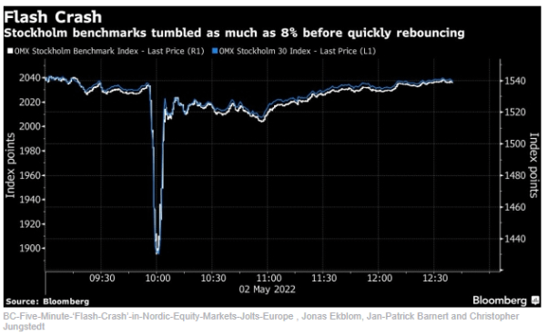

## Table of Contents

## What was the 2010 Flash Crash?

The 2010 Flash Crash was a sudden and dramatic drop in the stock market that happened on May 6, 2010. It started around 2:30 pm and lasted for about 36 minutes. During this time, the Dow Jones Industrial Average, which is a big measure of how the stock market is doing, dropped by almost 1000 points. This was very scary for people who had money in the stock market because it seemed like their money was disappearing very quickly.

The crash was caused by a combination of things. One big reason was the use of high-frequency trading, which is when computers trade stocks very quickly. A big sell order for a certain type of stock triggered a chain reaction, making other computers sell their stocks too. This made the prices drop really fast. After the crash, rules were changed to try to stop this from happening again. People learned that the stock market can be very unpredictable and that computers can make things worse if they are not watched carefully.

## When and where did the 2010 Flash Crash occur?

The 2010 Flash Crash happened on May 6, 2010. It took place in the United States, affecting the major stock markets like the New York Stock Exchange and the NASDAQ.

The crash started around 2:30 pm Eastern Time and lasted for about 36 minutes. During this short time, the stock market saw a big drop, with the Dow Jones Industrial Average falling almost 1000 points before recovering. It was a scary moment for people watching their investments.

## What caused the 2010 Flash Crash?

The 2010 Flash Crash was mainly caused by high-frequency trading. This is when computers trade stocks very quickly, often in fractions of a second. On that day, a big sell order for a certain type of stock was placed. This order was so big that it set off a chain reaction. Other computers saw the big sell order and started selling their stocks too, thinking the price was going to drop even more. This caused the prices to drop really fast, leading to the crash.

After the crash, experts looked into what happened and found out that the rules for trading needed to change. They made new rules to slow down high-frequency trading and to stop big sell orders from causing such big problems. The crash showed everyone that the stock market can be very unpredictable and that computers can make things worse if they are not watched carefully. It was a big lesson for everyone involved in the stock market.

## How did the 2010 Flash Crash affect the stock market?

The 2010 Flash Crash caused a big scare in the stock market. On May 6, 2010, the market dropped a lot in just 36 minutes. The Dow Jones Industrial Average, which is a big measure of how the stock market is doing, went down by almost 1000 points. This made people very worried because it seemed like their money was disappearing very quickly. The crash happened because of high-frequency trading, where computers trade stocks very fast. A big sell order set off a chain reaction, making other computers sell their stocks too, which made the prices drop really fast.

After the crash, people realized they needed to change the rules to make the stock market safer. They made new rules to slow down high-frequency trading and to stop big sell orders from causing such big problems. These changes helped to make the market more stable and less likely to crash like that again. The 2010 Flash Crash was a big lesson for everyone, showing that the stock market can be very unpredictable and that computers need to be watched carefully to avoid making things worse.

## What role did algorithmic trading play in the 2010 Flash Crash?

Algorithmic trading, especially high-frequency trading, played a big role in the 2010 Flash Crash. This type of trading uses computers to buy and sell stocks very quickly, often in fractions of a second. On May 6, 2010, a large sell order for a certain type of stock was placed. This order was so big that it triggered other computers to start selling their stocks too. They thought the price was going to drop even more, so they wanted to sell before the price went down. This started a chain reaction, making the prices drop very fast and causing the crash.

After the crash, people learned that [algorithmic trading](/wiki/algorithmic-trading) needed to be watched more closely. The fast trading by computers made the market go crazy in just 36 minutes. New rules were made to slow down high-frequency trading and to stop big sell orders from causing such big problems. These changes helped to make the market more stable and less likely to crash like that again. The 2010 Flash Crash was a big lesson, showing everyone that computers can make things worse if they are not watched carefully.

## What was the impact of the 2010 Flash Crash on individual investors?

The 2010 Flash Crash made a lot of individual investors very worried. When the stock market dropped almost 1000 points in just 36 minutes, many people thought they were losing a lot of money very quickly. This was scary because it happened so fast, and they didn't know why it was happening. Some investors might have even sold their stocks during the crash, trying to stop their losses, but this could have made things worse for them if the market went back up after they sold.

After the crash, many investors felt less sure about the stock market. They saw how quickly things could go wrong, especially because of high-frequency trading by computers. This made some people more careful about where they put their money. The rules that were changed after the crash helped to make the market safer, but the memory of the Flash Crash made many individual investors more aware of the risks in the stock market.

## What measures were taken by regulatory bodies in response to the 2010 Flash Crash?

After the 2010 Flash Crash, regulatory bodies took steps to make the stock market safer. They realized that high-frequency trading, where computers trade stocks very quickly, was a big problem. So, they made new rules to slow down this kind of trading. They also set up something called "circuit breakers." These are like emergency stops that pause trading if the market starts dropping too fast. This gives everyone a chance to calm down and figure out what's happening before things get out of control.

Another important change was the introduction of the "Limit Up-Limit Down" rule. This rule stops stocks from moving too much in price in a short time. If a stock's price tries to go up or down too quickly, trading in that stock is paused until the price comes back to a more normal level. These changes helped to make the market more stable and less likely to crash like it did in 2010. The regulatory bodies wanted to make sure that what happened on May 6, 2010, wouldn't happen again, so they worked hard to protect investors and keep the market fair.

## How have trading algorithms been modified since the 2010 Flash Crash?

Since the 2010 Flash Crash, trading algorithms have been changed to make them safer and more stable. One big change is that they now have more checks and balances to stop them from causing big problems. For example, some algorithms now have limits on how much they can trade in a short time. This helps to stop the kind of chain reaction that happened during the Flash Crash, where computers kept selling stocks very quickly.

Another change is that algorithms are now better at handling big orders. They break up large sell orders into smaller ones, so they don't shock the market all at once. This helps to keep prices from dropping too fast. Also, many algorithms now work with the new rules set by the regulators, like the "Limit Up-Limit Down" rule, which stops stocks from moving too much in price in a short time. These changes have made the stock market safer for everyone.

## What are the key lessons learned from the 2010 Flash Crash?

The 2010 Flash Crash taught us a lot about how the stock market works. One big lesson is that high-frequency trading, where computers trade stocks very quickly, can cause big problems. When a large sell order was placed, it set off a chain reaction that made the market drop very fast. This showed everyone that we need to watch these computers more closely and make rules to slow them down so they don't cause crashes.

Another lesson is that the stock market can be very unpredictable. The Flash Crash happened in just 36 minutes, which scared a lot of people who had money in the market. It made investors more careful and showed them that the market can change very quickly. After the crash, new rules were made to help keep the market stable, like circuit breakers that pause trading if the market starts dropping too fast. These changes help protect everyone's money and make the market safer.

## What research has been conducted on the 2010 Flash Crash and its implications for market stability?

After the 2010 Flash Crash, a lot of research was done to understand what happened and how to stop it from happening again. Researchers looked at how high-frequency trading and big sell orders caused the market to drop so quickly. They found that computers trading stocks very fast can make the market go crazy if they are not watched carefully. This research helped to make new rules to slow down these computers and stop big sell orders from causing problems. The studies also showed that the stock market can be very unpredictable, which made people think more about how to keep it stable.

The research also looked at how the Flash Crash affected people who had money in the stock market. It made investors scared and more careful about where they put their money. The studies helped to create new safety measures like circuit breakers, which pause trading if the market starts dropping too fast. These changes were important to make the market safer for everyone. The research on the Flash Crash showed that we need to keep learning and making the stock market better to protect people's money.

## How has the 2010 Flash Crash influenced the development of new financial technologies?

The 2010 Flash Crash showed everyone how important it is to have good technology to keep the stock market safe. After the crash, people started working on new financial technologies to stop big problems like that from happening again. They made systems that can watch the market more closely and stop trading if things start going crazy. These new technologies help to slow down high-frequency trading, which is when computers trade stocks very quickly. They also help to break up big sell orders into smaller ones so they don't shock the market all at once. This has made the market more stable and safer for everyone.

Another big change was the creation of better tools to help people understand what's happening in the market. New technologies now give investors more information and help them see if something strange is happening. This makes it easier for them to make good choices about their money. The Flash Crash also pushed for more research into how computers and algorithms affect the market. This research has led to new ways to keep the market fair and stable. Overall, the 2010 Flash Crash has made financial technology better and more focused on keeping the market safe for everyone.

## What are the ongoing debates and discussions among experts about the 2010 Flash Crash?

Experts are still talking about what really caused the 2010 Flash Crash and what we can do to stop it from happening again. Some people think that high-frequency trading, where computers trade stocks very quickly, was the main problem. They say that these computers can make the market go crazy if they are not watched carefully. Others think that the big sell order that started the crash was the real issue. They argue that if we can find a way to handle big orders better, we can stop crashes like this from happening.

There's also a lot of discussion about how to make the market safer. Some experts want even more rules to slow down high-frequency trading and to stop big sell orders from causing problems. They think that these rules can help keep the market stable. Others worry that too many rules might make it hard for the market to work well. They say we need to find a balance between safety and letting the market do its job. Everyone agrees that we need to keep learning and making the stock market better to protect people's money.

## References & Further Reading

[1]: U.S. Securities and Exchange Commission & Commodity Futures Trading Commission. (2010). ["Findings Regarding the Market Events of May 6, 2010."](https://www.sec.gov/news/studies/2010/marketevents-report.pdf)

[2]: Kirilenko, A., Kyle, A. S., Samadi, M., & Tuzun, T. (2017). ["The Flash Crash: High-Frequency Trading in an Electronic Market."](https://www.jstor.org/stable/26652722) Review of Financial Studies, 30(11), 2226–2257.

[3]: Lewis, M. (2014). ["Flash Boys: A Wall Street Revolt."](https://www.amazon.com/Flash-Boys-Wall-Street-Revolt/dp/0393351599) W. W. Norton & Company.

[4]: Aldridge, I. (2013). ["High-Frequency Trading: A Practical Guide to Algorithmic Strategies and Trading Systems."](https://www.amazon.com/High-Frequency-Trading-Practical-Algorithmic-Strategies/dp/1118343506) John Wiley & Sons.

[5]: Patterson, S. (2013). ["Dark Pools: The Rise of the Machine Traders and the Rigging of the U.S. Stock Market."](https://www.amazon.com/Dark-Pools-Machine-Riggers-Market/dp/0307887189) Crown Business.