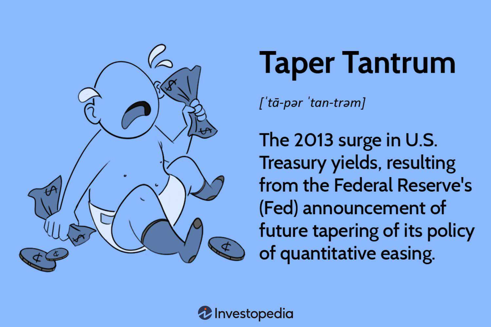

The financial world was rocked in 2013 by an event known as the 'Taper Tantrum.' This term refers to the market's intense reaction to the Federal Reserve's announcement that it would begin tapering its quantitative easing (QE) program. Initially implemented in response to the 2008 financial crisis, QE involved large-scale asset purchases by the Federal Reserve to inject liquidity into the economy, lower interest rates, and stimulate economic growth. For several years following the crisis, these measures were significant in supporting the recovery of the U.S. economy and stabilizing financial markets globally.

On May 22, 2013, then-Federal Reserve Chairman Ben Bernanke indicated that the Fed might reduce the pace of its asset purchases sooner than expected, contingent on continued economic improvement. This announcement sent shockwaves across financial markets, causing a surge in volatility and dramatically increasing yields on U.S. Treasuries. The resultant market turmoil underscored how deeply interconnected the world's financial systems had become and highlighted the profound influence central bank policies could have on global markets.

The Taper Tantrum's impacts were not confined to U.S. markets; emerging economies experienced significant capital outflows and currency depreciation as investors adjusted their portfolios in response to the anticipated changes in U.S. monetary policy. Understanding why the Taper Tantrum led to such pronounced market instability involves examining the Federal Reserve's communication strategies, the sensitivity of global markets to shifts in U.S. policy, and the role of modern trading technologies.

This article explores the implications of the Taper Tantrum by analyzing Federal Reserve policy, the mechanics and consequences of quantitative easing, and the role of algorithmic trading in amplifying market responses. These elements have lasting impacts on global financial markets, influencing everything from interest rates to investor behavior and the development of trading strategies. Recognizing these factors is crucial for navigating current and future market complexities and understanding the broader economic landscape.

## Table of Contents

## What Triggered the Taper Tantrum?

Quantitative easing (QE) is a monetary policy tool utilized by central banks to stimulate the economy when traditional policy measures, such as lowering interest rates, become ineffective. This approach involves the large-scale purchase of financial assets, primarily government securities, to inject liquidity into the financial system, lower interest rates, and promote lending and investment. Following the 2008 financial crisis, the Federal Reserve implemented QE to counteract the severe economic downturn. This led to a significant expansion of the Fed's balance sheet, increasing from approximately $900 billion in 2008 to over $4 trillion by 2013.

The policy was designed to push down long-term interest rates and encourage spending by making borrowing cheaper and saving less attractive. By the early 2010s, QE had effectively reduced borrowing costs and helped to stabilize the financial system, albeit with rising concerns about potential asset bubbles and financial stability risks.

The turning point came in May 2013, when then-Chairman of the Federal Reserve, Ben Bernanke, addressed Congress with the possibility of tapering, or gradually reducing, the pace of asset purchases. Bernanke emphasized that the tapering would depend on continued improvements in economic conditions, specifically significant progress towards the Fed's employment and inflation goals. This announcement marked a shift in monetary policy, signaling that the era of aggressive asset purchases might be drawing to a close.

The market's reaction was swift and pronounced, resulting in what became known as the "Taper Tantrum." Investors reacted strongly to the prospect of reduced monetary support, sparking a sharp uptick in U.S. Treasury yields. The yield on the 10-year Treasury note, for instance, climbed from about 1.6% in early May 2013 to nearly 3% by the end of the year. This abrupt increase in rates reflected market concerns about the implications of reduced [liquidity](/wiki/liquidity-risk-premium) and rising borrowing costs, leading to significant [volatility](/wiki/volatility-trading-strategies) across financial markets worldwide.

The anticipation of tapering also prompted a reassessment among global investors, particularly affecting emerging markets. As U.S. bond yields rose, capital flows reversed, causing currencies in these economies to depreciate sharply. Investors pulled out funds in search of higher returns in more stable U.S. assets, leading to broader financial destabilization in affected countries.

The Taper Tantrum underscored the interconnectedness of global financial markets and the sensitivity of investors to cues from major central banks like the Federal Reserve. The episode provided valuable insights into the dynamics of monetary policy normalization and its far-reaching consequences on market behavior and economic stability.

## Market Reactions and Impacts

The Federal Reserve's announcement regarding the tapering of its quantitative easing program in 2013 led to a significant spike in U.S. Treasury yields. This increase was driven by investors anticipating a reduction in the demand for government bonds, given that the Federal Reserve had been a major purchaser through its asset-buying program. Yields on 10-year U.S. Treasury notes rose sharply, increasing from around 1.63% in May 2013 to approximately 3.01% by the end of the year. This rise in yields indicated higher borrowing costs and shifted market perceptions on interest rates, as they serve as a benchmark for various financial instruments.

The repercussions extended beyond the U.S., profoundly impacting emerging markets. Capital outflows surged as investors withdrew funds in search of higher yields in developed economies. This capital migration resulted in significant currency depreciation for many emerging market nations. For example, countries like India and Brazil experienced a rapid decline in their currency values as investor confidence faltered. The Indian Rupee and Brazilian Real found themselves under pressure, requiring central bank interventions in several instances to stabilize and restore faith in their economic fundamentals.

Corporate bonds also faced the ripple effects of the Taper Tantrum. With U.S. Treasury yields climbing, corporate bond yields followed suit, leading to increased costs of debt issuance for companies. Investors demanded higher yields to compensate for the perceived rise in risk and opportunity costs associated with holding corporate debt over government securities. This adjustment had tangible implications for investors who had previously sought the relative safety and steady returns offered by corporate bonds.

Overall, the announcement instigated substantial volatility in financial markets, with ripple effects reverberating through various asset classes. Stock markets, foreign exchange rates, and commodities all experienced a period of heightened uncertainty and fluctuations. The broader economic repercussions included tighter financial conditions, particularly felt in economies reliant on foreign capital flows or those with substantial foreign currency exposure.

The interplay of these factors during the Taper Tantrum underscored the interconnectedness of global financial markets. It highlighted how shifts in U.S. monetary policy could have immediate and widespread impacts, creating challenges for policymakers and investors globally. Understanding these dynamics continues to be crucial for anticipating changes in market conditions and formulating appropriate risk management strategies.

## Algorithmic Trading and FinTech Implications

During the Taper Tantrum of 2013, [algorithmic trading](/wiki/algorithmic-trading) played a significant role in shaping the dynamics of financial markets. Algorithms, which execute trades based on predefined criteria, were instrumental in magnifying both sell-offs and recoveries as they quickly responded to new data and market conditions. This rapid reaction capability underscores the influence of technology-driven trading strategies in contemporary financial systems.

Predictive analytics, including sentiment analysis, provided tools for forecasting market reactions. By analyzing large datasets, algorithms could identify patterns or shifts in investor sentiment, potentially predicting market movements. For example, natural language processing (NLP) techniques applied to financial news and social media allowed algorithms to assess market sentiment and make informed decisions. This capability enabled traders to anticipate market reactions to the Federal Reserve's announcements, thus positioning themselves advantageously.

Liquidity management and diversification became critical components of trading strategies during this period. Algorithmic platforms were able to manage large volumes of transactions efficiently, maintaining liquidity even amidst market volatility. Additionally, diversification algorithms ensured that portfolios were optimally balanced to mitigate exposure to any single asset class, thus reducing systemic risk. The importance of liquidity can be understood through the bid-ask spread, a key measure of market liquidity, defined as:

$$
\text{Bid-Ask Spread} = \text{Ask Price} - \text{Bid Price}
$$

A narrow spread indicates high liquidity, crucial during turbulent times like the Taper Tantrum.

The Taper Tantrum also highlighted the importance of managing risk and volatility. Algorithms were equipped with risk management protocols, such as stop-loss orders and volatility filters, to minimize potential losses. These tools allowed for automated adjustments to changing market conditions, which mitigated the impact of rapid fluctuations. Moreover, algorithms were programmed to conduct stress testing on portfolios, evaluating potential outcomes under various market scenarios to better prepare for uncertainties.

In conclusion, algorithmic trading and FinTech innovations have revolutionized the way financial markets operate, particularly in situations requiring rapid adaptability and risk management. The experiences of the Taper Tantrum underscore the need for continuous refinement of these technologies to address future market challenges effectively.

## Why Didn't the Stock Market Collapse?

The resilience of the stock market during the 2013 Taper Tantrum can be attributed to a combination of strategic interventions by the Federal Reserve and specific investor behaviors that collectively steadied market sentiment. One significant [factor](/wiki/factor-investing) was the Federal Reserve's proactive approach in communicating its policy intentions clearly to the public and financial markets. Following the initial adverse reaction to Chairman Ben Bernanke's announcement regarding the potential tapering of the quantitative easing program, the Federal Reserve took deliberate steps to reassure investors that any reduction in asset purchases would be gradual and contingent on economic conditions improving consistently.

The Federal Reserve's open market communications strategy played a crucial role in mitigating fears. By providing a clearer timeline and conditions under which the tapering would occur, the Fed helped alleviate uncertainty about its monetary policy trajectory. This guidance helped stabilize investor expectations, as market participants could better adjust their strategies based on anticipated policy actions rather than speculative assumptions. The clarified communication underscored the central bank’s commitment to supporting economic recovery while managing inflation, reinforcing confidence in the ongoing accommodative monetary policy.

Investor behavior and psychological factors also contributed significantly to the stock market's stability during this period. While the initial shock of tapering discussions prompted some volatility, a majority of investors soon recognized signs of economic recovery, such as improved employment figures and modest growth in GDP, which underpinned their confidence in the market’s long-term potential. Behavioral finance suggests that investors, when faced with uncertainty, often revert to heuristics and sentiment analysis. As such, the behavioral shift towards acknowledging positive economic indicators helped dissipate the pervasive fear that had initially gripped markets following the Fed's announcement.

Furthermore, adaptive investor behavior involved increasing allocations to riskier assets, driven by the low-interest-rate environment and the quest for higher yields. The resilience was further boosted by value investors capitalizing on temporarily depressed prices, reinforcing a floor under the market. Combined with the anticipation of impending policy actions being slow and supportive of growth, these dynamics buttressed the stock market from a complete downturn.

In conclusion, the stock market's sustained performance during the Taper Tantrum was a testament to the Federal Reserve's effective communication strategy and investors' adaptive behaviors. These elements collectively fostered a supportive environment that mitigated fears and promoted confidence despite the initial volatility.

## Lessons and Future Outlook

The Taper Tantrum of 2013 underscored the critical importance of effective communication by central banks in managing market expectations. When the Federal Reserve signaled a potential tapering of its quantitative easing (QE) policy, financial markets reacted with significant volatility. This highlighted how central bank communications can profoundly influence investor behavior and market dynamics. Clarity and transparency in messaging are essential to reduce uncertainty and stabilize markets. The event demonstrated that even well-intentioned policy changes could create disruptions if not communicated effectively.

The Taper Tantrum influenced monetary policy and financial market strategies by illustrating the interconnectedness of global markets and the potential consequences of abrupt policy shifts. Central banks have since become more attuned to the nuances of forward guidance, striving to provide more explicit signals regarding future policy directions. This includes gradual and well-telegraphed changes in [interest rate](/wiki/interest-rate-trading-strategies) policies and asset purchase programs, aiming to smooth transitions and mitigate unintended market disturbances.

As a result of the Taper Tantrum, financial institutions and investors have adapted their strategies to be more resilient to policy shifts. This includes emphasizing diversification and liquidity management, as well as integrating advanced predictive analytics to better anticipate and navigate potential market stressors. The development of technologies such as algorithmic trading and sentiment analysis has enabled market participants to analyze vast datasets and predict market movements more accurately.

Looking ahead, future developments in macroeconomic policy will likely focus on balancing accommodative policies with sustainable economic growth. Central banks are likely to retain a cautious approach, incorporating lessons from the Taper Tantrum to avoid abrupt policy changes that might destabilize markets. This involves not only fine-tuning interest rates and asset purchases but also deploying other tools such as regulatory adjustments and targeted interventions.

Moreover, as the economic landscape evolves with technological advancements and global challenges, policy-makers will need to adapt their frameworks and strategies continually. The lessons from the Taper Tantrum emphasize the necessity for central banks to maintain responsive and adaptive policy mechanisms. Future macroeconomic policy developments will need to consider a broader range of economic indicators and potential risks, ensuring that policy shifts are both data-driven and well-communicated to maintain market stability and investor confidence.

## Conclusion

The Taper Tantrum of 2013 represents a critical juncture in the financial market narrative, illustrating the complex interplay between monetary policy and market dynamics. Triggered by the Federal Reserve's announcement to taper its quantitative easing program, this event underscored the necessity for clear and effective communication by central banks to manage expectations and minimize market disruptions. The Taper Tantrum exemplified how swiftly market conditions can change in response to policy shifts, emphasizing the need for adaptive and proactive trading strategies.

Its legacy persists in shaping how monetary policy is crafted and perceived. Central banks worldwide have since become more attuned to the potential volatility their communications can induce, guiding them to approach policy announcements with an understanding of potential market reactions. Moreover, this episode has propelled advancements in trading algorithms and predictive analytics, emphasizing the importance of incorporating diverse data sets and sentiment analysis to better anticipate market movements.

Continuous learning and adaptation remain imperative as financial markets evolve with technological advancements and shifting macroeconomic conditions. The lessons derived from the Taper Tantrum highlight the importance of resilience and agility in the financial world, where unexpected changes can significantly impact market stability and investing strategies. As global financial dynamics continue to evolve, the experiences and insights gained from 2013's market turbulence serve as invaluable references for navigating future uncertainties.

## References & Further Reading

[1]: Eichengreen, B., & Gupta, P. (2014). "Tapering Talk: The Impact of Expectations of Reduced Federal Reserve Security Purchases on Emerging Markets." Emerging Markets Review, 25, 1-15. [Link](https://www.sciencedirect.com/science/article/pii/S1566014115000448)

[2]: Mishkin, F. S. (2013). "The Economics of Money, Banking, and Financial Markets." Pearson Education.

[3]: Bernanke, B. S. (2013). "Transcript of Chairman Bernanke’s Press Conference." [Federal Reserve](https://www.federalreserve.gov/mediacenter/files/FOMCpresconf20130918.pdf)

[4]: Rajan, R. G. (2014). "Competitive Monetary Easing: Is it Yesterday Once More?" Reserve Bank of India. [Link](https://www.tandfonline.com/doi/full/10.1080/17520843.2014.992451)

[5]: Glick, R., & Leduc, S. (2013). "The Effects of Unconventional and Conventional U.S. Monetary Policy on the Dollar." Federal Reserve Bank of San Francisco Working Paper Series. [Link](https://ideas.repec.org/p/fip/fedfwp/2013-11.html)

[6]: Jotikasthira, C., Lundblad, C. T., & Ramadorai, T. (2012). "Asset Fire Sales and Purchases and the International Transmission of Funding Shocks." The Journal of Finance, 67(6), 2015-2050. [Link](https://onlinelibrary.wiley.com/doi/abs/10.1111/j.1540-6261.2012.01780.x)