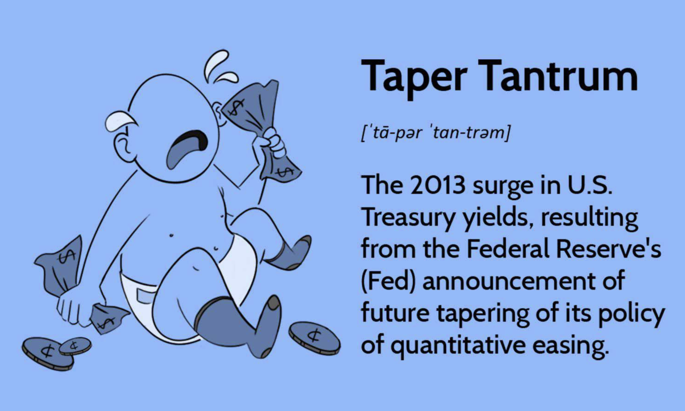

## Table of Contents

## What was the 2013 Taper Tantrum?

The 2013 Taper Tantrum was a big reaction in financial markets when the U.S. Federal Reserve hinted it might slow down its bond-buying program. This program was called quantitative easing, and it was meant to help the economy by keeping interest rates low. When the Fed suggested it might start to "taper" or reduce this program, investors got worried. They thought interest rates would go up, so they started selling off bonds and other investments.

This caused a lot of chaos in the markets. Bond prices dropped, and interest rates went up quickly. Not just in the U.S., but also in many other countries, especially in emerging markets. These countries felt the impact because money started flowing out of their economies and back to the U.S. The Taper Tantrum showed how sensitive global markets can be to changes in U.S. monetary policy.

## What were the main causes of the 2013 Taper Tantrum?

The main cause of the 2013 Taper Tantrum was the Federal Reserve's hint that it might start to reduce its bond-buying program, known as quantitative easing. This program had been pumping money into the economy to keep interest rates low and help recovery after the financial crisis. When the Fed suggested it might slow down or "taper" this program, investors got worried. They thought that if the Fed bought fewer bonds, there would be less money in the economy, and interest rates would go up.

This fear led investors to start selling their bonds and other investments. As they sold, bond prices went down, and interest rates went up quickly. The sudden change caused a lot of chaos in the markets, not just in the U.S. but around the world. Emerging markets were hit hard because investors pulled their money out of these countries and moved it back to the U.S. The Taper Tantrum showed how much global markets can be affected by changes in U.S. monetary policy.

## Who was primarily affected by the Taper Tantrum?

The Taper Tantrum mainly hurt emerging markets. These are countries that are still growing and developing their economies. When the U.S. Federal Reserve hinted it might slow down its bond-buying program, investors got scared. They started taking their money out of these emerging markets and putting it back into the U.S. This caused the value of these countries' currencies to drop and their borrowing costs to go up.

In the U.S., the Taper Tantrum also affected the bond market. When investors thought interest rates would rise, they sold their bonds. This made bond prices fall and interest rates go up quickly. It was a big shock to the markets because everyone was used to the Fed's help keeping rates low. The Taper Tantrum showed how much the world's economy can be shaken by changes in U.S. monetary policy.

## How did the Federal Reserve's policies contribute to the Taper Tantrum?

The Federal Reserve's policies were the main reason for the Taper Tantrum. The Fed had been using a program called quantitative easing to help the economy. This program meant the Fed was buying a lot of bonds, which kept interest rates low. But in 2013, the Fed hinted it might start to slow down this program, or "taper" it. This made investors think that interest rates would start to go up. They got scared and started selling their bonds and other investments, which caused bond prices to fall and interest rates to rise quickly.

This sudden change caused a lot of problems, especially in emerging markets. These countries were hit hard because investors pulled their money out and moved it back to the U.S. This made the value of their currencies drop and their borrowing costs go up. The Taper Tantrum showed how much the world's economy can be affected by what the U.S. Federal Reserve does. It was a big lesson about how sensitive markets can be to changes in U.S. monetary policy.

## What was the immediate impact of the Taper Tantrum on financial markets?

When the Federal Reserve hinted it might slow down its bond-buying program in 2013, it caused a big reaction in financial markets. Investors got scared because they thought interest rates would go up. They started selling their bonds and other investments, which made bond prices drop and interest rates rise quickly. This sudden change caused a lot of chaos in the markets.

Emerging markets were hit the hardest. When investors got scared, they pulled their money out of these countries and moved it back to the U.S. This made the value of the currencies in these countries go down and their borrowing costs go up. The Taper Tantrum showed how much the world's economy can be affected by changes in U.S. monetary policy.

## How did emerging markets react to the Taper Tantrum?

Emerging markets felt a big impact from the Taper Tantrum. When the U.S. Federal Reserve hinted it might slow down its bond-buying program, investors got scared. They started pulling their money out of these countries and moving it back to the U.S. This caused the value of the currencies in these emerging markets to drop a lot. It also made it more expensive for these countries to borrow money, which can slow down their economies.

The Taper Tantrum showed how sensitive emerging markets can be to changes in U.S. monetary policy. Countries like India, Indonesia, and Brazil were hit especially hard. They had to take quick actions to try to calm their markets and keep their economies stable. It was a tough time for these countries, and it taught them about the risks of relying too much on foreign investment.

## What were the long-term effects of the Taper Tantrum on global economies?

The Taper Tantrum had big effects on global economies that lasted a long time. It showed everyone how much the world's money systems can be shaken by what the U.S. Federal Reserve does. After the Taper Tantrum, many countries, especially emerging markets, started to be more careful about relying too much on money from other countries. They worked on making their own economies stronger and less dependent on foreign investment. This meant they tried to save more money and make their own markets more stable.

The Taper Tantrum also made central banks around the world think more about how their actions can affect other countries. They started talking more to each other and working together to make sure big changes in one country's money policy wouldn't cause so much chaos again. This helped make the world's money system a bit more stable over time. Overall, the Taper Tantrum was a big lesson for everyone about how connected the world's economies are and how important it is to be ready for sudden changes.

## How did the Taper Tantrum influence monetary policy worldwide?

The Taper Tantrum made central banks around the world think more about how their actions can affect other countries. Before the Taper Tantrum, many countries did not pay much attention to how their money policies could cause problems in other places. But after seeing the chaos caused by the U.S. Federal Reserve's hint about slowing down its bond-buying program, central banks started to talk more with each other. They worked together to make sure big changes in one country's money policy wouldn't cause so much trouble again. This helped make the world's money system more stable over time.

Emerging markets learned a big lesson from the Taper Tantrum. They saw how quickly money could leave their countries when investors got scared. So, these countries started to be more careful about relying too much on money from other places. They worked on making their own economies stronger and less dependent on foreign investment. This meant they tried to save more money and make their own markets more stable. The Taper Tantrum showed everyone how connected the world's economies are and how important it is to be ready for sudden changes.

## What lessons were learned from the 2013 Taper Tantrum regarding communication from central banks?

The 2013 Taper Tantrum taught central banks a big lesson about how important it is to talk clearly to everyone. When the U.S. Federal Reserve hinted it might slow down its bond-buying program, it caused a lot of fear and confusion. Investors didn't know what to expect, so they started selling their investments, which made the markets go crazy. This showed that central banks need to explain their plans better so people don't get scared and start making big moves with their money.

After the Taper Tantrum, central banks started to be more open about what they were thinking and planning. They talked more with each other and with the public to make sure everyone understood what was going on. This helped to calm the markets and make them more stable. The Taper Tantrum made everyone realize that clear communication from central banks is really important for keeping the world's money system steady.

## How did the Taper Tantrum affect investor behavior and market volatility?

The Taper Tantrum made investors very nervous. When the U.S. Federal Reserve hinted it might slow down its bond-buying program, people thought interest rates would go up. This scared them, so they started selling their bonds and other investments really fast. This made bond prices fall and interest rates rise quickly. Investors pulled their money out of emerging markets and moved it back to the U.S., which made those countries' economies shake. The Taper Tantrum showed investors how big changes in U.S. money policy can affect them, so they started being more careful about where they put their money.

The Taper Tantrum also caused a lot of ups and downs in the markets. When investors got scared and started selling their investments, it made the markets very unstable. This sudden change caused a lot of chaos, not just in the U.S., but all over the world. After the Taper Tantrum, people learned that markets can be very sensitive to what central banks say and do. This made investors more aware of how important it is to watch what central banks are planning, and it also made them think more about the risks of investing in certain places.

## What measures were taken by countries to mitigate the effects of the Taper Tantrum?

When the Taper Tantrum happened, countries, especially emerging markets, had to do things to calm their economies. They saw that investors were pulling money out fast, so they tried to make their own economies stronger. They did this by saving more money and making their markets more stable. Some countries also used their own money policies to help. For example, they might have changed their interest rates or used other tools to make sure their economies didn't get too shaken.

Central banks around the world also learned to talk more with each other. They realized that big changes in one country's money policy could cause problems everywhere. So, they started working together to make sure these changes wouldn't cause so much chaos again. This helped make the world's money system more stable over time. The Taper Tantrum was a big lesson for everyone about how connected the world's economies are and how important it is to be ready for sudden changes.

## How has the approach to tapering changed since the 2013 Taper Tantrum?

Since the 2013 Taper Tantrum, central banks have changed how they talk about and do tapering. They learned that it's really important to explain their plans clearly so people don't get scared and start selling their investments. Now, they give more warnings and take their time when they start to slow down their bond-buying programs. This helps everyone understand what's going on and makes the markets more stable. The Federal Reserve and other central banks now share more information about their plans and try to make sure everyone knows what to expect.

The Taper Tantrum also made central banks work together more. They talk to each other more often to make sure big changes in one country don't cause problems everywhere. This teamwork helps keep the world's money system steady. By being more open and working together, central banks can help prevent the kind of chaos that happened during the Taper Tantrum. They've learned that clear communication and cooperation are key to keeping markets calm when they start to slow down their money programs.

## References & Further Reading

[1]: Eichengreen, B., & Gupta, P. (2014). "Tapering Talk: The Impact of Expectations of Reduced Federal Reserve Security Purchases on Emerging Markets." Emerging Markets Review, 25, 1-15. [Link](https://www.sciencedirect.com/science/article/pii/S1566014115000448)

[2]: Mishkin, F. S. (2013). "The Economics of Money, Banking, and Financial Markets." Pearson Education.

[3]: Bernanke, B. S. (2013). "Transcript of Chairman Bernanke’s Press Conference." [Federal Reserve](https://www.federalreserve.gov/mediacenter/files/FOMCpresconf20130918.pdf)

[4]: Rajan, R. G. (2014). "Competitive Monetary Easing: Is it Yesterday Once More?" Reserve Bank of India. [Link](https://www.tandfonline.com/doi/full/10.1080/17520843.2014.992451)

[5]: Glick, R., & Leduc, S. (2013). "The Effects of Unconventional and Conventional U.S. Monetary Policy on the Dollar." Federal Reserve Bank of San Francisco Working Paper Series. [Link](https://ideas.repec.org/p/fip/fedfwp/2013-11.html)

[6]: Jotikasthira, C., Lundblad, C. T., & Ramadorai, T. (2012). "Asset Fire Sales and Purchases and the International Transmission of Funding Shocks." The Journal of Finance, 67(6), 2015-2050. [Link](https://onlinelibrary.wiley.com/doi/abs/10.1111/j.1540-6261.2012.01780.x)