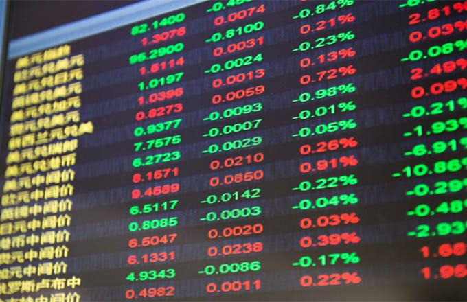

## Table of Contents

## What was the 2015 Chinese Stock Market Turmoil?

The 2015 Chinese Stock Market Turmoil was a big drop in the value of stocks in China. It started in June 2015 and lasted for several months. Many people who had invested money in the stock market lost a lot of money because the prices of stocks went down a lot. This made people worried and scared about their money.

The government tried to help by stopping some people from selling their stocks and by putting more money into the market. But it was hard to stop the prices from falling. The turmoil affected not just China, but also other countries because many people around the world had invested in Chinese stocks. It showed how risky the stock market can be and how quickly things can change.

## When did the 2015 Chinese Stock Market Turmoil begin and end?

The 2015 Chinese Stock Market Turmoil started in June 2015. This is when people noticed that the prices of stocks in China were going down a lot. It made many investors worried because they were losing money.

The turmoil lasted for several months. It started to get better towards the end of 2015, but it took a while for things to calm down completely. By early 2016, the situation had mostly stabilized, though the effects were felt for a longer time.

## What were the immediate causes of the 2015 Chinese Stock Market crash?

The immediate cause of the 2015 Chinese Stock Market crash was a sudden drop in stock prices. Many people had borrowed money to buy stocks, hoping the prices would keep going up. But when the prices started to fall, these people panicked and started selling their stocks quickly to avoid losing even more money. This selling made the prices drop even faster, causing a big crash.

Another reason was that the Chinese government had been trying to boost the economy by encouraging people to invest in stocks. They relaxed some rules and made it easier for people to buy stocks. But when the market started to fall, the government's efforts to stop the crash, like banning some people from selling stocks, didn't work well. This made people lose trust in the market and the government's ability to control it, which made the situation worse.

## How did the Chinese government's policies contribute to the stock market bubble?

The Chinese government helped create the stock market bubble by making it easier for people to buy stocks. They did this because they wanted to make the economy grow faster. They relaxed some rules and encouraged people to invest in the stock market. This made more people, even those who didn't know much about investing, start buying stocks. Many people borrowed money to buy even more stocks, hoping to make a lot of money quickly. This pushed stock prices up a lot, creating a bubble.

When the bubble started to burst, the government tried to stop it by putting in new rules. They tried to stop some people from selling their stocks and put more money into the market to keep prices from falling. But these efforts didn't work well. People lost trust in the government's ability to control the market. This made more people sell their stocks, which made the crash even worse. The government's policies to boost the market at first, and then to stop the crash, both played a big role in the whole situation.

## What role did margin trading play in the 2015 Chinese Stock Market Turmoil?

Margin trading played a big part in the 2015 Chinese Stock Market Turmoil. It's when people borrow money to buy stocks. They hope that the stock prices will go up so they can pay back the loan and make a profit. In China, many people used margin trading to buy more stocks than they could afford with their own money. This made the stock prices go up a lot because so many people were buying.

But when the stock prices started to fall, people who used margin trading got scared. They had to sell their stocks quickly to pay back the money they borrowed. This made the prices fall even faster. It turned into a big problem because everyone was trying to sell at the same time. Margin trading helped make the bubble bigger, and when it burst, it made the crash worse.

## How did the stock market crash affect the average Chinese investor?

The 2015 Chinese Stock Market crash hurt a lot of average Chinese investors. Many people had put their money into the stock market, hoping to make more money. But when the stock prices started to fall, they lost a lot of their savings. Some people had borrowed money to buy stocks, and when the prices went down, they couldn't pay back their loans. This made them lose even more money and left them in a tough spot financially.

The crash also made people feel scared and unsure about investing in the stock market. They lost trust in the market and the government's ability to control it. This made them less likely to invest again in the future. For many families, the money they lost was supposed to be used for important things like buying a home or paying for education. The crash had a big impact on their plans and their future.

## What were the economic impacts of the 2015 Chinese Stock Market Turmoil on China's economy?

The 2015 Chinese Stock Market Turmoil had a big impact on China's economy. When the stock market crashed, many people lost a lot of money. This made people spend less money on things like shopping and eating out because they were scared about their savings. Companies also felt the impact because fewer people were buying their products. This slowdown in spending made the economy grow more slowly than before.

The government had to step in to try to fix things. They spent a lot of money to support the stock market and help people who lost money. This used up a lot of the government's money that could have been used for other things like building roads or helping poor people. The turmoil also made other countries worried about investing in China. This made it harder for China to get money from other countries to help its economy grow. Overall, the stock market crash made China's economy weaker and slower for a while.

## How did the global financial markets react to the 2015 Chinese Stock Market Turmoil?

The 2015 Chinese Stock Market Turmoil made global financial markets very worried. When China's stock market crashed, it made people all over the world think that the whole global economy might be in trouble. Stock markets in other countries, like the United States and Europe, also started to go down. Investors were scared because they had put a lot of money into Chinese stocks, and now they were losing money. This fear made them sell their stocks in other countries too, which made those stock markets go down.

The turmoil also made people think about how connected the world's economies are. When one big economy like China has problems, it can affect everyone. Many countries had been investing in China because it was growing so fast. But when the Chinese stock market crashed, it showed that even big economies can have big problems. This made countries and investors more careful about where they put their money. They started to think more about the risks of investing in other countries, not just the possible rewards.

## What measures did the Chinese government take to stabilize the market during the turmoil?

During the 2015 Chinese Stock Market Turmoil, the Chinese government tried many things to calm down the market. They stopped some people from selling their stocks to keep the prices from falling too fast. They also put more money into the market by buying stocks themselves. The government made it easier for people to borrow money to buy stocks again, hoping this would make the prices go up. They also told the media to say good things about the market to make people feel less scared.

But these efforts did not work as well as the government hoped. People were still worried and kept selling their stocks. The government's actions made some people think that the situation was even worse than they thought. It was hard for the government to stop the crash because so many people were scared and wanted to get their money out of the market. In the end, the government had to spend a lot of money and time to help the market get better, but it took a while for things to calm down.

## What were the long-term effects of the 2015 Chinese Stock Market Turmoil on investor confidence?

The 2015 Chinese Stock Market Turmoil had a big impact on investor confidence in China. Many people lost a lot of money and trust in the stock market. They felt that the government couldn't control the market well. This made them scared to invest again. Even after the market got better, many people were still careful about putting their money back into stocks. They wanted to be sure that their money was safe and that the market wouldn't crash again.

This loss of confidence also affected how people saw the Chinese economy. Investors from other countries became more careful about investing in China. They worried that if the stock market could crash so badly, other parts of the economy might also have problems. It took a long time for trust to come back. Even though the government tried to fix things and make the market more stable, many investors stayed cautious. They looked for safer places to put their money, and it took years for the Chinese stock market to regain its reputation as a good place to invest.

## How did the 2015 Chinese Stock Market Turmoil influence future Chinese financial regulations?

The 2015 Chinese Stock Market Turmoil made the Chinese government think a lot about how to make the market safer. They saw that letting too many people borrow money to buy stocks was risky. So, they made new rules to control how much people can borrow. They also made it harder for people to start trading without knowing much about it. The government wanted to make sure that people understood the risks before they put their money into the stock market.

These changes helped make the market more stable over time. The government also worked on making the rules clearer so that everyone knew what was allowed and what was not. They wanted to build trust again so that people would feel safe investing. Even though it took a while, these new rules helped the Chinese stock market become a better place for investors, making it less likely for big crashes like the one in 2015 to happen again.

## What lessons can be learned from the 2015 Chinese Stock Market Turmoil to prevent future crises?

The 2015 Chinese Stock Market Turmoil showed us that it's important to be careful when borrowing money to buy stocks. When too many people borrow money and the market goes down, it can cause a big crash. Governments and people need to make sure they understand the risks before they start investing. It's also important to have clear rules that everyone understands. This way, people know what they can and can't do, and it helps keep the market stable.

Another lesson is that trust is very important in the stock market. When people lose trust in the market or the government, they might start selling their stocks quickly, which can make the situation worse. Governments should be honest about what's happening and do what they can to help without making things more confusing. By learning from these mistakes, we can work to make the stock market a safer place for everyone.

## References & Further Reading

[1]: Huang, Y., & Luk, P. (2020). ["Measuring financial market contagion in the presence of both normal and extreme shocks."](https://cbade.hkbu.edu.hk/wp-content/uploads/2020/08/measuring_economic_policy_uncertainty_in_china_oct_2019.pdf) Journal of Economic Dynamics and Control, 114, 103884.

[2]: Kose, M. A., & Ohnsorge, F. (2020). ["A Decade after the Global Recession."](https://www.semanticscholar.org/paper/A-Decade-After-the-Global-Recession-Kose-Ohnsorge/59efc99dad1c8c7347f81d4f3d42f08106c57e9d) World Bank.

[3]: Loh, L., & Todd, T. (2018). ["The Dynamics of Financial Crises: A Macro-Finance View."](https://onlinelibrary.wiley.com/doi/abs/10.1111/jofi.12611) Applied Economics Letters, 25(19), 1348-1354.

[4]: "China's Stock Market Crash of 2015: Why it happened and what we can learn from it" (2015). The Economist. [Link](https://en.wikipedia.org/wiki/2015%E2%80%932016_Chinese_stock_market_turbulence)

[5]: King, M. R., & Ma, Y. (2019). ["Algorithmic trading and market liquidity: Evidence from China's stock markets."](https://www.researchgate.net/publication/378548435_Algorithmic_Trading_and_AI_A_Review_of_Strategies_and_Market_Impact) Review of Financial Studies, 32(3), 1034-1074.

[6]: Grullon, G., & Longstaff, F. A. (2020). ["The influence of algorithmic trading in China's stock market crash."](https://papers.ssrn.com/sol3/papers.cfm?abstract_id=2612047) Journal of Financial Markets, 54, 100661.