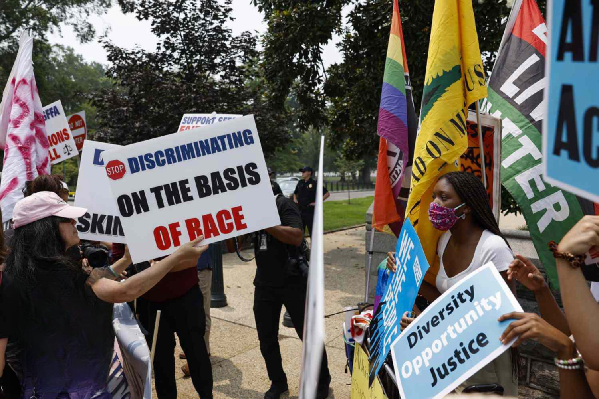

The Supreme Court of the United States plays a pivotal role in shaping national policy and public opinion. Its decisions can redefine the legal landscape, influencing a vast array of subjects from civil rights to economic regulations. The Court’s rulings on major issues often set precedents that guide the interpretation and application of laws across the country for generations. This significance is especially evident in matters such as affirmative action, which has been a contentious and evolving topic in U.S. education and employment policy.

Affirmative action refers to a set of policies and practices designed to address historical injustices and discrimination experienced by minority groups by promoting their inclusion in education and employment. Emerging in the latter half of the 20th century, these measures aimed to level the playing field for minorities and women by providing them increased opportunities. Despite its intentions, affirmative action has sparked extensive debate over its effectiveness and fairness, leading to numerous legal challenges and Supreme Court evaluations that have shaped its current status.

Simultaneously, algorithmic trading has become a dominant force within the financial markets. This trading method uses complex algorithms to automate and optimize the buying and selling of financial securities, enabling markets to function at unprecedented speeds and scales. Its growing influence raises questions about transparency, equity, and the potential biases encoded into algorithmic systems.

The purpose of this article is to explore the potential implications of the 2023 Supreme Court rulings on affirmative action and how they intersect with the mechanisms of algorithmic trading. By examining this intersection, the article seeks to shed light on how these legal and technological developments might affect various sectors and influence future policies and practices within the United States.

## Table of Contents

## A Historical Context of Affirmative Action

Affirmative action in the United States refers to policies that aim to increase the representation of historically marginalized groups, particularly in education and employment. These policies focus on addressing past discrimination and promoting diversity by providing opportunities to those who have been systematically disadvantaged. The primary objective of affirmative action is to create equal opportunities for all individuals, irrespective of race, gender, or socio-economic status, thereby fostering a more inclusive society.

The historical development of affirmative action in the U.S. includes several key milestones and landmark cases. The concept gained prominence during the Civil Rights Movement of the 1960s. President John F. Kennedy first used the term in Executive Order 10925 in 1961, which mandated that government contractors take "affirmative action" to ensure employment practices are free from racial bias. This was further solidified by President Lyndon B. Johnson's Executive Order 11246 in 1965, which enforced non-discriminatory practices within federal contractors.

Several Supreme Court decisions have profoundly shaped affirmative action policies. One of the seminal cases was *Regents of the University of California v. Bakke* (1978). The Court held that race could be considered a [factor](/wiki/factor-investing) in the admissions process of educational institutions, but the use of racial quotas was deemed unconstitutional. This ruling set the precedent that diversity could be a compelling interest for institutions, yet it required that policies be implemented in a manner that was narrowly tailored.

In *Grutter v. Bollinger* (2003), the Supreme Court upheld the affirmative action policy of the University of Michigan Law School, which considered race as one factor in admissions without imposing quotas. The decision reinforced the idea that educational diversity is a legitimate goal that can justify the use of race in admissions processes under certain conditions.

*Fisher v. University of Texas* (2013 and 2016) further explored the constitutionality of affirmative action. In these cases, the Court ruled that race-conscious admissions programs must be subjected to strict scrutiny, ensuring they are narrowly tailored and serve a compelling governmental interest without being more extensive than necessary.

Despite these landmark rulings, affirmative action remains a controversial topic with ongoing debates. Supporters argue that it is essential for redressing historical injustices and achieving a diverse and equitable society. They assert that diversity enriches educational experiences and better prepares students for a multicultural workforce. Critics, however, contend that affirmative action can lead to reverse discrimination, undermining meritocracy by favoring certain groups over others based on race or ethnicity.

This ongoing debate reflects differing perspectives on affirmative action policies' fairness and effectiveness in achieving diversity and equality. As societal norms and values continue to evolve, the conversation about how best to balance these policies with other societal goals remains dynamic and complex.

## Overview of Supreme Court 2023 Rulings

The Supreme Court's 2023 rulings on affirmative action marked a pivotal juncture in the ongoing discourse surrounding diversity policies in education and employment. The Court's decisions centered on the constitutionality and relevance of affirmative action, fundamentally challenging its future implementation.

The 2023 rulings included two major cases that scrutinized the use of race as a criterion in college admissions. The majority opinion, penned by Justice Samuel Alito, emphasized the need for race-neutral alternatives, citing concerns that race-based affirmative action could perpetuate stereotypes and foster division rather than unity. Justice Alito argued that equal protection under the law should preclude racial preferences, asserting that such practices may unfairly disadvantage other groups, contravening the Fourteenth Amendment.

In contrast, the dissenting voices, notably Justice Sonia Sotomayor, argued the necessity of considering race to redress systemic inequities and to foster diverse educational environments that benefit all students. Justice Sotomayor highlighted the critical role of affirmative action in mitigating the lingering effects of past discrimination and in cultivating a multifaceted academic community.

These rulings proposed significant changes for educational institutions, particularly in their admissions processes. Universities may need to explore alternative diversity strategies, such as placing greater emphasis on socioeconomic factors or expanding outreach initiatives to underrepresented communities. These adjustments could reshape the demographic composition of student bodies and potentially impact the broader perceptions of institutional fairness and inclusivity.

Reactions to the 2023 Supreme Court rulings were markedly polarized. Political leaders reflected the divide, with conservatives lauding the decisions as a triumph for meritocracy and individual rights, while liberals criticized them as a setback for social justice and equality. Educational institutions expressed concerns about the challenges of sustaining diversity without race-conscious admissions, a sentiment echoed by various advocacy groups striving for equitable representation.

The public response was equally varied, with some sectors welcoming the rulings as a step towards eliminating racial considerations in policy, while others feared a regression in the progress made towards achieving racial equality. The 2023 decisions have thus prompted a reevaluation of affirmative action's place in modern America, suggesting a shift towards a more individualized approach in creating opportunities for all citizens.

## The Intersection of Algorithmic Trading and Affirmative Action

Algorithmic trading refers to the use of computer algorithms to execute trades in financial markets at speeds and frequencies impossible for human traders. These algorithms are designed to perform tasks such as analyzing market data, identifying trading opportunities, and executing buy or sell orders on behalf of investors. The core mechanism involves using quantitative models to predict price movements by analyzing historical data and current market trends. These models range from simple linear regressions to complex [machine learning](/wiki/machine-learning) algorithms.

The 2023 Supreme Court rulings on affirmative action could potentially influence [algorithmic trading](/wiki/algorithmic-trading) in several ways. Traditionally, algorithmic trading relies heavily on patterns and historical data. Changes in regulatory policy or societal norms, such as those regarding affirmative action, might affect market dynamics and thereby inform the datasets used by these algorithms. For instance, if a ruling induces significant shifts in education or employment patterns, it could indirectly influence economic indicators that trading algorithms consider.

From an impact perspective, companies utilizing algorithmic models may need to adjust these models to reflect any economic ramifications stemming from the Supreme Court's decisions. For instance, if such rulings lead to changes in workforce diversity, this could alter company performance metrics, which algorithms track to predict stock prices. An algorithm that integrates employment diversity data as a variable for predicting company success might weigh this factor differently following changes in affirmative action policies.

Moreover, the principles of affirmative action could influence algorithm development and investment strategies directly. There is a growing debate over the ethical implications of algorithms, particularly concerning bias and fairness. Introducing affirmative action principles into algorithmic trading could mean reevaluating models to ensure they promote equitable outcomes. For example, algorithms could be designed to recognize and adjust for biases in financial data that reflect socio-economic disparities. This might involve incorporating fairness constraints into optimization models or using counterfactual analysis to recognize potential biases.

Mathematically, this could be represented by adding a fairness constraint $F(x)$ to the objective function of the algorithm, where:

$$
\text{Objective:} \quad \text{maximize} \ E[x] \quad \text{subject to} \quad F(x) \leq \epsilon
$$

Here, $E[x]$ is the expected return, $x$ is the decision variable vector, and $\epsilon$ is a permissible level of bias, quantifying acceptable inequities.

Furthermore, investment strategies could lean towards companies that demonstrate commitment to diversity and inclusion, reflecting a shift in market sentiment driven by societal values. This could galvanize investors to favor stocks of companies known for robust diversity policies, based on the underlying assumption that these companies may benefit from a more innovative and dynamic workforce.

Finally, the dialogue between algorithmic trading and affirmative action underscores the broader challenge of integrating ethical considerations into financial models. As financial technologies evolve, the intersection of algorithmic opaqueness and social objectives demands an ongoing reassessment of trading models to align with contemporary ethical standards and legal frameworks. This reevaluation requires collaboration across disciplines, including finance, law, and ethics, to ensure algorithms serve the broader goal of equitable financial systems.

## Potential Implications and Future Outlook

The 2023 Supreme Court rulings on affirmative action signify a pivotal moment with potentially wide-ranging implications for various economic sectors reliant on diversity policies. The ripple effects of these rulings are expected to extend beyond education and finance, influencing industries such as technology and law.

**Economic Sector Impact**

In the economic landscape, diversity policies have been integral to fostering inclusive opportunities and broadening market perspectives. The discontinuation or modification of affirmative action could affect corporate hiring practices, potentially narrowing the demographic diversity within companies. Sectors that have historically relied on diverse talent pools, such as technology, may face challenges in maintaining innovation fueled by varied perspectives. Similarly, in law, the diversity among practitioners and decision-makers is crucial for equitable representation and understanding of diverse client bases. This evolution might necessitate new approaches to inclusive recruitment strategies, potentially influencing workplace dynamics and performance.

**Future Legal Challenges and Evolutions**

The 2023 rulings might provoke future legal challenges as stakeholders seek to redefine or contest the boundaries of permissible diversity initiatives. Legal challenges are likely to focus on the interpretation of equal protection clauses and non-discrimination statutes, testing the flexibility of current legal frameworks. This evolution could lead to innovative affirmative action models or alternative diversity-enhancement programs that align with judicial guidelines while still promoting social equity.

**Broader Societal Changes**

On a societal level, adaptability to these changes is crucial. The reduction of legally mandated affirmative action programs might encourage organizations and institutions to voluntarily commit to diversity goals, driven by market and social dynamics rather than legal requirements. This could incite a cultural shift towards intrinsic diversity values beyond compliance, promoting equity-centered innovation. Simultaneously, societal commitment to diversity may influence consumer behavior, with support for companies and institutions reflecting inclusive practices.

In summary, the 2023 Supreme Court rulings present a complex interplay of challenges and opportunities across various sectors. As industries navigate the transition, emphasis on maintaining diversity through innovative and voluntary measures will be critical in preserving the ethos of inclusivity pivotal to societal progress.

## Conclusion

Throughout this article, we have examined the intricacies of the 2023 Supreme Court rulings on affirmative action and their broader societal implications, particularly in relation to algorithmic trading. The discussion highlighted how such judicial decisions can significantly influence institutional practices in education and employment, while potentially shaping financial market dynamics.

A pivotal takeaway is the assertion of the Supreme Court's role in steering the moral and legal compass of the nation. Affirmative action has long been a contentious issue, reflective of America's ongoing struggle with diversity and equality. The 2023 rulings underscore the complexities and evolving nature of policies designed to foster equitable opportunities. While the decisions may lead to restructuring in sectors reliant on diversity policies, they also trigger vital discourses concerning the balance between achieving social equity and maintaining market efficiency.

The connection to algorithmic trading denotes an interesting intersection of law, technology, and ethics. As these automated systems play a growing role in financial markets, their adaptability to legal and regulatory changes becomes paramount. Whether corporations will recalibrate their trading algorithms to align with equity-focused judicial directives remains an area ripe for inquiry.

Given these layered intersections, it is essential to continue dialogue and empirical research to navigate the implications effectively. The potential for these rulings and their ripple effects extends beyond immediate institutional impacts, prompting reconsideration of policies and practices across various sectors, including technology and law.

In conclusion, maintaining a delicate balance between judicial influence, technological advancement, and social equity is critical. The ongoing societal debate emphasizes the need for greater understanding and proactive adaptation in policies and market strategies. Readers are encouraged to engage with these issues critically, considering their implications on personal and professional levels and contributing to the broader conversation on achieving a just and equitable society.

## References & Further Reading

[1]: García, H. F. (2012). ["Trading with a Conscience: An Examination of How Capital Markets Can and Should Incorporate Ethical Factors."](https://link.springer.com/chapter/10.1007/978-3-031-57956-1_1) Journal of Behavioral and Experimental Finance.

[2]: Glater, J. D. (2012). ["The Griggs Economy: Title VII, Disparate Impact, and the Business Necessity Defense."](https://digitalcommons.wcl.american.edu/cgi/viewcontent.cgi?article=1095&context=facsch_lawrev) Michigan Law Review.

[3]: Kang, J. M. (2009). ["Affirmative Action: A Creating a More Educated Workforce?"](https://www.cambridge.org/core/journals/journal-of-public-policy/article/political-and-legal-antecedents-of-affirmative-action-a-comparative-framework/87D0E99565B1819CC466F575BF89A3DA) Harvard Journal of Law & Public Policy.

[4]: Bernhardt, A., & Osterman, P. (2022). ["Race, Class, and the Change We Need: An Agenda for Action."](https://www.academia.edu/126057180/_Just_a_Job_An_Assessment_of_Precarious_Employment_Trajectories_by_Gender_Among_Young_People_in_the_U_S) Washington Center for Equitable Growth.

[5]: Crenshaw, K. (1991). ["Mapping the Margins: Intersectionality, Identity Politics, and Violence against Women of Color."](https://www.jstor.org/stable/1229039) Stanford Law Review.