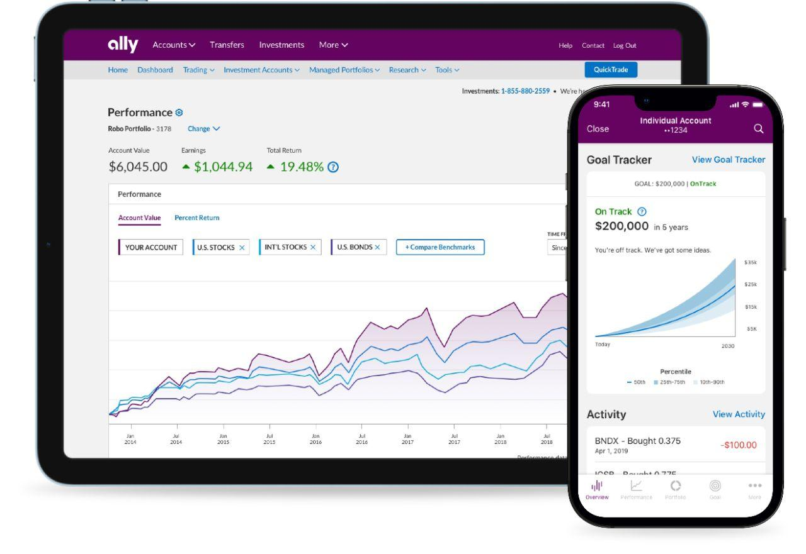

The world of investing has been evolving rapidly, with a discernible shift towards automated investment solutions. Among these innovations, robo-advisors have gained widespread popularity due to their cost-efficiency and user-friendly nature. These digital platforms utilize sophisticated algorithms to manage client investments, offering a streamlined approach that minimizes human intervention while maximizing results based on predefined goals and risk assessments.

Ally Invest Robo Portfolios is a noteworthy player within this context. It combines the benefits of automated investment management with the robust financial services offered by Ally Bank. By integrating both investing and banking under one platform, Ally Invest aims to provide a holistic financial experience that caters to modern investors' diverse needs. 

In this review, we will explore various aspects of Ally Invest Robo Portfolios including key features, advantages, drawbacks, and the types of investors who might benefit most from this service. The combination of automation, competitive pricing, and banking integration makes it a significant option for those looking to simplify and enhance their financial strategy.

## Table of Contents

## What are Robo Portfolios?

Robo portfolios, also referred to as robo-advisors, employ automated, algorithm-driven financial planning services. These platforms are designed to offer cost-effective and efficient investment management, leveraging technology to allocate investments based on a user's specific financial goals, risk tolerance, and investment horizon. Typically, the process commences with clients completing an online survey about their financial situation and future goals. 

Robo-advisors utilize algorithms to process this data, crafting and managing diversified portfolios that align with user preferences. The advantages of these platforms include accessibility, comparatively lower fees than human financial advisors, and ease of use. This democratizes access to portfolio management services, previously considered exclusive to wealthier individuals with access to traditional financial advisors. A key appeal of robo-advisors lies in their ability to offer continual portfolio rebalancing and tax-loss harvesting, although not all platforms may provide these advanced features. With the rise of fintech, robo-advisors have increasingly become a staple in personal finance management, offering investors a streamlined way to achieve their financial objectives.

## Overview of Ally Invest Robo Portfolios

Ally Invest Robo Portfolios provides investors with an array of pre-determined portfolio options tailored to specific financial objectives, such as retirement planning, income generation, and wealth building. This approach allows investors to align their investment strategies with their personal financial goals, enhancing the prospect of achieving desired outcomes over time.

One of the differentiating features of Ally Invest Robo Portfolios is its low account minimum. Investors can begin their journey with as little as $100, making it accessible even to those with limited initial capital. This low entry barrier contrasts with higher minimum requirements that often characterize traditional investment management services.

The fee structure of Ally Invest Robo Portfolios is another aspect that underscores its competitiveness. The platform offers a straightforward pricing model, charging a 0.30% annual advisory fee for portfolios with minimal cash allocation. Notably, for portfolios with a 30% cash component, referred to as cash-enhanced portfolios, there are no advisory fees. This structure presents a cost-effective solution, particularly appealing to individuals looking to minimize investment costs while still benefiting from professional asset management.

In addition to standard investment options, Ally Invest Robo Portfolios includes provisions for socially responsible investing. This feature enables clients to invest in portfolios that are aligned with their ethical values, fostering a sense of personal satisfaction and responsibility through their investment choices.

What truly sets Ally Invest Robo Portfolios apart is its seamless integration with Ally Bank's suite of financial services. This integration facilitates effortless asset management and cash management, allowing clients to efficiently oversee their investment portfolios alongside their broader financial activities. This holistic approach serves to streamline financial management, making it an attractive option for those already using Ally Bank services or seeking a unified financial services provider.

## Key Features

Ally Invest Robo Portfolios are designed to accommodate a broad range of investors, offering several key features that enhance their appeal.

**Account Minimum**: Investors can start building their portfolios with a modest minimum amount of $100. This low threshold makes it accessible to newcomers who are beginning their investment journey, offering an entry point into the world of automated investment management without requiring substantial initial capital.

**Fee Structure**: The platform operates with a clear and competitive fee design. Investors are charged a 0.30% annual advisory fee on portfolios that have a minimal cash allocation. However, for portfolios that maintain a 30% cash balance, often referred to as cash-enhanced portfolios, there are no advisory fees. This structure can be particularly beneficial for those who prefer to have a significant portion of their portfolio in cash, whether for liquidity purposes or risk aversion, effectively allowing them to minimize management costs.

**Portfolio Options**: Ally Invest offers a variety of portfolio strategies tailored to align with different financial objectives and ethical considerations. Investors can select from core options that cover basic investment needs, income portfolios focused on generating dividends or interest, tax-optimized portfolios aimed at reducing tax liabilities, and socially responsible portfolios for those looking to invest in companies with positive environmental, social, and governance (ESG) practices. This diverse array allows investors to align their portfolios with personal goals and values, whether they are seeking growth, income, tax efficiency, or ethical investing.

**Customer Support**: To ensure users have seamless access to assistance, Ally Invest provides 24/7 support via phone and online chat. In addition, portfolio specialists are available during business hours for more specialized inquiries, offering tailored advice and support. This extensive customer service setup ensures that investors can receive help at virtually any time, enhancing user experience and confidence in managing their portfolios. 

These features collectively position Ally Invest Robo Portfolios as a robust option for investors seeking automated solutions with flexible financial and ethical considerations, backed by comprehensive customer service.

## Pros and Cons

Ally Invest Robo Portfolios present a range of advantages and disadvantages for investors considering automated management solutions. 

One of the primary benefits is the low starting investment threshold, allowing users to begin investing with a minimum of $100. This feature makes the platform accessible to a broader audience, particularly those who are new to investing or have limited capital to deploy initially. Furthermore, Ally Invest offers options for no-fee portfolios. These portfolios, known as cash-enhanced portfolios, allocate 30% of the portfolio to cash, allowing investors to avoid advisory fees while also [earning](/wiki/earning-announcement) interest on cash holdings. This can be particularly attractive for those seeking a cost-effective investment solution while still retaining some degree of [liquidity](/wiki/liquidity-risk-premium) in their portfolios.

On the other hand, the platform does have some drawbacks. A notable limitation is the lack of tax-loss harvesting in its basic offerings. Tax-loss harvesting is a strategy that can help reduce taxable income by offsetting gains with losses, and its absence may deter more tax-savvy investors. Additionally, Ally Invest Robo Portfolios are limited in the variety of asset classes available, excluding options such as cryptocurrencies, [forex](/wiki/forex-system), and individual stocks. This restriction may not meet the needs of more sophisticated investors looking for a diverse range of investment options. Another potential downside is the high cash allocation in the no-fee accounts, which might not align with the investment goals of individuals seeking more aggressive growth or diversified asset exposure. 

Overall, the benefits of Ally Invest Robo Portfolios, such as low-cost entry and no-fee options, are balanced by limitations in investment features such as tax optimization and asset variety.

## Use Cases and Suitability

Ally Invest Robo Portfolios is strategically designed to cater to a diverse range of investors, though it primarily excels in serving beginners and those looking for a passive investment strategy. The platform's intuitive nature and low account minimum appeal to novice investors who may be unfamiliar with the complexities of financial markets yet wish to benefit from automated investment management. The user-friendly interface and integrated financial services offered by Ally Bank provide an accessible entry point into the world of investing without the steep learning curve associated with traditional asset management.

For existing Ally Bank customers, the Robo Portfolios present an attractive option to consolidate their financial services under a single umbrella. This integration facilitates seamless communication between banking and investment accounts, allowing for efficient cash management and streamlined financial oversight. By maintaining all accounts within one platform, users can easily track their progress toward financial goals and make data-driven decisions aligned with their broader financial strategies.

However, while Ally Invest Robo Portfolios is well-suited for those seeking simplicity and integration, it may not fully meet the needs of more active traders or investors desiring highly customized portfolios. The platform's primary focus on preset portfolio configurations, rather than individual asset selection, limits its flexibility in catering to investors with specific asset preferences or complex trading strategies. Additionally, those interested in exploring a broader spectrum of assets, such as cryptocurrencies, individual stocks, or forex, might find the available options somewhat constrained.

In summary, Ally Invest Robo Portfolios is an optimal choice for investors who prioritize ease of use and comprehensive financial integration. However, individuals seeking a highly tailored investment experience with a wide array of assets may need to explore alternative platforms that offer greater customization and asset diversity.

## Conclusion

Ally Invest Robo Portfolios provides a solid option for investors who prefer automated management, strengthened by the credibility of Ally Bank, a well-known financial institution. This investment solution caters to a variety of investor types due to its attractive features, including low fees and straightforward user experience. Although the platform has some constraints regarding asset diversity and advanced functionalities, these are balanced by its seamless integration with Ally Bank’s suite of financial services.

The integration with Ally Bank enhances the user experience by offering cohesive financial management, enabling users to manage their investments alongside other banking activities. This feature is particularly beneficial for those who are already Ally Bank customers or those seeking consolidated financial management under one umbrella. The competitive pricing model, characterized by low management fees and options for fee-free portfolios, further bolsters its appeal, particularly for cost-conscious investors.

In summary, Ally Invest Robo Portfolios stands out as an appealing choice for individuals who prioritize ease of use and wish to leverage the integrated services of a larger financial institution. While it may not cater to investors seeking a broad array of asset classes or advanced trading features, its strengths in automation, accessibility, and cost-efficiency make it a commendable option for many.

## Frequently Asked Questions

### What is the minimum investment required for Ally Invest Robo Portfolios?

Ally Invest Robo Portfolios requires a minimum investment of $100 to open an account. This low entry point makes it accessible to a broad range of investors, including beginners who may not have significant initial capital to invest.

### Does Ally Invest offer tax-loss harvesting?

Currently, Ally Invest Robo Portfolios does not offer tax-loss harvesting as part of its standard features. Tax-loss harvesting, a strategy used to offset capital gains tax by selling securities at a loss, is available with some other robo-advisors but is not included in the basic offerings from Ally Invest.

### How does Ally Invest Robo Portfolios compare to other robo-advisors in terms of fees and services?

Ally Invest Robo Portfolios charges a 0.30% annual advisory fee for its standard portfolios but offers cash-enhanced portfolios with a 30% cash allocation that come with no advisory fee. This fee structure is competitive when compared to industry averages, which typically range between 0.25% to 0.50%. However, it's important to consider the lack of tax-loss harvesting and limited asset classes when comparing to services that provide these additional features.

### Is there a mobile app available for managing accounts on-the-go?

Yes, Ally Bank provides a mobile app that allows users to manage their Ally Invest Robo Portfolios on-the-go. This app is available for both iOS and Android devices, offering features such as account monitoring, fund transfers, and customer support access, ensuring convenience for users looking to manage their investments from anywhere.

### What additional financial services does Ally Bank offer its investment clients?

In addition to robo-advisory services, Ally Bank offers a range of financial products including savings accounts, checking accounts, home and auto loans, and credit cards. This integration facilitates seamless financial management across various services, benefiting clients who prefer consolidating their banking and investment needs within a single institution. Ally's comprehensive suite of services positions it as a full-service online bank.

## References & Further Reading

[1]: ["Advances in Financial Machine Learning"](https://www.amazon.com/Advances-Financial-Machine-Learning-Marcos/dp/1119482089) by Marcos Lopez de Prado

[2]: ["Algorithms for Hyper-Parameter Optimization"](https://dl.acm.org/doi/10.5555/2986459.2986743) by J. Bergstra, R. Bardenet, Y. Bengio, & B. Kégl. Advances in Neural Information Processing Systems 24.

[3]: ["Evidence-Based Technical Analysis: Applying the Scientific Method and Statistical Inference to Trading Signals"](https://www.amazon.com/Evidence-Based-Technical-Analysis-Scientific-Statistical/dp/0470008741) by David Aronson

[4]: ["Machine Learning for Algorithmic Trading"](https://github.com/PacktPublishing/Machine-Learning-for-Algorithmic-Trading-Second-Edition) by Stefan Jansen

[5]: ["Quantitative Trading: How to Build Your Own Algorithmic Trading Business"](https://books.google.com/books/about/Quantitative_Trading.html?id=j70yEAAAQBAJ) by Ernest P. Chan