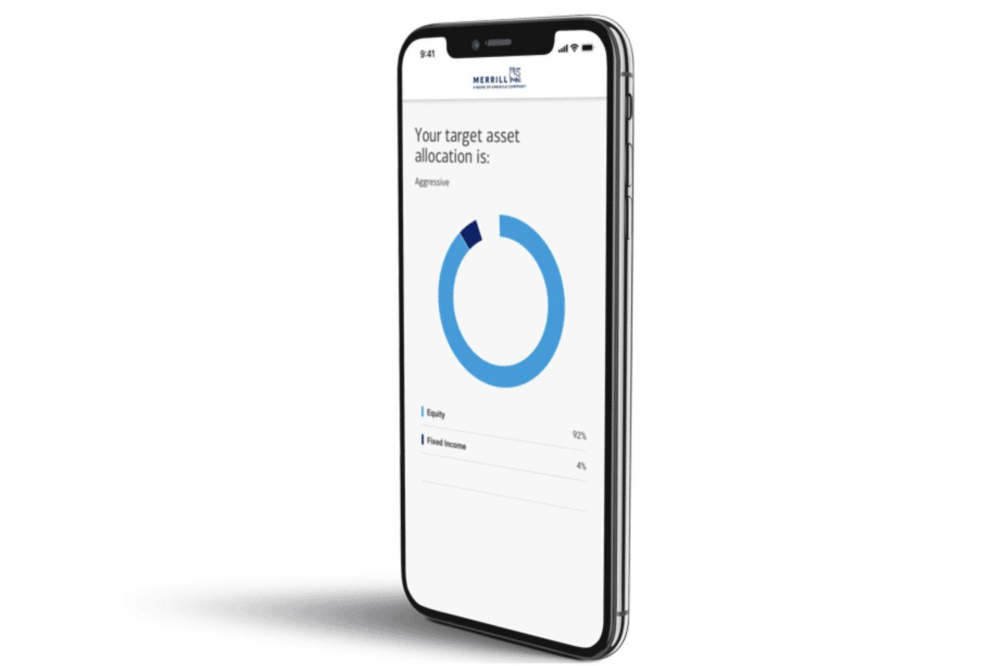

In the fast-evolving world of finance, algorithmic trading and robo-advisors have become integral components of personal investment strategies. These technologies leverage advanced algorithms and data analytics to optimize investment decisions, offering potential for enhanced portfolio management and diversified financial planning. In 2024, Merrill Guided Investing continues to stand out as a reliable option for investors seeking automation in their investment activities. Supported by its affiliation with Merrill Lynch, a subsidiary of Bank of America, the platform provides a robust automated portfolio management service.

This review aims to provide an in-depth analysis of Merrill Guided Investing and its features as they relate to algorithmic trading. The platform’s innovative approach combines the expertise of seasoned financial strategists with cutting-edge technological tools, offering an automated service that caters to various investor needs. Users of Merrill Guided Investing benefit from personalized guidance, which is algorithmically driven, ensuring that each portfolio is tailored to individual financial goals and risk tolerances.

We will explore the benefits that make Merrill Guided Investing a compelling choice for both novice and experienced investors. Additionally, it is crucial to consider the platform's limitations and compare its offerings to other market options, such as Betterment and Wealthfront. Understanding these aspects is essential for investors planning their investment strategies for 2024, as it allows them to make informed decisions tailored to their financial goals. Whether you're a seasoned investor or just beginning, a comprehensive understanding of what Merrill Guided Investing offers is crucial as automation continues to reshape the investment landscape.

## Table of Contents

## Overview of Merrill Guided Investing

Merrill Guided Investing is a robo-advisor introduced by Merrill Lynch, part of the global financial services company Bank of America. This platform is primarily aimed at investors interested in automated portfolio management services. It seamlessly integrates the strategic insights of Merrill's expert financial analysts with advanced investment technologies to deliver an efficient and personalized investment management experience.

The core functionality of Merrill Guided Investing revolves around algorithm-driven processes that enable users to manage their portfolios with minimal manual intervention. This is achieved through sophisticated algorithms designed to optimize investment decisions based on a set of customized parameters aligned with the user's financial goals and risk appetite. The algorithms continuously assess market conditions and adjust portfolio allocations to optimize returns, reflecting the evolving financial landscape.

Users of Merrill Guided Investing can benefit from tailored investment strategies that consider their individual financial situation, goals, and risk tolerance. This personalized approach is a significant value proposition of the platform, as it combines the precision and speed of algorithmic trading with personalized financial advice.

Merrill Guided Investing offers a variety of account options to cater to diverse investor needs. These include taxable accounts and individual retirement accounts (IRAs), among others, allowing users to select the type of account that best fits their investment objectives.

In terms of pricing, Merrill Guided Investing implements a competitive fee structure. The platform typically charges an annual program fee, which is a percentage of the total assets under management (AUM). This fee covers all aspects of portfolio management provided by the platform, including transactions and rebalancing. The transparent fee model is designed to align the costs with the investment services offered, ensuring no hidden charges.

Overall, the integration of modern investment technologies with Merrill's strategic expertise positions Merrill Guided Investing as a potent option for investors seeking the benefits of automated financial management.

## Features and Benefits of Merrill Guided Investing

Merrill Guided Investing stands out in the crowded market of robo-advisors by delivering personalized investment plans through its advanced algorithmic infrastructure. The core strength of this platform lies in its capacity to tailor investment strategies to individual client needs, blending automated efficiency with personalized advice.

One of the appealing aspects of Merrill Guided Investing is its low minimum investment requirement. This feature democratizes access to professional portfolio management, allowing a broader spectrum of investors—from novices to seasoned veterans—an opportunity to efficiently manage their portfolios through genuine capital automation. By lowering the barrier of entry, the platform actively encourages participation from individuals who might have previously found professional investment management inaccessible.

The platform equips users with comprehensive tools for real-time performance monitoring and investment adjustments. These tools are invaluable for ensuring that portfolios remain aligned with the investor's goals and market conditions. Through continuous tracking of performance metrics and the ability to make timely adjustments, investors can optimize their investment strategies to react to dynamic market changes effectively. 

In addition to algorithm-driven actions, Merrill Guided Investing provides clients access to Merrill's well-regarded market insights and economic outlooks. These insights are generated by a team of experienced financial analysts who scrutinize market trends and economic indicators, offering a value-added layer of human intelligence to the automated processes. By synthesizing algorithmic precision with expert-led market analysis, clients are positioned to make informed decisions anchored both in quantitative rigor and qualitative expertise.

Both new and experienced investors stand to gain from these features. For newcomers, the platform's structured approach and educational resources can foster an improved understanding of investment frameworks, creating a foundation for financial literacy and empowerment. For veterans, the sophisticated tools and insights available can enhance sophisticated trading strategies and facilitate greater portfolio diversification and risk management.

In summary, Merrill Guided Investing delivers a balance of accessibility, personalized automation, and expert insight, presenting a compelling proposition for those looking to navigate the complexities of personal investment with the aid of modern technology.

## Algorithmic Trading and Robo-Advisory Services

Algorithmic trading, commonly known as algo trading, employs sophisticated mathematical models and high-speed computing to make trading decisions rapidly and effectively. In the financial markets, this approach allows for executing a large number of trades in fractions of a second, optimizing timing and pricing to maximize returns. The algorithms are designed to analyze vast amounts of data and recognize patterns, which enable traders to capitalize on market inefficiencies and fluctuations.

Robo-advisors like Merrill Guided Investing integrate [algorithmic trading](/wiki/algorithmic-trading) into their frameworks to automate both asset management and trading processes. The platform combines these algorithms with insights from financial strategists to offer personalized investment advice, aligning portfolios with an investor's risk tolerance and financial goals. By outsourcing the intensive process of portfolio management to algorithms, investors can benefit from reduced human error and the psychological biases often associated with manual trading.

The integration of algorithmic trading in robo-advisory services like Merrill Guided Investing offers several advantages. It enhances the speed and precision of trade executions and adapts swiftly to market changes. The algorithms can optimize investment strategies by employing tactics such as mean-variance optimization, where the expected returns of a portfolio are maximized for a given level of risk. This ensures that clients’ portfolios are not only aligned with their investment objectives but are also dynamically adjusted to capture emerging opportunities and mitigate risks.

The current trends in algorithmic trading underscore the increasing reliance on [machine learning](/wiki/machine-learning) and [artificial intelligence](/wiki/ai-artificial-intelligence). These technologies further refine trading models by continuously learning from data patterns and improving decision-making processes over time. Merrill Guided Investing leverages these advancements by integrating machine learning algorithms capable of predictive analytics, thus maintaining a competitive edge in the technology-driven financial landscape.

Understanding the growth trajectory of the robo-advisory market is essential to recognizing the potential of platforms like Merrill Guided Investing. The market is expanding rapidly due to its accessibility and cost-effectiveness, providing a viable option for both novice and experienced investors. The convenience of having a diversified, intelligently managed portfolio without the necessity of in-depth market knowledge is appealing to many. As these platforms continue to evolve, they are likely to gain an even greater share of the investment market, promising innovative solutions for modern financial challenges.

Ultimately, the fusion of algorithmic trading and robo-advisory services not only streamlines the investment process but also empowers individuals with tools and strategies previously accessible only to large financial institutions. This democratization of investment management could redefine the landscape, making sophisticated portfolio management a standard offering across the industry.

## Comparison with Competing Platforms

Merrill Guided Investing, a prominent player in the robo-advisory sector, stands alongside competitors like Betterment and Wealthfront. Each platform presents a unique set of features, fee structures, and performance metrics vying for attention in this rapidly evolving market.

One of the primary factors that sets Merrill Guided Investing apart is its integration with Bank of America's robust financial ecosystem. This partnership provides clients with the ability to seamlessly manage investments alongside personal banking accounts, offering a level of convenience that some competitors may lack. Moreover, users benefit from the extensive market insights derived from Merrill Lynch's team of financial experts, combining human expertise with algorithmic precision.

In contrast, Betterment and Wealthfront are known for their straightforward fee structures and ease of use, particularly appealing to those new to investing. Betterment, for instance, charges an annual management fee that starts at 0.25% for its Digital plan, providing a cost-effective option for investors seeking low-cost entry into automated portfolio management. Wealthfront offers a similar fee of 0.25%, which is competitive in the industry and includes tax-loss harvesting, a distinct advantage that can optimize the tax efficiency of an investor’s portfolio.

Despite its strengths, Merrill Guided Investing may have some gaps in attracting newcomers when considering its fee structure. While competitive, fees can be on the higher end compared to its rivals once an account balance exceeds certain thresholds. The minimum investment requirement is also traditionally higher than that of Betterment and Wealthfront, potentially serving as a barrier for beginners with limited initial capital.

Performance-wise, all three platforms employ sophisticated algorithms to adjust portfolios based on market conditions and personal risk tolerance. However, Wealthfront has distinguished itself with unique offerings like the Path financial planning tool, which combines various aspects of financial life beyond investments, appealing to tech-savvy users interested in a comprehensive financial planning experience.

A cost-benefit analysis reveals that Merrill Guided Investing excels in leveraging its association with Bank of America to deliver an integrated financial solution, catering to clients who value such synergies. Conversely, Betterment and Wealthfront cater effectively to cost-sensitive investors through lower fees and innovative features that enhance overall investment strategy.

Ultimately, selecting the best platform depends on individual preferences and financial goals. Investors who value integration with broader financial services might favor Merrill Guided Investing. In contrast, those prioritizing lower costs with similar advisory services might lean towards Betterment or Wealthfront. Analyzing these factors will empower investors to choose a platform aligned with their unique investment journeys.

## Potential Downsides and Considerations

Merrill Guided Investing, like any other platform, has its own set of potential downsides and considerations that investors should be aware of. One of the most prominent concerns is the lack of human interaction, which can be a significant drawback for investors who value personalized advice and guidance. While the platform leverages sophisticated algorithms to manage and optimize portfolios, some users may miss the nuanced insights that a human advisor could provide, especially when dealing with complex financial situations or unexpected market events.

Another important aspect to consider is the fee structure of Merrill Guided Investing. Despite being competitive compared to traditional financial advisory services, the fees might not align with every investor's expectations or financial strategy. The platform charges an annual management fee based on a percentage of the assets under management. While this fee structure is typical for robo-advisors, investors with larger portfolios might find the costs accumulating over time, potentially impacting overall returns. It's crucial for investors to compare these fees with those of competing platforms and weigh them against the benefits offered.

Customer reviews provide valuable insights into common issues experienced by users. Some reviews highlight technical glitches within the platform or difficulties in navigating the user interface. Others mention delays in executing trades or discrepancies between expected and actual returns. While such issues might not represent the experiences of the majority, they are worthy of consideration when making an investment decision. Potential users should ensure that they have a clear understanding of the platform's operational mechanics and have access to technical support when needed.

Ultimately, understanding these limitations is key to making a well-informed choice. Investors should evaluate their personal needs and preferences, particularly concerning human interaction and fee structures, before committing to the platform. By comprehensively reviewing customer feedback and comparing with alternatives, investors can better ascertain whether Merrill Guided Investing is the right fit for their investment strategy.

## Conclusion

Merrill Guided Investing provides a robust option for investors looking for automated asset management solutions in 2024. The platform effectively combines algorithm-driven advice with user-friendly accessibility, making it attractive to a wide range of investors, from beginners to experienced ones. Its ability to personalize investment strategies using advanced algorithms allows investors to potentially maximize their returns while reducing risks.

However, as with any investment platform, it is essential for investors to thoroughly research and understand all aspects of Merrill Guided Investing before making a commitment. This ensures that the platform aligns with their individual financial goals and risk tolerance levels. With the continuous advancement in algorithmic trading technologies, Merrill stands to maintain a strong position in the competitive market.

Investors are encouraged to explore available trial options and read various reviews to better understand the features and performance of Merrill Guided Investing. By doing so, they can ascertain whether it fits within their broader investment strategy and offers the necessary tools and support to achieve their financial objectives.

## References & Further Reading

[1]: Bergstra, J., Bardenet, R., Bengio, Y., & Kégl, B. (2011). ["Algorithms for Hyper-Parameter Optimization."](https://papers.nips.cc/paper/4443-algorithms-for-hyper-parameter-optimization) Advances in Neural Information Processing Systems 24.

[2]: ["Advances in Financial Machine Learning"](https://www.amazon.com/Advances-Financial-Machine-Learning-Marcos/dp/1119482089) by Marcos Lopez de Prado

[3]: ["Evidence-Based Technical Analysis: Applying the Scientific Method and Statistical Inference to Trading Signals"](https://www.amazon.com/Evidence-Based-Technical-Analysis-Scientific-Statistical/dp/0470008741) by David Aronson

[4]: ["Machine Learning for Algorithmic Trading"](https://github.com/PacktPublishing/Machine-Learning-for-Algorithmic-Trading-Second-Edition) by Stefan Jansen

[5]: ["Quantitative Trading: How to Build Your Own Algorithmic Trading Business"](https://books.google.com/books/about/Quantitative_Trading.html?id=j70yEAAAQBAJ) by Ernest P. Chan