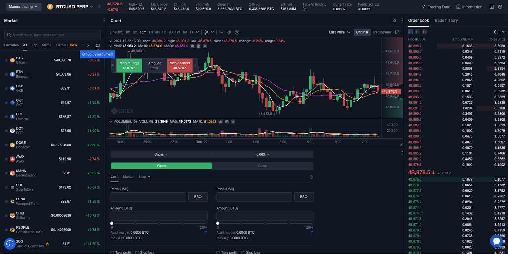

In 2024, the cryptocurrency trading landscape is characterized by rapid technological advancements and an expanding global user base. As the market matures, traders are increasingly seeking sophisticated tools to optimize their strategies and enhance profitability. The global cryptocurrency market has seen a substantial rise in trading volumes, with algorithmic trading emerging as a significant trend. This methodology utilizes automated processes based on mathematical models to execute trades, thereby minimizing human intervention and reducing potential errors. Algorithmic trading is gaining traction due to its ability to handle large volumes of data efficiently and execute trades at speeds impossible for manual trading.

OKX has established itself as a prominent player in the crypto exchange sector, providing a comprehensive platform that caters to both retail and institutional traders. Launched in 2017, OKX has rapidly evolved to accommodate the growing demands of cryptocurrency enthusiasts and professionals alike. It offers a diverse range of trading options, extensive security measures, and a user-friendly interface. By continuously updating its offerings, OKX strives to maintain its competitive edge in an increasingly crowded market.

This review specifically focuses on OKX's algorithmic trading features, highlighting how the platform meets the needs of modern traders who utilize automated strategies. Given the increasing complexity and dynamism of cryptocurrency markets, algorithmic trading tools offered by exchanges like OKX are instrumental in providing users with the resources required to navigate these environments successfully. This review aims to provide a comprehensive understanding of how OKX supports algorithmic trading, evaluates its efficacy, and identifies the potential benefits and limitations for users engaged in such practices.

## Table of Contents

## What is OKX?

OKX is a prominent global cryptocurrency exchange known for its comprehensive services and user-friendly platform. Since its founding in 2017 by its parent company OKCoin, OKX has rapidly ascended to become one of the leading exchanges globally, offering a broad range of digital assets for trading, including Bitcoin (BTC), Ethereum (ETH), and other altcoins. The platform's commitment to providing advanced trading tools and technologies has played a significant role in its growth and success in the competitive cryptocurrency market.

The evolution of OKX reflects a trajectory of innovation and adaptation to the rapidly changing cryptocurrency landscape. Initially launched to cater to growing demands for cryptocurrency trading solutions, OKX has expanded its offerings over the years to include futures and margin trading, decentralized finance (DeFi) services, and various algorithmic trading tools. This continuous enhancement of its platform has positioned OKX as a versatile exchange catering to both retail and institutional traders.

OKX's global reach is underscored by its extensive user base, which spans numerous countries across Asia, Europe, and beyond. The exchange supports multiple languages and offers a wide range of fiat-to-crypto and crypto-to-crypto trading pairs, making it accessible to traders worldwide. The accessibility of OKX, combined with its strong emphasis on security and robust trading infrastructure, has helped it establish a trustworthy reputation among users in the cryptocurrency community.

In summary, OKX's rapid growth and dedication to providing a secure and efficient trading environment have cemented its place as a key player in the [cryptocurrency](/wiki/cryptocurrency) exchange market. Its ability to adapt and innovate continues to attract a diverse and growing user base, further solidifying its position as a leader in the global crypto ecosystem.

## Features of OKX

OKX is recognized for its robust set of features designed to cater to both novice and experienced cryptocurrency traders. Central to its offering is a user-friendly interface that simplifies navigation and operation within the platform. This design intuitiveness ensures that beginners can easily understand and engage with trading activities, while advanced traders benefit from quick access to more sophisticated tools and functionalities.

The platform supports a wide variety of cryptocurrencies and trading pairs, providing users with ample opportunities to diversify their portfolios and capitalize on market movements. As of 2024, OKX hosts hundreds of digital assets, including prominent cryptocurrencies such as Bitcoin (BTC), Ethereum (ETH), and a myriad of altcoins. This extensive selection allows traders to engage in a wide range of transactions, from common currency exchanges to speculative trading strategies, thus addressing diverse trading preferences and risk appetites.

OKX stands out with its advanced trading tools, notably futures and margin trading capabilities. Futures trading on OKX allows market participants to speculate on the future price of cryptocurrencies by entering contracts that obligate the transaction at a predetermined price and date. This feature is particularly appealing for traders seeking to hedge investments or capitalize on price [volatility](/wiki/volatility-trading-strategies). Margin trading, another sophisticated tool offered by OKX, enables users to borrow funds to increase their market position size, potentially amplifying profits. However, it is important to note that while margin trading can enhance gains, it also increases risk exposure.

Overall, OKX’s feature set is designed to support a comprehensive trading strategy for a wide range of investors, ensuring both accessibility for newcomers and depth for seasoned traders.

## Understanding Algorithmic Trading on OKX

Algorithmic trading, often referred to as "algo trading," involves using computer programs to execute trading strategies based on predefined criteria. This form of trading can analyze vast datasets and execute trades at speeds far beyond human capability. In cryptocurrency markets, where volatility is high and prices can fluctuate rapidly, [algorithmic trading](/wiki/algorithmic-trading) has gained prominence for its ability to efficiently capitalize on price movements and reduce the risks associated with emotional trading decisions.

OKX provides a range of algorithmic trading tools tailored to both novice and experienced traders looking to automate their strategies. These tools allow traders to write custom scripts and employ strategies such as [arbitrage](/wiki/arbitrage), [market making](/wiki/market-making), and [trend following](/wiki/trend-following) without the need to manually monitor the market continuously. OKX supports the integration of trading algorithms through its API, which allows users to create automated trading systems that can execute trades based on specific market conditions and parameters predefined by the user.

One of the significant advantages of using algorithmic trading on the OKX platform is its ability to execute trades at high speeds and volumes, an essential [factor](/wiki/factor-investing) in the fast-paced crypto markets. The algorithms can operate 24/7, taking advantage of markets worldwide, crucial in a market that never sleeps. Furthermore, algorithmic trading can help minimize the impact of the trader's psychological biases, providing a more disciplined approach to trading by adhering strictly to the predefined rules of the algorithms.

However, there are also cons associated with using algorithmic trading on OKX. One primary concern is the requirement for technical knowledge and expertise in developing algorithms and understanding market dynamics thoroughly. Traders using these tools must ensure that their algorithms are robust and have been tested under various market conditions to avoid significant losses. Moreover, algorithms can sometimes make poor decisions based on erroneous data or unexpected market conditions, leading to rapid financial losses if not monitored and managed properly.

In summary, while algorithmic trading on OKX presents a powerful tool for enhancing trading efficiency and effectiveness, it demands a clear understanding of both the technical and market-specific elements involved. For traders who possess the requisite knowledge and skills, algorithmic trading can offer significant advantages, including speed, precision, and the ability to operate continuously without human intervention.

## Security and Safety on OKX

OKX, a leading cryptocurrency exchange, prioritizes security to protect its users and their assets against potential threats. Security on OKX hinges on several industry-standard measures, designed to ensure the safety of its platform and bolster user confidence.

**Two-Factor Authentication (2FA):** OKX employs two-factor authentication, a vital security layer that requires users to verify their identity with two separate authentication factors before accessing their accounts. This not only enhances security but also minimizes the risks associated with compromised passwords.

**Cold Storage:** A considerable portion of OKX's digital assets are stored in "cold wallets." Cold storage refers to keeping cryptocurrencies in offline wallets, disconnected from the internet. This approach significantly reduces the likelihood of hacking and cyber threats, as offline wallets are inaccessible to remote attackers.

**Multi-Signature Wallets:** OKX uses multi-signature technology to further secure its cryptocurrency holdings. Multi-signature wallets require multiple private keys to authorize a transaction. This provides additional security by ensuring that no single party can unilaterally execute unauthorized transactions, thus mitigating risks from individual key compromises.

OKX's dedication to security has fostered a reputation of trust in the crypto community. The exchange's transparent operations and commitment to regular security audits reinforce this trust. Security audits involve third-party specialists evaluating the exchange's security infrastructure, identifying potential vulnerabilities, and recommending improvements. By conducting these audits, OKX demonstrates its proactive approach to maintaining and enhancing its security measures, further cementing its reliability within the crypto landscape.

By implementing these robust security measures, OKX consistently strives to protect user assets, maintaining a secure and trustworthy environment for cryptocurrency trading.

## Fee Structure and Costs

OKX's fee structure is a critical consideration for traders looking to understand the cost implications of their transactions. Generally, OKX employs a tiered fee system based on 30-[day trading](/wiki/day-trading-spy) [volume](/wiki/volume-trading-strategy) and OKB (OKX's native token) holdings, applicable to both spot and futures trading. This tiered approach allows for a reduction in fees as users trade more or hold more OKB.

### Spot Trading Fees

For spot trading, fees range from 0.08% for both market makers (those who provide [liquidity](/wiki/liquidity-risk-premium) by placing limit orders) and takers (those who take liquidity by placing market orders) for beginners, to 0.02% for makers and 0.05% for takers at higher trading volumes or OKB holdings. The use of OKB can further reduce these fees by up to 40%, making trading more cost-effective for regular users.

### Futures Trading Fees

Futures trading on OKX follows a similar structure with a slight variation. Here, the fees for beginners start at 0.02% for makers and 0.05% for takers. As traders move up the tier ladder, fees can decrease to 0.01% for makers and 0.03% for takers. This structure incentivizes higher trading volumes, granting more favorable rates to active traders.

### Competitive Analysis

When comparing OKX's fees with other major cryptocurrency exchanges like Binance and Coinbase, OKX remains highly competitive. Binance offers spot trading fees starting at 0.10% for both makers and takers, which can be reduced using their native token, BNB. Coinbase, on the other hand, typically has higher fees that start at around 0.50% for takers, emphasizing OKX's cost efficiency especially for high-volume traders. This competitive edge is attractive to traders focused on minimizing costs.

### VIP Program

OKX's VIP program offers further fee reductions and privileges for high-volume traders. The program is structured into multiple VIP levels, determined by trading volume and OKB holdings over 30 days. Benefits of the VIP program include lower fees, higher withdrawal limits, and priority customer support. For instance, a VIP trader may enjoy maker fees as low as 0.015% and taker fees at 0.030% in futures, further enhancing profitability for those trading large volumes.

Overall, OKX's fee structure is strategically designed to cater to a wide range of traders, offering both competitive rates and additional reductions through its VIP program. This structure, coupled with cost-saving measures via the OKB token, provides substantial benefits, especially to those engaging in frequent trading.

## OKX's Stance in the Crypto Market

OKX stands as a significant entity within the cryptocurrency exchange landscape of 2024, often compared to giants such as Coinbase and Binance. Its market position can be attributed to several factors, including its broad array of trading options and robust liquidity. Unlike Coinbase, which primarily focuses on the American market and has a reputation for ease of use, OKX boasts a diverse global user base, supporting an extensive range of cryptocurrencies and trading pairs. This global outreach ensures that OKX remains competitive, particularly among international traders seeking varied investment opportunities.

Liquidity is a crucial determinant of an exchange's reliability and efficiency. OKX excels in providing high liquidity for its trading pairs, facilitating quick and effective transactions. This advantage is comparable to Binance, which is renowned for its vast liquidity pools and comprehensive trading services. OKX's strengths are further evidenced by its support for sophisticated trading instruments such as futures and margin trading, catering to both retail and institutional traders.

Despite its notable strengths, OKX is not without areas for improvement. Customer reviews and expert opinions often highlight the need for enhanced customer service and more responsive platforms. Some users report challenges with the exchange's interface and the occasional delays in transaction processing. Comparatively, Coinbase is lauded for its user-friendly interface, while Binance is praised for its extensive support system, pointing to areas where OKX can evolve.

Furthermore, regulatory compliance remains a pivotal aspect for OKX to address, especially in jurisdictions with stringent financial regulations. Ensuring adherence to these regulations could enhance its reputation and trustworthiness, aligning it closely with competitors like Coinbase, which prioritizes regulatory compliance as a cornerstone of its operation.

In summary, OKX's position in the crypto market is characterized by its global reach, extensive trading options, and substantial liquidity. However, focusing on user experience improvements and rigorous regulatory compliance could further solidify its stance as a leading cryptocurrency exchange.

## Pros and Cons of Using OKX

OKX is a well-regarded cryptocurrency exchange, offering a comprehensive set of features catering to various trader experience levels. Among the primary advantages of using OKX is its extensive selection of cryptocurrencies and trading pairs, which provides traders with numerous opportunities to diversify their portfolios. The platform's sophisticated trading tools, including futures and margin trading, are particularly appealing to experienced traders who seek advanced strategies to maximize returns.

In terms of security, OKX implements robust measures such as two-factor authentication and multi-signature wallets, enhancing user confidence in safeguarding their assets. Additionally, the exchange holds a solid reputation, having undergone multiple security audits to ensure transparency and build trust within the crypto community.

However, despite its strengths, OKX faces certain challenges. One major drawback is service availability, as some users report restricted access in specific regions due to regulatory limitations. This can pose a hindrance to traders wishing to engage with OKX from those areas. Moreover, while the platform's array of features is beneficial, they may be overwhelming for beginners who might require a simpler interface to start trading effectively.

Overall, OKX provides a robust trading experience with its competitive fee structure, extensive market options, and reliable security measures. It is especially suitable for seasoned traders who can leverage its advanced tools and benefit from its comprehensive offerings. However, beginner traders might need to navigate a steep learning curve, and the limitations in regional availability could impact user accessibility. As OKX continues to expand and adapt to the evolving cryptocurrency landscape, addressing these concerns could enhance its appeal and market standing in the future.

## Conclusion

In this review, we've examined OKX, a prominent player in the cryptocurrency exchange landscape, highlighting its diverse offerings and competitive positioning. OKX's user-friendly interface caters to both novice and seasoned traders, providing them with an extensive array of cryptocurrencies and trading pairs. The platform's advanced trading options, such as futures and margin trading, are particularly noteworthy, offering traders enhanced strategies and the potential for higher returns.

Algorithmic trading, meanwhile, emerges as a distinctive feature, allowing users to leverage automated strategies for potentially more efficient trading. While these tools offer significant advantages, such as speed and precision, they also require users to understand their complexities fully to mitigate associated risks.

Security is a fundamental aspect of any crypto exchange, and OKX implements robust measures, including two-factor authentication and cold storage, to protect user funds. Their commitment to transparency and regular security audits has helped establish a level of trust within the crypto community.

The fee structure at OKX is competitive, with various incentives for high-volume traders through VIP programs, making it an attractive option for both small and large-scale traders. However, customers have identified areas for improvement, particularly regarding service availability in certain regions.

In conclusion, OKX presents itself as a versatile and secure platform suitable for a broad spectrum of traders. While it excels in providing advanced trading features and maintaining high security standards, variability in service availability and the complexity of algorithmic trading tools may impact user experience. Nonetheless, OKX is well-positioned within the cryptocurrency ecosystem and, with continued improvements, is likely to maintain and possibly enhance its market standing in the future. Its adaptability to emerging trends and technological advancements will be key factors in sustaining its relevance in this rapidly evolving industry.

## FAQs

### FAQs

**Is OKX suitable for beginner traders?**

Yes, OKX offers features that cater to both beginner and seasoned traders. The platform is equipped with a user-friendly interface designed to simplify the trading process, making it accessible for those new to cryptocurrency trading. OKX provides educational resources such as guides and tutorials to help beginners understand trading fundamentals. Additionally, users can trade with confidence using demo accounts, which allow practice without risking real funds.

**How does OKX ensure the security of user funds?**

OKX employs several industry-standard security measures to safeguard user funds. These include:

1. **Two-Factor Authentication (2FA):** This adds an extra layer of security by requiring not only a password and username but also something only the user has, like a physical token or mobile phone.

2. **Cold Storage:** A significant portion of funds is stored offline in cold wallets, which are not connected to the internet, thereby reducing the risk of hacking.

3. **Multi-Signature Wallets:** These wallets require multiple keys to authorize a transaction, enhancing the security and making unauthorized access extremely difficult.

OKX also conducts regular security audits to ensure that their system is robust against potential threats. This commitment to security has earned the platform a reliable reputation in the cryptocurrency community.

**What sets OKX apart from other crypto exchanges?**

Several factors distinguish OKX from other cryptocurrency exchanges:

1. **Algorithmic Trading Tools:** OKX provides advanced algorithmic trading tools, allowing traders to implement complex strategies automatically. This feature is particularly attractive to professional traders seeking efficiency and precision.

2. **Variety of Trading Options:** OKX offers a wide range of trading options, including spot, futures, and margin trading, across numerous cryptocurrencies. This diversity provides traders with expanded opportunities for portfolio diversification.

3. **Competitive Fee Structure:** The platform has a competitive fee structure that becomes increasingly favorable for higher volumes traded, along with VIP programs offering reduced fees for active traders.

These features, combined with an emphasis on user security and a user-friendly interface, contribute to OKX's strong position within the cryptocurrency exchange market.

## References & Further Reading

[1]: Bergstra, J., Bardenet, R., Bengio, Y., & Kégl, B. (2011). ["Algorithms for Hyper-Parameter Optimization."](https://dl.acm.org/doi/10.5555/2986459.2986743) Advances in Neural Information Processing Systems 24.

[2]: ["Advances in Financial Machine Learning"](https://www.amazon.com/Advances-Financial-Machine-Learning-Marcos/dp/1119482089) by Marcos Lopez de Prado

[3]: ["Evidence-Based Technical Analysis: Applying the Scientific Method and Statistical Inference to Trading Signals"](https://www.amazon.com/Evidence-Based-Technical-Analysis-Scientific-Statistical/dp/0470008741) by David Aronson

[4]: ["Machine Learning for Algorithmic Trading"](https://github.com/stefan-jansen/machine-learning-for-trading) by Stefan Jansen

[5]: ["Quantitative Trading: How to Build Your Own Algorithmic Trading Business"](https://books.google.com/books/about/Quantitative_Trading.html?id=j70yEAAAQBAJ) by Ernest P. Chan