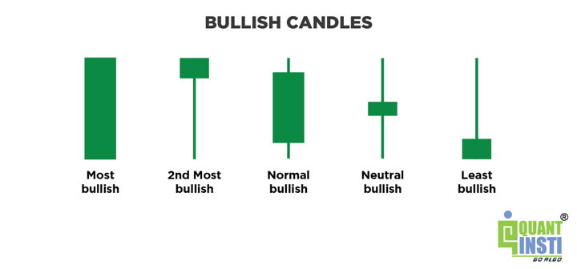
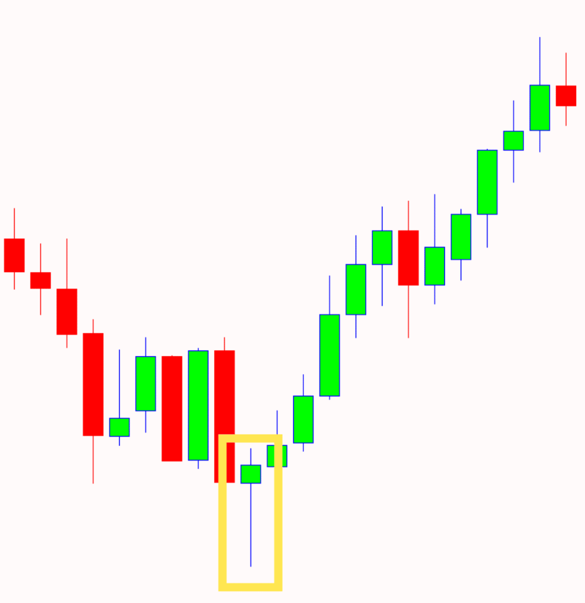
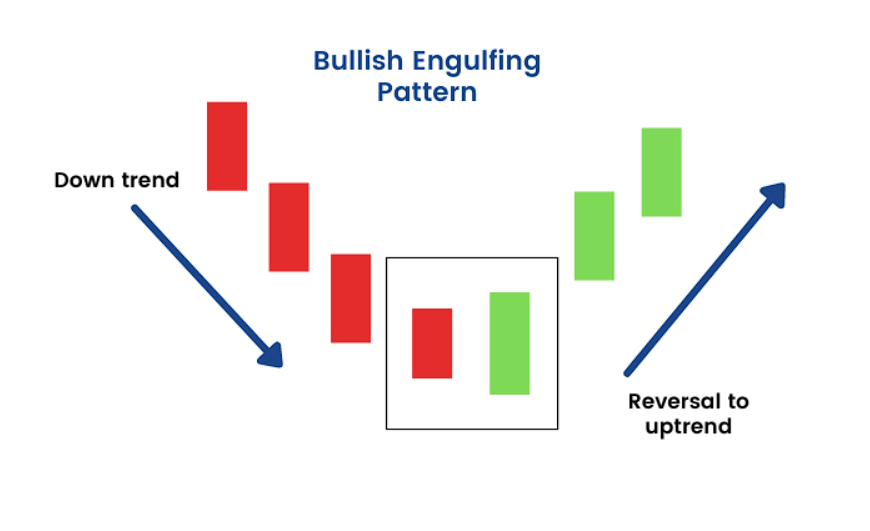
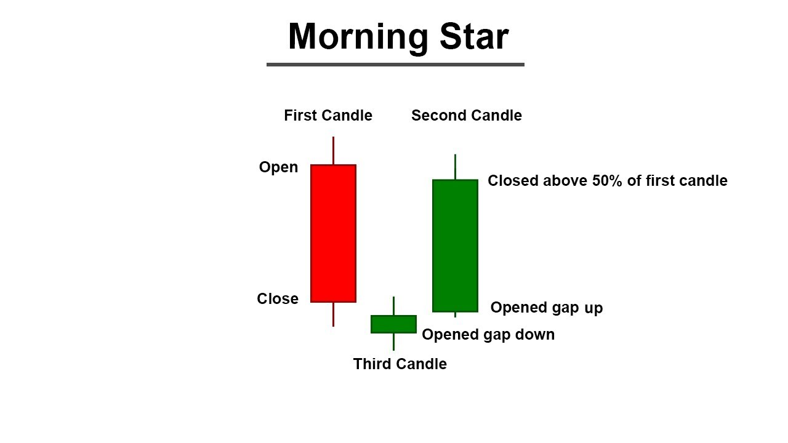

## Table of Contents

## What is a bullish candlestick pattern?

A bullish candlestick pattern is a type of chart pattern used in trading that shows a potential increase in the price of a stock or other asset. It looks like a candle on a chart and has a body and sometimes lines called wicks or shadows. When traders see this pattern, they think the price might go up soon. This is because the pattern shows that buyers are becoming stronger than sellers.

There are many types of bullish candlestick patterns, but some common ones are the Hammer, the Bullish Engulfing, and the Morning Star. The Hammer has a small body at the top and a long lower wick, which shows that the price dropped a lot during the day but then went back up. The Bullish Engulfing pattern happens when a small bearish candle is followed by a larger bullish candle that "engulfs" it. The Morning Star is a three-candle pattern where the first is bearish, the second is small, and the third is bullish, suggesting a reversal from a downtrend to an uptrend.

## Why are bullish candlestick patterns important for traders?

Bullish candlestick patterns are important for traders because they help predict when the price of a stock or other asset might go up. When traders see these patterns, they think that more people want to buy than sell, which can push the price higher. This information helps traders decide when to buy a stock, hoping to sell it later at a higher price and make a profit.

These patterns also help traders see when a trend might change from going down to going up. This is called a reversal. By spotting these patterns early, traders can get into the market at the right time before the price goes up a lot. Knowing when to buy and sell based on these patterns can make a big difference in how much money traders can make or lose.

## What is the Hammer pattern and how does it form?

The Hammer pattern is a bullish candlestick pattern that looks like a hammer. It has a small body at the top and a long lower wick. The body can be either green or red, but it is the shape that matters. The long lower wick shows that the price dropped a lot during the day but then went back up near where it started. This tells traders that even though the price went down, buyers stepped in and pushed it back up.

The Hammer pattern forms when the price of a stock or asset falls a lot during the trading day but then recovers strongly before the day ends. This often happens at the end of a downtrend. When traders see this pattern, they think that the sellers are losing control and buyers are getting stronger. This could mean that the price might start going up soon. So, traders watch for the Hammer to decide if it's a good time to buy.

## How can the Hammer pattern signal a bullish reversal?

The Hammer pattern can signal a bullish reversal because it shows that the price dropped a lot during the day but then went back up. This tells traders that even though sellers pushed the price down, buyers came in and pushed it back up near where it started. When this happens at the end of a downtrend, it means the sellers might be losing control and buyers are getting stronger.

Seeing the Hammer pattern at the bottom of a downtrend can make traders think the price might start going up soon. They see it as a sign that the trend could be changing from going down to going up. So, traders might decide to buy the stock, hoping to sell it later at a higher price and make a profit.

## What is the Bullish Engulfing pattern and how is it identified?

The Bullish Engulfing pattern is a type of candlestick pattern that traders look for to predict that a stock's price might go up. It happens when you see two candles next to each other. The first candle is small and bearish, meaning its closing price is lower than its opening price. The second candle is bigger and bullish, with its opening price lower than the first candle's closing price and its closing price higher than the first candle's opening price. This second candle "engulfs" the first one, showing that buyers took over after the sellers.

Traders identify the Bullish Engulfing pattern by looking for these two specific candles. The first candle should be a small bearish one, showing that the price went down a bit. The second candle should be a bigger bullish one that completely covers the body of the first candle. This pattern often shows up at the end of a downtrend, suggesting that the trend might change and the price could start going up. When traders see this, they might decide it's a good time to buy the stock, hoping to sell it later at a higher price.

## Can you explain the significance of the Bullish Engulfing pattern in trend analysis?

The Bullish Engulfing pattern is important in trend analysis because it can show when a stock's price might start going up after going down for a while. This pattern happens when a small red candle, where the price closes lower than it opened, is followed by a bigger green candle that covers the whole body of the red one. This means that even though the price went down a bit first, buyers came in strong and pushed the price up higher than where it started the day before. When traders see this at the end of a downtrend, they think it could mean the trend is changing and the price might go up soon.

This pattern helps traders decide when to buy a stock. If they see a Bullish Engulfing pattern after the price has been going down, they might think it's a good time to buy because the pattern suggests that buyers are taking over from sellers. This can be a signal to get into the market before the price goes up more. By spotting this pattern, traders can try to make money by buying low and selling high.

## What is the Morning Star pattern and what does it indicate?

The Morning Star pattern is a type of candlestick pattern that traders look for to predict that a stock's price might go up. It's made up of three candles. The first candle is big and red, meaning the price went down a lot that day. The second candle is small and can be red or green, showing that the price didn't change much from where it opened to where it closed. The third candle is big and green, meaning the price went up a lot. When these three candles happen in a row, especially at the end of a downtrend, it looks like a star in the morning sky, which is why it's called the Morning Star.

This pattern tells traders that the price might start going up soon. The big red candle shows that sellers were in control, but the small second candle shows that the sellers are losing power. Then, the big green candle shows that buyers took over and pushed the price up. When traders see this pattern at the bottom of a downtrend, they think it's a sign that the trend might be changing from going down to going up. So, they might decide to buy the stock, hoping to sell it later at a higher price and make a profit.

## How does the Morning Star pattern help in predicting market movements?

The Morning Star pattern helps traders guess when a stock's price might start going up after it's been going down. It's made of three candles. The first one is big and red, showing that the price dropped a lot. The second one is small and can be either red or green, which means the price didn't change much. The third one is big and green, showing that the price went up a lot. When these three candles happen in a row at the end of a downtrend, it's like seeing a star in the morning sky, which is why it's called the Morning Star.

This pattern tells traders that the price might start going up soon. The big red candle shows that sellers were in control, but the small second candle shows that the sellers are losing power. Then, the big green candle shows that buyers took over and pushed the price up. When traders see this pattern at the bottom of a downtrend, they think it's a sign that the trend might be changing from going down to going up. So, they might decide to buy the stock, hoping to sell it later at a higher price and make a profit.

## What are the key differences between these three bullish patterns?

The Hammer, Bullish Engulfing, and Morning Star patterns are all bullish candlestick patterns, but they look different and tell traders slightly different things. The Hammer pattern has one candle with a small body at the top and a long lower wick. It shows that the price dropped a lot during the day but then went back up near where it started. Traders see this as a sign that buyers are getting stronger, especially if it happens at the end of a downtrend. The Bullish Engulfing pattern has two candles: a small red one followed by a bigger green one that covers the whole body of the red candle. This shows that after a small drop, buyers came in strong and pushed the price up higher than where it started the day before.

The Morning Star pattern is made up of three candles and is a bit more complex. The first candle is big and red, showing a big drop in price. The second candle is small and can be either red or green, meaning the price didn't change much. The third candle is big and green, showing a big increase in price. This pattern tells traders that after a period where sellers were in control, buyers started to take over, suggesting that the price might start going up soon. Each pattern helps traders predict when a stock's price might reverse from going down to going up, but they do it in different ways based on their unique shapes and the number of candles involved.

## How can these patterns be integrated into a comprehensive trading strategy?

Traders can use the Hammer, Bullish Engulfing, and Morning Star patterns as part of a bigger plan to decide when to buy and sell stocks. These patterns help traders see when the price might start going up after going down. For example, if a trader sees a Hammer pattern at the end of a downtrend, they might think it's a good time to buy because it shows that buyers are getting stronger. The same goes for the Bullish Engulfing pattern; if a trader sees a small red candle followed by a bigger green one, they might buy the stock because it suggests buyers are taking over. The Morning Star pattern, with its three candles, also helps traders see when a trend might change from down to up, giving them a chance to buy before the price goes up more.

But these patterns work best when used with other tools and information. Traders should look at things like the overall trend, other chart patterns, and even news about the company or the market. They can also use other signs like moving averages or [volume](/wiki/volume-trading-strategy) to make sure the pattern is a good signal. By combining these patterns with other parts of their trading plan, traders can make better guesses about when to buy and sell. This helps them try to make more money and avoid losing too much.

## What are the common pitfalls to avoid when using these bullish patterns?

When using bullish candlestick patterns like the Hammer, Bullish Engulfing, and Morning Star, traders need to be careful not to make some common mistakes. One big mistake is relying only on these patterns without looking at other things. Candlestick patterns are just one part of the puzzle. Traders should also check the overall trend, other chart patterns, and news about the company or the market. If they only focus on the patterns, they might miss important signs that the pattern is not a good signal this time.

Another common pitfall is not waiting for confirmation. Sometimes, a bullish pattern might look like it's signaling a price increase, but the price might not go up right away. Traders should wait for more signs that the pattern is working, like seeing the price go up in the next few days or seeing more people buying the stock. Jumping into a trade too quickly without waiting for this confirmation can lead to losses. It's important to be patient and make sure the pattern is really showing what traders think it is showing.

## How can advanced traders refine the use of these patterns with additional technical indicators?

Advanced traders can make their use of bullish candlestick patterns like the Hammer, Bullish Engulfing, and Morning Star better by adding other technical indicators to their plan. One way to do this is by using moving averages. These are lines on a chart that show the average price of a stock over a certain time. If a bullish pattern happens near a moving average, it can be a stronger sign that the price might go up. Another useful indicator is the Relative Strength Index (RSI), which tells traders if a stock is overbought or oversold. If a bullish pattern shows up when the RSI is low, it can mean the stock is ready to go up, making the pattern more reliable.

Volume is also important. When a bullish pattern happens with high trading volume, it means more people are buying the stock, which makes the pattern more likely to work. Traders can also use trend lines to see the bigger picture. If a bullish pattern happens at a key support level or after a long downtrend, it can be a stronger sign of a reversal. By combining these patterns with other indicators, advanced traders can make better guesses about when to buy and sell, helping them make more money and avoid big losses.

## References & Further Reading

[1]: [41 Candlestick Patterns Explained With Examples - Living From Trading](https://www.livingfromtrading.com/blog/candlestick-patterns/)

[2]: [Three White Soldiers Candlestick Pattern in Trading Explained - Investopedia](https://www.investopedia.com/terms/t/three_white_soldiers.asp)

[3]: [Morning Star Candlestick Pattern - Investopedia](https://www.investopedia.com/terms/m/morningstar.asp)

[4]: [Three Outside Up and Down Candlestick Patterns: How to Identify and Trade Them - FXOpen](https://fxopen.com/blog/en/three-outside-up-and-down-candlestick-patterns-how-to-identify-and-trade-them/)

[5]: [Three White Soldiers Candlestick Pattern - PatternsWizard](https://patternswizard.com/three-white-soldiers-candlestick-pattern/)

[6]: [3 White Soldiers Trading Strategy Guide - StocksToTrade](https://stockstotrade.com/3-white-soldiers-trading-strategy-guide/)