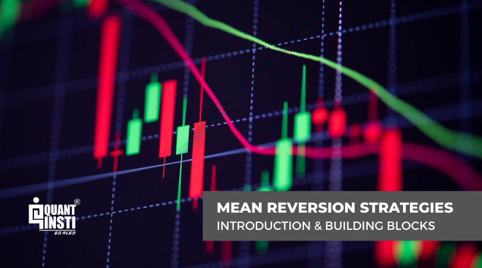

Mean reversion is a foundational concept in trading that suggests asset prices and returns tend to revert to their historical averages over time. This principle was first introduced in the 19th century and has become a key strategy in financial markets. The concept of mean reversion is built on the assumption that prices and returns fluctuate around a consistent mean or average over time. Historical data often demonstrates that extreme deviations from this mean are followed by a return to more average levels. 

Mean reversion strategies are crucial for traders looking for systematic approaches to capitalize on market inefficiencies. These strategies involve identifying assets that are perceived as overvalued or undervalued compared to their historical averages and anticipating a reversal or reversion to the mean. The practical application of this concept requires traders to pinpoint significant deviations, which can indicate potential trading opportunities. 



This article focuses on the best indicators for implementing mean reversion strategies in algorithmic trading. Technical indicators such as Bollinger Bands, Moving Averages, Relative Strength Index (RSI), Moving Average Convergence Divergence (MACD), and Standard Deviation are commonly used in these strategies. By understanding how these indicators function, traders can optimize their strategies and improve decision-making.

Enhancing a trader's algorithmic trading strategy involves not just knowing when to enter or exit trades, but also understanding the market conditions under which mean reversion is most effective. While this strategy offers clear benefits in non-trending markets, traders must be aware of its limitations and ensure robust risk management practices are in place. Understanding mean reversion and its related indicators is essential for navigating the complexities of financial markets successfully.

## Table of Contents

## The Basics of Mean Reversion Trading

Mean reversion trading is a strategy based on the expectation that asset prices will revert to an average level over time. This concept suggests that prices which deviate significantly from their historical average will eventually return to that average, providing trading opportunities. Traders employing mean reversion strategies typically buy assets considered undervalued, anticipating their price will rise to the mean, and sell overvalued assets with the expectation that their price will decline.

A critical component of this strategy is accurately identifying when an asset's price has significantly deviated from its historical average. Various technical indicators can help detect these deviations, including moving averages, Bollinger Bands, and the Relative Strength Index (RSI). For instance, if the price of a stock trades substantially below the average indicated by a moving average, a trader might anticipate an upward correction.

Mean reversion strategies are versatile and can be applied across different asset classes such as stocks, [forex](/wiki/forex-system), and commodities. This versatility makes mean reversion a valuable technique in diverse markets, aligning with the dynamic nature of price movements in these markets. The following Python code snippet demonstrates a simple application of a mean reversion strategy using moving averages:

```python
import pandas as pd
import numpy as np

# Example data: Date, Open, High, Low, Close, Volume
data = pd.read_csv('historical_data.csv', parse_dates=['Date'], index_col='Date')
data['20_MA'] = data['Close'].rolling(window=20).mean()
data['50_MA'] = data['Close'].rolling(window=50).mean()

# Simple trading signal
data['Signal'] = 0
data.loc[data['20_MA'] > data['50_MA'], 'Signal'] = 1  # Buy
data.loc[data['20_MA'] < data['50_MA'], 'Signal'] = -1  # Sell

# Display the first few rows
print(data.head())
```

In this example, we calculate two moving averages: a 20-day moving average (20_MA) and a 50-day moving average (50_MA). A buy signal is generated when the 20-day moving average crosses above the 50-day moving average, indicating a potential upward price reversion. Conversely, a sell signal is generated when the 20-day moving average crosses below the 50-day moving average, suggesting a potential downward price reversion.

In summary, mean reversion trading capitalizes on price movements that deviate from historical averages, using technical indicators to identify such opportunities across various financial instruments. Effective application of these strategies can enhance returns by systematically exploiting market inefficiencies.

## Importance of Mean Reversion in Algorithmic Trading

Mean reversion in [algorithmic trading](/wiki/algorithmic-trading) is a vital concept that leverages statistical tendencies of asset prices to revert to their historical means. This approach provides a systematic framework for exploiting market inefficiencies. By focusing on the hypothesis that extreme price deviations are temporary and likely to return to average levels, traders can identify promising trading opportunities. 

In practice, mean reversion strategies involve statistical analysis to determine the expected mean of an asset's price and to identify significant deviations. The underlying assumption is that prices will oscillate around the mean over time. When prices deviate significantly from the calculated mean, these strategies suggest potential entry or [exit](/wiki/exit-strategy) points for trades. For example, if the price of an asset moves significantly above its historical mean, a mean reversion strategy would suggest that the price is likely overbought and will eventually decline back to average levels. The converse is true for prices that dip below the mean.

Risk management is another key benefit of mean reversion strategies. By establishing thresholds based on historical price data, traders can identify extreme price movements that may present undue risk. This risk identification can lead to more informed decision-making. For instance, incorporating stop-loss or take-profit orders around the mean can safeguard against unexpected market shifts, thus enhancing the trader's ability to manage potential losses effectively.

The consistent nature of mean reversion strategies is one of their strengths, as they can be applied across various market conditions. They are flexible and adaptable to different assets, be it stocks, forex, or commodities, providing traders with a reliable approach applicable in different contexts. These strategies enhance the overall trading framework by offering systematic rules for entering and exiting trades based on statistical measures.

Incorporating mean reversion strategies into algorithmic trading can involve the use of quantitative models to process financial data, often coded in programming languages such as Python. The algorithm continuously monitors market data to detect when an asset's price deviates sufficiently from the mean, triggering buy or sell signals based on predefined criteria.

Overall, mean reversion in algorithmic trading allows for systematically exploiting statistical properties of price movements, managing risk effectively, and applying consistent strategies across different types of markets.

## Top Indicators for Mean Reversion Strategies

Bollinger Bands are widely used in mean reversion strategies to assess market [volatility](/wiki/volatility-trading-strategies) and determine potential overbought or oversold conditions. They consist of three lines: a simple moving average (SMA) in the middle, and two standard deviation bands plotted above and below the SMA. The formula for the upper and lower bands can be expressed as:

$$
\text{Upper Band} = \text{SMA} + (k \times \text{Standard Deviation})
$$

$$
\text{Lower Band} = \text{SMA} - (k \times \text{Standard Deviation})
$$

where $k$ is typically set to 2. Traders often look for price movements that touch or breach these bands as potential reversal signals.

Relative Strength Index (RSI) is another crucial indicator, serving as a [momentum](/wiki/momentum) oscillator that ranges from 0 to 100. RSI is used to identify overbought or oversold conditions, with values typically above 70 indicating an overbought state and values below 30 suggesting an oversold condition. The RSI calculation is given by the formula:

$$
\text{RSI} = 100 - \left( \frac{100}{1 + \frac{\text{Average Gain}}{\text{Average Loss}}} \right)
$$

This indicator aids traders in anticipating potential price corrections.

Moving Averages are fundamental tools in mean reversion as they smooth out price data to highlight the asset's overall direction. Simple Moving Averages (SMA) or Exponential Moving Averages (EMA) are typically used. An SMA is the average of prices over a specified period, while an EMA gives more weight to recent prices, making it more responsive. Deviations from these moving averages can suggest reversion opportunities.

Moving Average Convergence Divergence (MACD) is composed of two moving averages: the MACD line, which is the difference between the 12-period EMA and the 26-period EMA, and the signal line, which is the 9-period EMA of the MACD line. Crossovers between the MACD line and the signal line can provide buy or sell signals:

$$
\text{MACD Line} = \text{EMA}_{12} - \text{EMA}_{26}
$$

$$
\text{Signal Line} = \text{EMA}_9(\text{MACD Line})
$$

MACD histograms visualize this difference, helping traders identify momentum and reversal points.

Standard Deviation itself is a measure of the [dispersion](/wiki/dispersion-trading) or variability of prices around the mean. In mean reversion, high standard deviation levels can indicate high volatility and potential price reversions, while low levels might suggest stability. The calculation for standard deviation is:

$$
\sigma = \sqrt{\frac{1}{N}\sum_{i=1}^{N}(x_i - \mu)^2}
$$

where $N$ is the number of observations, $x_i$ is each individual observation, and $\mu$ is the mean of these observations.

These indicators, when applied correctly, can significantly aid in identifying potential trading opportunities based on mean reversion strategies, guiding traders to make informed decisions in algorithmic trading environments.

## Using Mean Reversion in Trading

Mean reversion strategies capitalize on the assumption that asset prices will revert to their historical averages after deviating significantly. A practical application involves utilizing the Exponential Moving Average (EMA) and the Relative Strength Index (RSI) on hourly charts to identify buying and selling opportunities.

### Using the 50 EMA

The 50-period Exponential Moving Average (EMA) serves as a dynamic support and resistance level. By placing more weight on recent prices, the EMA reacts more quickly to price changes than a Simple Moving Average (SMA). Traders often use the 50 EMA to spot potential reversals. When the asset price crosses below the 50 EMA, it may signal a potential uptrend reversal, suggesting a buying opportunity as the price is expected to revert to the mean. Conversely, a price crossing above the 50 EMA could indicate a potential downtrend reversal, signaling a selling opportunity.

### Integrating RSI

The Relative Strength Index (RSI) complements the 50 EMA by offering insight into whether an asset is overbought or oversold. Calculated using the formula:
$$
RSI = 100 - \left( \frac{100}{1 + RS} \right)
$$
where $RS$ is the average of x days' up closes divided by the average of x days' down closes, the RSI oscillates between 0 and 100. An RSI above 70 suggests an overbought condition, while below 30 indicates oversold conditions.

### Practical Example

Consider an asset analyzed on an hourly chart with these indicators. 

1. **Buying Point**: When the asset's price dips below the 50 EMA and the RSI falls below 30, it suggests an oversold condition. A trader could buy the asset anticipating a price move back towards the EMA.

2. **Selling Point**: If the price exceeds the 50 EMA and the RSI surpasses 70, the asset might be overbought. The trader might choose to sell under the assumption that the price will revert back to the EMA.

### Python Example

Here's a Python snippet utilizing the `pandas` library for calculating the 50 EMA and RSI:

```python
import pandas as pd

def compute_ema_rsi(data, period=50):
    data['EMA'] = data['Price'].ewm(span=period, adjust=False).mean()
    delta = data['Price'].diff(1)
    gain = delta.where(delta > 0, 0)
    loss = -delta.where(delta < 0, 0)

    avg_gain = gain.rolling(window=period).mean()
    avg_loss = loss.rolling(window=period).mean()
    rs = avg_gain / avg_loss
    data['RSI'] = 100 - (100 / (1 + rs))

    return data

# Sample DataFrame with price data
data = pd.DataFrame({'Price': [120, 122, 119, 121, 124]})
result = compute_ema_rsi(data)
print(result)
```

### Risk Management

Executing a mean reversion strategy successfully requires robust risk management. Traders should establish stop-loss orders slightly below or above the EMA to protect against prolonged deviation. Additionally, setting profit targets near the EMA can secure gains once the reversion occurs.

By combining the EMA and RSI, traders can effectively pinpoint actionable entry and exit points, improving their ability to capitalize on market inefficiencies introduced by price deviations from historical averages.

## Benefits and Limitations of Mean Reversion Strategies

Mean reversion strategies in trading have garnered considerable attention due to their potential to deliver high win rates. This is primarily because these strategies capitalize on the natural tendency of asset prices to revert to their mean or average levels after extreme deviations. By doing so, traders can often achieve a higher probability of successful trades when market conditions are favorable for mean reversion.

Another notable benefit is the clear entry and exit criteria these strategies offer. By identifying significant deviations from an asset's historical average, traders can establish precise points for entering or exiting trades. This clarity not only enhances decision-making but also minimizes the ambiguity that can often accompany other trading strategies.

Furthermore, the suitability of mean reversion strategies for automation makes them particularly appealing in algorithmic trading environments. These strategies can be programmed into trading systems, allowing for rapid execution of trades based on predefined criteria. Automation reduces emotional decision-making and facilitates consistency in strategy application.

Mean reversion strategies also demonstrate effectiveness in range-bound markets, where asset prices oscillate within a certain range for an extended period. In such conditions, mean reversion strategies can consistently exploit the cyclical price movements, generating return opportunities that may not be as apparent in trending markets.

Despite these advantages, mean reversion strategies are not without limitations. One primary challenge is their potential underperformance in trending markets—where prices continue to move in one direction without reverting to the mean. In such scenarios, mean reversion strategies might lead to losses as they attempt to bet against the prevailing trend.

Moreover, these strategies often require constant monitoring to ensure their relevancy in changing market conditions. Market dynamics can shift rapidly, and strategies reliant on historical averages may become obsolete if not regularly updated. This necessitates continuous evaluation and adjustment, which can be resource-intensive.

Lastly, the psychological challenges inherent in executing mean reversion strategies should not be underestimated. Traders might find it difficult to hold positions against prevailing market sentiment, particularly during periods of extended trends or heightened volatility. This can result in premature exits from positions or reluctance to adhere strictly to strategy rules, potentially impacting overall profitability.

In conclusion, mean reversion strategies offer distinct advantages but also come with inherent challenges that must be carefully managed. Traders should weigh these benefits and limitations when evaluating the suitability of mean reversion strategies for their trading objectives.

## Conclusion

Mean reversion is a potent tool in a trader's arsenal, adept at identifying profitable opportunities in non-trending markets. By focusing on statistical anomalies, mean reversion strategies capitalize on the tendency of asset prices to return to historical averages. This approach is particularly effective in range-bound markets where price fluctuations are predictable and less influenced by large-scale economic trends.

While mean reversion strategies offer significant advantages, traders must remain cognizant of their limitations. One key challenge is the potential for underperformance during trending markets, where prices may persistently deviate from historical averages without reverting. This scenario necessitates robust risk management practices, as relying heavily on mean reversion in such conditions could lead to substantial losses.

Incorporating mean reversion indicators into algorithmic trading systems can enhance performance and improve decision-making processes. By automating the detection of statistical deviations and the execution of trades, algorithms can efficiently manage the repetitive tasks of monitoring multiple assets and swiftly responding to market changes. This enables traders to focus more on strategic decisions, such as adjusting parameters in response to evolving market conditions.

To harness the power of mean reversion, traders should leverage technical tools wisely. Using indicators such as Bollinger Bands, Relative Strength Index (RSI), and Moving Averages provides a framework for identifying mean reversion opportunities. By fine-tuning these indicators and integrating them into a cohesive trading strategy, traders can improve their ability to exploit short-term market inefficiencies and achieve consistent success in the financial markets. 

Through diligent application and ongoing adaptation, mean reversion strategies can form a core component of an effective trading plan, balancing opportunities with risk considerations and aligning with broader market dynamics.

## References & Further Reading

[1]: Bergstra, J., Bardenet, R., Bengio, Y., & Kégl, B. (2011). ["Algorithms for Hyper-Parameter Optimization."](https://papers.nips.cc/paper/4443-algorithms-for-hyper-parameter-optimization) Advances in Neural Information Processing Systems 24.

[2]: ["Advances in Financial Machine Learning"](https://www.amazon.com/Advances-Financial-Machine-Learning-Marcos/dp/1119482089) by Marcos Lopez de Prado

[3]: ["Evidence-Based Technical Analysis: Applying the Scientific Method and Statistical Inference to Trading Signals"](https://www.amazon.com/Evidence-Based-Technical-Analysis-Scientific-Statistical/dp/0470008741) by David Aronson

[4]: ["Machine Learning for Algorithmic Trading"](https://github.com/stefan-jansen/machine-learning-for-trading) by Stefan Jansen

[5]: ["Quantitative Trading: How to Build Your Own Algorithmic Trading Business"](https://books.google.com/books/about/Quantitative_Trading.html?id=j70yEAAAQBAJ) by Ernest P. Chan