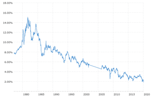

## Table of Contents

## What is a 30-Year Treasury Bond?

A 30-Year Treasury Bond is a type of bond issued by the U.S. government that lasts for 30 years. When you buy this bond, you are lending money to the government, and in return, they promise to pay you back with interest over that time. These bonds are seen as very safe investments because they are backed by the U.S. government, which is considered very reliable.

The interest on a 30-Year Treasury Bond is paid to the bondholder every six months until the bond matures. At the end of the 30 years, the government pays back the full amount you originally lent them. Because these bonds last a long time, they usually offer a higher interest rate than shorter-term bonds to make up for the longer wait. People often buy these bonds to save for the future or to have a steady income over a long period.

## How does the 30-Year Treasury Bond work?

When you buy a 30-Year Treasury Bond, you are giving money to the U.S. government. They promise to pay you back that money after 30 years. Until then, they also give you interest every six months. This interest is like a thank you for lending them your money. The bond is very safe because the U.S. government always pays back its debts.

The interest rate on a 30-Year Treasury Bond is usually higher than on bonds that last for a shorter time. This is because you have to wait longer to get your money back. People might buy these bonds if they want to save money for a long time or if they want to get regular interest payments. It's a good way to plan for the future because it's a very safe investment.

## What is the history of the 30-Year Treasury Bond?

The 30-Year Treasury Bond was first introduced by the U.S. government in 1977. Before that, the longest bond the government offered lasted for 20 years. The government decided to make a 30-year bond to give people a way to invest their money for a longer time. At first, these bonds were popular because they offered a good [interest rate](/wiki/interest-rate-trading-strategies) and were very safe.

In 2001, the U.S. government stopped making new 30-Year Treasury Bonds because they thought shorter bonds were enough. But, they started making them again in 2006 because people still wanted to invest in them. Since then, the 30-Year Treasury Bond has been a key part of the U.S. bond market, helping people save for the long term and giving the government a way to borrow money for a long time.

## How is the yield of a 30-Year Treasury Bond determined?

The yield of a 30-Year Treasury Bond is like the interest rate you get for lending your money to the government for 30 years. It's determined by how much people are willing to pay for the bond when it's first sold at an auction. If lots of people want to buy the bond, the price goes up, and the yield goes down. If fewer people want to buy it, the price goes down, and the yield goes up. It's all about supply and demand.

After the bond is sold, its yield can still change. This happens in the bond market where people can buy and sell the bond before it matures. If interest rates in the economy go up, the price of the bond goes down because new bonds will offer higher yields. If interest rates go down, the price of the bond goes up because it's paying a higher yield than new bonds. So, the yield of a 30-Year Treasury Bond can change a lot over time depending on what's happening in the economy.

## What are the risks associated with investing in 30-Year Treasury Bonds?

When you invest in 30-Year Treasury Bonds, one big risk is interest rate risk. This means that if interest rates go up after you buy the bond, the value of your bond can go down. If you need to sell your bond before it matures, you might get less money than you paid for it. This happens because new bonds will be offering higher interest rates, so people won't want to buy your old bond as much. It's like if you're selling a used car, and new cars are cheaper and better, people won't pay as much for your used car.

Another risk is inflation risk. Inflation means that the prices of things go up over time. If inflation goes up a lot, the money you get back from the bond might not buy as much as it used to. For example, if you get $1,000 back after 30 years, but prices have gone up a lot, that $1,000 might not be enough to buy what you need. So, even though the bond is safe and you'll get your money back, it might not be worth as much as you hoped.

Lastly, there's the risk of opportunity cost. This means that by putting your money in a 30-Year Treasury Bond, you might miss out on other investments that could give you more money. For example, if you put your money in stocks or real estate instead, you might earn more over time. So, you have to think about what you might be giving up when you choose to invest in these bonds.

## How have 30-Year Treasury Bonds performed historically?

Over the years, 30-Year Treasury Bonds have given investors a steady but changing return. From when they started in 1977 until now, the yield on these bonds has gone up and down a lot. In the early 1980s, the yield was very high, sometimes over 15%, because inflation was high and the economy was not doing well. But as the economy got better and inflation went down, the yields also went down. By the 2000s, the yields were much lower, often around 4% to 6%. This shows that the return you get from these bonds can change a lot depending on what's happening in the economy.

When you look at the long term, 30-Year Treasury Bonds have been a safe way to save money. Even though the yields have changed, the U.S. government has always paid back the money it borrowed. This makes these bonds a good choice for people who want to keep their money safe and get some interest over a long time. But, because the yields can go down if interest rates go up, the value of the bonds can also go down if you need to sell them before they mature. So, while they are safe, you need to think about when you might need your money back.

## What role do 30-Year Treasury Bonds play in the U.S. economy?

30-Year Treasury Bonds are important for the U.S. economy because they help the government borrow money for a long time. When the government needs money to pay for big projects or programs, it can sell these bonds to people and investors. This way, the government gets the money it needs now and promises to pay it back in 30 years. This helps the government plan and spend money over a long time, which is good for things like building roads, schools, or other big projects that take many years to finish.

These bonds also help the economy by giving people a safe place to save their money. Because the U.S. government always pays back its debts, people feel safe putting their money in these bonds. This can help keep the economy stable because people know they can save money without losing it. Plus, the interest people get from these bonds can be spent or saved, which helps keep money moving in the economy. So, 30-Year Treasury Bonds are a key part of making sure the economy works well and stays strong.

## How can one invest in 30-Year Treasury Bonds?

You can invest in 30-Year Treasury Bonds by buying them directly from the U.S. government through a website called TreasuryDirect. First, you need to set up an account on TreasuryDirect. Once your account is ready, you can go to the site during one of the auctions for 30-Year Treasury Bonds. These auctions happen a few times a year, and you can bid on the bonds. If your bid wins, you'll get the bonds, and you'll start getting interest payments every six months until the bond matures in 30 years.

Another way to invest in 30-Year Treasury Bonds is through a broker or a bank. Many financial institutions offer these bonds to their customers. You can call your bank or talk to a broker to buy the bonds. They might charge a fee for this service, but it can be easier than doing it yourself on TreasuryDirect. Once you buy the bonds through a broker or bank, you'll also start getting interest payments every six months until the bond matures.

## What are some notable examples of 30-Year Treasury Bond issuances?

One notable example of a 30-Year Treasury Bond issuance happened in February 2020. The U.S. government sold these bonds with a yield of about 2%. This was a time when the economy was doing well, but people were starting to worry about a new virus called COVID-19. Many investors bought these bonds because they wanted a safe place to put their money during uncertain times. The bond was popular and showed how people turn to these long-term investments when they're worried about the future.

Another example was in November 2008, during the financial crisis. The U.S. government issued 30-Year Treasury Bonds with a yield of around 4%. This was a time when the economy was in big trouble, and many banks were failing. Investors were very worried, so they bought a lot of these bonds because they wanted a safe investment. The high demand for these bonds during the crisis showed how important they are for keeping money safe during tough economic times.

## How do changes in interest rates affect 30-Year Treasury Bonds?

When interest rates go up, the price of 30-Year Treasury Bonds usually goes down. This happens because if new bonds are being sold with higher interest rates, the old bonds that pay less interest are not as attractive to buyers. If you need to sell your bond before it matures, you might have to sell it for less money than you paid for it. This is called interest rate risk, and it's a big thing to think about when you're investing in these long-term bonds.

On the other hand, when interest rates go down, the price of 30-Year Treasury Bonds usually goes up. This is because your bond is now paying more interest than new bonds that are being sold. People will want to buy your bond because it's a better deal, so you can sell it for more money than you paid for it. This can be good if you need to sell your bond before it matures, but it also means that if you keep the bond until the end, you might miss out on better opportunities to invest your money somewhere else.

## What are the tax implications of investing in 30-Year Treasury Bonds?

The interest you get from 30-Year Treasury Bonds is safe from state and local taxes. This means you don't have to pay state or city taxes on the money you earn from these bonds. But, you still have to pay federal taxes on the interest. So, if you live in a place with high state taxes, these bonds can be a good choice because you save money on those taxes.

If you sell your 30-Year Treasury Bond before it matures, you might have to pay capital gains tax. This tax depends on how much money you made or lost when you sold the bond. If you sell the bond for more than you paid for it, you'll pay tax on the profit. If you sell it for less, you might be able to use that loss to lower your taxes on other money you made. It's a good idea to talk to a tax expert to understand how this works for you.

## How do 30-Year Treasury Bonds compare to other long-term investment options?

30-Year Treasury Bonds are different from other long-term investments like stocks or real estate because they are very safe. When you buy a 30-Year Treasury Bond, you know the U.S. government will pay you back in 30 years, and you'll get interest every six months. This makes them a good choice if you want to keep your money safe and get a steady income over a long time. But, the interest rate on these bonds is usually lower than what you might get from riskier investments like stocks, which can go up and down a lot but might give you more money in the long run.

Stocks can be a good long-term investment if you're okay with more risk. When you buy stocks, you're buying a small part of a company, and if the company does well, the value of your stock can go up a lot. But if the company does badly, you can lose money. Real estate is another long-term investment where you buy property that can go up in value over time. You can also rent out the property to get regular income, but it takes more work to manage and can be riskier than bonds. So, 30-Year Treasury Bonds are a safer choice, but they might not grow your money as much as stocks or real estate could.

## References & Further Reading

[1]: [Timeline of U.S. Treasury Bonds](https://www.treasurydirect.gov/research-center/timeline/bonds/)

[2]: [History of U.S. Treasury Bonds](https://www.treasurydirect.gov/research-center/history-of-marketable-securities/bonds/)

[3]: [U.S. government ends issuance of 30-year bond](https://money.cnn.com/2001/10/31/markets/longbond/)

[4]: [Reintroduction of the 30-Year Treasury Bond](https://www.everycrsreport.com/reports/RL32049.html)

[5]: [Treasury Bonds](https://www.treasurydirect.gov/marketable-securities/treasury-bonds/)

[6]: [About Auctions](https://www.treasurydirect.gov/auctions/)

[7]: [Treasury Notes & Bonds Historical Information](https://www.treasurydirect.gov/auctions/announcements-data-results/announcement-results-press-releases/previous-announcements-and-results/treasury-notes-bonds-historical-information/)

[8]: [Treasury Auction Results Show Lagging Demand for Bonds](https://www.investopedia.com/treasury-auction-shows-lagging-demand-for-bonds-8357802)

[9]: [United States 30 Year Bond Yield](https://tradingeconomics.com/united-states/30-year-bond-yield)

[10]: [US 10-Year Treasury Auction for Record $42 Billion Awarded at 4.093%](https://www.bloomberg.com/news/articles/2024-02-07/treasury-s-biggest-ever-10-year-auction-garners-solid-demand)

[11]: [3(c)(7) Funds: Definition and Exemption Requirements](https://repool.com/fundpedia/section-3c7/)