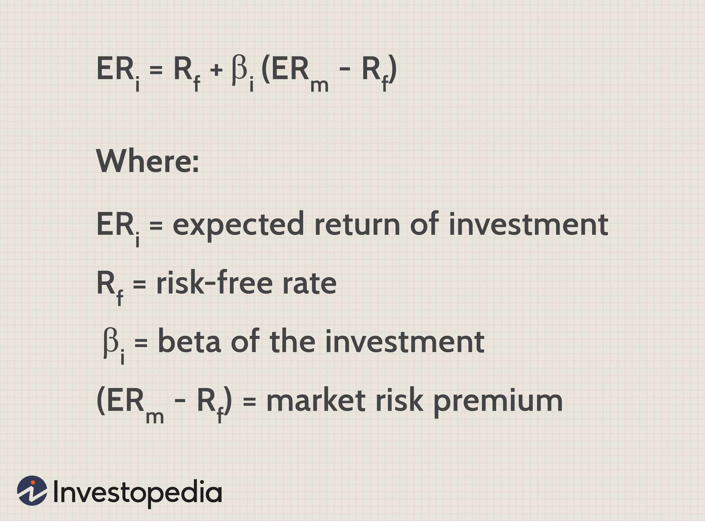

## Table of Contents

## What is a 3(c)(7) investment fund?

A 3(c)(7) investment fund is a type of private investment fund that is exempt from registering with the Securities and Exchange Commission (SEC) under the Investment Company Act of 1940. This exemption allows the fund to operate without the usual regulatory requirements that apply to public investment companies, as long as it meets certain conditions. One key condition is that the fund can only be offered to "qualified purchasers," which are individuals or entities with a high level of wealth or investment experience.

These funds are often used by hedge funds, private equity funds, and other types of investment vehicles that cater to sophisticated investors. The main advantage of a 3(c)(7) fund is the flexibility it offers in terms of investment strategies and operations, since it is not subject to the same level of regulatory oversight as registered funds. However, this also means that investors in these funds have less protection and must rely on their own due diligence and understanding of the risks involved.

## Who can invest in a 3(c)(7) fund?

Only certain people can invest in a 3(c)(7) fund. These investors are called "qualified purchasers." A qualified purchaser is someone who has a lot of money or experience with investing. For individuals, this usually means they have at least $5 million in investments. For companies or other groups, they need to have at least $25 million in investments.

Because these funds are for people with a lot of money or experience, they are not open to everyone. The rules are set up this way to make sure that only people who understand the risks and can afford to lose money can invest. This is important because 3(c)(7) funds are not watched as closely by the government, so investors need to be careful and do their own research.

## What are the key requirements for a fund to qualify as a 3(c)(7) fund?

To be a 3(c)(7) fund, the main thing the fund needs to do is only let "qualified purchasers" invest in it. A qualified purchaser is someone who has a lot of money or knows a lot about investing. For a person, this means they need to have at least $5 million in investments. For a company or group, they need at least $25 million in investments. This rule makes sure that only people who can handle the risks can invest in these funds.

Another important rule for a 3(c)(7) fund is that it does not have to register with the Securities and Exchange Commission (SEC). This means the fund does not have to follow all the rules that regular investment companies have to follow. But, in return, the fund cannot advertise to the public or let just anyone invest. It has to stick to the qualified purchasers. This gives the fund more freedom to make different kinds of investments, but it also means the investors need to be careful and do their own research because there is less protection from the government.

## How does a 3(c)(7) fund differ from other types of investment funds?

A 3(c)(7) fund is different from other investment funds because it only lets certain people invest in it. These people are called "qualified purchasers," which means they have a lot of money or know a lot about investing. A person needs to have at least $5 million in investments, and a company needs at least $25 million. This is different from other funds, like mutual funds, that can let almost anyone invest as long as they meet some basic rules. Because of this, 3(c)(7) funds are often used by hedge funds and private equity funds that want to work with experienced investors.

Another big difference is that 3(c)(7) funds do not have to register with the Securities and Exchange Commission (SEC). This means they do not have to follow all the strict rules that other investment companies have to follow. This gives 3(c)(7) funds more freedom to make different kinds of investments and operate in ways that might not be allowed for other funds. But, because they are not watched as closely by the government, investors in these funds need to be careful and do their own research. They have less protection than investors in other types of funds.

## What are the benefits of investing in a 3(c)(7) fund?

Investing in a 3(c)(7) fund can offer some big advantages. One main benefit is that these funds can make a wider range of investments. Because they do not have to follow all the strict rules that other funds have to follow, they can try different and sometimes riskier strategies. This can lead to higher returns for investors if the fund does well. Another benefit is that these funds are only open to people who have a lot of money or know a lot about investing. This means the fund can focus on finding the best opportunities without worrying about meeting the needs of less experienced investors.

However, there are also some important things to think about. Since 3(c)(7) funds are not watched as closely by the government, investors need to do their own research and be careful. There is less protection for investors in these funds compared to other types of funds. But for people who understand the risks and have the money to invest, a 3(c)(7) fund can be a good way to try to make more money than they might with more traditional investments.

## What are the potential risks associated with 3(c)(7) funds?

Investing in a 3(c)(7) fund can be risky because these funds are not watched as closely by the government. This means there is less protection for investors. If something goes wrong with the fund, like if it loses a lot of money or if there is fraud, investors might not have the same legal help that they would with other types of funds. Also, because these funds can make riskier investments, there is a bigger chance that investors could lose money.

Another risk is that 3(c)(7) funds are only for people who have a lot of money or know a lot about investing. This means that if you are not very experienced, you might not understand all the risks involved. It can be hard to know if the fund is making good choices or if it is taking too many risks. Because of this, it is really important for investors to do their own research and make sure they understand what they are getting into before they invest in a 3(c)(7) fund.

## How does the SEC regulate 3(c)(7) funds?

The SEC does not regulate 3(c)(7) funds in the same way it regulates other types of investment funds. This is because 3(c)(7) funds are exempt from registering with the SEC under the Investment Company Act of 1940. This means they do not have to follow all the strict rules that other funds have to follow. The main rule they have to follow is that they can only let "qualified purchasers" invest in them. These are people with a lot of money or experience in investing.

Even though 3(c)(7) funds do not have to register with the SEC, they still have to follow some rules. For example, they cannot advertise to the public or let just anyone invest. They have to stick to qualified purchasers. This gives them more freedom to make different kinds of investments, but it also means the investors need to be careful and do their own research. The SEC can still look into these funds if there are problems, like fraud, but the day-to-day regulation is less strict than for other funds.

## What are the reporting and compliance obligations for a 3(c)(7) fund?

A 3(c)(7) fund does not have to follow all the strict reporting and compliance rules that other funds have to follow. This is because it does not have to register with the Securities and Exchange Commission (SEC). Instead, the main rule it has to follow is that it can only let "qualified purchasers" invest in it. These are people with a lot of money or experience in investing. The fund does not have to file regular reports with the SEC like other funds do.

However, even though a 3(c)(7) fund does not have to register with the SEC, it still has to follow some rules. For example, it cannot advertise to the public or let just anyone invest. It has to stick to qualified purchasers. Also, if the fund is managed by an investment adviser, that adviser might have to register with the SEC and follow certain rules. This means the fund might have to provide some information to the adviser, but the day-to-day regulation and reporting requirements are less strict than for other funds.

## Can a 3(c)(7) fund be marketed to the general public?

No, a 3(c)(7) fund cannot be marketed to the general public. These funds are only for people called "qualified purchasers," which means they have a lot of money or know a lot about investing. A person needs to have at least $5 million in investments, and a company needs at least $25 million. This rule is in place to make sure that only people who can handle the risks can invest in these funds.

Because 3(c)(7) funds do not have to register with the Securities and Exchange Commission (SEC), they do not have to follow all the strict rules that other funds have to follow. This gives them more freedom to make different kinds of investments, but it also means they cannot advertise to everyone. They have to stick to qualified purchasers. This helps keep the fund focused on experienced investors who understand what they are getting into.

## How does the structure of a 3(c)(7) fund impact its tax treatment?

A 3(c)(7) fund is usually set up as a partnership or a limited liability company (LLC). This structure can affect how the fund is taxed. Unlike a regular company, a partnership or LLC does not pay taxes on its income. Instead, the income is passed through to the investors, who then report it on their own tax returns. This is called "pass-through taxation." It can be good for investors because they only pay taxes on their share of the fund's income, and they can use any losses to lower their own taxes.

However, the tax treatment can get more complicated depending on the types of investments the fund makes. For example, if the fund invests in things like real estate or other funds, there might be different tax rules to follow. Also, some income from the fund, like interest or dividends, might be taxed at different rates than other types of income. Investors need to be careful and maybe talk to a tax advisor to understand how their investment in a 3(c)(7) fund will affect their taxes.

## What are some common strategies employed by 3(c)(7) funds?

3(c)(7) funds often use different strategies to try to make money for their investors. One common strategy is to invest in things that other funds might not be able to, like risky stocks, real estate, or even other funds. Because 3(c)(7) funds do not have to follow all the strict rules that other funds have to follow, they can take more chances and try to find big opportunities that might not be available to everyone.

Another strategy is to use leverage, which means borrowing money to invest more than the fund actually has. This can make the fund's returns bigger if things go well, but it also makes the risks bigger. Some 3(c)(7) funds also focus on long-term investments, like buying companies and helping them grow over time. These strategies can be good for investors who understand the risks and have the money to invest, but they need to be careful and do their own research.

## How can a fund manager ensure ongoing compliance with 3(c)(7) exemption requirements?

To make sure a 3(c)(7) fund keeps following the rules for the exemption, the fund manager needs to check that only qualified purchasers are allowed to invest. A qualified purchaser is someone with a lot of money or experience in investing. A person needs at least $5 million in investments, and a company needs at least $25 million. The fund manager has to keep good records to show that all the investors meet these rules. They also need to make sure the fund does not advertise to the public or let just anyone invest, because that would break the rules.

The fund manager also needs to stay up to date with any changes in the law that might affect the fund. This means they should keep learning about new rules and making sure the fund follows them. If the fund is managed by an investment adviser, that adviser might have to register with the SEC and follow certain rules. The fund manager should work closely with the adviser to make sure everything is done right. By doing these things, the fund manager can help make sure the 3(c)(7) fund stays in line with the exemption requirements.

## References & Further Reading

[1]: [3(c)(7) Exemption: What It Is and How It Works](https://www.investopedia.com/terms/1/3c7.asp)

[2]: [3(c)(7) Funds: Definition and Exemption Requirements | Repool](https://repool.com/fundpedia/section-3c7/)

[3]: [What Is 3C1 and How Is the Exemption Applied?](https://www.investopedia.com/terms/1/3c1.asp)

[4]: [Investment Company Act Exemptions for Private Funds and Syndications: 3(c)(1), 3(c)(5)(c), and 3(c)(7)](https://patellegal.com/blog/investment-company-act-exemptions-for-private-funds-and-syndications-3c1-3c5c-and-3c7/)

[5]: [Sections 3(c)(1) and 3(c)(7) of the Investment Company Act](https://carta.com/learn/private-funds/regulations/3c1-3c7/)

[6]: [Section 3(c)(7) Hedge Funds | Hedge Fund Law Blog](https://hedgefundlawblog.com/section-3c7-hedge-funds.html)

[7]: [Section 3(c)(7) Exemption from Definition of Investment Company](https://40act.com/laws-rules/other-laws-and-rules/section-3c1/section-3c7-exemption-from-definition-of-investment-company/)

[8]: [What is a 3(c)(7) Fund? | Aronoff, Rosen & Hunt, LPA](https://arh-law.com/what-is-a-3c7-fund/)

[9]: [Defining the Term "Qualified Purchaser" Under the Securities Act of 1933](https://www.sec.gov/rules-regulations/2001/12/defining-term-qualified-purchaser-under-securities-act-1933)

[10]: [Qualified Purchaser: Definition & Requirements](https://carta.com/learn/private-funds/regulations/qualified-purchaser/)

[11]: [Learn About Qualified Purchaser](https://equitymultiple.com/glossary/qualified-purchaser)

[12]: [What Is a Qualified Purchaser?](https://www.fool.com/investing/2018/02/14/what-is-a-qualified-purchaser.aspx)

[13]: [Qualified purchaser vs accredited investor – What you need to know](https://www.yieldstreet.com/resources/article/qualified-purchaser-vs-accredited-investor-what-you-need-to-know/)

[14]: [Private Investments: What is a Qualified Purchaser?](https://www.merceradvisors.com/insights/investing/private-investments-what-is-a-qualified-purchaser/)

[15]: [Qualified Purchasers | Definition, Criteria, & Responsibilities](https://www.financestrategists.com/wealth-management/investment-management/qualified-purchasers/)

[16]: [What Is a Qualified Purchaser? | White Coat Investor](https://www.whitecoatinvestor.com/what-is-a-qualified-purchaser/)

[17]: [Statutes and Regulations](https://www.sec.gov/rules-regulations/statutes-regulations)