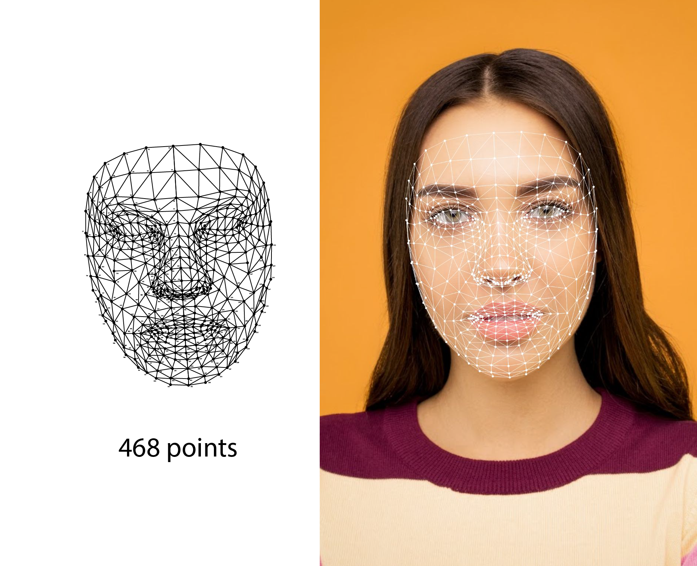

## Table of Contents

## What is a 3D Face Mesh Model and why is it important in machine learning?

A 3D Face Mesh Model is a digital representation of a human face created using three-dimensional coordinates. It's like a detailed map of the face that shows the shape and contours, including points, lines, and surfaces that make up the face's structure. This model is made by capturing data from various angles and then using special software to build a complete 3D image. The model can show things like the shape of the eyes, nose, mouth, and even the wrinkles and dimples on the face.

In machine learning, a 3D Face Mesh Model is important because it helps computers understand and work with human faces in a more detailed way. For example, these models can be used in facial recognition systems to identify people more accurately, even if their face is at a different angle or partially covered. They are also used in creating realistic animations and virtual reality experiences, where the computer needs to know exactly how a face moves and changes expression. By using 3D Face Mesh Models, machine learning algorithms can learn to predict and simulate human facial behavior more effectively, making technology more interactive and lifelike.

## How does 3D Gaussian Splatting work in the context of 3D Face Mesh Models?

3D Gaussian Splatting is a technique used to render and visualize 3D Face Mesh Models more efficiently. Imagine you have a bunch of tiny, colored balls (called Gaussians) that you can throw onto a 3D face model. Each ball represents a small part of the face, and when you throw them all together, they blend to create a smooth image of the face. This method helps computers quickly draw the face from any angle without needing to calculate every single point on the model, making it faster and less resource-intensive.

In the context of 3D Face Mesh Models, 3D Gaussian Splatting works by assigning these tiny balls to different parts of the face. The balls are positioned and shaped based on the detailed data of the face mesh. When you want to see the face from a new angle, the computer just needs to move and adjust these balls, rather than recalculating the entire model. This makes it easier to animate the face or change its expression in real-time, which is very useful in applications like video games, virtual reality, and facial recognition systems.

## What are the basic principles behind DECA (Detailed Expression Capture and Animation) for 3D face modeling?

DECA, which stands for Detailed Expression Capture and Animation, is a method used to create detailed 3D face models that can show different expressions. The basic idea behind DECA is to use a combination of a 3D face model and a set of images or videos of a person's face to capture how the face moves and changes when making different expressions. By analyzing these images, DECA can figure out the shape of the face and how the muscles move to create smiles, frowns, or other expressions. This information is then used to create a detailed 3D model that can be animated to show these expressions accurately.

The process starts with a basic 3D face model, which is like a blank canvas. Then, DECA uses [machine learning](/wiki/machine-learning) algorithms to look at images or videos of a person's face and match the movements and changes to the model. This involves adjusting the model's vertices (points on the model) to fit the observed expressions. For example, if the person smiles, the model's vertices around the mouth area will move to mimic that smile. By doing this for many different expressions, DECA can create a model that can be animated to show a wide range of facial movements, making it very useful for applications like video games, movies, and virtual reality.

## Can you explain how Improved GANs contribute to the generation of 3D Face Mesh Models?

Improved Generative Adversarial Networks (GANs) help make better 3D Face Mesh Models by using two parts that work together: a generator and a discriminator. The generator tries to create realistic 3D faces, while the discriminator checks if the faces look real or fake. They keep improving by learning from each other. The generator gets better at making faces that look real, and the discriminator gets better at telling real faces from fake ones. This back-and-forth process helps the generator create very detailed and lifelike 3D face models.

One big advantage of using Improved GANs is that they can learn from a lot of different face data. This means they can make 3D face models that look like real people, with all the small details like wrinkles, dimples, and expressions. By training on a diverse set of faces, the GANs can create models that are not just generic but can represent different people accurately. This is really helpful for things like making realistic characters in video games or movies, or even for medical uses where detailed face models are needed.

## What role does VQ-VAE-2 play in enhancing 3D Face Mesh Models?

VQ-VAE-2, which stands for Vector Quantized Variational Autoencoder 2, helps make 3D Face Mesh Models better by breaking down the face into smaller, manageable parts. It does this by turning the face data into a set of codes that can be easily understood and used by computers. Imagine you have a big puzzle of a face, and VQ-VAE-2 helps by sorting the pieces into groups, making it easier to put the puzzle back together in a way that looks realistic and detailed.

By using VQ-VAE-2, we can create 3D Face Mesh Models that capture more details and variations in faces. This is really useful for things like making characters in video games or movies look more lifelike, or for helping computers recognize faces more accurately. VQ-VAE-2 makes it possible to generate faces that look different from each other, showing all sorts of expressions and features, which makes the models more versatile and useful in many applications.

## How does the Attention Mesh technique improve the accuracy of 3D Face Mesh Models?

The Attention Mesh technique helps make 3D Face Mesh Models more accurate by focusing on important parts of the face. Imagine you're drawing a face and you want to make sure the eyes, nose, and mouth are just right. The Attention Mesh does something similar by paying extra attention to these key areas. It uses a special way of looking at the face data to figure out which parts need more detail. By doing this, the model can capture the small differences that make each face unique, like the shape of the eyes or the curve of the lips.

This technique is really helpful because it makes the 3D Face Mesh Models more lifelike and detailed. When computers use these models for things like facial recognition or creating characters in video games, they need to be as accurate as possible. The Attention Mesh helps by making sure the model doesn't miss any important details. This means the models can show a wider range of expressions and look more like real people, which is great for all sorts of applications where realistic faces are needed.

## What are the common challenges faced when training models for 3D Face Mesh?

Training models for 3D Face Mesh can be tricky because faces have a lot of small details that need to be captured just right. One big challenge is getting enough good data to train the model. Faces can look very different from one person to another, and they change a lot when they move or make different expressions. This means the model needs to learn from a lot of different faces and expressions to be accurate. If the data isn't varied enough, the model might not work well for all kinds of faces.

Another challenge is making sure the model can handle different lighting and angles. Faces look different under different lights or when seen from different sides. The model needs to be smart enough to recognize a face no matter how it's lit or turned. This can be hard because it requires the model to understand how light and shadows affect the face's appearance. Getting this right helps the model be more useful in real-world situations where lighting and angles can change a lot.

## How can one evaluate the performance of a 3D Face Mesh Model?

To evaluate the performance of a 3D Face Mesh Model, you need to check how well it can capture and show the details of a face. One way to do this is by comparing the model's output to real photos or scans of faces. You can use something called "mean squared error" to see how close the model's face is to the real one. If the error is small, it means the model is doing a good job. Another way is to see if the model can correctly show different expressions and angles of the face. If it can, then it's working well.

Another important thing to look at is how the model performs in real-life situations. This means testing it with different lighting conditions and from different angles. You can also check how fast the model works, because if it takes too long to create a face, it might not be useful for things like video games or virtual reality. By testing the model in many different ways, you can get a good idea of how well it's doing and where it might need to be improved.

## What are some of the latest advancements in 3D Face Mesh Models beyond the mentioned methods?

One of the latest advancements in 3D Face Mesh Models is the use of neural radiance fields (NeRFs). NeRFs help create very detailed and realistic 3D models of faces by using a lot of images taken from different angles. They work by figuring out how light moves through the scene, which helps them make models that look very lifelike. This is really useful for things like making characters in movies or video games look more real, or for helping computers recognize faces better in different lighting conditions.

Another exciting development is the use of self-supervised learning for 3D Face Mesh Models. This means the model can learn to make better faces without needing a lot of labeled data. Instead, it can learn from the data itself, which makes it easier and cheaper to train the model. This is great because it means we can create more accurate and detailed face models without needing huge amounts of information, making it easier to use these models in more places, like in virtual reality or for medical purposes.

## How do different machine learning architectures compare when applied to 3D Face Mesh Modeling?

Different machine learning architectures used for 3D Face Mesh Modeling each have their own strengths and weaknesses. For example, Convolutional Neural Networks (CNNs) are good at handling image data, which makes them useful for creating 3D face models from photos or videos. They work by breaking down images into smaller parts and learning how these parts fit together to form a face. However, CNNs can struggle with capturing the full 3D structure of a face, especially when dealing with different angles or expressions. On the other hand, Generative Adversarial Networks (GANs) are great at generating realistic faces. They use two parts, a generator and a discriminator, that work together to improve the model's output. GANs can create very detailed and lifelike face models, but they can be hard to train and might sometimes produce faces that are too similar to the training data.

Another architecture, Variational Autoencoders (VAEs), including advanced versions like VQ-VAE-2, are good at compressing and reconstructing face data. They work by turning a face into a set of codes and then using these codes to rebuild the face. This makes them useful for creating diverse and detailed face models. However, VAEs might not capture the fine details as well as GANs. Lastly, techniques like neural radiance fields (NeRFs) are newer and focus on creating very realistic 3D models by understanding how light interacts with the face. They are excellent for producing high-quality models but can be computationally intensive. Each of these architectures has its place in 3D Face Mesh Modeling, and the best choice depends on what you need the model to do.

## What are the potential applications of 3D Face Mesh Models in industries like gaming, film, and virtual reality?

In the gaming industry, 3D Face Mesh Models are used to create realistic characters that can show a wide range of emotions and expressions. This makes the games more immersive and engaging for players. By using these models, game developers can make characters that look and move like real people, which helps players feel more connected to the game. For example, in a role-playing game, the main character's face can change to show happiness, sadness, or anger, making the story feel more real and personal. These models also help in creating different versions of characters, so players can customize their avatars to look more like themselves or how they want their characters to look.

In the film industry, 3D Face Mesh Models are crucial for creating lifelike special effects and animations. They allow filmmakers to capture an actor's performance and translate it into a digital model that can be used in scenes where real actors can't be used, like in action sequences or fantasy worlds. This technology helps in making movies that are more visually stunning and believable. For instance, if a movie needs a character to transform into a monster, a 3D Face Mesh Model can show the transformation in a way that looks real and keeps the audience engaged. It also saves time and money by reducing the need for physical makeup and prosthetics.

In virtual reality (VR), 3D Face Mesh Models enhance the user experience by creating realistic avatars and environments. When users enter a VR world, they can see other people's faces in detail, which makes the virtual world feel more like the real one. This is important for social VR platforms where people want to interact with others as if they were in the same room. For example, in a VR meeting, seeing the other person's facial expressions clearly can help in understanding their emotions and reactions better, making the communication more effective. Additionally, these models can be used to create realistic training simulations, where users need to see and respond to facial cues accurately.

## What future developments can we expect in the field of 3D Face Mesh Modeling with machine learning?

In the future, we can expect 3D Face Mesh Modeling to become even more advanced with machine learning. One big change might be the use of even smarter algorithms that can learn from less data. This means we won't need huge amounts of pictures or videos to make a good model. These new algorithms could make it easier and cheaper to create detailed face models, which would be great for smaller companies or projects. Another exciting development could be the ability to capture and show emotions even more accurately. By using new machine learning techniques, the models could understand and show subtle changes in a person's face, making them look more real and lifelike.

Another area where we might see progress is in making these models work faster and better in real-time situations. For example, in video games or virtual reality, the models need to change quickly to match what the user is doing. Future developments could make these changes happen almost instantly, making the experience smoother and more enjoyable. Additionally, we might see more use of 3D Face Mesh Models in new areas like healthcare. Doctors could use these models to help with surgeries or to study how people's faces change over time. Overall, the future of 3D Face Mesh Modeling with machine learning looks bright, with lots of possibilities for making technology more realistic and useful in our daily lives.