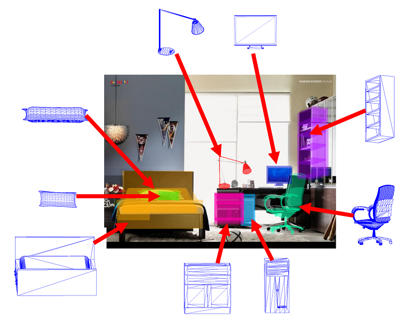

## Table of Contents

## What is 3D object detection in machine learning?

3D object detection in machine learning is a technique used to identify and locate objects in a three-dimensional space. This is different from 2D object detection, which only works with images. In 3D object detection, the system uses data from sources like cameras, LiDAR, or radar to create a 3D model of the environment. This model helps the system understand where objects are and how they are positioned in space. For example, self-driving cars use 3D object detection to see and understand the road, other cars, and pedestrians around them.

The process of 3D object detection involves several steps. First, the system collects data from sensors. This data is then processed to create a 3D representation of the scene. Next, the system uses machine learning algorithms to analyze this 3D data and detect objects. These algorithms are trained on large datasets to recognize different types of objects, like cars, people, or buildings. The final output is a set of 3D bounding boxes that show the location and size of each detected object. This information is crucial for applications like autonomous driving, robotics, and augmented reality, where understanding the 3D world is important.

## How does 3D object detection differ from 2D object detection?

3D object detection and 2D object detection are two different ways that machines can find and understand objects. 2D object detection works with flat pictures or videos. It looks at the image and puts a box around things it knows, like a car or a person. This box is called a bounding box, and it helps the machine know where the object is in the picture. However, this method only sees things from one angle and doesn't know how far away things are.

On the other hand, 3D object detection uses information from special sensors like LiDAR or multiple cameras to see the world in three dimensions. It creates a 3D map of the surroundings and can tell not just where an object is, but also how far away it is and how it's positioned in space. For example, a self-driving car uses 3D object detection to see the road, other cars, and pedestrians all around it, not just in one flat view. This makes it much better at understanding and navigating the real world.

In summary, while 2D object detection is good for identifying objects in pictures, 3D object detection goes a step further by understanding the full 3D environment. This difference is important for applications like self-driving cars, robots, and augmented reality, where knowing the exact position and distance of objects is crucial for safe and effective operation.

## What are some common applications of 3D object detection models?

3D object detection models are used in many different areas because they can see and understand the world in three dimensions. One big use is in self-driving cars. These cars need to know where other cars, people, and things are around them to drive safely. 3D object detection helps the car see everything in 3D, not just in a flat picture. This way, the car can tell how far away things are and how they are moving, which is very important for driving without crashing.

Another common use is in robotics. Robots that work in factories or warehouses use 3D object detection to find and pick up things. For example, a robot in a warehouse can use 3D sensors to see where boxes are and then move to pick them up. This makes the robot's job easier and faster. Also, in augmented reality, 3D object detection helps put virtual things into the real world in a way that looks right. For instance, a game on your phone might use it to make a virtual monster appear to be standing on your real table.

These are just a few examples, but 3D object detection is also used in other areas like security systems, where it can help spot people or cars in a 3D space, and in medical imaging, where it can help doctors see and understand the inside of the body in three dimensions. The ability to understand the world in 3D makes these models very useful in many different fields.

## What are the main types of data used in 3D object detection (e.g., point clouds, voxels)?

In 3D object detection, one main type of data used is point clouds. Point clouds are collections of points in 3D space, each with x, y, and z coordinates. These points come from sensors like LiDAR, which shoot out laser beams and measure how long it takes for the light to bounce back. This data helps create a detailed 3D picture of the world around the sensor. For example, a self-driving car might use point clouds to see all the cars and people around it in 3D.

Another type of data used in 3D object detection is voxels. Voxels are like 3D pixels; they are small cubes that fill up a 3D space. By dividing the 3D space into these cubes, the computer can process the data more easily. Voxels are good for understanding the shape and size of objects in 3D space. For instance, in medical imaging, voxels can help doctors see the inside of the body in three dimensions.

Both point clouds and voxels are important for 3D object detection because they help machines understand the world in 3D. Point clouds give a detailed view of the environment, while voxels help with processing and understanding the data in a structured way. Together, these types of data make 3D object detection more accurate and useful for applications like self-driving cars, robotics, and more.

## Can you explain how the CenterPoint model works for 3D object detection?

The CenterPoint model is a way to find objects in 3D space, and it's really good at it. It works by looking at the center points of objects instead of trying to put boxes around them right away. Imagine you're trying to find cars on a road. Instead of drawing a box around each car, CenterPoint first finds the exact middle point of each car. This makes it easier and faster to find where the cars are. Once it knows where the centers are, it can then figure out the size and shape of the cars around those points.

CenterPoint uses something called a heatmap to find these center points. A heatmap is like a map that shows where things are more likely to be. The model looks at the 3D data, like point clouds from LiDAR, and makes a heatmap where the bright spots show where the centers of objects might be. After finding these bright spots, CenterPoint then uses other information to figure out how big the objects are and which way they're facing. This method is really good because it's fast and works well even when there are a lot of objects around.

## What are the key features of Voxel R-CNN and how does it improve upon previous models?

Voxel R-CNN is a model used for 3D object detection that works by turning 3D data into small cubes called voxels. It then uses a technique called Region Proposal Network (RPN) to find areas in the 3D space where objects might be. After finding these areas, Voxel R-CNN uses another part called the Region-based Convolutional Neural Network (R-CNN) to look at each area closely and figure out what the object is and how it's positioned. One cool thing about Voxel R-CNN is that it uses a method called Voxel Set Abstraction (VSA) to make the 3D data easier to understand. This helps the model see the shape and size of objects better.

Voxel R-CNN improves on older models by making the detection process more accurate and faster. It does this by using voxels, which help the model understand the 3D space in a more structured way than just using point clouds. Also, the VSA method helps the model focus on important parts of the data, which makes it better at finding and understanding objects. For example, in a self-driving car, Voxel R-CNN can quickly and accurately find other cars and people around it, making the car safer and more reliable. By combining these new techniques, Voxel R-CNN gives better results than older models that might have missed some objects or taken longer to find them.

## How does DSGN utilize geometric information for 3D object detection?

DSGN, which stands for Differentiable Sparse-to-Dense Generator Network, is a model that uses geometric information to find objects in 3D space. It does this by turning the sparse data from sensors like LiDAR into a denser, more complete 3D picture. This helps the model understand the shape and position of objects better. DSGN uses a special way to handle the 3D data called a sparse-to-dense transformation. This means it starts with the scattered points from the LiDAR and fills in the gaps to make a full 3D model. By doing this, DSGN can see the whole object, not just the points where the laser hit.

This method of using geometric information makes DSGN very good at 3D object detection. It can tell where objects are and how they are shaped, even if the original data is not complete. For example, if a car is partially hidden behind another car, DSGN can still figure out its full shape and position. This is really helpful in situations like self-driving cars, where knowing the exact location and shape of everything around the car is important for safe driving. By using geometric information in this smart way, DSGN improves how well machines can understand and navigate the 3D world.

## What is the significance of CT3D in handling complex scenes in 3D object detection?

CT3D, which stands for Continuous Triangulation for 3D Object Detection, is important for handling complex scenes because it uses a smart way to understand 3D spaces. In busy places, like a crowded city street, there are lots of objects all around. CT3D can handle this by breaking down the 3D space into smaller parts and looking at each part closely. It uses a method called continuous triangulation, which means it makes a detailed map of the scene by connecting points in the 3D data. This helps CT3D see and understand the shape and position of objects even when they are close together or partially hidden.

This ability to handle complex scenes makes CT3D very useful for things like self-driving cars. In a busy street, a self-driving car needs to know where all the cars, people, and other things are. CT3D can help the car see everything clearly, even in tricky situations. By using continuous triangulation, CT3D makes sure that the car has a good understanding of its surroundings, which is important for safe driving. This makes CT3D a powerful tool for 3D object detection in real-world environments where things can get complicated quickly.

## How does I3DR-Net integrate image and point cloud data for improved detection accuracy?

I3DR-Net, which stands for Image-Integrated 3D Region-based Network, is a smart way to find objects in 3D space by using both pictures and point cloud data together. It starts by looking at the pictures from cameras to get a good idea of what objects might be there. Then, it uses the point cloud data from sensors like LiDAR to get a detailed 3D view of those objects. By combining these two types of information, I3DR-Net can see things more clearly and understand them better. For example, if a car is partially hidden behind a tree, the pictures might help show the car's color and shape, while the point cloud data helps figure out exactly where the car is in 3D space.

This way of using both images and point clouds makes I3DR-Net really good at finding objects accurately, even in tricky situations. It uses a special method to match the information from the pictures with the point cloud data, making sure that everything lines up correctly. This helps the model see the whole scene in a way that's more complete and accurate than using just one type of data. In the end, I3DR-Net can find and understand objects better, which is very helpful for things like self-driving cars that need to see everything around them clearly to drive safely.

## What makes 3DSSD efficient in terms of speed and accuracy for 3D object detection?

3DSSD, which stands for 3D Single Shot Detector, is a model that's really good at finding objects in 3D space quickly and accurately. It works by looking at the 3D data, like point clouds from LiDAR, and figuring out where objects are in one go, without needing to look at the data multiple times. This makes 3DSSD fast because it doesn't waste time going back and forth. It uses a special way to understand the 3D data called a feature extraction network, which helps it see the important parts of the data without getting bogged down by too many details.

Another reason 3DSSD is efficient is that it uses a method called anchor-free detection. This means it doesn't need to guess where objects might be by using pre-set boxes, which can slow things down. Instead, 3DSSD looks directly at the data and finds the center points of objects, then figures out their size and shape from there. This makes the model more accurate because it's not limited by the shapes of the pre-set boxes. By combining speed and accuracy in this way, 3DSSD is a powerful tool for 3D object detection, especially in situations where quick and reliable detection is important, like in self-driving cars.

## Can you describe the role of Point-GNN in processing sparse point cloud data?

Point-GNN, which stands for Point Graph Neural Network, is a smart way to handle sparse point cloud data. When you have point clouds from sensors like LiDAR, the points can be spread out and not very dense. Point-GNN helps by connecting these points into a graph, which is like a network where each point is a node and the connections between them are edges. This graph helps the model understand the relationships between the points better, even if they are far apart. By doing this, Point-GNN can see the shape and position of objects more clearly, even when the data is not very complete.

This method makes Point-GNN really good at finding objects in 3D space. For example, if you're trying to find cars on a road, the point cloud might not have points on every part of the car. But with Point-GNN, the model can still figure out where the car is and how it's shaped by looking at the connections between the points. This makes the detection more accurate and reliable, which is important for things like self-driving cars that need to see everything around them clearly to drive safely.

## How does VoTr leverage transformer architectures to enhance 3D object detection performance?

VoTr, which stands for Voxel Transformer, uses a special kind of computer model called a transformer to make 3D object detection better. Transformers are good at understanding things like words in a sentence or points in 3D space. VoTr takes the 3D data, which is made up of voxels (small 3D cubes), and uses the transformer to look at how these voxels are connected to each other. By doing this, VoTr can see the whole 3D scene more clearly and understand where objects are and how they are shaped. This is really helpful in situations like self-driving cars, where knowing exactly where everything is can help the car drive safely.

One big way VoTr makes 3D object detection better is by using something called self-attention. Self-attention helps the model focus on the most important parts of the 3D data. Imagine you're trying to find a car in a busy street. Instead of looking at every single point in the 3D data, VoTr can pay more attention to the points that are part of the car. This makes the detection faster and more accurate. By using transformers and self-attention, VoTr can handle complex 3D scenes better than older models, making it a powerful tool for things like self-driving cars and robotics.

## References & Further Reading

[1]: Qi, Charles R., Su, Hao, Mo, Kaichun, & Guibas, Leonidas J. (2017). ["PointNet: Deep Learning on Point Sets for 3D Classification and Segmentation."](https://arxiv.org/abs/1612.00593) Proceedings of the IEEE Conference on Computer Vision and Pattern Recognition (CVPR).

[2]: Lang, Alex H., Vora, Sourabh, Caeser, Eric, Zhou, Lubing, Yang, Jiong, & Beijbom, Oscar. (2019). ["PointPillars: Fast Encoders for Object Detection from Point Clouds."](https://arxiv.org/abs/1812.05784) Proceedings of the IEEE Conference on Computer Vision and Pattern Recognition (CVPR).

[3]: Yan, Yan, Mao, Yuxing, & Li, Bo. (2018). ["SECOND: Sparsely Embedded Convolutional Detection."](https://www.mdpi.com/1424-8220/18/10/3337) Sensors.

[4]: Zhou, Yinlong, Tuzel, Oncel, & Zhang, Jian. (2021). ["CenterNet: Keypoint Triplets for Object Detection"](https://ieeexplore.ieee.org/document/8578570) Proceedings of CVPR Workshops.

[5]: Shaoshuai Shi, Zhe Wang, Jianping Shi, Xiaogang Wang, & Hongsheng Li. (2019). ["Point-GNN: Graph Neural Network for 3D Object Detection in a Point Cloud."](https://arxiv.org/abs/1907.03670) Proceedings of CVPR.

[6]: Wang, Yilun, Guo, Yue, Choy, Christopher B., & Xing, Eric. (2019). ["I3D: Implementation of Lightweight 3D Object Detection Systems Using Integrating Image and 3D Sensors."](https://onlinelibrary.wiley.com/doi/abs/10.1002/solr.201900045) Proceedings of the IEEE Conference on Computer Vision and Pattern Recognition (CVPR).

[7]: Shi, Shaoshuai, Wang, Zhe, & Li, Hongsheng. (2020). ["Point-GNN: Graph Neural Network for 3D Object Detection in a Point Cloud."](https://arxiv.org/abs/1907.03670) Proceedings of the IEEE/CVF Conference on Computer Vision and Pattern Recognition (CVPR).