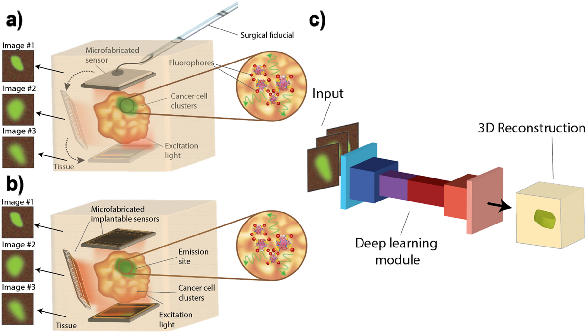

## Table of Contents

## What is 3D reconstruction in the context of machine learning?

3D reconstruction in machine learning is the process of creating a three-dimensional model of an object or scene from a set of two-dimensional images. It's like solving a puzzle where the pieces are flat pictures, and the goal is to build a 3D model that looks like the real thing. This is useful in many fields, such as medicine for creating models of organs, in gaming for creating realistic environments, and in robotics for understanding and navigating the world.

To do 3D reconstruction, machine learning algorithms analyze the images to find common points and understand the depth and shape of the object or scene. They use techniques like stereo vision, where two images taken from slightly different angles are compared to figure out the depth. Other methods include structure from motion, which uses a series of images taken from different viewpoints to build the 3D model. These algorithms often use neural networks to improve their accuracy and speed up the process.

In summary, 3D reconstruction helps machines understand and replicate the real world in three dimensions. It's a powerful tool that combines computer vision and machine learning to turn flat images into detailed 3D models, making it easier for technology to interact with the physical world.

## How does 3D reconstruction differ from traditional computer vision techniques?

3D reconstruction and traditional computer vision techniques both deal with understanding images, but they focus on different goals. Traditional computer vision techniques are mainly about analyzing and interpreting 2D images to extract information like edges, shapes, and textures. These methods help computers recognize objects, track movement, and understand scenes from a single viewpoint. For example, a traditional computer vision system might identify a car in a photo by looking at its shape and color.

On the other hand, 3D reconstruction goes a step further by creating a three-dimensional model from multiple 2D images. It's like building a 3D puzzle where each piece is a flat picture. This process involves figuring out the depth and spatial relationships between objects in the scene. By using techniques like stereo vision or structure from motion, 3D reconstruction can create a detailed model that looks like the real thing, allowing for a more comprehensive understanding of the environment. This is particularly useful in applications where understanding the full 3D structure is important, such as in robotics or medical imaging.

## What are the basic steps involved in a 3D reconstruction process?

The first step in 3D reconstruction is collecting multiple 2D images of the object or scene from different angles. These images are the puzzle pieces that will be used to build the 3D model. Next, the computer looks for common points, called features, in these images. These features help the computer understand how the images fit together. For example, if the same corner of a building appears in several photos, the computer can use that to figure out where the building is in 3D space.

Once the features are identified, the computer uses them to calculate the depth and position of each point in the scene. This is often done using techniques like stereo vision, where two images taken from slightly different angles are compared to figure out how far away things are. Another method is structure from motion, which uses a series of images taken from different viewpoints to build the 3D model. After calculating the depth and position, the computer puts all these points together to create a 3D model. This model can be refined and smoothed to make it look more like the real object or scene.

In summary, 3D reconstruction starts with gathering multiple 2D images, then finding common features in these images, and finally using these features to calculate depth and build a 3D model. It's like solving a puzzle where the end result is a detailed 3D representation of the real world.

## Can you explain the concept of NeRF (Neural Radiance Fields) and its role in 3D reconstruction?

NeRF, or Neural Radiance Fields, is a cool way to create 3D models from pictures. It's like a magic trick where you take a bunch of photos from different angles and use a special computer program to turn them into a 3D scene. The magic part is that NeRF uses something called a [neural network](/wiki/neural-network), which is a type of computer brain that can learn from examples. When you show NeRF a lot of pictures, it figures out how to make a 3D model that looks just like the real thing. It does this by guessing what the scene looks like from any angle, even if you didn't take a picture from that exact spot.

The way NeRF works is pretty smart. It uses a function that takes in the position and direction of a point in the scene and spits out the color and density of that point. This function is represented by a neural network, which means it can learn to make really accurate guesses. The cool thing about NeRF is that it can create very detailed and realistic 3D models, which is super useful for things like making movies, designing video games, or even helping robots understand the world around them. By using NeRF, you can get a 3D model that looks like the real thing, even if you only have a bunch of 2D pictures to start with.

## How does 3D Gaussian Splatting improve upon existing 3D reconstruction methods?

3D Gaussian Splatting is a new way to make 3D models that's faster and can look even better than older methods. It works by using something called Gaussian functions to represent the 3D scene. Imagine you're throwing paint at a canvas, but instead of paint, you're throwing little blobs of color and shape. These blobs, or Gaussians, can be adjusted to fit the scene perfectly. This method is quicker because it doesn't need as much heavy math to figure out how to put the scene together, making it easier for computers to handle.

One big advantage of 3D Gaussian Splatting is that it can create very detailed and realistic 3D models without taking too long. It's like building a sandcastle with a special tool that lets you shape the sand quickly and accurately. This makes it great for things like video games, where you need the scene to look good and load fast. Plus, it's easier to change and improve the model later on, which is helpful if you want to add new details or fix something that doesn't look quite right.

## What is the ARCH method and how does it contribute to 3D reconstruction?

The ARCH method, which stands for Adaptive Recursive Chunking of Hierarchical Gaussians, is a new way to make 3D models even better and faster. It's like taking a big puzzle and breaking it into smaller, easier pieces. ARCH uses something called Gaussian functions to represent parts of the 3D scene. These functions are like little blobs that can be adjusted to fit the scene perfectly. By breaking the scene into smaller chunks and working on them one by one, ARCH can create very detailed and realistic 3D models without taking too long.

One of the cool things about ARCH is that it's really good at handling complex scenes. It can focus on the important parts of the scene and spend less time on the less important parts. This makes the whole process faster and more efficient. ARCH is also great because it's easy to change and improve the model later on. If you want to add new details or fix something that doesn't look right, ARCH makes it simple to do that. This method is really helpful for making video games, movies, and other things where you need the 3D models to look good and load quickly.

## What are the key features and applications of NICE-SLAM in 3D reconstruction?

NICE-SLAM, which stands for Neural Implicit representation-based Continuous Signed distance function for Simultaneous Localization and Mapping, is a cool way to make 3D models while also figuring out where the camera is moving. It's like drawing a map and building a 3D model at the same time. NICE-SLAM uses something called neural networks to understand the scene and create a detailed 3D model. It's really good at making smooth and accurate models because it uses a special way to represent the scene called a signed distance function. This function helps the computer understand the shape of the scene better, making the 3D model look more like the real thing.

One of the key features of NICE-SLAM is that it can handle scenes that change over time. Imagine you're walking through a room and things are moving around. NICE-SLAM can keep up with these changes and update the 3D model to match what's happening in real time. This makes it super useful for things like robots that need to understand and navigate their environment. NICE-SLAM is also great for making virtual reality experiences because it can create detailed and realistic 3D models that you can explore. It's like having a magic tool that helps you build a perfect 3D world from just a bunch of pictures.

## How does CodeSLAM integrate coding and SLAM for 3D reconstruction?

CodeSLAM is a cool way to make 3D models by mixing coding and SLAM, which stands for Simultaneous Localization and Mapping. It's like building a 3D puzzle while also figuring out where you are in the room. CodeSLAM uses special computer programs, called code, to help understand the scene and create a detailed 3D model. The cool thing about CodeSLAM is that it can learn from the code to make the 3D model even better. It's like having a smart friend who can read instructions and use them to build something amazing.

One of the key features of CodeSLAM is that it can use the code to make the 3D model more accurate and detailed. Imagine you're drawing a map of a room, and you have a set of instructions that tell you exactly where to put each piece of furniture. CodeSLAM uses these instructions to make sure the 3D model looks just like the real room. This makes it really useful for things like robots that need to understand and navigate their environment, or for making video games and movies where you need the 3D models to look perfect.

## What makes NeuralRecon unique in the field of 3D reconstruction?

NeuralRecon is a special way to make 3D models that's different from other methods because it uses something called neural networks to understand the scene. It's like having a smart computer that can learn from pictures and create a detailed 3D model all by itself. What makes NeuralRecon unique is that it can create these models really fast and accurately, even if the pictures are taken from different angles or if the scene is really complex. It's like solving a puzzle where the pieces keep changing, but NeuralRecon can still figure it out and make a perfect 3D model.

Another cool thing about NeuralRecon is that it can handle scenes that change over time. Imagine you're walking through a room and things are moving around. NeuralRecon can keep up with these changes and update the 3D model to match what's happening in real time. This makes it super useful for things like robots that need to understand and navigate their environment, or for making virtual reality experiences where you need the 3D models to be as realistic as possible. It's like having a magic tool that helps you build a perfect 3D world from just a bunch of pictures.

## How does MonoPort utilize monocular images for 3D reconstruction?

MonoPort is a clever way to make 3D models using just one camera. It's like trying to guess what a room looks like by looking through a peephole. MonoPort uses special computer programs, called neural networks, to understand the scene from these single pictures and create a detailed 3D model. It's really good at figuring out the depth and shape of objects, even if you only have one view. This makes it easier to use because you don't need a bunch of cameras or to take pictures from different angles.

One of the cool things about MonoPort is that it can handle scenes that change over time. Imagine you're looking through the peephole and people are moving around in the room. MonoPort can keep up with these changes and update the 3D model to match what's happening in real time. This makes it super useful for things like robots that need to understand and navigate their environment, or for making virtual reality experiences where you need the 3D models to be as realistic as possible. It's like having a magic tool that helps you build a perfect 3D world from just one picture.

## What is the Depth-wise Plane Sweeping technique and how is it applied in 3D reconstruction?

The Depth-wise Plane Sweeping technique is a way to make 3D models from pictures by figuring out how far away things are. Imagine you're looking at a scene through a camera, and you want to know the distance to different objects. With this technique, you take a bunch of pictures from different angles and then imagine a bunch of planes slicing through the scene at different depths. By comparing how things look in these pictures when they're lined up with these planes, you can figure out which plane makes the objects line up best. This tells you how far away each object is, helping you build a 3D model of the scene.

This method is really useful because it can create detailed 3D models even if the pictures are taken from different angles or if the scene is complex. It's like solving a puzzle where you're trying to match up pieces to see the full picture. By using Depth-wise Plane Sweeping, you can make accurate 3D models that look just like the real thing, which is helpful for things like making video games, movies, or helping robots understand and navigate their environment.

## What are the current challenges and future directions in 3D reconstruction using machine learning?

One of the main challenges in 3D reconstruction using [machine learning](/wiki/machine-learning) is dealing with complex and dynamic scenes. When things in the scene are moving or changing, it can be hard for the computer to keep up and make an accurate 3D model. Another challenge is getting enough good quality pictures from different angles. If the pictures are blurry or if there aren't enough of them, the 3D model might not look right. Also, these methods can be slow and need a lot of computer power, which can make them hard to use in real-time applications like robotics or virtual reality.

In the future, researchers are working on making 3D reconstruction faster and more accurate. They're trying to use new types of neural networks that can learn from fewer pictures and still make good 3D models. They're also looking at ways to make the process work in real time, so it can be used for things like helping robots navigate or creating immersive virtual reality experiences. Another exciting direction is using 3D reconstruction for things like medical imaging, where it could help doctors understand and treat diseases better. By solving these challenges, 3D reconstruction could become even more useful and powerful in the future.

## References & Further Reading

[1]: Mildenhall, B., Srinivasan, P. P., Tancik, M., Barron, J. T., Ramamoorthi, R., & Ng, R. (2020). ["NeRF: Representing Scenes as Neural Radiance Fields for View Synthesis."](https://arxiv.org/abs/2003.08934) Proceedings of the European Conference on Computer Vision (ECCV).

[2]: Engel, J., Koltun, V., & Cremers, D. (2018). ["Direct Sparse Odometry."](https://ieeexplore.ieee.org/document/7898369) IEEE Transactions on Pattern Analysis and Machine Intelligence, 40(3), 611-625.

[3]: Yi, X., Wu, Z., Choy, C. B., & Xing, E. P. (2020). ["NeuralRecon: Real-Time Coherent 3D Reconstruction from Monocular Video."](https://arxiv.org/abs/2104.00681) arXiv preprint arXiv:2104.04727.

[4]: Sun, Y., Dai, A., & Nießner, M. (2022). ["3D Gaussian Splatting for Real-Time Radiance Field Rendering."](https://arxiv.org/abs/2308.04079) arXiv preprint arXiv:2303.14168.

[5]: Bloesch, M., Czarnowski, J., Clark, R., Leutenegger, S., & Davison, A. J. (2018). ["CodeSLAM—Learning a Compact, Optimisable Representation for Dense Visual SLAM."](https://arxiv.org/abs/1804.00874) IEEE Conference on Computer Vision and Pattern Recognition (CVPR).

[6]: Zeng, Z., & Liu, H. (2021). ["MonoPort: 3D Human Reconstruction from a Single Image."](https://scholar.google.com/citations?user=12qaaesAAAAJ&hl=en) arXiv preprint arXiv:2104.10154.

[7]: Schöps, T., Sattler, T., Pollefeys, M., & Geiger, A. (2017). ["Multi-View and Multi-Scale Structure-from-Motion in Unordered Image Collections."](https://arxiv.org/html/2504.16930) Proceedings of the IEEE International Conference on Computer Vision (ICCV).