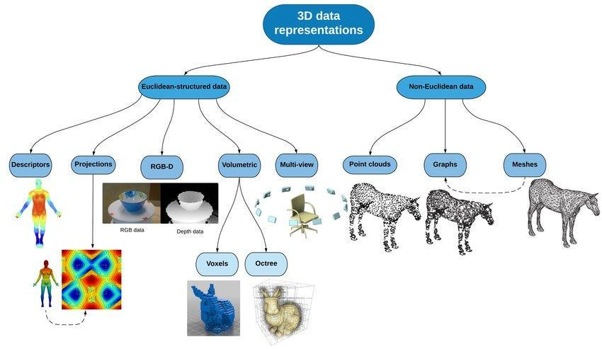

## Table of Contents

## What are 3D representations in the context of machine learning?

In machine learning, 3D representations refer to ways of showing data or models in three dimensions. This can help people understand complex data better because it's easier to see patterns and relationships in three dimensions than in two. For example, in medical imaging, a 3D model of a patient's brain can show more details than a flat image. Machine learning algorithms can use these 3D models to learn and make predictions about new data.

Creating 3D representations often involves using special techniques and tools. One common method is to use a type of math called "3D geometry" to turn data into a 3D shape. Another method is to use neural networks, which are a type of machine learning model, to generate 3D images from 2D data. These techniques can be complex, but they are important for fields like robotics, where a robot needs to understand its 3D environment to move and interact with objects correctly.

## How does NeRF (Neural Radiance Fields) work for 3D scene representation?

NeRF, or Neural Radiance Fields, is a way to create 3D scenes using a special type of machine learning called neural networks. Imagine you want to make a 3D model of a room. With NeRF, you take many pictures of the room from different angles. Then, you feed these pictures into a neural network. The network learns how to create a 3D model by figuring out where objects are in space and how they look from different viewpoints. It does this by predicting the color and density of points in 3D space. When you look at the scene from any angle, the network can generate what it should look like, even from angles you didn't take pictures from.

The way NeRF works is by using a function that takes a 3D point and a viewing direction as inputs and outputs the color and density of that point. This function is represented by a neural network. When you want to render a new view of the scene, the network calculates the color and density for many points along rays cast from the camera into the scene. These values are then combined to create the final image. This process allows NeRF to create very realistic 3D scenes that can be viewed from any angle, making it useful for virtual reality, video games, and other applications where detailed 3D models are needed.

## What is PointNet and how does it process 3D point cloud data?

PointNet is a type of neural network designed to work with 3D point cloud data. Point clouds are collections of points in 3D space that represent the surface of objects. Imagine you have a bunch of dots floating in the air, each dot representing a point on an object. PointNet takes these points and figures out important features from them, like shape and structure, without needing to convert them into a different format like a grid or mesh. This is useful because point clouds are often used in applications like self-driving cars and robotics, where sensors capture the world as a set of points.

PointNet works by applying a series of operations to the input points. First, it uses a function to transform each point into a higher-dimensional space, capturing more information about each point. Then, it applies a special function called a symmetric function, which helps the network understand the overall structure of the point cloud, no matter how the points are arranged. This is important because the same object can look different if you rotate it or view it from another angle. Finally, PointNet combines all the information from the points into a single feature vector that represents the whole object. This vector can then be used for tasks like classifying the object or detecting if it's in a certain pose.

## Can you explain the concept of 3DIS (3D Instance Segmentation) and its applications?

3D Instance Segmentation (3DIS) is a way to take a 3D scene and break it down into different objects, each with its own label. Imagine you have a room full of furniture. 3DIS would look at the room and tell you where each piece of furniture is and what it is, like a chair, a table, or a sofa. It does this by using special computer programs that can understand 3D shapes and separate them from each other. These programs use a lot of math and machine learning to figure out where one object ends and another begins, even if they are close together or touching.

3DIS is really useful in many areas. For example, in self-driving cars, it helps the car understand what's around it, like other cars, pedestrians, and road signs. This helps the car drive safely. In robotics, 3DIS can help a robot pick up objects or move around without bumping into things. It's also used in construction to plan and check buildings, and in medicine to look at 3D scans of the body and see different organs or tumors. By understanding the 3D world in detail, 3DIS makes it easier for machines to interact with the real world in smart ways.

## What is GMI (Geometric Multimodal Interaction) and how does it enhance 3D representations?

GMI, or Geometric Multimodal Interaction, is a way to make 3D models better by using different kinds of information together. Imagine you have a 3D model of a room. GMI can use not just the shape of the room, but also sounds, pictures, and even how people move around in it to make the model more detailed and realistic. It's like putting together pieces of a puzzle from different boxes to get a clearer picture of the whole room.

By combining these different types of information, GMI helps create 3D representations that are more accurate and useful. For example, in a virtual reality game, GMI can make the game world feel more real by adding sounds that match what you see, and by changing what you see based on how you move. This makes the game more fun and immersive. In robotics, GMI can help a robot understand its surroundings better by using both its camera and its touch sensors, making it easier for the robot to pick up objects or navigate around obstacles.

## How does a 3D Dynamic Scene Graph represent and manage changes in a 3D environment?

A 3D Dynamic Scene Graph is a way to keep track of objects in a 3D world and how they change over time. Think of it like a family tree, but instead of people, it shows objects and how they relate to each other. The graph updates as things in the scene move or change. For example, if a car in the scene starts driving, the graph will show the new position of the car and how it affects other objects around it. This helps computers understand the 3D world better and react to changes quickly.

In practical terms, a 3D Dynamic Scene Graph can be used in video games, where characters and objects are always moving, or in self-driving cars, where the environment is constantly changing. The graph makes it easier for the computer to keep everything organized and up-to-date. By continuously updating the relationships between objects, the scene graph ensures that the 3D environment remains accurate and responsive, which is crucial for real-time applications where quick and correct decisions are needed.

## What are StereoLayers and how do they contribute to understanding 3D scenes?

StereoLayers is a way to understand 3D scenes better by using two pictures taken from slightly different angles, kind of like how our eyes see the world. These two pictures are called stereo images. By comparing the differences between the two images, StereoLayers can figure out how far away objects are and create a 3D model of the scene. This is useful because it helps computers see the world in 3D, just like we do, and understand where things are in space.

In practical terms, StereoLayers can be used in things like self-driving cars to help them see the road and other cars in 3D, or in virtual reality to make the game world feel more real. By using stereo images, StereoLayers can make a detailed 3D map of the environment, which helps computers make better decisions and react to changes in the scene more accurately. This technology makes it easier for machines to understand and interact with the 3D world around them.

## How does Models Genesis approach the generation of 3D models?

Models Genesis is a way to make 3D models using a special kind of computer program called a neural network. It starts by looking at a bunch of 2D pictures from different angles of the thing you want to model, like a chair or a car. The neural network then figures out how to turn these pictures into a 3D shape. It does this by learning the patterns and details in the pictures and using them to build a 3D model that looks like the real thing. This is helpful because it can make 3D models quickly and without needing a lot of special equipment.

Once the neural network has learned from the pictures, it can create a 3D model that you can look at from any angle. This is useful for things like video games, where you need lots of different 3D objects, or in virtual reality, where you want the world to feel real. Models Genesis makes it easier to create these 3D models because it can do a lot of the work automatically, saving time and effort.

## What is imGHUM and how does it use images to create 3D human models?

imGHUM is a way to make 3D models of people using just a few pictures. Imagine you take some photos of a person from different angles. imGHUM uses a special computer program to look at these photos and figure out what the person looks like in 3D. This program is smart and can guess the shape and details of the person's body, even parts you can't see in the pictures. It's like solving a puzzle where you have to imagine what the missing pieces look like.

This method is really helpful because it's quick and doesn't need special equipment like 3D scanners. You can use imGHUM to create 3D models for things like video games or movies, where you need realistic characters. It makes it easier to get a good 3D model without spending a lot of time or money. By using just a few pictures, imGHUM can create a detailed 3D model that looks just like the person in the photos.

## Can you describe DeltaConv and its role in processing 3D data?

DeltaConv is a special way to look at 3D data, like point clouds, which are collections of points in 3D space that represent objects. Imagine you have a bunch of dots that make up a shape. DeltaConv helps computers understand these shapes better by looking at how the points are arranged and how they relate to each other. It does this by using something called a convolution, which is a way to process data by sliding a small window over it and doing some math. DeltaConv is different because it focuses on the differences between nearby points, which helps it capture the details of the shape more accurately.

This method is really useful in fields like self-driving cars and robotics, where understanding the 3D world is important. By using DeltaConv, computers can figure out what objects are in their surroundings and how they are positioned. This helps them make better decisions, like how to navigate around obstacles or pick up objects. DeltaConv makes it easier for machines to work with 3D data because it can handle the complex arrangements of points in a point cloud and turn them into useful information.

## What is LSDM (Latent Space Dynamics Model) and how does it model 3D dynamics?

LSDM, or Latent Space Dynamics Model, is a way to understand how things move and change in a 3D world using a special kind of math called a neural network. Imagine you have a video of a car driving around. LSDM looks at the video and figures out how the car moves from one frame to the next. It does this by turning the 3D information into a simpler form, called a latent space, which makes it easier to predict how things will move in the future. This helps computers understand and predict the movements of objects in a 3D scene, like how a robot might move or how a ball might bounce.

By using LSDM, computers can make better guesses about what will happen next in a 3D environment. For example, in video games, LSDM can make characters move more realistically, or in self-driving cars, it can help predict where other cars will be in the next few seconds. This is really useful because it lets machines plan and react to changes in the world around them more accurately.

## How do these various 3D representation techniques compare in terms of performance and application suitability?

Different 3D representation techniques like NeRF, PointNet, 3DIS, GMI, StereoLayers, Models Genesis, imGHUM, DeltaConv, and LSDM have their own strengths and are suited for different tasks. NeRF is great for creating very detailed 3D scenes from pictures, which makes it perfect for virtual reality and movie making where you need realistic environments. PointNet is good at understanding point clouds, which are useful in robotics and self-driving cars where sensors capture the world as a bunch of points. 3DIS helps break down a 3D scene into separate objects, which is helpful for self-driving cars to understand what's around them. GMI uses different types of information to make 3D models better, making it useful in games and robotics where you want a more realistic and interactive world. StereoLayers uses two pictures to create a 3D model, which is great for self-driving cars and VR to understand depth.

Models Genesis is good at quickly making 3D models from 2D pictures, which is useful in video games and VR where you need lots of different objects. imGHUM creates 3D models of people from just a few photos, making it handy for movies and games that need realistic characters without special equipment. DeltaConv is good at understanding the details in point clouds, which is important for robotics and self-driving cars to navigate and interact with objects. LSDM helps predict how things move in a 3D scene, which is useful in games for realistic character movement and in self-driving cars to predict where other cars will go. Each technique has its own performance advantages, like NeRF's high detail, PointNet's ability to handle point clouds, and LSDM's prediction capabilities, making them suitable for different applications based on what you need.