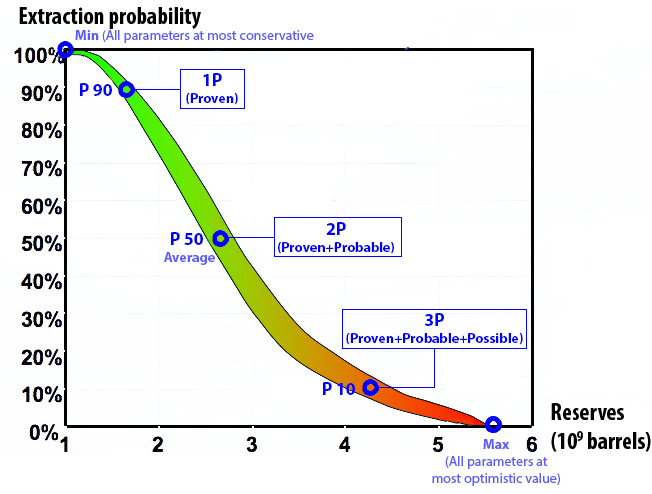

## Table of Contents

## What are 3P Oil Reserves?

3P Oil Reserves refer to the total amount of oil that a company believes it can extract from its oil fields. The "3P" stands for Proven, Probable, and Possible reserves. Proven reserves are the oil that the company is almost certain it can extract with current technology and under current economic conditions. Probable reserves are less certain, but there is a good chance they can be extracted. Possible reserves are the least certain, but there is still a chance they might be recoverable.

These categories help companies and investors understand the potential of an oil field. Proven reserves are the most reliable and are used for planning and financial reporting. Probable and possible reserves are more speculative and are used to give a fuller picture of what might be available in the future. By considering all three categories, companies can better plan their operations and investments.

## What do the terms 'Proved', 'Probable', and 'Possible' mean in the context of 3P Oil Reserves?

In the context of 3P Oil Reserves, 'Proved' reserves are the oil that a company is very sure it can get out of the ground. They know this because they have done a lot of tests and studies. They are confident that with the technology they have now and the money they can make from selling the oil, they can extract it. This is the most reliable type of reserve and is used for planning and telling investors how much oil they can count on.

'Probable' reserves are less certain than proved reserves. There is a good chance the company can get this oil out, but it's not as sure as with proved reserves. They might need a bit more technology or the price of oil might need to be a bit higher to make it worth it. 'Possible' reserves are even less certain. There is a chance the company can extract this oil, but it's the least sure of the three. They might need new technology or a big change in the price of oil to make it work. These two categories help give a fuller picture of what might be available in the future, but they are more like guesses than certainties.

## How are 3P Oil Reserves classified?

3P Oil Reserves are divided into three types: Proved, Probable, and Possible. Proved reserves are the oil that a company knows for sure it can get out of the ground. They have done a lot of tests and studies to be sure. They know they can use the technology they have now and the price of oil will make it worth it. This is the most reliable type of reserve and is used for planning and telling investors how much oil they can count on.

Probable reserves are less certain than proved reserves. There is a good chance the company can get this oil out, but it's not as sure as with proved reserves. They might need a bit more technology or the price of oil might need to be a bit higher to make it worth it. Possible reserves are even less certain. There is a chance the company can extract this oil, but it's the least sure of the three. They might need new technology or a big change in the price of oil to make it work. These two categories help give a fuller picture of what might be available in the future, but they are more like guesses than certainties.

## What is the significance of 3P Oil Reserves for oil companies?

3P Oil Reserves are very important for oil companies because they help them plan their future. When a company knows how much oil it can get from its fields, it can make better decisions about where to spend money and how to grow. Proved reserves are the most important because they are the oil the company is sure it can get out of the ground. This helps the company plan its operations and tell investors how much oil they can count on.

Probable and possible reserves are also important, but they are less certain. These reserves help the company think about what might be possible in the future. If new technology comes along or the price of oil goes up, the company might be able to get this oil out of the ground too. By looking at all three types of reserves, the company can have a fuller picture of its future and make smarter choices about where to invest its time and money.

## How are 3P Oil Reserves estimated?

Estimating 3P Oil Reserves involves a lot of detailed work. Companies use different methods to figure out how much oil is in the ground. They start by doing geological surveys, which means they study the rocks and the earth to see where the oil might be. Then, they drill test wells to get samples of the oil and see how much is there. They use this information along with computer models to make their best guess about how much oil they can get out.

Once they have all this information, they divide the oil into three categories: Proved, Probable, and Possible. Proved reserves are the oil they are very sure they can get out. They know this because they have done a lot of tests and studies. Probable reserves are less certain, but there is a good chance they can get this oil out too. Possible reserves are the least certain, but there is still a chance they might be able to extract them. By putting the oil into these categories, companies can plan better and tell investors what to expect.

## What technologies are used to assess 3P Oil Reserves?

To assess 3P Oil Reserves, companies use a variety of technologies. They start with geological surveys, which involve studying the earth's surface and subsurface to identify potential oil-bearing rock formations. This is done using tools like seismic imaging, where sound waves are sent into the ground and the echoes are analyzed to create detailed images of the subsurface. Another important technology is drilling test wells, which allows companies to collect samples of the oil and measure the pressure and flow rates. These samples help them understand the quality and quantity of the oil in the reservoir.

Once the initial data is collected, companies use computer modeling and simulation software to estimate the amount of oil that can be extracted. These models take into account the data from the geological surveys and test wells, as well as factors like the reservoir's characteristics, the oil's properties, and the technology available for extraction. By running different scenarios, the models help predict how much oil falls into the categories of Proved, Probable, and Possible reserves. This combination of field data and advanced technology gives companies a detailed picture of their oil reserves and helps them plan their operations and investments.

## What are the differences between 1P, 2P, and 3P Oil Reserves?

1P, 2P, and 3P Oil Reserves are ways to talk about how much oil a company thinks it can get out of the ground. 1P stands for Proved reserves, which is the oil the company is very sure it can extract. They have done a lot of tests and studies to be sure about this. This is the most reliable type of reserve and is used for planning and telling investors how much oil they can count on.

2P includes both Proved and Probable reserves. Probable reserves are less certain than Proved reserves, but there is a good chance the company can get this oil out too. They might need a bit more technology or a higher oil price to make it work. 3P adds Possible reserves to Proved and Probable. Possible reserves are the least certain, but there is still a chance they might be able to extract them. By looking at all three types of reserves, companies can have a fuller picture of their future and make smarter choices about where to invest their time and money.

## How do economic factors influence the classification of 3P Oil Reserves?

Economic factors play a big role in deciding how much oil a company thinks it can get out of the ground. When they classify oil into Proved, Probable, and Possible reserves, they look at things like the price of oil and the cost of getting it out. If the price of oil is high, it might make sense to go after oil that is harder to get, so more oil might be counted as Proved reserves. But if the price is low, they might only focus on the easiest oil to get, and less oil would be counted as Proved reserves.

The cost of technology also matters. If new technology makes it cheaper to get oil out of the ground, more oil could be moved from Probable or Possible to Proved reserves. But if the technology is too expensive, some oil might stay in the Probable or Possible categories. By looking at these economic factors, companies can better guess how much oil they can really get out of the ground and plan their business accordingly.

## What role do geological uncertainties play in determining 3P Oil Reserves?

Geological uncertainties are a big part of figuring out how much oil a company can get out of the ground. When they try to guess how much oil is there, they look at the rocks and the earth to see where the oil might be. But the earth is a big and complicated place, and it's hard to know everything about it. Sometimes, the oil might be in places that are hard to see or reach, or it might be spread out in a way that makes it hard to get. These uncertainties mean that the company can't be totally sure about how much oil is really there.

Because of these uncertainties, the company divides the oil into three groups: Proved, Probable, and Possible reserves. Proved reserves are the oil they are very sure they can get because they have done a lot of tests and studies. Probable reserves are less certain, but there is a good chance they can get this oil out too. Possible reserves are the least certain, but there is still a chance they might be able to extract them. By putting the oil into these groups, the company can plan better and tell investors what to expect, even though they can't know everything for sure because of the geological uncertainties.

## How do changes in oil prices affect the categorization of 3P Oil Reserves?

Changes in oil prices can really change how oil companies think about their oil reserves. When the price of oil goes up, it makes more sense for companies to go after oil that is harder or more expensive to get out of the ground. This means that some oil that was thought to be Probable or Possible reserves might now be counted as Proved reserves. They can do this because the higher price makes it worth the extra effort and cost.

On the other hand, if the price of oil goes down, companies might only want to focus on the easiest and cheapest oil to get. This means that some oil that was thought to be Proved reserves might now be moved to Probable or Possible reserves. They do this because the lower price makes it not worth the effort and cost to go after the harder-to-get oil. So, the price of oil can make a big difference in how much oil a company thinks it can really get out of the ground.

## What are the regulatory frameworks governing the reporting of 3P Oil Reserves?

The reporting of 3P Oil Reserves is guided by rules set by different countries and international groups. In the United States, the Securities and Exchange Commission (SEC) has rules that companies must follow when they talk about their oil reserves. These rules say that companies can only report Proved reserves in their financial statements. Other countries, like Canada, have their own rules. For example, the Canadian Securities Administrators (CSA) let companies report Proved, Probable, and Possible reserves, but they have to be clear about how sure they are about each type.

There are also international standards that help make sure everyone is talking about oil reserves in the same way. The Society of Petroleum Engineers (SPE) and the World Petroleum Council (WPC) have created guidelines called the Petroleum Resources Management System (PRMS). These guidelines help companies all over the world report their oil reserves in a clear and consistent way. By following these rules and guidelines, companies can give investors and others a good idea of how much oil they can get out of the ground.

## How do advancements in extraction technologies impact the assessment of 3P Oil Reserves?

Advancements in extraction technologies can change how much oil companies think they can get out of the ground. When new technology makes it easier or cheaper to get oil, more oil can be counted as Proved reserves. For example, if a new drilling method or a better way to get oil out of tight rock formations comes along, oil that was hard to reach before might now be easier to get. This means that some oil that was thought to be Probable or Possible reserves might now be moved to the Proved category because the company is more sure they can get it out.

These technological improvements also help companies find new oil or get more out of places they already know about. With better tools and methods, companies can explore deeper or in more difficult places, which might add to their reserves. For example, new seismic imaging technology can give a clearer picture of what's underground, helping companies find oil they didn't know was there. Overall, better technology means companies can be more confident about how much oil they can extract, which can change how they classify their 3P Oil Reserves.

## References & Further Reading

[1]: [3P Oil Reserves: What it Means, How it Works](https://www.investopedia.com/terms/1/3p.asp)

[2]: [Oil and gas reserves and resource quantification](https://en.wikipedia.org/wiki/Oil_and_gas_reserves_and_resource_quantification)

[3]: [What are 3P Oil & Gas Reserves and Why Are They Important?](https://info.evaluateenergy.com/what-are-3p-oil-gas-reserves-and-why-are-they-important/)

[4]: [Understanding 1P, 2P, 3P Reserves Definition](https://www.supermoney.com/encyclopedia/1p-2p-3p-reserves-definition)

[5]: [Estimates of Oil and Gas Volumes Unraveling and Understanding the Terminology](https://ryderscott.com/estimates-of-oil-and-gas-volumes-unraveling-and-understanding-the-terminology-from-oil-in-place-to-proved-reserves/)

[6]: [Petroleum Reserve - an overview](https://www.sciencedirect.com/topics/engineering/petroleum-reserve)

[7]: [Calculation of reserves](https://www.tethysoil.com/en/calculation-of-reserves/)

[8]: [3P Oil Reserves: A Comprehensive Overview](https://grizzlybulls.com/financial-terms/3p-oil-reserves)

[9]: [Reserves Evaluation](https://www.ihsenergy.ca/support/documentation_ca/Harmony/content/html_files/reference_material/general_concepts/reserves_evaluation.htm)

[10]: [Guidelines for Evaluation of Reserves and Resources](https://www.spe.org/industry/docs/Guidelines-Evaluation-Reserves-Resources-2001.pdf)

[11]: [Reserves estimation](http://wiki.aapg.org/Reserves_estimation)

[12]: [Estimates of Oil Reserves](https://www.researchgate.net/publication/228789703_Estimates_of_Oil_Reserves)

[13]: [Chapter 11 Oil and Gas Reserve Estimation Methods](https://www.sciencedirect.com/science/article/abs/pii/S0376736109701347)

[14]: [PetroObjects](http://large.stanford.edu/courses/2013/ph240/zaydullin2/docs/petrobjects.pdf)