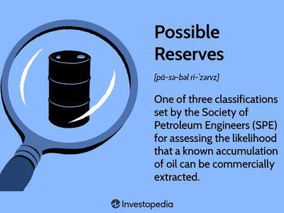

3P oil reserves, comprising Proven, Probable, and Possible reserves, play a pivotal role in the oil and gas industry. These reserves are fundamental to understanding the potential yield of oil fields and making informed decisions in exploration, production, and investment. 

Proven reserves, often denoted as P1, refer to quantities of petroleum that, based on geological and engineering data, are reasonably certain to be recoverable under existing economic and operational conditions. Probable reserves (P2) are those additional reserves which analysis of geological and engineering data suggest are more likely than not to be recoverable. Possible reserves (P3) foresee potential extra quantities that might be technically and economically feasible to extract under favorable circumstances. Together, these categories create a comprehensive framework for assessing the potential total recoverable oil from a particular field, thus being of immense significance for strategic planning and risk management in the oil sector.



The importance of 3P reserves extends beyond operational strategies to influence significant financial aspects, particularly for investors and companies. For investors, 3P reserves offer a measure of an oil company’s future growth prospects and profitability. Companies with substantial reserves of P1, P2, and P3 are typically perceived as having lower risk profiles, attracting more investment. For the companies involved, accurate reporting and management of 3P reserves drive corporate valuation, affecting their market competitiveness and ability to secure funding. In the global energy markets, these reserves help in forecasting supply availability, influencing oil prices and geopolitical strategies.

In an increasingly data-driven world, the intersection of 3P reserves with algorithmic trading signifies a transformative trend. Algorithmic trading in commodity markets utilizes computer algorithms to systematically execute trades, analyzing market data at speeds far beyond human capabilities. Integrating 3P reserve data into such algorithms can enhance predictive models, enabling traders to optimize their strategies based on real-time reserve fluctuation and market conditions. Consequently, these algorithms can lead to more accurate price discovery and increased market efficiency, reflecting the fundamental role of 3P reserves in shaping the future landscape of oil trading.

## Table of Contents

## Understanding 3P Oil Reserves

3P oil reserves represent a critical classification system in the oil and gas industry. They encompass Proven (P1), Probable (P2), and Possible (P3) reserves, which together provide a comprehensive assessment of the quantity of recoverable oil. Understanding these categories aids stakeholders in evaluating the potential and limitations of oil fields.

**Proven Reserves (P1)** are the most certain category, reflecting those volumes of oil that are recoverable with a high degree of confidence. This confidence arises from existing operational conditions, and typically, there's a 90% probability that the actual quantities recovered will equal or exceed the estimated volumes. Proven reserves are often termed as "1P" and include 'Proven Developed' and 'Proven Undeveloped' reserves. These classifications rely heavily on existing geological and engineering data, corroborated by production history or conclusive formation tests.

**Probable Reserves (P2)** are less certain than proven reserves, involving a 50% probability that the quantities actually recovered will meet or exceed the estimates. Often abbreviated as "2P" when combined with proven reserves, these reserves require more favorable conditions, such as technological advancements or improved recovery techniques, to be considered economically viable. Probable reserves are determined by the analysis of geological and engineering data, but with a degree of uncertainty due to factors like reservoir heterogeneity or operational challenges.

**Possible Reserves (P3)** present the least certainty, accounting for reserves with a 10% probability of recovery meeting or exceeding estimates. These are speculative reserves, identified through geological and theoretical models but lacking sufficient empirical verification to classify as probable or proven. Known as "3P" when combined with proven and probable reserves, they offer potential future resources contingent upon significant technological, market, or regulatory developments.

Classification criteria for these reserves are stringent, involving comprehensive geological surveys, advanced geological and engineering modeling, and thorough economic evaluations. The decision to classify reserves under these categories depends on the sufficiency of geophysical and geochemical data, reservoir pressure and temperature estimates, and economic factors such as projected oil prices and recovery costs.

The probabilities associated with each classification represent a statistical measure of confidence in the estimated recoverability. For investors and companies, these probabilities signify risk levels, influencing strategic decisions around exploration, development, and production. Proven reserves, with their lower risk profile, often underpin company valuations and secure financing, while probable and possible reserves offer insights into potential future gains and the strategic growth of an energy portfolio.

## Significance of 3P Oil Reserves

3P oil reserves, comprising Proven (P1), Probable (P2), and Possible (P3) reserves, are pivotal in managing risk and strategic planning for oil companies. These reserves form the foundation of a company's asset base, influencing financial health, operational decisions, and long-term viability.

Firstly, 3P reserves are integral to risk management strategies. Proven reserves, characterized by high certainty of extraction, provide a reliable foundation for production planning and financial forecasting. Probable and Possible reserves, while less certain, offer potential upside and guide strategic investments in exploration and technology. By categorizing reserves based on extraction probability, companies can allocate resources efficiently, balancing risk and reward. This strategic allocation helps mitigate the financial impact of market [volatility](/wiki/volatility-trading-strategies) and geopolitical uncertainties, essential aspects of risk management.

3P reserves also profoundly affect corporate valuation. The reserves form a significant component of an oil company's tangible assets, directly influencing market perception and investor confidence. Proven reserves typically provide immediate value, reflecting a company's capacity for stable revenue generation. Probable and Possible reserves, showcasing potential growth, attract investors seeking long-term gains. Consequently, accurate and comprehensive reserve disclosures are crucial for maintaining investor trust and securing capital. In fact, companies with substantial 3P reserves often enjoy higher market capitalization as the reserves represent potential future income streams.

Moreover, the data derived from 3P reserves significantly influence regulatory compliance and strategic operations. Regulatory bodies mandate precise reporting of reserves, ensuring transparency and accountability within the industry. Accurate 3P data supports compliance with reporting standards, such as the Petroleum Resources Management System (PRMS) or the U.S. Securities and Exchange Commission (SEC) requirements. Non-compliance can lead to legal repercussions and damage to corporate reputation, underscoring the importance of meticulous reserve management.

Strategically, companies utilize 3P reserves to align operations with market demands and technological advancements. For example, a detailed understanding of these reserves enables a company to prioritize investments in technologies that enhance extraction efficiency and environmental sustainability. This alignment is crucial as technological innovations can alter the feasibility of accessing Probable and Possible reserves, converting them into more certain assets over time.

In summary, 3P oil reserves provide a critical tool for managing operational and financial risks, influencing corporate valuation, and ensuring regulatory compliance. They enable oil companies to plan strategically for both immediate and long-term goals, making them essential to the industry's success and sustainability.

## Calculation and Estimation of 3P Reserves

The calculation and estimation of 3P oil reserves—Proven, Probable, and Possible—rely on a combination of geological, technical, and economic evaluations. These evaluations help in assessing the commercial viability and extraction feasibility of oil reserves. The estimation process is crucial, as it determines the classification of oil reserves, which is significant for strategic planning and financial analysis in the oil and gas industry.

### Geological Evaluations

Geological evaluations play a foundational role in estimating 3P reserves. Geophysical surveys, such as seismic surveys, are primary methods used to map and analyze subsurface formations. Seismic reflection techniques involve sending sound waves into the earth and interpreting the reflected signals to build a detailed picture of subsurface geology. This information assists in identifying potential hydrocarbon traps.

Core samples, extracted during drilling operations, provide direct evidence of the subsurface conditions. These samples help analyze rock properties, fluid content, porosity, and permeability, which are critical parameters in estimating reserves. Geological models integrate data from these geological assessments to predict the distribution and [volume](/wiki/volume-trading-strategy) of oil resources.

### Technical Evaluations

Technical evaluations involve advanced methodologies to refine reserve estimates. Reservoir simulation models are particularly significant. These models use mathematical and computational techniques to simulate the behavior of fluids within the reservoir over time. By inputting data from core samples and geophysical surveys, engineers can estimate the potential production rate and recovery [factor](/wiki/factor-investing) of the oil field.

Engineering assessments also include the evaluation of drilling and extraction technologies. Enhanced oil recovery (EOR) techniques, such as gas injection and thermal recovery, are considered to estimate the potential increase in extractable reserves. 

### Economic Evaluations

The economic aspects of estimating 3P reserves involve market conditions, operational costs, and pricing forecasts. Economic viability is assessed by evaluating the net present value (NPV) of a project, which considers future cash flows, discount rates, and the oil price environment. The classification of reserves depends significantly on whether the extraction is economically feasible under current or projected market conditions.

A reserve is classified as Proven (P1) when there is a high degree of certainty (90% probability) that it can be commercially extracted. Probable (P2) reserves have a 50% probability, and Possible (P3) reserves have a lower probability of economic extraction. As technological advancements and economic conditions evolve, these probabilities and classifications can shift.

### Influence of Technology and Economic Conditions

Technological advancements play a pivotal role in reserve estimation. Innovations in geological imaging, drilling, and extraction can significantly enhance the recovery rates and thus, potentially reclassify reserves from Probable or Possible to Proven. Similarly, changes in economic conditions, such as fluctuations in oil prices or improvements in cost-efficiency of extraction technologies, can alter the economic feasibility of extracting certain reserves, thereby impacting their classification.

In conclusion, the estimation of 3P oil reserves is a multifaceted process that requires the integration of geological, technical, and economic data. This data informs decisions regarding the classification and viability of oil reserves, which are essential for guiding strategic actions in the oil and gas industry.

## Investment Implications of 3P Oil Reserves

The classification of 3P oil reserves—Proven (P1), Probable (P2), and Possible (P3)—plays a critical role in shaping investment decisions in the oil and gas industry. Understanding these classifications allows investors to assess the potential profitability and risk associated with investing in companies dependent on oil extraction and reserves.

**Risk-Return Profile of Oil Companies Based on 3P Reserves**

Investors rely heavily on the classification of 3P reserves to evaluate the risk-return profile of oil companies. Proven reserves, characterized by a high degree of certainty regarding their recoverability under current economic and operational conditions, tend to be the most valuable. These reserves offer relatively low-risk investment opportunities and have a direct impact on a company's valuation.

Probable reserves are less certain than Proven reserves but still present a substantial probability of extraction, typically estimated at 50% probability. These reserves add potential upside to an investment, albeit with higher associated risks compared to Proven reserves.

Possible reserves, with a lower confidence level and estimated at approximately 10% probability, represent the highest risk but potentially high-reward investments. They act as a speculative element within a company's portfolio, offering significant upside potential if extraction becomes viable.

Investors often analyze the composition of a company's reserve portfolio to gauge its future potential. A company with a higher proportion of Proven reserves may be attractive to risk-averse investors seeking stable returns, while those with a higher concentration in Probable and Possible reserves might appeal to investors willing to accept higher risks for potentially greater returns.

**Technological Advancements and Shift in Recoverable Reserves Probability**

Technological advancements play a pivotal role in shifting the probability associated with recoverable reserves. Innovations in extraction techniques, such as hydraulic fracturing and enhanced oil recovery, have the potential to upgrade Probable and Possible reserves to Proven reserves by improving the efficiency and feasibility of extraction. 

For instance, the implementation of [machine learning](/wiki/machine-learning) algorithms and advanced geophysical imaging can enhance the accuracy of reserve estimations, allowing for better-informed investment decisions. Python, widely used for data analysis and modeling, can be employed in algorithms to process seismic data or simulate reservoir conditions, ultimately refining reserve classifications.

```python
import numpy as np
from sklearn.ensemble import RandomForestRegressor

# Example of a machine learning model for reserve estimation
# Features could include seismic data, historical extraction data, and economic conditions
features = np.array([...])  # hypothetical input features
target_reserves = np.array([...])  # hypothetical target reserve estimates

model = RandomForestRegressor(n_estimators=100)
model.fit(features, target_reserves)

# Predicting future reserves based on new data
new_data = np.array([...])
predicted_reserves = model.predict(new_data)
```

The capacity to re-evaluate reserves classifications with modern technology can attract more investments into the sector, particularly for companies demonstrating a commitment to adopting innovative approaches. This dynamic showcases how technology not only mitigates extraction risks but also enhances the economic attractiveness of oil companies by increasing the recoverability of reserves initially classified with lower confidence. 

Ultimately, understanding the interplay between reserve classifications and technological advancements provides investors with a strategic advantage in the oil and gas industry, aligning investment decisions with the evolving landscape of energy resources.

## Algorithmic Trading and Oil Reserves

Algorithmic trading in commodity markets utilizes computer algorithms to automate the trading process, significantly transforming how trades are executed. This approach leverages high-frequency data analytics to rapidly analyze market conditions and execute trades at optimal times, improving efficiency and reducing the emotional biases typical of human traders. The oil and gas industry, particularly with its reliance on accurate reserve estimates, benefits significantly from this technological advancement.

3P oil reserves—comprising Proven, Probable, and Possible reserves—are critical inputs into trading algorithms for several reasons. Accurate estimation of these reserves can affect supply forecasts, which in turn influence price trends in the commodity markets. The registration of higher 3P estimates by a company can signal increased future production capacity, affecting algorithmic predictions surrounding the company's stock value and commodities' price fluctuations. As trading algorithms input various data points, 3P reserves' estimates serve as vital indicators of a company's potential production output and market position, factored into predictions of stock price movements and future trades.

Data analytics play a pivotal role in refining and enhancing predictive models for oil reserve exploitation. With vast datasets available, machine learning algorithms can ingest and analyze data such as historical production rates, geophysical survey results, and economic factors to predict future reserve estimations more accurately. By applying complex statistical methods and computational techniques, these models improve the reliability of the reserve classification and the anticipated extraction results. For instance, advanced neural networks can develop more nuanced predictions by identifying patterns and correlations in historical data that may not be evident through traditional analysis.

This integration of data analytics into [algorithmic trading](/wiki/algorithmic-trading) allows for dynamic adjustments to market conditions, as trading systems can be trained to respond to volatility in real-time. Algorithmic systems, with the right models, can quickly assimilate new reserve estimate data and adjust trading positions accordingly, providing a competitive edge in the markets. As technological advancements continue to progress, the precision in estimating and leveraging 3P reserves is likely to improve, enhancing the strategic trading capabilities and operational decision-making of oil companies.

## Case Study: Industry Examples

ExxonMobil and BP are two of the largest and most influential players in the global oil and gas industry, showcasing distinct approaches to managing 3P (Proven, Probable, and Possible) oil reserves. Both companies utilize comprehensive strategies to estimate and maximize these reserves, profoundly affecting their market prospects and operational strategies.

### ExxonMobil

ExxonMobil adopts a robust and integrated approach to managing its 3P reserves. The company emphasizes using advanced technology and detailed geological assessments to ensure accurate reserve estimation. By leveraging state-of-the-art computational models and high-resolution 3D seismic surveys, ExxonMobil optimizes its ability to characterize subsurface geology and evaluate reserve potential with precision.

Accurate reserve estimation critically influences ExxonMobil’s market prospects by providing a solid foundation for strategic planning and risk assessment. The company’s reputation for precise reserve reporting enhances investor confidence, frequently resulting in a more favorable valuation compared to less transparent competitors. This accuracy allows ExxonMobil to better manage production schedules and capital expenditures, aligning its operations with market demands and shareholder expectations.

### BP

Similarly, BP employs sophisticated techniques in evaluating its 3P reserves. The company's strategy focuses on collaboration with independent consultants and external auditors to verify reserve claims, ensuring the integrity and accuracy of its reported figures. By engaging independent experts, BP bolsters the credibility of its reserve estimations, which is crucial in securing regulatory approval and maintaining investor trust.

BP’s emphasis on external verification has notable advantages. Independent consultants often bring a diverse range of expertise and cutting-edge methodologies, enriching BP’s internal processes and enhancing the accuracy of reserve classifications. This approach not only supports regulatory compliance but also strengthens BP’s strategic positioning in global markets. Verified reserves provide a reliable basis for BP’s capital investment decisions and help maintain its competitive edge through informed portfolio management.

### Impact of Accurate Reserve Estimation

For both ExxonMobil and BP, accurate reserve estimations are pivotal in informing corporate strategies and influencing their market valuation. The precision in estimating reserves allows these companies to effectively communicate value to stakeholders, aligning their market positioning with verified asset potential. Markets tend to reward companies with transparent and reliable reserve data through stronger financial performance and more substantial market capitalizations.

Moreover, the involvement of independent consultants in verifying oil reserve claims adds an extra layer of assurance for both regulators and investors. These consultants apply rigorous industry standards and best practices, enhancing the accuracy of the reserve estimation process. This independent verification can mitigate risks associated with overreporting, such as regulatory penalties or reputational damage.

In conclusion, ExxonMobil and BP exemplify how major oil companies leverage technological and methodological advancements to manage their 3P reserves effectively. Through a combination of precise estimation techniques and independent verification, these companies are able to maintain robust market prospects and secure investor confidence, underscoring the strategic importance of accurate reserve reporting in the oil and gas industry.

## Conclusion

3P oil reserves, encompassing Proven, Probable, and Possible reserves, hold a crucial position in the oil and gas industry. These classifications significantly influence the strategies of oil companies, investor decisions, and overall market stability. Understanding and correctly estimating 3P reserves is pivotal for managing risks, optimizing resource extraction, and ensuring long-term sustainability in energy markets.

As reserve estimation techniques continue to advance, leveraging technologies such as machine learning and [artificial intelligence](/wiki/ai-artificial-intelligence) promises more accurate and efficient assessments. These technologies can analyze extensive datasets from geophysical surveys, core samples, and reservoir simulations, enhancing the precision of reserve classifications. For example, machine learning algorithms can be implemented to identify patterns in seismic data that may indicate the presence of oil reserves with higher certainty. The following Python code snippet illustrates a simple framework for utilizing machine learning in this context:

```python
from sklearn.ensemble import RandomForestClassifier
import numpy as np

# Example data: geological features and known reserve classifications
data = np.array([[0.8, 0.7, 1], [0.4, 0.5, 0], [0.9, 0.6, 1], [0.3, 0.4, 0]])
features = data[:, :-1]  # Geological features
labels = data[:, -1]     # Reserve classification (1 for potential reserve, 0 otherwise)

# Initialize and train the Random Forest model
model = RandomForestClassifier(n_estimators=100)
model.fit(features, labels)

# Predict potential reserves for new geological data
new_data = np.array([[0.95, 0.65]])
predicted_classification = model.predict(new_data)
print("Predicted Reserve Classification:", predicted_classification)
```

Strategically, understanding and leveraging 3P reserves allows companies to optimize their exploration and production strategies, allocate resources effectively, and communicate value to stakeholders. For investors, knowledge of a company's 3P reserves aids in evaluating risk-return profiles and making informed decisions. Additionally, fluctuations in reserve estimates can impact oil prices and, consequently, trading strategies. Algorithmic trading systems can incorporate 3P reserve data to adapt to these market dynamics, potentially enhancing profitability.

In conclusion, the accurate estimation and strategic utilization of 3P oil reserves are central to both the operational efficiency of oil companies and the informed decision-making of investors. As technological advancements transform reserve estimation processes, there lies a significant opportunity to boost industry efficiency and forge a more resilient energy market.

## References & Further Reading

[1]: Society of Petroleum Engineers. ["Petroleum Resources Management System."](https://www.spe.org/industry/docs/Petroleum-Resources-Management-System-2007.pdf)

[2]: Schlumberger. ["Oil and Gas Reserves and Resources Definitions."](http://www.anpm.tl/wp-content/uploads/2024/11/Guidelines-for-Reserves-Resources-Reporting-draft57.pdf)

[3]: Adelman, M. A. (1990). ["Mineral Depletion, with Special Reference to Petroleum,"](https://dspace.mit.edu/handle/1721.1/27208) The Review of Economics and Statistics, 72(1), 1-10.

[4]: Sherwood, K. (2012). ["Understanding Oil and Gas Reserves: A Primer."](https://searchworks.stanford.edu/view/9547202).pdf) U.S. Energy Information Administration.

[5]: Deloitte. ["Reserves classification and categorization processes,"](https://www.researchgate.net/publication/273527659_Reserves_and_Resources_Classification_Definitions_and_Guidelines_Defining_the_Standard) Oil & Gas Financial Journal.

[6]: "Fundamentals of Investing in Oil and Gas" by Chris Termeer.

[7]: "World Oil Outlook 2020" published by the Organization of the Petroleum Exporting Countries (OPEC).