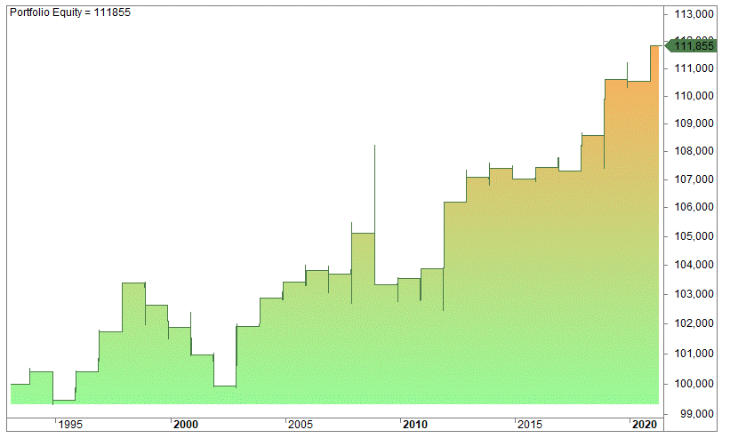

The stock market is a complex system where various factors can lead to fluctuations in trading patterns. A notable factor is the occurrence of holidays, during which the behavior of traders and markets can change significantly. The 4th of July, celebrated as Independence Day in the United States, is one such holiday that has particular significance. As a federal holiday, it results in the closure of U.S. stock exchanges, which alters usual trading routines.

The impact of the 4th of July on financial markets is multifaceted. Historical observations indicate fluctuations in trading volume and overall market activity in the days leading up to and following this holiday. This is partly due to many traders taking time off, resulting in reduced market participation. Lower trading volumes can lead to increased volatility, as fewer market participants might cause wider bid-ask spreads and larger price swings for certain securities.



For traders who employ algorithmic strategies, the 4th of July presents both challenges and opportunities. Algorithmic trading, which uses computer programs to automate trading decisions and execute trades at optimal prices, is particularly sensitive to changes in market conditions. The unique market dynamics around the 4th of July require traders to adjust their strategies to optimize performance. Understanding these dynamics is crucial for making informed decisions, managing risk, and potentially capitalizing on any resultant market inefficiencies.

This article explores the influence of the 4th of July on the stock market and considers the implications for algorithmic traders. By examining historical patterns and discussing strategic adjustments, traders can better prepare for the potential effects of this holiday on the markets.

## Table of Contents

## Understanding the 4th of July Effect on the Stock Market

The 4th of July, widely celebrated as Independence Day in the United States, is not only a significant cultural event but also has notable implications for the stock market. As a federal holiday, the 4th of July leads to the complete closure of U.S. stock exchanges, including the New York Stock Exchange (NYSE) and the Nasdaq. This closure results in a temporary halt in trading activities, prompting adjustments in trading volumes and market behavior in the period surrounding the holiday.

Historically, the days leading up to and following the 4th of July have exhibited distinctive trading patterns. Typically, there is a noticeable decrease in trading volume as traders anticipate the holiday and adjust their positions accordingly. The tendency for reduced market participation can lead to lower liquidity, which, in turn, may increase volatility as fewer trades dictate price movements. This scenario presents an opportunity and challenge for traders to navigate through potential rapid price changes.

Additionally, market sentiment during this period may be influenced by broader macroeconomic factors intersecting with holiday-related trading behavior. For instance, institutional investors might adjust their portfolios to reflect mid-year assessments, aligning with the halftime mark of the fiscal year, which coincides with the holiday. As a result, shifts in investor strategies can further affect trading patterns around the 4th of July.

Recognizing these historical patterns, traders—especially those engaged in [algorithmic trading](/wiki/algorithmic-trading)—often modify their strategies to account for the anticipated changes in trading activity. It becomes essential to [factor](/wiki/factor-investing) in the holiday effect when analyzing historical data or [backtesting](/wiki/backtesting) trading models to ensure accuracy. The absence of regular trading sessions during the 4th of July can skew data, necessitating adjustments to avoid misleading conclusions drawn from trading trends surrounding the holiday.

## Algorithmic Trading: An Overview

Algorithmic trading utilizes sophisticated computer algorithms to execute trades in financial markets. These algorithms analyze a vast array of market data and execute trades at speeds and frequencies beyond human capability. They are designed to follow predefined criteria, making use of mathematical models and statistical analyses to decide when to buy or sell assets.

At the core of algorithmic trading are strategies devised to maximize profits while minimizing associated risks. A fundamental aspect includes the employment of quantitative methods, often leveraging historical and real-time data to detect trading signals. For instance, an algorithm might be programmed to execute a buy order when a stock's 50-day moving average surpasses its 200-day moving average, a common signal indicating a potential upward trend.

Trading strategies in algorithmic trading can be categorized into several types, including market-making, trend-following, and [arbitrage](/wiki/arbitrage) opportunities. Market-making involves placing simultaneous buy and sell orders to capture the spread, thus providing [liquidity](/wiki/liquidity-risk-premium) to the market. Trend-following strategies capitalize on [momentum](/wiki/momentum), buying assets that are trending upwards and selling those trending downwards. Arbitrage strategies exploit price differences of similar financial instruments across different markets or forms, ensuring a risk-free profit.

Risk management is an integral part of algorithmic trading strategies. Algorithms monitor positions continuously and adjust them to manage exposure effectively. This might involve setting stop-loss orders, which automatically trigger a sale when a stock’s price drops to a predetermined level, or employing ‘[value at risk](/wiki/var-value-at-risk)’ metrics to predict and limit potential losses.

Developers utilize programming languages such as Python, C++, Java, and others to implement these algorithms. Python is particularly popular due to its rich ecosystem of libraries for data analysis and financial computation, such as NumPy, pandas, and scikit-learn, which facilitate the rapid development and testing of trading strategies. For example, a simple algorithm to backtest a moving average crossover strategy in Python might look like this:

```python
import pandas as pd

# Load historical price data
data = pd.read_csv('stock_data.csv')
data['50_MA'] = data['Close'].rolling(window=50).mean()
data['200_MA'] = data['Close'].rolling(window=200).mean()

# Generate trading signals
data['Signal'] = 0
data.loc[data['50_MA'] > data['200_MA'], 'Signal'] = 1  # Buy signal
data.loc[data['50_MA'] < data['200_MA'], 'Signal'] = -1 # Sell signal
```

Algorithmic trading has transformed modern financial markets, accounting for a significant proportion of total trading [volume](/wiki/volume-trading-strategy). Its strategic framework and sophisticated execution capabilities provide traders with a competitive edge, enabling them to react to market movements instantaneously while minimizing human error and emotional decision-making.

## Impact of Holiday Closures on Algorithmic Trading

Markets closing on the 4th of July can significantly impact algorithmic trading strategies, particularly those dependent on continuous market conditions. These interruptions necessitate recalibrations within algorithmic frameworks to align with the unusual market dynamics emerging around holidays. Algorithmic trading typically relies on the continuous influx of data and uninterrupted market operations to execute trades based on predefined algorithms. When a market closure occurs, it interrupts this flow, impacting algorithms that function on real-time data assessment and execution.

For algorithms that depend heavily on high-frequency trading ([HFT](/wiki/high-frequency-trading-strategies)), these closures can lead to a lack of sufficient trading opportunities, reducing potential profit margins. The absence of market activity results in data gaps that can distort predictive models, leading to suboptimal decision-making upon market reopening. Without modification, these strategies can incur increased risk.

Traders and developers must incorporate holiday schedules within their algorithmic designs to mitigate the effects of such closures. One common adjustment involves reconfiguring the algorithms to accommodate or exploit the anticipated low-volume trading sessions preceding and following the holiday. These periods often display reduced liquidity and can result in unusual price swings, necessitating a cautious approach.

Moreover, it becomes essential to backtest with historical data encompassing similar holiday periods to understand how past algorithms performed under comparable conditions. This backtesting can highlight weaknesses in the current strategy and inform necessary adjustments. A key aspect of this process involves augmenting the algorithms to recognize and respond to non-standard patterns that frequently emerge during holiday trading sessions.

An additional optimization strategy is altering the trade volume and timing around the 4th of July. This can be achieved by programming the algorithms to either scale back on trading activities during these periods or hold off the execution until market stability is predictably restored. 

In more sophisticated setups, [machine learning](/wiki/machine-learning) models can be introduced to predict market behavior based on patterns observed in previous holiday sessions. These models can adaptively modulate their trading strategies to optimize performance during atypical trading periods.

Python offers robust libraries for implementing these adaptations. For example, to automatically adjust trading rules around holidays, developers might employ a script to fetch market schedules and modify trading parameters accordingly:

```python
import datetime
import pandas_market_calendars as mcal

# Get market calendar for NYSE
nyse = mcal.get_calendar('NYSE')

# Check if the 4th of July is a trading day or holiday
date_to_check = datetime.date(2023, 7, 4)
is_holiday = nyse.valid_days(start_date=date_to_check, end_date=date_to_check).empty

if is_holiday:
    print("Market is closed on 4th of July, adjust algorithm parameters.")
else:
    print("Market is open, proceed with usual algorithm parameters.")
```

This script determines whether the market will be closed or open on a specific date, allowing the trading algorithm to adjust its strategies in advance. By integrating these structures, traders can mitigate the disruptions posed by the closure of the markets around the 4th of July, enhancing the resilience and adaptability of their algorithmic trading systems.

## Strategic Adjustments for the 4th of July

Adapting trading strategies around the 4th of July involves careful consideration of the unique market conditions that occur due to reduced activity and market closures. To effectively navigate this period, algorithmic traders adjust their trade volume and timing to better align with the expected market dynamics.

### Altering Trade Volume and Timing

Typically, the days surrounding the 4th of July holiday see a decline in trading volume. This dip can lead to increased [volatility](/wiki/volatility-trading-strategies) and less predictable price movements. Traders may reduce their trade volume during this period to mitigate the risks associated with these market conditions. Additionally, adjustments in timing are critical. For instance, executing trades either well in advance of the holiday or strategically on the shortened trading day can avoid the rush and potential slippage often observed as the market approaches a holiday break.

### Backtesting with Historical Data

Backtesting is a crucial component in refining algorithmic strategies, especially around holidays. To increase the accuracy of trading algorithms for the 4th of July, traders examine historical data from previous years that encompass this period. This data helps identify patterns and anomalies related to the holiday, enabling more informed adjustments to trading models.

For instance, an effective practice is to employ Python for backtesting strategies:

```python
import pandas as pd
import numpy as np

# Load historical market data
data = pd.read_csv('historical_market_data.csv')

# Convert date to datetime format for easier manipulation
data['Date'] = pd.to_datetime(data['Date'])

# Filter data to include days around the 4th of July
july_data = data[(data['Date'].dt.month == 7) & (data['Date'].dt.day <= 5) & (data['Date'].dt.day >= 2)]

# Calculate average volatility
average_volatility = np.std(july_data['Close'].pct_change())

print(f"Average volatility around the 4th of July: {average_volatility}")
```

This code snippet demonstrates loading historical data and filtering it to focus on the days surrounding the 4th of July. By analyzing percentage changes, traders can observe annual volatility trends and adjust their algorithms accordingly.

### Conclusion

Through strategic modifications, such as altering trade volume and execution timing around the holiday and robust backtesting with pertinent historical data, algorithmic traders can enhance their models. These adjustments help mitigate risks and leverage potential opportunities presented by market behaviors unique to the 4th of July.

## Pros and Cons of Trading Around the 4th of July

Trading around the 4th of July presents both opportunities and challenges for participants in the stock market, particularly those employing algorithmic strategies.

One of the main advantages of trading during this period is the potential opportunities arising from increased market volatility. The days surrounding the 4th of July can see atypical price movements attributed to changes in trading volume and investor behavior. Lower trading volumes, often observed due to the holiday's market closures, can amplify the price effects of trades, leading to greater volatility. This environment can be advantageous for traders who have strategies in place to capitalize on rapid price fluctuations, as it allows for the possibility of enhanced returns. Algorithms designed to exploit short-term volatility, such as mean reversion or momentum-based strategies, can thus be particularly profitable during these periods.

However, there are significant drawbacks associated with trading around the 4th of July. The primary disadvantage is the unpredictability of market movements. As trading volumes decrease during the holiday season, the liquidity in the market diminishes, which can lead to erratic price behavior and wider bid-ask spreads. This may result in increased transaction costs and slippage, making it more difficult for traders to execute orders at desired prices. Additionally, the market's reaction to macroeconomic news released during this period can be unpredictable, complicating the decision-making process for traders.

Moreover, algorithmic strategies that rely on continuous trading data might face challenges due to the market closures. Such interruptions require adjustments to be made to the trading algorithms to account for missing data or altered market conditions. Traders must therefore carefully consider historical data from previous years when backtesting and adjusting their models for the 4th of July period, to ensure their strategies are robust against these unique market dynamics.

In summary, while trading around the 4th of July can provide lucrative opportunities due to increased volatility and potential price movements, it also presents risks associated with reduced liquidity and unpredictable market behavior. Traders need to balance these factors, employing backtested and adaptable strategies to effectively navigate this distinctive trading environment.

## Conclusion

Independence Day presents a set of distinct challenges and opportunities for the stock market, particularly for those employing algorithmic trading strategies. Market closures and alterations in trading volumes during this period necessitate that traders remain vigilant and adaptable. The absence of trading activity on the 4th of July and the potential for reduced liquidity on surrounding days can induce increased volatility, which, while accounting for greater risk, may also unveil lucrative trading opportunities.

To effectively navigate this unique market landscape, traders should rigorously backtest their algorithms using historical data pertinent to previous 4th of July periods. Such testing can illuminate patterns and anomalies that typically emerge around the holiday, enabling traders to modify their strategies accordingly. This might involve adjusting parameters related to trade volume, entry and [exit](/wiki/exit-strategy) points, or risk management protocols to better align with the anticipated market behavior.

For instance, a Python script for backtesting a strategy could include adjustments like:

```python
import pandas as pd
import numpy as np

# Load historical stock data
data = pd.read_csv('historical_stock_data.csv', parse_dates=['Date'], index_col='Date')

# Define strategy parameters
lookback_period = 20
holiday_buffer = 5  # Days before and after the holiday

# Calculate moving average
data['Moving_Avg'] = data['Close'].rolling(window=lookback_period).mean()

# Implement strategy with adjustments for holiday period
def trading_strategy(data, holiday_buffer):
    signals = []
    for i in range(len(data)):
        if i >= lookback_period:
            if data['Close'][i] > data['Moving_Avg'][i]:
                signals.append("Buy")
            else:
                signals.append("Sell")
        else:
            signals.append("Hold")
    return signals

data['Signals'] = trading_strategy(data, holiday_buffer)

# Analyze strategy performance
performance = (data['Close'].pct_change() * (data['Signals'] == "Buy")).cumsum()

print(performance)
```

In conclusion, Independence Day requires traders to not only understand the risks associated with lower liquidity and market closure but also to harness algorithmic trading strategies as a tool for potential financial gain. By thoroughly testing and refining their models to accommodate holiday periods, traders can optimally position themselves to capitalize on market dynamics unique to this time.

## FAQs

### What is the impact of the 4th of July on the stock market?

The 4th of July, as a federal holiday in the United States, results in the closure of U.S. stock exchanges such as the NYSE and NASDAQ. Historically, the trading volume decreases in the days leading up to this holiday. Traders often anticipate lower liquidity, which can lead to increased volatility. Without regular trading sessions, price movements can be unpredictable both before and after the holiday, affecting stock valuations and traders' activities.

### How should algorithmic traders prepare for holiday-induced market changes?

Algorithmic traders should adjust their strategies to account for the holiday effect. Preparation includes analyzing historical data to understand market behavior around the 4th of July. This backtesting helps in refining algorithms to better handle reduced liquidity and potential volatility. Traders should adjust parameters such as trade volume, stop-loss limits, and execution timing to align with expected changes in market dynamics. For example, reducing trade volumes can mitigate risks associated with the holiday effect:

```python
# Example of adjusting trade volume for algorithmic trading
def adjust_trade_volume(original_volume, volatility_factor):
    return original_volume * volatility_factor

# Assuming lower liquidity and higher volatility around the 4th of July
current_trade_volume = 1000  # Example original volume
volatility_factor = 0.75  # Example factor reflecting increased volatility
adjusted_volume = adjust_trade_volume(current_trade_volume, volatility_factor)
print(f"Adjusted Trade Volume: {adjusted_volume}")
```

### Are there specific strategies that perform well around the 4th of July?

Certain strategies can potentially perform better during the 4th of July period, particularly those that exploit volatility or involve short-term trading windows. For instance, pairs trading or [statistical arbitrage](/wiki/statistical-arbitrage) strategies might be advantageous, allowing traders to capitalize on temporary price inefficiencies. Additionally, momentum-based strategies that adapt quickly to price changes might find success by harnessing increased volatility. However, these strategies should be rigorously tested and tailored to the specific conditions expected around the holiday to ensure efficacy.

## References & Further Reading

[1]: Bergstra, J., Bardenet, R., Bengio, Y., & Kégl, B. (2011). ["Algorithms for Hyper-Parameter Optimization."](https://papers.nips.cc/paper/4443-algorithms-for-hyper-parameter-optimization) Advances in Neural Information Processing Systems 24.

[2]: ["Advances in Financial Machine Learning"](https://www.amazon.com/Advances-Financial-Machine-Learning-Marcos/dp/1119482089) by Marcos Lopez de Prado

[3]: ["Evidence-Based Technical Analysis: Applying the Scientific Method and Statistical Inference to Trading Signals"](https://www.amazon.com/Evidence-Based-Technical-Analysis-Scientific-Statistical/dp/0470008741) by David Aronson

[4]: ["Machine Learning for Algorithmic Trading"](https://github.com/stefan-jansen/machine-learning-for-trading) by Stefan Jansen

[5]: ["Quantitative Trading: How to Build Your Own Algorithmic Trading Business"](https://books.google.com/books/about/Quantitative_Trading.html?id=j70yEAAAQBAJ) by Ernest P. Chan