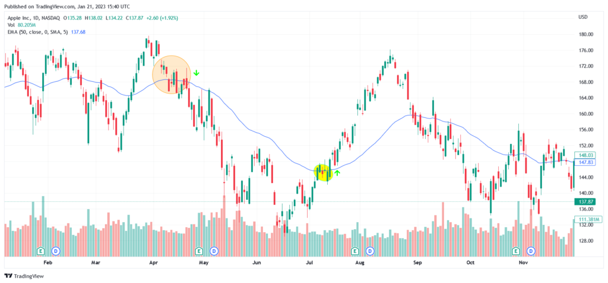

## Table of Contents

## What is an Exponential Moving Average (EMA)?

An Exponential Moving Average (EMA) is a type of moving average that puts more weight on recent prices. It's used in trading to help smooth out price data and make trends easier to spot. Unlike a simple moving average, which treats all prices the same, an EMA reacts more quickly to new information because it gives more importance to the latest price changes.

To calculate an EMA, you start with a simple moving average and then use a formula that includes a multiplier to give more weight to recent prices. The multiplier is based on the number of periods you're using for the EMA. For example, a 20-day EMA will react more quickly to price changes than a 50-day EMA because it uses more recent data. Traders often use EMAs to decide when to buy or sell, as they can help identify when a trend might be starting or ending.

## How is the 50-day EMA calculated?

To calculate a 50-day EMA, you first need to find the 50-day simple moving average (SMA). This is done by adding up the closing prices of the last 50 days and then dividing by 50. Let's call this number the starting point for your EMA. After that, you use a special formula to update the EMA each day. The formula is: EMA = (Closing Price - Previous EMA) * Multiplier + Previous EMA. The multiplier for a 50-day EMA is 2/(50 + 1), which equals about 0.0392.

Each day, you take the current day's closing price, subtract the previous day's EMA, multiply the result by the multiplier (0.0392), and then add that to the previous day's EMA. This way, the most recent prices have a bigger impact on the EMA than older prices. For example, if yesterday's EMA was 100 and today's closing price is 102, the new EMA would be (102 - 100) * 0.0392 + 100, which equals about 100.78. You repeat this process every day to keep the EMA up to date.

## Why is the 50-day EMA considered significant in trading?

The 50-day EMA is considered significant in trading because it helps traders see the overall trend of a stock or asset over a medium-term period. By looking at the 50-day EMA, traders can tell if the price is going up or down over about two months. If the price stays above the 50-day EMA, it suggests that the trend is upward, which might be a good time to buy. If the price drops below the 50-day EMA, it could mean the trend is turning downward, and it might be a time to sell.

Traders also use the 50-day EMA to spot when the trend might be changing. For example, if the price crosses above the 50-day EMA after being below it, this could be a signal that the trend is turning bullish. On the other hand, if the price crosses below the 50-day EMA after being above it, it might signal a bearish trend. This makes the 50-day EMA a useful tool for making decisions about when to enter or [exit](/wiki/exit-strategy) trades.

## What is the 50 EMA Strategy?

The 50 EMA strategy is one of the cornerstone approaches in technical analysis, primarily utilizing the 50-day Exponential Moving Average (EMA) to capture medium-term market trends effectively. This strategy is leveraged by traders to ascertain the direction of the market trend, thereby facilitating the timing of entry and exit points in trading decisions.

At its core, the 50 EMA is a type of moving average that assigns greater significance to more recent price data, making it particularly responsive to price changes while smoothing out historical data. The mathematical formula for calculating the EMA is:

$$
\text{EMA}_t = \left( \frac{\text{Price}_t \times \text{Multiplier}}{1 + \text{Days}} \right) + \left( \text{EMA}_{t-1} \times \left(1 - \text{Multiplier}\right) \right)
$$

where the multiplier is computed as:

$$
\text{Multiplier} = \frac{2}{\text{Days} + 1}
$$

In this formula, $\text{EMA}_t$ represents the current EMA value, $\text{Price}_t$ is the current price, and $\text{EMA}_{t-1}$ is the previous EMA value. For a 50-day period, the calculations adjust to the specified day count accordingly.

The 50 EMA gains popularity because of its ability to filter out noise from random price fluctuations and maintain a focus on the established trend. By implementing this moving average, traders can swiftly determine the prevailing trend by simply observing whether the current price is positioned above or below the 50 EMA line.

Beyond trend identification, the 50 EMA strategy is instrumental in generating actionable buy and sell signals, especially when combined with other technical indicators. For instance, traders frequently employ oscillators such as the Relative Strength Index (RSI) or [momentum](/wiki/momentum) indicators like the Moving Average Convergence Divergence (MACD) in conjunction with the 50 EMA. This multi-indicator approach enhances the reliability of the signals generated, enabling traders to make more informed trading decisions.

Due to its adaptability, the 50 EMA is a powerful component of a trader's toolkit, proving effective across various market conditions and asset classes. By integrating the 50 EMA with other indicators, traders can refine their strategies, thus optimizing their trading performance.

## What are the entry and exit signals when using the 50 EMA strategy?

When using the 50-day EMA strategy, the entry signal to buy happens when the price of the stock or asset moves from being below the 50-day EMA to above it. This is called a bullish crossover. It suggests that the trend is turning up, and it might be a good time to buy the stock or asset. Traders look for this crossover because it can mean the start of an upward trend over the next two months.

The exit signal to sell comes when the price moves from being above the 50-day EMA to below it. This is known as a bearish crossover. It means the trend might be turning down, and it could be a good time to sell the stock or asset. By watching these crossovers, traders can decide when to get in and out of trades based on the medium-term trend shown by the 50-day EMA.

## How does the 50 EMA strategy perform in different market conditions?

The 50-day EMA strategy works well in trending markets, where the price of a stock or asset is clearly going up or down over time. When the market is trending up, the 50-day EMA can help traders catch the upward movement by signaling them to buy when the price crosses above the EMA. In a downward trend, the strategy helps by telling traders to sell when the price falls below the EMA. This way, traders can make good trades by following the trend and staying in the market during strong up or down movements.

In a sideways or choppy market, where the price moves up and down without a clear direction, the 50-day EMA strategy might not work as well. The price can cross above and below the EMA many times, giving false signals to buy and sell. This can lead to traders buying and selling too often, which can result in losses due to trading costs and small price movements. So, while the 50-day EMA is great for trending markets, it's less useful in markets without a clear trend.

## Can the 50 EMA strategy be combined with other indicators, and if so, how?

Yes, the 50-day EMA strategy can be combined with other indicators to make trading decisions better. One common way is to use it with the 200-day EMA. Traders look at when the 50-day EMA crosses above the 200-day EMA, which is called a "golden cross." This can be a strong buy signal because it shows a long-term trend might be starting. On the other hand, if the 50-day EMA crosses below the 200-day EMA, known as a "death cross," it can be a strong sell signal because it might mean a long-term downtrend is starting.

Another way to use the 50-day EMA with other indicators is with the Relative Strength Index (RSI). The RSI helps show if a stock is overbought or oversold. If the price crosses above the 50-day EMA and the RSI is not in the overbought zone, it can be a good time to buy. If the price crosses below the 50-day EMA and the RSI is not in the oversold zone, it might be a good time to sell. By combining the 50-day EMA with other indicators like the 200-day EMA and RSI, traders can get more reliable signals and avoid some of the false signals that can happen when using the 50-day EMA alone.

## What are the common pitfalls and mistakes to avoid when using the 50 EMA strategy?

One common pitfall when using the 50-day EMA strategy is relying on it too much during choppy or sideways markets. In these conditions, the price can move above and below the 50-day EMA a lot, which can lead to false signals. Traders might buy and sell too often, which can result in losses from trading costs and small price changes. It's important to be aware of the market conditions and not just follow the 50-day EMA without thinking about other factors.

Another mistake to avoid is not using the 50-day EMA with other indicators. While the 50-day EMA can be useful on its own, it works better when combined with other tools like the 200-day EMA or the Relative Strength Index (RSI). Using these together can give more reliable signals and help avoid some of the false signals that can come from using the 50-day EMA alone. By looking at more than one indicator, traders can make smarter decisions and improve their chances of success.

## How can risk management be integrated into the 50 EMA trading strategy?

Risk management is important when using the 50-day EMA strategy. One way to manage risk is to set stop-loss orders. A stop-loss order is a way to limit how much money you can lose on a trade. For example, if you buy a stock when it crosses above the 50-day EMA, you can set a stop-loss order below the EMA. If the price falls back below the EMA, the stop-loss will trigger and sell your stock, helping you avoid big losses. This way, you can follow the 50-day EMA strategy but still protect your money.

Another way to manage risk is to not put all your money into one trade. Instead, you can split your money into smaller parts and use each part for different trades. This is called diversification. If one trade doesn't go well, you won't lose all your money because you have other trades going on. By using stop-loss orders and diversifying, you can use the 50-day EMA strategy but also keep your risk under control. This helps you stay in the game longer and have a better chance of making money over time.

## What are some advanced techniques for optimizing the 50 EMA strategy?

One advanced technique for optimizing the 50-day EMA strategy is to use multiple time frames. Instead of just looking at the daily chart, traders can also look at the weekly or monthly charts to get a better idea of the overall trend. If the 50-day EMA on the daily chart is showing a bullish crossover, but the 50-day EMA on the weekly chart is still below the price, it might be a good idea to wait before buying. This can help traders avoid false signals and make sure they are trading in the direction of the bigger trend.

Another technique is to combine the 50-day EMA with other moving averages, like the 20-day and 200-day EMAs. This can help traders see different trends happening at the same time. For example, if the 20-day EMA crosses above the 50-day EMA, and the 50-day EMA is already above the 200-day EMA, this can be a strong buy signal because it shows that short-term, medium-term, and long-term trends are all moving up. By looking at these different moving averages together, traders can get a clearer picture of the market and make better trading decisions.

## How does the 50 EMA strategy compare to other moving average strategies like the 200 EMA or 100 EMA?

The 50-day EMA strategy is popular because it helps traders see the medium-term trend of a stock or asset. It's faster than the 200-day EMA, which looks at the long-term trend over about eight months. Because the 50-day EMA reacts more quickly to price changes, it can be good for catching shorter trends and making trades based on them. On the other hand, the 200-day EMA is better for understanding the bigger picture and making decisions based on long-term trends. Traders often use the 50-day EMA to spot when a trend might be starting or ending, while the 200-day EMA can help them see if the overall direction is up or down.

The 100-day EMA falls in between the 50-day and 200-day EMAs, looking at the trend over about four months. It's slower than the 50-day EMA but faster than the 200-day EMA. This makes it useful for traders who want to see a trend that's longer than the medium-term but not as long as the long-term. The 100-day EMA can help smooth out some of the short-term noise that the 50-day EMA might pick up, but it still reacts faster than the 200-day EMA. By choosing the right EMA, traders can match their strategy to the kind of trends they are trying to follow and the time frame they are most interested in.

## References & Further Reading

[1]: ["Evidence-Based Technical Analysis: Applying the Scientific Method and Statistical Inference to Trading Signals"](https://www.amazon.com/Evidence-Based-Technical-Analysis-Scientific-Statistical/dp/0470008741) by David Aronson

[2]: ["Advances in Financial Machine Learning"](https://www.amazon.com/Advances-Financial-Machine-Learning-Marcos/dp/1119482089) by Marcos Lopez de Prado

[3]: ["Quantitative Trading: How to Build Your Own Algorithmic Trading Business"](https://books.google.com/books/about/Quantitative_Trading.html?id=j70yEAAAQBAJ) by Ernest P. Chan

[4]: ["Machine Learning for Algorithmic Trading"](https://github.com/stefan-jansen/machine-learning-for-trading) by Stefan Jansen

[5]: Bergstra, J., Bardenet, R., Bengio, Y., & Kégl, B. (2011). ["Algorithms for Hyper-Parameter Optimization."](https://dl.acm.org/doi/10.5555/2986459.2986743) Advances in Neural Information Processing Systems 24.