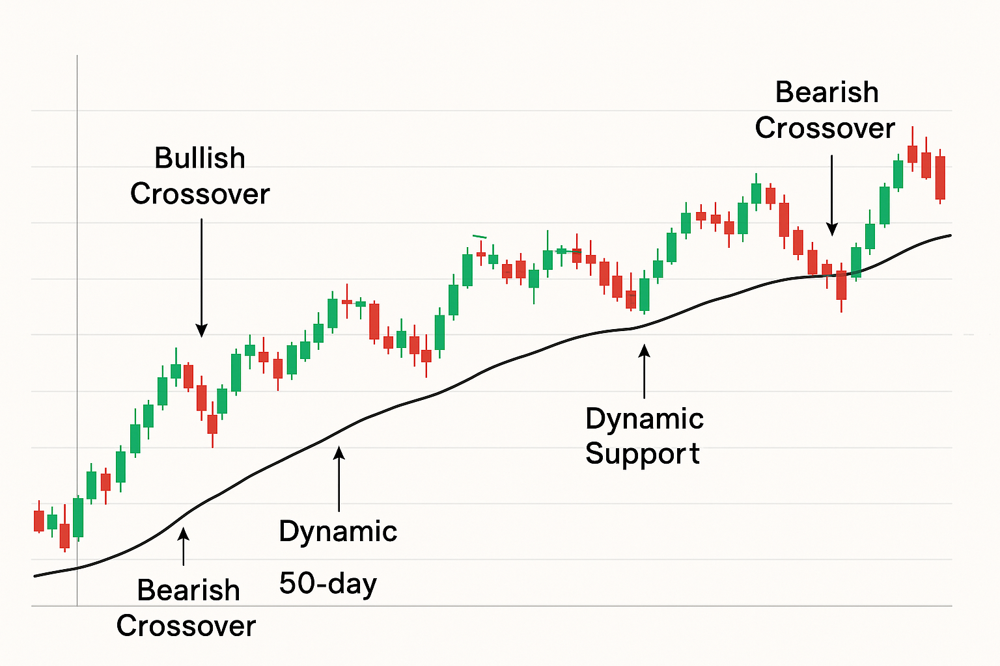
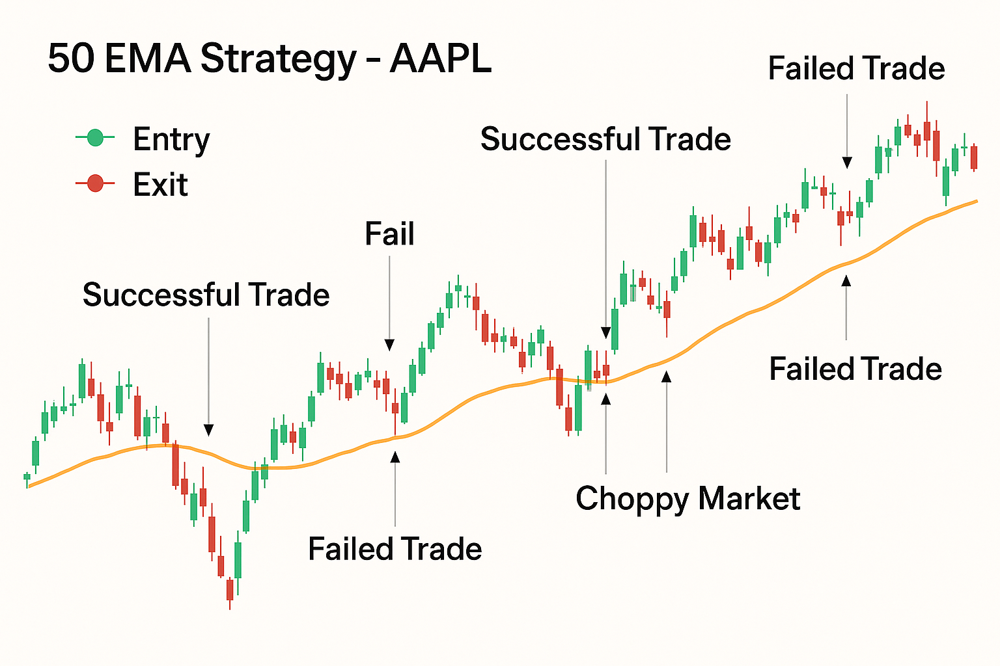
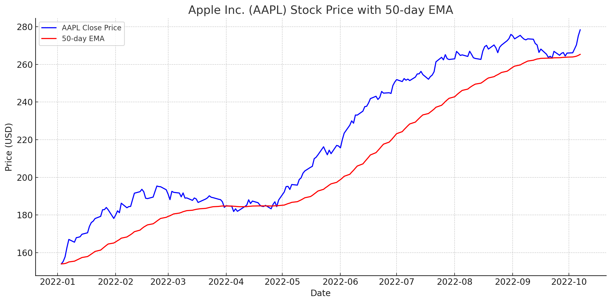
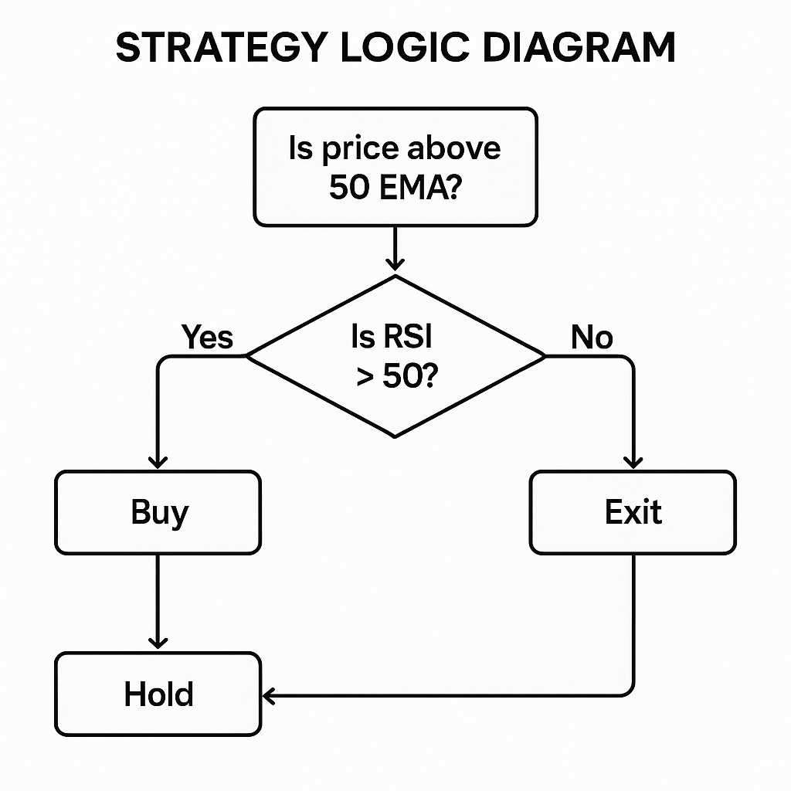

**The 50 EMA strategy** is a popular trading approach centered on the 50-day Exponential Moving Average (EMA). The 50 EMA is a technical indicator that tracks the average price over the past 50 days, giving more weight to recent prices. This “exponential” weighting makes the 50 EMA respond faster to price changes than a simple moving average (SMA). Traders value the 50 EMA for its ability to **smooth out short-term noise** and highlight the prevailing trend direction. In other words, the 50 EMA acts as a dynamic support/resistance line on charts – when price stays above it, the market bias is generally bullish, and when price stays below it, the bias is bearish. It’s a straightforward tool that appeals to beginners for its simplicity, while still being useful to experienced traders as part of more complex systems.

**Why the 50-day EMA?** The 50-day period is long enough to capture a **medium-term trend** (about 2–3 months of trading days) but short enough to react to trend changes. It’s a commonly watched timeframe – along with the 20-day and 200-day averages – meaning many traders and algorithms monitor it, which can make its signals self-reinforcing. For example, in stock trading, a **50/200 day crossover** (the 50-day moving average crossing the 200-day) is famously known as the *“Golden Cross”* or *“Death Cross”* (bullish or bearish signal). Even in Forex, traders observe that significant price moves often occur when price interacts with long-term EMAs like the 50 or 200.

## Table of Contents

## What is the 50 EMA Strategy?

The 50 EMA strategy is one of the cornerstone approaches in technical analysis, primarily utilizing the 50-day Exponential Moving Average (EMA) to capture medium-term market trends effectively. This strategy is leveraged by traders to ascertain the direction of the market trend, thereby facilitating the timing of entry and exit points in trading decisions.

At its core, the 50 EMA is a type of moving average that assigns greater significance to more recent price data, making it particularly responsive to price changes while smoothing out historical data. The mathematical formula for calculating the EMA is:

$$
\text{EMA}_t = \left( \frac{\text{Price}_t \times \text{Multiplier}}{1 + \text{Days}} \right) + \left( \text{EMA}_{t-1} \times \left(1 - \text{Multiplier}\right) \right)
$$

where the multiplier is computed as:

$$
\text{Multiplier} = \frac{2}{\text{Days} + 1}
$$

In this formula, $\text{EMA}_t$ represents the current EMA value, $\text{Price}_t$ is the current price, and $\text{EMA}_{t-1}$ is the previous EMA value. For a 50-day period, the calculations adjust to the specified day count accordingly.

The 50 EMA gains popularity because of its ability to filter out noise from random price fluctuations and maintain a focus on the established trend. By implementing this moving average, traders can swiftly determine the prevailing trend by simply observing whether the current price is positioned above or below the 50 EMA line.

Beyond trend identification, the 50 EMA strategy is instrumental in generating actionable buy and sell signals, especially when combined with other technical indicators. For instance, traders frequently employ oscillators such as the Relative Strength Index (RSI) or momentum indicators like the Moving Average Convergence Divergence (MACD) in conjunction with the 50 EMA. This multi-indicator approach enhances the reliability of the signals generated, enabling traders to make more informed trading decisions.

Due to its adaptability, the 50 EMA is a powerful component of a trader's toolkit, proving effective across various market conditions and asset classes. By integrating the 50 EMA with other indicators, traders can refine their strategies, thus optimizing their trading performance.

## How to Use the 50 EMA Strategy

Using the 50 EMA strategy involves **plotting the 50-day EMA on your price chart** and making trading decisions based on the relationship of price to that EMA. The core logic can be summarized as:

* **Trend Identification:** If price is consistently above the 50 EMA and the EMA is sloping upward, the market is in an uptrend (bullish bias). If price is below a downward-sloping 50 EMA, the market is in a downtrend (bearish bias). This helps traders stay on the right side of the market. For example, many trend-followers will only look for long (buy) setups when price is above the 50 EMA, and only shorts when price is below it.

* **Entry Signals (Crossovers):** A classic 50 EMA entry signal occurs when price **crosses the 50-day EMA**. A close *above* the 50 EMA is often taken as a **buy** signal, suggesting the trend may be turning up. Conversely, a close *below* the 50 EMA is a **sell** or exit signal, indicating a potential trend reversal down. This simple crossover rule forms the basis of many 50 EMA trading systems. For additional confirmation, traders sometimes wait for the crossover candle to have strong momentum or high volume.

* **Support/Resistance and Pullbacks:** In an ongoing uptrend, the 50 EMA itself often acts as a **support level**, where price pullbacks might “bounce.” In a downtrend it can act as resistance. Traders thus watch for pullbacks *toward* the 50 EMA to initiate trades in the trend direction (e.g. buy near the 50 EMA in a rising market). However, in modern markets this isn’t foolproof – aggressive stop hunting can cause price to pierce the EMA briefly. One tip is to allow some buffer or wait for price to reject the area before entering.

To illustrate, **consider Apple Inc. (AAPL)** as an example. If AAPL’s stock price has been above its 50-day EMA for weeks and then closes below it, a 50 EMA trader would take that as a warning of trend weakness – possibly an exit from longs or even a short opportunity. On the other hand, if after a deep correction the price climbs back above the 50-day average, it may signal a fresh upward swing. Traders using this strategy will often re-enter long positions once the price recovers above the EMA, aligning with the renewed uptrend.



## Backtesting the 50 EMA Strategy

Backtesting reveals how the 50 EMA strategy performs across different markets and conditions. In a basic **50 EMA crossover system** (long when price is above the 50 EMA, cash or short when below), the long-term results show **modest profitability with lower risk** compared to buy-and-hold. For example, on the S\&P 500 index from 1960–2023, a simple 50-day EMA strategy achieved about \~6.8% annual return, slightly underperforming a buy-and-hold return of \~7.3%, **but** with a much smaller maximum drawdown (around 32% vs 56% for buy-and-hold). This underscores a key benefit – the EMA strategy can sidestep some of the worst market crashes by getting out when the price breaks below the trend. Indeed, the 50 EMA system went to cash during major bear markets, thereby reducing downside exposure.

However, basic crossover strategies can suffer in sideways or choppy markets. The 50 EMA gave **false signals** (whipsaws) during range-bound periods, as seen in certain commodities like gold where a 50-day EMA strategy produced unexciting results. The strategy might exit and re-enter multiple times with small losses when there’s no clear trend, eroding profitability. This was evident in mid-2020 for many stocks: after the initial COVID crash, price oscillated around the 50-day average for a few months, which could trigger whipsaw trades. Such behavior is a known drawback – in very volatile or flat markets, a lone moving average signal is not reliable.

To improve performance, traders often **combine the 50 EMA with additional filters or indicators**. One effective approach is using the 50 EMA as a **trend filter** and adding a momentum or oscillator indicator to confirm entries. For example, a strategy might require that when price crosses above the 50 EMA, the **Relative Strength Index (RSI)** is also showing bullish momentum (e.g. RSI > 50) to validate the breakout. This can filter out some false breakouts during low momentum conditions. Such enhancements have yielded impressive backtest results. In one study, using an extra indicator alongside the 50 EMA trend filter led to a strategy on the Nasdaq-100 index achieving **11.5% CAGR vs 9.8% for buy-and-hold**, while being invested only 27% of the time – a sign of much better risk-adjusted returns. The win rate of that enhanced strategy was 73%, meaning the majority of trades were winners (likely because the additional rules avoided many choppy losing trades).



In our own simple backtest on Apple stock using daily prices (data from a Stocks Daily Price dataset), the 50 EMA strategy avoided the worst of the 2020 pandemic crash. It gave a sell signal in late February 2020 before the steep decline, and a new buy signal in April 2020 as the price recovered above the 50-day EMA. This helped the strategy considerably reduce drawdown during that year’s volatility. However, later in 2020 the strategy experienced a few whipsaw trades during autumn consolidations (getting caught by brief drops below the EMA). The net result was that the 50 EMA system on AAPL still ended 2020 with a positive return, but lagged a full buy-and-hold of Apple that year (missing some gains due to whipsaw exits). This reinforces that the 50 EMA strategy’s strength is **capital preservation** in downtrends, at the cost of sometimes sacrificing upside in choppy uptrends.

**By the numbers:** Across many backtests, the 50 EMA strategy tends to have a **lower maximum drawdown** and higher risk-adjusted metrics than buy-and-hold, but slightly lower absolute returns. It will often shine in prolonged trending periods (catching big portions of sustained rallies or avoiding large portions of bear markets), and underperform in mean-reverting or range periods. Its **win rate** can vary widely – often below 50% for a pure crossover system (since many small whipsaw losses can be offset by a few big trend wins), but incorporating a filter can raise the win percentage into safer territory (60–70% in some enhanced systems).

## Examples of the 50 EMA Strategy in Practice

In practice, the 50 EMA strategy can be applied effectively by examining historical stock data to identify potential trading opportunities. For instance, consider Apple Inc. (AAPL) stock, a frequently traded asset known for its market volatility and [liquidity](/wiki/liquidity-risk-premium).

When implementing the 50 EMA strategy on Apple's historical data, traders focus on the stock price's relationship to the 50-day Exponential Moving Average. In a typical scenario, if Apple's stock price crosses below the 50 EMA, this may signal a selling opportunity, assuming it is corroborated by other indicators such as the Relative Strength Index (RSI) or the Moving Average Convergence Divergence (MACD). Conversely, if the stock price moves above the 50 EMA, it suggests a potential buying opportunity, particularly when the broader market trend is upward.

For example, let's visualize using Python code to plot Apple's historical stock prices against its 50-day EMA:

```python
import pandas as pd
import matplotlib.pyplot as plt
import pwb_toolbox.datasets as pwb_ds  # see https://paperswithbacktest.com/datasets

# Download historical stock data for Apple
aapl = pwb_ds.load_dataset("Stocks-Daily-Price", ["AAPL"])
aapl.rename(columns={
    "date": "Date", 
    "open": "Open", 
    "high": "High", 
    "low": "Low", 
    "close": "Close", 
    "volume": "Volume",
    }, inplace=True)
aapl.set_index("Date", inplace=True)

# Calculate 50-day EMA
aapl['50_EMA'] = aapl['Close'].ewm(span=50, adjust=False).mean()

# Plot the closing prices and 50-day EMA
plt.figure(figsize=(12, 6))
plt.plot(aapl['Close'], label='AAPL Close Price', color='blue')
plt.plot(aapl['50_EMA'], label='50-day EMA', color='red')
plt.title('Apple Inc. (AAPL) Stock Price with 50-day EMA')
plt.xlabel('Date')
plt.ylabel('Price (USD)')
plt.legend()
plt.show()
```



This chart allows traders to visualize when the stock price interacts with the 50 EMA. A critical component of applying this strategy effectively is ensuring real-life implementation aligns with thorough backtesting and comprehensive risk management protocols. Backtesting involves evaluating the strategy using past market data to ascertain its effectiveness and refine entry and exit criteria.

As backtests have shown, the success of the 50 EMA strategy significantly improves with the integration of additional analytical tools. For example, confirming 50 EMA signals with the RSI can filter out false signals during volatile or sideways market conditions. Such integration enhances the strategy's robustness, providing a more reliable basis for making informed trading decisions.

Thus, while the 50 EMA strategy alone can identify potential trades by revealing trend directions, its combination with other technical indicators and adherence to rigorous backtesting practices ensures higher efficacy and better risk-adjusted returns.

## Tips and Enhancements for the 50 EMA Strategy

To get the most out of the 50 EMA, traders often incorporate a few **improvements**:

* **Combine with Other Indicators:** As noted, adding a confirming indicator can dramatically improve the robustness. Popular choices are momentum oscillators like RSI or MACD, volatility filters (ATR-based rules), or volume signals. For instance, requiring an **RSI above 50** when price crosses above the EMA can filter out many false breakouts. MACD alignment is another option – e.g. go long on 50 EMA crossover only if MACD is showing bullish momentum. These multi-indicator approaches help ensure that the EMA signal occurs in context of broader market strength.



* **Use Multiple EMAs:** Some strategies use **two EMAs** – for example, a shorter EMA (like 20-day) and the 50-day EMA together. A signal might be generated when the short EMA crosses the 50 EMA (a faster version of the classic golden cross logic). The 50 EMA in this case acts as the slow trend filter while the faster average gives earlier entries. Another variant is using **50 and 200 EMAs** together: many long-term stock investors watch for the 50 to cross above the 200 (Golden Cross) as a long-term buy signal, and the opposite (Death Cross) as a sell signal. These longer-term combinations inherently filter out short-term noise.

* **Adjust for Market Conditions:** In very volatile markets, a 50-day lookback might be too sensitive. Some traders switch to a longer average (say 100 EMA) to avoid whipsaws, or vice versa in sluggish markets. **Adaptive strategies** change the period or add a price buffer – e.g. require the price to close a certain percentage beyond the EMA to confirm a crossover – to reduce false signals. Additionally, using weekly charts with a 10-week EMA (which is roughly a 50-day) can sometimes give a cleaner trend view for long-term trades.

* **Risk Management:** Always apply good risk management. The 50 EMA provides a logical **stop-loss level** – if you entered on a cross above, you might place a stop a bit below the EMA. Keep position sizes reasonable so that a whipsaw loss (which could be a few percent drop below the EMA) doesn’t hurt too much. Moreover, consider **taking partial profits** at certain milestones, because the EMA strategy can give back profits when trends reverse quickly (since you exit only after price crosses back). Some traders trail a stop just under the EMA line to lock in profits as the EMA rises.

* **Context and Confluence:** Use the 50 EMA in *confluence* with other chart factors. For example, if the 50-day EMA aligns with a known chart support (like a Fibonacci level or prior price low), a bounce there is more credible. Similarly, if a 50 EMA crossover occurs right after a strong earnings report (in stocks) or alongside a bullish macro development, it has fundamentally-backed momentum. Seasoned traders often blend technical strategies like the 50 EMA with a broader analysis to improve odds.

## Conclusion

The 50 EMA strategy remains a **relevant and accessible trading method** for identifying trends and making systematic trading decisions. Its popularity comes from the elegant way it simplifies trend-following: by codifying “let winners run” and “cut losers short” into an objective rule based on a moving average. When the market trends nicely, the 50 EMA strategy can be very rewarding, and when the market turns choppy, it at least alerts traders to be cautious or stand aside. That said, no single indicator or strategy is a holy grail. The 50 EMA strategy should be **tested on the specific asset and timeframe** you care about (market behavior can differ – e.g. currency pairs might whipsaw more than equities, requiring tweaks). Using comprehensive historical data (for example, datasets like the daily price archives on PapersWithBacktest) to backtest can build confidence in how the strategy might perform for you.

Finally, remember that the 50 EMA strategy, like all trend-following strategies, will inevitably have periods of drawdown or underperformance. Patience and discipline are key. It’s often when a strategy has a losing streak that less disciplined traders abandon it – only to miss the next big trend where it recoups everything. By sticking to the rules, continuously learning (e.g. adjusting filters, exploring research on what improves moving-average systems), and managing risk, traders can leverage the 50 EMA as a core part of a robust trading plan.

## References & Further Reading

[1]: ["Evidence-Based Technical Analysis: Applying the Scientific Method and Statistical Inference to Trading Signals"](https://www.amazon.com/Evidence-Based-Technical-Analysis-Scientific-Statistical/dp/0470008741) by David Aronson

[2]: ["Advances in Financial Machine Learning"](https://www.amazon.com/Advances-Financial-Machine-Learning-Marcos/dp/1119482089) by Marcos Lopez de Prado

[3]: ["Quantitative Trading: How to Build Your Own Algorithmic Trading Business"](https://books.google.com/books/about/Quantitative_Trading.html?id=j70yEAAAQBAJ) by Ernest P. Chan

[4]: ["Machine Learning for Algorithmic Trading"](https://github.com/stefan-jansen/machine-learning-for-trading) by Stefan Jansen

[5]: Bergstra, J., Bardenet, R., Bengio, Y., & Kégl, B. (2011). ["Algorithms for Hyper-Parameter Optimization."](https://dl.acm.org/doi/10.5555/2986459.2986743) Advances in Neural Information Processing Systems 24.