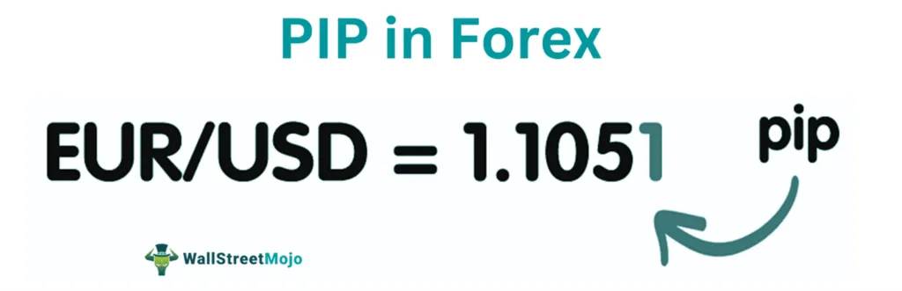

## Table of Contents

## What are pips in forex trading?

In forex trading, a pip is a very small measure of change in a currency pair's exchange rate. It stands for "percentage in point" or "price interest point." Most major currency pairs are priced to four decimal places, so a pip is typically the smallest change in that fourth decimal place. For example, if the EUR/USD moves from 1.1850 to 1.1851, that 0.0001 change is one pip.

Some currency pairs, like those involving the Japanese yen, are quoted to two decimal places. In these cases, a pip is the smallest change in the second decimal place. For instance, if the USD/JPY moves from 110.00 to 110.01, that 0.01 change is one pip. Understanding pips is important because they help traders measure the profit or loss of a trade.

## What is the 50 Pips a Day Forex Strategy?

The 50 Pips a Day Forex Strategy is a trading method where traders aim to make 50 pips of profit each day. Pips are small changes in currency pair prices. The idea is to keep trading simple and focus on making a small, steady profit every day. Traders use this strategy to avoid big risks and to build their account slowly but surely.

To use this strategy, traders usually pick a currency pair they know well, like EUR/USD or GBP/USD. They watch the market and look for good times to buy or sell. The goal is to make 50 pips before the day ends. If they reach their goal, they stop trading for the day. This helps them avoid losing the profits they already made. It's important to be patient and disciplined when using this strategy.

## How does the 50 Pips a Day Forex Strategy work?

The 50 Pips a Day Forex Strategy is a simple trading method where the goal is to make 50 pips of profit every day. Traders choose a currency pair they are familiar with, like EUR/USD or GBP/USD, and watch the market closely. They look for the right moment to buy or sell, aiming to gain 50 pips before the day ends. Once they reach their target, they stop trading for the day to avoid losing the profits they've already made. This strategy helps traders keep their trading simple and avoid taking big risks.

The key to making this strategy work is being patient and disciplined. Traders need to stick to their plan and not get greedy. If they don't reach 50 pips in one day, they should not try to make up for it the next day by taking bigger risks. Instead, they should keep following the strategy day by day. By doing this, they can slowly build their account and avoid big losses. The 50 Pips a Day Forex Strategy is all about steady, small gains over time.

## What are the key components of the 50 Pips a Day Forex Strategy?

The 50 Pips a Day Forex Strategy is all about making a small profit every day. Traders aim to make 50 pips of profit each day by trading a currency pair they know well, like EUR/USD or GBP/USD. They watch the market and wait for a good time to buy or sell. The goal is to reach 50 pips before the day is over. Once they hit their target, they stop trading for the day to keep their profits safe.

Being patient and disciplined is really important for this strategy to work. Traders should stick to their plan and not try to make more than 50 pips in one day. If they don't reach their goal, they should not take bigger risks the next day to make up for it. Instead, they should keep following the strategy day by day. This way, they can slowly grow their account without taking big risks. The 50 Pips a Day Forex Strategy is about steady, small gains over time.

## What currency pairs are best suited for the 50 Pips a Day Forex Strategy?

The 50 Pips a Day Forex Strategy works well with currency pairs that have a lot of trading activity and are easy to understand. The best pairs for this strategy are usually the major ones like EUR/USD, GBP/USD, and USD/JPY. These pairs are very popular, so they have a lot of movement during the day. This makes it easier to find good times to buy or sell and reach the 50 pips goal.

It's important to pick a currency pair you know well. If you're new to [forex](/wiki/forex-system) trading, starting with EUR/USD is a good idea because it's the most traded pair and has a lot of information available. As you get more comfortable, you can try other major pairs like GBP/USD or USD/JPY. The key is to stick with pairs that you understand and can predict well, so you can make the 50 pips every day without taking big risks.

## What are the entry and exit rules for the 50 Pips a Day Forex Strategy?

The entry rule for the 50 Pips a Day Forex Strategy is to wait for the right time to buy or sell. Traders watch the market closely and look for a good moment to enter a trade. They use tools like moving averages, support and resistance levels, or other indicators to help them decide when to enter. The goal is to make a trade that will move in their favor and help them reach 50 pips of profit.

The [exit](/wiki/exit-strategy) rule is simple: once a trader makes 50 pips of profit, they should close their trade and stop trading for the day. This helps them keep the profits they've made and avoid losing them by taking more risks. If the trade doesn't reach 50 pips, traders should still follow their plan and not try to make up for it by taking bigger risks. They should be patient and try again the next day, sticking to the strategy of making small, steady gains over time.

## How can risk management be applied within the 50 Pips a Day Forex Strategy?

Risk management is really important when using the 50 Pips a Day Forex Strategy. One way to manage risk is by setting a stop-loss order. This is a tool that automatically closes your trade if it starts losing too much money. For example, if you want to make 50 pips, you might set your stop-loss at 25 pips. This means if your trade goes the wrong way, you won't lose more than 25 pips. It helps you protect your money and keep your losses small.

Another way to manage risk is by not risking too much money on one trade. You should only use a small part of your trading account for each trade. For example, if you have $1,000, you might only risk $10 on a trade. This way, even if you lose, you still have most of your money left to try again. Also, once you make your 50 pips for the day, stop trading. This helps you keep your profits safe and not lose them by taking more risks.

## What are the common mistakes to avoid when using the 50 Pips a Day Forex Strategy?

One common mistake when using the 50 Pips a Day Forex Strategy is trying to make more than 50 pips in one day. Traders can get greedy and keep trading even after they reach their goal. This can lead to big losses because they might lose the profits they already made. It's important to stick to the plan and stop trading once you hit 50 pips. Another mistake is not using a stop-loss order. Without a stop-loss, you might lose a lot of money if the trade goes the wrong way. Always set a stop-loss to protect your money and keep your losses small.

Another mistake is risking too much money on one trade. If you use a big part of your account on one trade, you could lose a lot if it doesn't work out. It's better to only risk a small part of your money on each trade. This way, even if you lose, you still have most of your money to try again. Also, some traders try to make up for losses by taking bigger risks the next day. This is a bad idea because it can lead to even bigger losses. It's better to be patient and stick to the strategy, aiming for small, steady gains over time.

## Can the 50 Pips a Day Forex Strategy be automated, and how?

Yes, the 50 Pips a Day Forex Strategy can be automated using trading software called Expert Advisors (EAs) or trading robots. These programs can be set up to follow the rules of the strategy, like entering trades at certain times and closing them once they reach 50 pips of profit. You can use a platform like MetaTrader 4 or 5 to create or buy an EA that will do the trading for you automatically. The EA will watch the market all day and make trades based on the rules you set, which can save you a lot of time and help you stick to the strategy without getting emotional.

To automate the strategy, you first need to decide on the entry and exit rules, like which currency pair to trade and what indicators to use. Then, you can either program an EA yourself if you know how to code, or buy one that's already made for this strategy. Make sure to test the EA on a demo account first to see if it works well and can really make 50 pips a day. Once you're happy with how it performs, you can start using it on a real account. Remember, even with automation, it's important to keep an eye on your trades and make sure the EA is working as expected.

## What are the historical performance results of the 50 Pips a Day Forex Strategy?

The historical performance of the 50 Pips a Day Forex Strategy can vary a lot depending on the market conditions and the trader's skill. Some traders have reported good results, making steady profits over time by sticking to the strategy. They found that by aiming for small, daily gains, they could grow their trading account slowly but surely. For example, if a trader made 50 pips every day for a month, that would be around 1,000 pips. At a standard lot size, this could mean a nice profit, but it all depends on how well the trader follows the rules and manages their risk.

However, not everyone has the same success with this strategy. Some traders have struggled to reach 50 pips every day, especially during times when the market is not moving much or is very unpredictable. They might hit their target some days but not others, which can lead to inconsistent results. Also, if traders don't use good risk management, like setting stop-loss orders, they could end up losing money even if they make profits on some days. So, while the 50 Pips a Day Forex Strategy can work well for some, it's not a sure thing and depends a lot on the trader's discipline and the market's behavior.

## How does the 50 Pips a Day Forex Strategy compare to other day trading strategies?

The 50 Pips a Day Forex Strategy is different from other [day trading](/wiki/day-trading-spy) strategies because it focuses on making a small, steady profit every day. Many other day trading strategies might aim for bigger profits in one trade, which can be riskier. The 50 Pips a Day strategy is simpler and more disciplined. Traders who use this strategy pick a currency pair they know well and try to make 50 pips of profit before the day ends. Once they reach their goal, they stop trading to keep their profits safe. This helps them avoid big losses and grow their account slowly over time.

Compared to other strategies, the 50 Pips a Day Forex Strategy requires a lot of patience and discipline. Some other day trading strategies might use more complex indicators or try to make bigger profits in a shorter time. These strategies can be exciting but also more stressful and risky. The 50 Pips a Day strategy is about taking small steps every day, which can be less stressful and more sustainable in the long run. It's good for traders who want to avoid big risks and build their account steadily.

## What advanced techniques can be used to enhance the effectiveness of the 50 Pips a Day Forex Strategy?

To make the 50 Pips a Day Forex Strategy work better, traders can use advanced techniques like using more than one time frame to look at the market. For example, they can use a longer time frame like a 4-hour chart to see the big picture and find the best times to trade. Then, they can use a shorter time frame like a 15-minute chart to find the right moment to enter and exit trades. This can help them make better decisions and reach their 50 pips goal more often.

Another technique is to use different indicators to help find good trades. Traders can use tools like the Relative Strength Index (RSI) or the Moving Average Convergence Divergence (MACD) to see if the market is overbought or oversold. This can help them know when it's a good time to buy or sell. Also, using a trailing stop-loss can be helpful. A trailing stop-loss moves up as the trade makes profit, which can help traders keep more of their gains and still protect against big losses.

## References & Further Reading

[1]: [50 Pips a Day Forex Strategy Book](https://www.amazon.com/50-Pips-Day-Forex-Strategy/dp/145059742X)

[2]: [50 Pips a Day Forex Strategy](https://www.forexcrunch.com/50-pips-a-day-forex-strategy/)

[3]: [Fibonacci Retracement](https://www.babypips.com/learn/forex/fibonacci-retracement)

[4]: [Moving Average](https://www.investopedia.com/terms/m/movingaverage.asp)

[5]: [Day Trading the Forex Market](https://www.dailyfx.com/education/day-trading-the-forex-market.html)