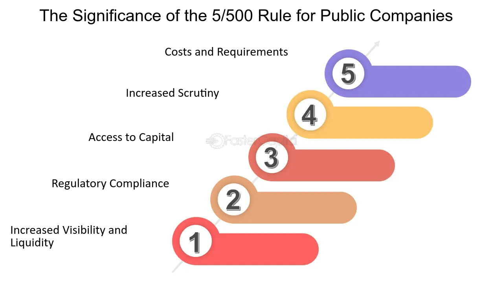

## Table of Contents

## What is the 500 Shareholder Rule?

The 500 Shareholder Rule is a regulation in the United States that affects how companies can be taxed. It says that if a company has 500 or fewer shareholders, it can choose to be taxed as an S corporation. An S corporation is special because it doesn't pay federal income tax itself. Instead, the shareholders report the company's income or losses on their own personal tax returns. This can help the company save money on taxes.

This rule is important for small businesses because it helps them decide how to structure their company. If a business thinks it will stay small with fewer than 500 shareholders, choosing to be an S corporation can be a good idea. But, if the business grows and gets more than 500 shareholders, it can no longer be an S corporation and will have to change how it is taxed. This rule helps businesses plan for their future and manage their taxes better.

## Who does the 500 Shareholder Rule apply to?

The 500 Shareholder Rule applies to businesses in the United States that want to be taxed as S corporations. An S corporation is a type of corporation that doesn't pay federal income tax at the corporate level. Instead, the income or losses are passed through to the shareholders, who report it on their personal tax returns. To qualify as an S corporation, a business must meet certain requirements, one of which is having no more than 500 shareholders.

This rule is important for small businesses because it helps them decide how to structure their company for tax purposes. If a business thinks it will stay small and have fewer than 500 shareholders, choosing to be an S corporation can save them money on taxes. However, if the business grows and exceeds 500 shareholders, it can no longer be an S corporation and must change its tax status. This rule helps businesses plan for their future and manage their taxes effectively.

## What are the origins of the 500 Shareholder Rule?

The 500 Shareholder Rule came from changes made to the tax laws in the United States. It was part of the Small Business Job Protection Act of 1996. This act was made to help small businesses by changing some tax rules. One of these changes was to let S corporations have up to 500 shareholders instead of the old limit of 35 shareholders. This was meant to help small businesses grow a bit bigger while still getting the tax benefits of being an S corporation.

Before 1996, S corporations could only have 35 shareholders. This made it hard for small businesses to grow without losing their S corporation status and the tax benefits that came with it. By raising the limit to 500 shareholders, the government wanted to help more small businesses stay as S corporations even as they got bigger. This change has helped many small businesses manage their taxes better and plan for growth.

## How does the 500 Shareholder Rule affect a company's structure?

The 500 Shareholder Rule can change how a company decides to set up its structure. If a company wants to be taxed as an S corporation, it needs to keep its number of shareholders under 500. This rule can make a company think about how big it wants to grow. If it stays small and keeps fewer than 500 shareholders, it can enjoy the tax benefits of being an S corporation. But if it grows too big and gets more than 500 shareholders, it can't be an S corporation anymore and will have to change how it is taxed.

This rule makes companies plan carefully. They need to think about how many shareholders they might have in the future. If a company thinks it will always be small, choosing to be an S corporation can save money on taxes. But if the company thinks it will grow a lot, it might choose a different structure from the start. This way, it won't have to change its tax status later, which can be complicated and costly.

## What are the potential benefits of adhering to the 500 Shareholder Rule?

Adhering to the 500 Shareholder Rule can help a company save money on taxes. If a company keeps its number of shareholders under 500, it can choose to be an S corporation. This means the company itself doesn't pay federal income tax. Instead, the shareholders report the company's income or losses on their own tax returns. This can be a big help for small businesses, especially if they are making a lot of money. It lets them keep more of their earnings instead of paying a big tax bill.

Another benefit is that it gives a company more control over its growth. By staying under 500 shareholders, a company can plan its future without worrying about losing its S corporation status. This can make it easier to attract investors and grow the business slowly. If a company knows it can stay small and still get tax benefits, it can make better decisions about how to expand. This rule helps small businesses stay flexible and plan for the future.

## What challenges might companies face in complying with the 500 Shareholder Rule?

Companies might find it hard to stay under 500 shareholders if they want to grow a lot. If a company gets bigger and more people want to invest, it might go over the 500 shareholder limit. This means it can't be an S corporation anymore and will have to change how it is taxed. Changing tax status can be complicated and costly, so companies need to be careful about how many shareholders they let in.

Another challenge is keeping track of who owns shares. If a company is not careful, it might accidentally go over the 500 shareholder limit. This can happen if shareholders sell their shares to new people without the company knowing. Companies need to keep good records and make sure they know who their shareholders are at all times. This can be a lot of work, especially for small businesses that might not have a big team to help with these tasks.

## How can a company determine if it needs to comply with the 500 Shareholder Rule?

A company needs to think about the 500 Shareholder Rule if it wants to be an S corporation. An S corporation is a special type of business that doesn't pay federal income tax. Instead, the shareholders report the company's income or losses on their own tax returns. To be an S corporation, a company can't have more than 500 shareholders. So, if a company wants to save money on taxes by being an S corporation, it needs to make sure it stays under this limit.

To figure out if they need to follow this rule, a company should look at how many shareholders it has now and how many it might have in the future. If the company thinks it will always be small and have fewer than 500 shareholders, it can choose to be an S corporation. But if the company thinks it will grow a lot and get more than 500 shareholders, it needs to pick a different type of business structure from the start. This way, the company won't have to change its tax status later, which can be hard and expensive.

## What are the penalties for non-compliance with the 500 Shareholder Rule?

If a company goes over 500 shareholders and keeps calling itself an S corporation, it can get into trouble with the IRS. The main penalty is that the company will lose its S corporation status. This means it has to start paying federal income tax like a regular corporation. This can be a big problem because the company might have to pay a lot of taxes all at once for the time it was supposed to be an S corporation but wasn't.

Besides losing S corporation status, the company might also have to pay fines or interest on the taxes it should have paid. The IRS can also look back at past years and make the company pay taxes for those years too. This can be a lot of money and can make things very hard for the company. So, it's important for companies to keep track of their shareholders and make sure they stay under 500 if they want to be an S corporation.

## How does the 500 Shareholder Rule interact with other securities regulations?

The 500 Shareholder Rule works together with other securities rules to make sure companies follow the law. One important rule is the Securities Exchange Act of 1934. This rule says that if a company has more than 2,000 shareholders or more than $10 million in assets, it has to report a lot of information to the SEC. This is to protect investors and make sure they know what's going on with the company. The 500 Shareholder Rule helps companies stay small and avoid these reporting rules if they want to. But if a company grows and gets more shareholders, it might have to follow both the 500 Shareholder Rule and the Securities Exchange Act rules.

Another rule that connects with the 500 Shareholder Rule is the JOBS Act of 2012. This rule made it easier for small businesses to raise money by letting them have more shareholders without having to report to the SEC. The JOBS Act raised the limit for private companies to 2,000 shareholders before they have to start reporting. This can help companies that are close to the 500 shareholder limit but still want to grow a bit more. So, the 500 Shareholder Rule and the JOBS Act work together to help small businesses decide how to grow and manage their shareholders while following the law.

## Can the 500 Shareholder Rule be waived or modified under certain conditions?

The 500 Shareholder Rule is a strict rule that says S corporations can't have more than 500 shareholders. Usually, you can't just waive or change this rule. It's set by the IRS, and it's there to help small businesses save money on taxes. If a company goes over 500 shareholders, it can't be an S corporation anymore and has to pay taxes like a regular corporation.

But there are some ways to work around the rule. For example, if a shareholder is a family member, they can be counted as one shareholder even if they own shares in different ways. Also, some trusts and estates can be shareholders without counting towards the 500 limit. These rules can help a company stay under the limit and keep its S corporation status. But these are not really changes to the rule, just ways to use it a bit differently.

## What strategies can companies use to manage their shareholder count under the 500 Shareholder Rule?

Companies can manage their shareholder count by being careful about who they let buy shares. They can make rules about how shares can be sold or transferred. For example, they might say that shareholders can only sell their shares back to the company or to other current shareholders. This helps keep the number of shareholders from growing too fast. Companies can also use buyback programs, where they buy shares back from shareholders who want to sell. This way, the company can control how many shareholders it has and stay under the 500 limit.

Another strategy is to use different kinds of ownership structures. For example, companies can set up trusts or family partnerships to hold shares. This can help them count fewer shareholders because the IRS allows certain trusts and family members to be counted as one shareholder. Companies can also think about using different classes of stock. By giving some shareholders non-voting stock, the company can attract more investors without increasing the number of shareholders that count towards the 500 limit. These strategies help companies stay small and keep the tax benefits of being an S corporation.

## How have recent legal changes or court decisions impacted the application of the 500 Shareholder Rule?

Recent legal changes and court decisions have not directly changed the 500 Shareholder Rule, but they have affected how companies think about it. The JOBS Act of 2012, for example, made it easier for companies to have more shareholders without having to report to the SEC. This act raised the limit for private companies to 2,000 shareholders before they have to start reporting. This change helps companies that are close to the 500 shareholder limit but want to grow a bit more. It gives them more room to add shareholders without losing their S corporation status right away.

Court decisions have also influenced how companies manage their shareholders. In some cases, courts have looked at how companies count their shareholders, especially when it comes to family members and trusts. For example, if a family member owns shares in different ways, they can still be counted as one shareholder. This helps companies stay under the 500 limit. While these decisions don't change the rule itself, they help companies understand how to use it better and stay within the law.

## References & Further Reading

[1]: Securities Exchange Act of 1934 - Key Amendments. [U.S. Securities and Exchange Commission](https://www.congress.gov/103/statute/STATUTE-107/STATUTE-107-Pg2344.pdf)

[2]: JOBS Act of 2012 - Overview and Implications. [U.S. Securities and Exchange Commission](https://www.sec.gov/rules-regulations/jumpstart-our-business-startups-jobs-act)

[3]: Budish, E., Cramton, P., & Shim, J. (2015). ["The High-Frequency Trading Arms Race: Frequent Batch Auctions as a Market Design Response."](https://academic.oup.com/qje/article/130/4/1547/1916146) The Quarterly Journal of Economics, 130(4), 1547-1621.

[4]: MacKenzie, D. (2015). ["Mechanizing the Merc: The Chicago Mercantile Exchange and the Rise of High-Frequency Trading."](https://pubmed.ncbi.nlm.nih.gov/26387525/) Economy and Society, 44(2), 278-306.

[5]: Yao, C., & Ye, M. (2018). ["Why Trading Speed Matters: A Tale of Queue Rationing under Price Controls."](https://academic.oup.com/rfs/article-abstract/31/6/2157/4975833) The Review of Financial Studies, 31(6), 2157-2193.