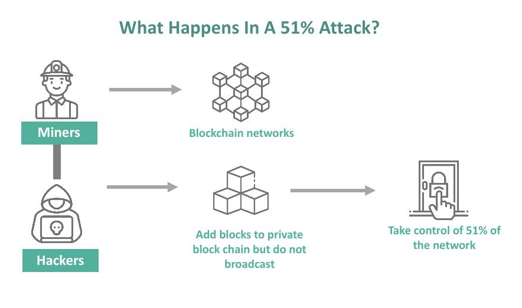

## Table of Contents

## What is a 51% attack in the context of blockchain technology?

A 51% attack happens when one person or group controls more than half of the computing power in a blockchain network. This is a big problem because blockchains are supposed to be safe and fair. When someone has more than half the power, they can change the rules and do things like stop new transactions from happening, reverse old transactions, or even spend the same money twice.

This kind of attack is very hard to do because it needs a lot of computing power and money. It's more likely to happen on smaller blockchains that don't have as much power overall. Even if someone pulls off a 51% attack, it usually doesn't last long because other people in the network will notice and try to stop it. But while it's happening, it can cause a lot of trouble and make people lose trust in the blockchain.

## How does a 51% attack affect a cryptocurrency network?

A 51% attack can really mess up a cryptocurrency network. When someone or a group takes over more than half of the network's power, they can start messing with transactions. They might stop new transactions from going through, which means people can't use the cryptocurrency to buy things or send money. They could also try to spend the same coins twice, which is called double-spending. This can make the cryptocurrency less valuable because people won't trust it anymore.

If a 51% attack happens, it can shake people's faith in the whole system. People might start to think the cryptocurrency isn't safe to use, which can make its value drop a lot. Even though these attacks are hard to do and usually don't last long, the damage they cause can be big. The network might need to make changes to stop future attacks, but in the meantime, people could lose money and trust in the cryptocurrency.

## What are the potential risks of a 51% attack for cryptocurrency users?

A 51% attack can be really bad for people using a cryptocurrency. If someone takes over more than half of the network's power, they can mess with transactions. They might stop new transactions from happening, which means you can't use the cryptocurrency to buy things or send money to others. They could also try to spend the same money twice, which is called double-spending. This can make you lose money if you've already sent some cryptocurrency to someone, and then the attacker reverses the transaction.

This kind of attack can also make people lose trust in the cryptocurrency. If users see that the system isn't safe, they might stop using it, which can make the value of the cryptocurrency go down a lot. Even though these attacks are hard to do and usually don't last long, the damage they cause can be big. Users might lose money and trust, and it can take a while for the cryptocurrency to recover its reputation and value.

## Can you provide historical examples of 51% attacks on cryptocurrencies?

One example of a 51% attack happened to Ethereum Classic in January 2019. Some people took over more than half of Ethereum Classic's network power. They used this power to take back some of the cryptocurrency they had already spent. This made a lot of people lose trust in Ethereum Classic, and its value went down a lot.

Another example is what happened to Bitcoin Gold in May 2018. Hackers managed to control more than half of Bitcoin Gold's network and stole a lot of money by spending the same coins twice. This attack made people very worried about using Bitcoin Gold, and it also lost a lot of its value because of the attack.

These attacks show how dangerous a 51% attack can be. They can make people lose money and trust in the cryptocurrency, which can hurt its value and reputation. Even though these attacks are hard to do, they can cause a lot of damage when they happen.

## What are the financial and technical costs associated with executing a 51% attack?

Executing a 51% attack on a cryptocurrency network is very expensive. You need to control more than half of the network's computing power, which means you need a lot of powerful computers. These computers use a lot of electricity, which costs money. You also have to keep renting or buying more computing power to stay ahead of everyone else on the network. The bigger the cryptocurrency, the more it costs to attack it because you need even more computing power.

Besides the financial cost, there are technical challenges too. You need to know a lot about how blockchains work and how to control a lot of computing power without being noticed. If people find out you're trying to attack the network, they might try to stop you. Also, even if you pull off the attack, it might not last long because the people running the cryptocurrency will try to fix the problem. So, while it's possible to do a 51% attack, it's very hard and risky.

## How do different consensus mechanisms influence the vulnerability to a 51% attack?

Different consensus mechanisms can make a blockchain more or less vulnerable to a 51% attack. In Proof of Work (PoW) systems, like Bitcoin, attackers need a lot of computing power to control more than half of the network. This makes PoW systems somewhat resistant to 51% attacks because it's very expensive and hard to gather that much power. However, smaller PoW blockchains with less total computing power are more at risk because it's easier for an attacker to control a majority of the network.

In contrast, Proof of Stake (PoS) systems, like Ethereum 2.0, work differently. Instead of computing power, PoS relies on the amount of cryptocurrency someone holds. To attack a PoS network, you need to own more than half of all the cryptocurrency, which is usually very expensive and hard to do. PoS systems are generally thought to be more resistant to 51% attacks because it's harder to gather that much cryptocurrency than to gather computing power. However, PoS systems can still be vulnerable to other types of attacks, like those targeting the staking process.

## What measures can be taken to prevent or mitigate the impact of a 51% attack?

To prevent or mitigate the impact of a 51% attack, one important measure is to increase the total computing power of the network. This makes it harder for an attacker to control more than half of it. For example, more people can be encouraged to join the network and help with the computing work. Another way is to use a consensus mechanism like Proof of Stake instead of Proof of Work. In Proof of Stake, an attacker needs to own more than half of the cryptocurrency, which is usually much harder than gathering computing power.

If a 51% attack happens, quick action can help reduce the damage. The people running the cryptocurrency can try to stop the attacker by changing the rules of the network or by working together to out-power the attacker. They can also let users know about the attack so they can be careful with their transactions. In some cases, the network might need to do a 'rollback' to undo the bad transactions made by the attacker. By acting fast and working together, the network can recover from a 51% attack and regain people's trust.

## How does the size and decentralization of a network impact its susceptibility to a 51% attack?

The size of a cryptocurrency network plays a big role in how easy it is to do a 51% attack. A bigger network with more computing power or more cryptocurrency staked makes it much harder for someone to take over more than half of it. For example, a big network like Bitcoin has so much computing power that it's almost impossible for someone to control more than half of it. On the other hand, smaller networks with less power are easier targets because it's cheaper and easier for an attacker to gather enough power to control the network.

Decentralization also matters a lot. A network that is more spread out, with many different people and groups helping to run it, is harder to attack. If the power is shared among many people, it's tougher for one person or group to take control. But if the network is less decentralized, with a few big players controlling most of the power, it's easier for an attacker to take over. So, keeping a network big and decentralized is key to staying safe from a 51% attack.

## What are the long-term consequences for a cryptocurrency that has suffered a 51% attack?

When a cryptocurrency suffers a 51% attack, it can face big problems in the long run. People might start to think the cryptocurrency isn't safe anymore. This loss of trust can make the value of the cryptocurrency go down a lot. If people don't trust it, they won't want to use it or invest in it. This can hurt the cryptocurrency's growth and make it hard for it to recover its old value and reputation. Even if the network fixes the problem, the memory of the attack can make people wary for a long time.

The attack can also lead to changes in how the cryptocurrency works. The people running the network might have to make big changes to prevent future attacks. These changes could make the network safer but might also make it harder or more expensive to use. For example, they might switch to a different way of agreeing on transactions, like moving from Proof of Work to Proof of Stake. These changes can help in the long run but might cause some short-term confusion and resistance from users. Overall, a 51% attack can have a lasting impact on a cryptocurrency's trust, value, and how it operates.

## How can blockchain developers and users detect a 51% attack in progress?

Detecting a 51% attack can be tricky, but there are some signs that blockchain developers and users can watch out for. One big sign is if transactions start getting delayed or reversed a lot. If you see that new transactions are not going through as quickly as they should, or if some old transactions are being undone, it might mean someone is trying to take over the network. Another thing to look for is if the network's computing power, or "hash rate," suddenly changes a lot. If the hash rate goes up or down quickly, it could mean someone is trying to control more than half of the network's power.

To catch a 51% attack early, developers can use special tools that keep an eye on the network all the time. These tools can send alerts if they see anything weird happening, like a lot of transactions being reversed or big changes in the hash rate. Users can also help by reporting any problems they see with their transactions. If everyone works together and stays alert, they can spot a 51% attack before it causes too much damage and take steps to stop it.

## What role do mining pools play in the possibility of a 51% attack?

Mining pools are groups of people who work together to mine cryptocurrency. They share their computing power to have a better chance of earning rewards. But if one mining pool gets too big, it could end up controlling more than half of the network's power. This would make it easier for them to do a 51% attack. So, the size of mining pools can make a network more at risk of being attacked.

To lower the chance of a 51% attack, it's important for mining pools to stay small and spread out. If there are many different pools, it's harder for any one of them to take over the network. People running the cryptocurrency can also keep an eye on mining pools and make rules to stop them from getting too big. By keeping mining pools balanced, the network can stay safer and less likely to be attacked.

## How do regulatory and legal frameworks address the issue of 51% attacks?

Regulatory and legal frameworks don't directly stop 51% attacks, but they can help make them less likely. Governments and organizations can set rules to make sure that no one group can control too much of a cryptocurrency network. They can watch over big players like mining pools and make sure they don't get too powerful. If a 51% attack happens, the legal system can also help catch and punish the people who did it, which can scare others from trying the same thing.

When a 51% attack happens, it can cause big problems for people who use the cryptocurrency. So, some countries might have laws to help those people get their money back or to make the cryptocurrency network fix the problem quickly. By having these rules in place, governments can help keep cryptocurrency networks safe and make sure that people don't lose trust in them. Even though these laws can't stop all attacks, they can make the whole system more secure and fair for everyone.

## References & Further Reading

[1]: Bonneau, J., Miller, A., Clark, J., Narayanan, A., Kroll, J. A., & Felten, E. W. (2015). ["Sok: Research perspectives and challenges for bitcoin and cryptocurrencies."](https://ieeexplore.ieee.org/document/7163021) IEEE Symposium on Security and Privacy.

[2]: Eyal, I., & Sirer, E. G. (2014). ["Majority is not Enough: Bitcoin Mining is Vulnerable."](https://dl.acm.org/doi/10.1145/3212998) International Conference on Financial Cryptography and Data Security.

[3]: Conti, M., Kumar, S., Lal, C., & Ruj, S. (2018). ["A Survey on Security and Privacy Issues of Bitcoin."](https://ieeexplore.ieee.org/document/8369416) IEEE Communications Surveys & Tutorials, 20(4), 3416-3452.

[4]: De Filippi, P., & Wright, A. (2018). ["Blockchain and the Law: The Rule of Code."](https://www.jstor.org/stable/j.ctv2867sp) Harvard University Press.

[5]: Narayanan, A., Bonneau, J., Felten, E., Miller, A., & Goldfeder, S. (2016). ["Bitcoin and Cryptocurrency Technologies: A Comprehensive Introduction."](https://press.princeton.edu/books/hardcover/9780691171692/bitcoin-and-cryptocurrency-technologies) Princeton University Press.