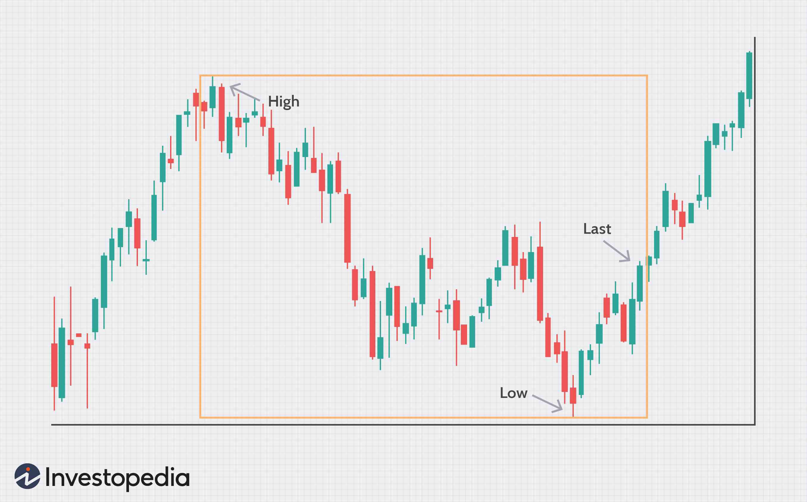

The world of stock trading presents a complex landscape, with various strategies designed to maximize returns. Among these, the use of the 52-week high and low indicators has gained popularity due to their ability to offer insights into market trends and investor sentiment. These indicators reflect the highest and lowest prices at which a stock has traded over the past year, providing a benchmark for evaluating a stock's current performance against historical price data.

The significance of the 52-week high/low in stock trading lies in their potential to guide investment decisions. For instance, a stock nearing its 52-week high is often perceived as bullish, suggesting upward momentum and investor confidence. Conversely, a stock approaching its 52-week low may indicate bearish conditions, signaling potential undervaluation or market pessimism. Understanding these dynamics empowers traders to make informed decisions by gauging the likely support and resistance levels in a stock’s price movement.



Moreover, algorithmic trading has revolutionized the use of these indicators by automating trading decisions based on predefined rules. Algorithms can analyze vast amounts of data rapidly, identifying opportunities to buy or sell based on movements around the 52-week high/low. This integration of technology not only enhances trading efficiency but also helps in mitigating emotional and psychological biases that may affect decision-making. By leveraging these price points through algorithmic strategies, traders can optimize their approach, ensuring a balanced and systematic engagement with the market.

This article aims to explore and explain how traders can effectively use the 52-week high and low in combination with algorithmic trading to enhance their strategies. Understanding these tools can aid traders in navigating the complex world of stock trading, offering them tactical advantages and insights into the evolving market landscape.

## Table of Contents

## Understanding the 52-Week High/Low

The 52-week high and low are vital metrics in stock trading, providing insights into the price dynamics of a security over the past year. This range encapsulates the highest price point (52-week high) and the lowest price point (52-week low) achieved by a stock during this period. These metrics play a significant role in technical analysis, aiding traders in identifying key support and resistance levels.

In the context of these metrics, the 52-week high is typically perceived as a resistance level. This is the point where a stock historically reaches its peak price within the year, often indicating a potential selling point. If a stock's price approaches this high, it may suggest that the stock is experiencing upward momentum; however, crossing this threshold might signal an overbought condition, leading to possible price corrections.

Conversely, the 52-week low serves as a support level. This is where the stock's price hits its lowest point over the previous year, potentially presenting a buying opportunity. When a stock's price nears its 52-week low, it can indicate that the stock is undervalued, enticing investors to purchase. Nonetheless, if the stock breaks through this support line, it might imply continued downward pressure or a bearish outlook.

Traders leverage the 52-week high/low to gauge market sentiment and predict future price movements. When prices approach these extremes, it can signify changing market conditions, prompting traders to adjust their strategies. The psychological impact of these numbers should not be underestimated: investors often react to these thresholds due to perceived value or fear of potential losses. By analyzing a stock's movement relative to its 52-week range, traders can make more informed decisions, possibly anticipating future trends based on historical patterns and market behaviors.

In summary, understanding the 52-week high and low is crucial for traders looking to capitalize on market opportunities. These metrics provide a framework for evaluating price levels, assessing market sentiment, and planning strategic entry and [exit](/wiki/exit-strategy) points in trades.

## Using the 52-Week High/Low in Trading Strategies

Traders frequently utilize the 52-week high and low as critical reference points for initiating or closing trades. The breach of a 52-week high often signals a [breakout](/wiki/breakout-trading), indicating that the stock price has passed a resistance level and may continue to rise. Conversely, when a stock hits its 52-week low, it suggests a potential bottom, implying that the price may rebound. Traders capitalize on these movements by implementing strategies such as buying stocks as their prices surpass the 52-week high, anticipating further upward [momentum](/wiki/momentum). Similarly, selling stocks when they fall below the 52-week low can be a strategy to prevent further losses or capitalize on anticipated downward trends.

Volume plays a significant role in validating these price movements. When a stock breaches its 52-week high or low, a spike in trading [volume](/wiki/volume-trading-strategy) often accompanies the event, signifying increased interest and strengthening the signal of a potential trend change. High volume indicates that many investors are in agreement with the price move, providing a stronger confirmation for trading decisions.

For example, if a stock trading at $100 reaches a 52-week high coinciding with a volume increase, traders may interpret this as a robust bullish signal and enter long positions. Conversely, if a stock hits a 52-week low during a volume surge, traders might see it as confirmation of continued bearish sentiment and consider short positions.

Integrating this approach with further technical analysis, such as chart patterns or other indicators, can enhance decision-making accuracy for traders looking to maximize their returns using these pivotal price levels.

## Algorithmic Trading and the 52-Week High/Low

Algorithmic trading uses advanced computational algorithms to implement trades more efficiently by leveraging predefined conditions and criteria. The integration of the 52-week high/low indicators into these algorithms enhances the decision-making process by providing precise points of entry and exit.

Algorithms designed around the 52-week high/low can automatically execute buy or sell orders when these thresholds are crossed. This process minimizes the emotional component of trading and allows for a systematic approach where decisions are made based on quantitative data. For example, an algorithm might be configured to buy a stock when it surpasses its 52-week high, under the assumption of a continued upward trend.

Integrating such features within algorithmic systems requires comprehensive [backtesting](/wiki/backtesting) to ensure efficacy. Backtesting involves running the algorithm with historical data to evaluate its performance against past market conditions. The process helps in optimizing strategy by assessing risk and return metrics such as Sharpe Ratio, Maximum Drawdown, and Profit Factor. For instance, a simple strategy utilizing the 52-week high might involve the following pseudocode:

```python
def trade_strategy(stock_prices, high_52week, low_52week):
    for price in stock_prices:
        if price > high_52week:
            # Execute buy order
            execute_trade('buy', price)
        elif price < low_52week:
            # Execute sell order
            execute_trade('sell', price)
```

Real-world implementation of such algorithms also requires incorporating additional filters or conditions, such as trading volume and market indicators, to confirm breakouts. Moreover, the robustness of these algorithms significantly depends on their ability to adapt to varying market conditions through continuous optimization and adjustments.

To minimize risk further, risk management routines can be integrated into the trading algorithm. Techniques like setting stop-loss orders or utilizing dynamic position sizing based on [volatility](/wiki/volatility-trading-strategies) indicators are effective. The optimization of these algorithms is crucial and requires regular analysis of performance metrics, including returns, volatility, and drawdowns.

While utilizing the 52-week high/low in [algorithmic trading](/wiki/algorithmic-trading) provides clarity and efficiencies, it is susceptible to false signals and market anomalies. Therefore, continuous refinement, along with a blend of comprehensive market research, is essential for maintaining an edge in trading operations.

## Advantages and Disadvantages of 52-Week High/Low Strategies

The 52-week high/low strategy is a well-regarded method in stock trading due to its straightforward nature and potential to capitalize on momentum shifts within the market. This section examines both the advantages and disadvantages of employing such strategies.

One significant advantage is the clarity of decision-making provided by the 52-week high/low indicators. These benchmarks offer precise reference points, which can simplify the process of establishing entry and exit points for trades. They allow traders to make informed decisions based on historical price behavior, creating a more structured approach to trading.

Risk management is another area where 52-week high/low strategies can shine. By using these well-defined price levels, traders can set stop-loss orders more effectively, helping to mitigate potential losses. This approach allows for clearer risk assessment and management, as traders have a historical parameter to work from. Additionally, it provides the opportunity to capture substantial momentum, as historical breakouts past the 52-week high or recoveries from the 52-week low often lead to notable price movements.

Despite their advantages, strategies based on the 52-week high/low come with certain drawbacks. Primarily, these strategies are susceptible to market shocks. Events that cause market-wide fluctuations can render these indicators temporarily unreliable, leading to potential losses if traders do not adapt quickly. Furthermore, when implemented without algorithmic support, there is a need for constant monitoring. This can be time-consuming and requires vigilance, as manual interventions might be necessary to adjust to sudden market shifts.

Another disadvantage is that the strategy may not be suitable for all market conditions. Particularly in highly volatile environments, these strategies can result in false signals. For instance, a stock reaching a 52-week high might not depict a genuine breakout if the market is erratic. 

Thus, while the 52-week high/low strategy provides clear and simple guidelines, its effectiveness greatly depends on the market environment and the trader’s ability to adapt swiftly to changes. Utilizing algorithmic trading to automate responses can substantially alleviate some of these disadvantages by maintaining constant vigilance and adjusting strategies in real-time.

## Best Practices for 52-Week High/Low Algo Trading

To optimize the implementation of 52-week high/low strategies through algorithmic trading, various best practices can significantly enhance performance and risk management.

Utilizing comprehensive data analytics is crucial for refining algorithms to achieve better decision-making accuracy. By employing sophisticated statistical techniques, traders can analyze historical price data and identify patterns that precede price movements past their 52-week highs or lows. Incorporating [machine learning](/wiki/machine-learning) models can further enhance predictability by analyzing non-linear relationships and market dynamics.

Moving averages and other technical indicators provide additional layers of confirmation for trading decisions based on 52-week price levels. Moving averages, such as the simple moving average (SMA) or exponential moving average (EMA), help reduce noise from price fluctuations and highlight the prevailing trend. For example, if a stock breaks its 52-week high and the price remains above its moving average, this confluence can act as a stronger buy signal. 

```python
import pandas as pd

def moving_average(data, window_size):
    return data.rolling(window=window_size).mean()

# Example usage with 50-day moving average
data = pd.Series([/*... stock prices data ...*/])
ma_50 = moving_average(data, 50)
```

Software tools that offer real-time alerts when securities approach their 52-week highs or lows are invaluable in ensuring traders are prepared to act promptly. These tools often integrate with trading platforms to provide automatic notifications, reducing the likelihood of missing critical trading opportunities.

Robust risk management practices are essential to safeguard capital, especially in volatile markets. This can include setting predefined stop-loss levels and position-sizing rules based on volatility measures. Employing techniques such as Value at Risk (VaR) or the Kelly Criterion can further assist in determining risk levels and optimal allocation.

The combination of these best practices enables a more systematic approach to exploiting the 52-week high/low signals, ensuring that trades are executed with greater precision and controlled risk exposure.

## Conclusion

The 52-week high/low metric stands as a vital component in technical analysis, providing traders with crucial insights into market trends and price movements. By identifying significant price boundaries, this indicator assists in evaluating support and resistance levels, which are foundational for predicting future price behavior. These metrics are instrumental in understanding whether a stock is experiencing momentum or slowing down, thereby guiding the decision-making process for traders.

When integrated with algorithmic trading, the 52-week high/low strategy evolves into a potent tool, bolstering trading efficacy. Algorithms bring precision to trade execution by rapidly processing large datasets and reacting to market movements without the latency of human intervention. The automation of trading through predefined conditions allows traders to seize opportunities promptly as soon as stocks approach these key levels. This integration not only enhances the speed of operations but reduces human errors commonly associated with manual trading.

Effectively combining the 52-week high/low with algorithmic models provides traders with a distinct competitive advantage. It permits a systematic approach to trading wherein strategies can be thoroughly tested and optimized for performance across different market conditions. Backtesting these algorithms ensures that strategies are refined, minimizing risks and maximizing returns through informed and data-driven decisions.

Achieving long-term success in trading requires constant vigilance and adaptation. The financial markets are perpetually evolving, making it imperative for traders to continuously update and improve their algorithmic models. Staying informed about market changes and advancements in algorithmic trading technologies aids in maintaining a robust trading strategy. Regularly fine-tuning algorithms and incorporating new data insights are key practices that support sustained profitability and competitive positioning in dynamic market environments.

In conclusion, the synergy between the 52-week high/low indicator and algorithmic trading establishes a formidable framework for traders aiming to harness the full potential of technical analysis. Through meticulous integration and persistent enhancement of trading models, traders can leverage these tools to navigate the complexities of the market effectively.

## References & Further Reading

[1]: Jansen, S. (2020). ["Machine Learning for Algorithmic Trading - Second Edition"](https://www.amazon.com/Machine-Learning-Algorithmic-Trading-alternative/dp/1839217715). Packt Publishing. 

[2]: Chan, E.P. (2008). ["Quantitative Trading: How to Build Your Own Algorithmic Trading Business"](https://github.com/ftvision/quant_trading_echan_book). Wiley.

[3]: Aronson, D.R. (2006). ["Evidence-Based Technical Analysis: Applying the Scientific Method and Statistical Inference to Trading Signals"](https://www.amazon.com/Evidence-Based-Technical-Analysis-Scientific-Statistical/dp/0470008741). Wiley.

[4]: Lopez de Prado, M. (2018). ["Advances in Financial Machine Learning"](https://www.amazon.com/Advances-Financial-Machine-Learning-Marcos/dp/1119482089). Wiley.

[5]: Bergstra, J., Bardenet, R., Bengio, Y., & Kégl, B. (2011). ["Algorithms for Hyper-Parameter Optimization."](https://proceedings.neurips.cc/paper/2011/file/86e8f7ab32cfd12577bc2619bc635690-Paper.pdf) Advances in Neural Information Processing Systems 24.