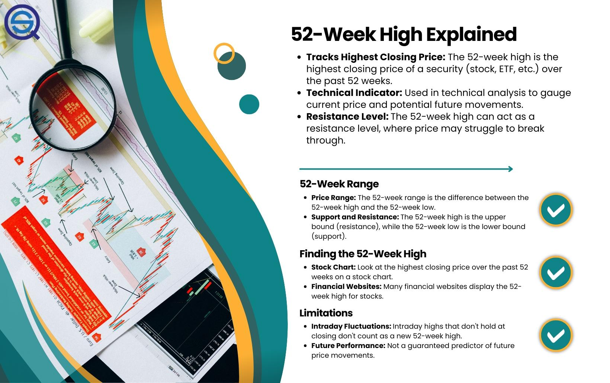

## Table of Contents

## What is the 52-Week High Strategy?

The 52-Week High Strategy is a way to pick stocks that are doing well. It looks at the highest price a stock reached in the last year. If the stock is close to this high price, it might keep going up. People who use this strategy think that stocks hitting new highs will keep going higher because more people will want to buy them.

This strategy is based on the idea that stocks at new highs are strong and likely to keep growing. Investors watch these stocks and buy them when they are near their 52-week high. They believe that the stock's momentum will continue, pushing the price even higher. It's a simple way to find stocks that might be good investments.

## How does the 52-Week High Strategy work?

The 52-Week High Strategy is a way to pick stocks that might keep going up in price. It looks at the highest price a stock reached in the last year. If a stock is close to this high price, people using this strategy think it might keep going up. They believe that when a stock hits a new high, more people will want to buy it, pushing the price even higher. This strategy is all about finding stocks with strong momentum.

To use this strategy, investors watch stocks and see how close they are to their 52-week high. If a stock is trading near its highest price in the last year, it might be a good time to buy it. The idea is that the stock's price will keep rising because of the positive attention it gets from being near its high. This simple approach helps investors find stocks that could be good investments based on their recent performance.

## What are the key principles behind the 52-Week High Strategy?

The 52-Week High Strategy is based on the idea that stocks reaching new highs are strong and likely to keep going up. When a stock gets close to its highest price in the last year, it catches people's attention. More people want to buy it because they think it will keep going up. This strategy believes in the power of [momentum](/wiki/momentum), where a stock's price keeps rising because more and more people are buying it.

Investors using this strategy look for stocks that are near their 52-week high. They think these stocks have a good chance of going even higher. The key is to buy these stocks when they are close to their high and then hold onto them as they hopefully keep rising. This simple approach helps investors find stocks that might be good investments based on their recent performance.

## Who developed the 52-Week High Strategy and when?

The 52-Week High Strategy was developed by Thomas J. George and Chuan-Yang Hwang. They came up with this idea in 2004. Thomas J. George and Chuan-Yang Hwang are professors who wanted to find a simple way to pick stocks that might go up in price.

They found that stocks that are close to their highest price in the last year often keep going up. This is because when a stock hits a new high, more people want to buy it. They think it will keep going up, so they buy it, which pushes the price even higher. This is the basic idea behind the 52-Week High Strategy.

## What types of stocks are typically targeted by the 52-Week High Strategy?

The 52-Week High Strategy usually looks at stocks that are doing well and are close to their highest price in the last year. These stocks are often in industries that are growing or have good news. For example, if a company just announced a new product that everyone wants, its stock might be near its 52-week high. Investors using this strategy think these stocks have a good chance of going up even more because more people will want to buy them.

These stocks are often from companies that are doing better than others in their industry. They might have strong earnings or good news that makes people excited about them. When a stock is near its 52-week high, it gets a lot of attention. More people want to buy it because they think it will keep going up. This can push the price even higher, which is what the 52-Week High Strategy tries to take advantage of.

## How can one identify stocks that are at their 52-week high?

To find stocks that are at their 52-week high, you can use financial websites and stock market apps. These tools show the highest price a stock reached in the last year. Look for a section that lists stocks near or at their 52-week high. This information is updated every day, so you can see which stocks are doing well right now. Some popular websites like Yahoo Finance, Google Finance, or apps like Robinhood and E*TRADE have this information easily available.

Once you find a stock that is at its 52-week high, you can check more details about it. See if the company is doing well, if it has good news, or if it is in a growing industry. This helps you decide if the stock might keep going up. Remember, stocks at their 52-week high get a lot of attention, and more people might want to buy them, which could push the price even higher.

## What are the potential benefits of using the 52-Week High Strategy?

Using the 52-Week High Strategy can help you find stocks that might keep going up in price. When a stock is near its highest price in the last year, it gets a lot of attention. More people want to buy it because they think it will keep going up. This can push the price even higher. So, if you buy a stock that's close to its 52-week high, you might make money as the price keeps rising.

Another benefit is that this strategy is simple to use. You don't need to be an expert to find stocks that are near their 52-week high. Many websites and apps show you this information easily. This makes it easier for anyone to try to pick stocks that might do well. By focusing on stocks with strong momentum, you can find good investment opportunities without needing to do a lot of complicated research.

## What are the risks associated with the 52-Week High Strategy?

Using the 52-Week High Strategy can be risky because stocks at their highest price in the last year might not keep going up. Just because a stock is near its 52-week high doesn't mean it will keep rising. Sometimes, a stock reaches its peak and then starts to fall. If you buy a stock at its high and it goes down, you could lose money. This strategy relies on the idea that the stock's price will keep going up because of momentum, but that doesn't always happen.

Another risk is that this strategy might make you miss out on other good investments. By focusing only on stocks near their 52-week high, you might ignore other stocks that could do well. Also, if everyone is buying the same stocks because they are at their high, it can create a bubble. If too many people are buying, the price might go up a lot very quickly, but then it could crash if people start selling. So, while the 52-Week High Strategy can help you find stocks that might go up, it also comes with the risk of losing money if the stock doesn't keep rising.

## How does the 52-Week High Strategy compare to other momentum investing strategies?

The 52-Week High Strategy is a type of momentum investing that focuses on stocks that are close to their highest price in the last year. It's simple because you just need to find stocks near their 52-week high and buy them, hoping they will keep going up. Other momentum strategies might look at different things, like how fast a stock's price is rising over a shorter time, or they might use more complex math to figure out which stocks to buy. The 52-Week High Strategy is easier to use because it doesn't need a lot of math or special tools, just a look at the stock's recent price.

Compared to other momentum strategies, the 52-Week High Strategy can be riskier because it relies on the idea that a stock will keep going up just because it's near its high. Other strategies might use more data to find stocks that are likely to keep rising, which can make them less risky. But, the 52-Week High Strategy can also be more rewarding if the stock does keep going up, because you're buying it at a time when a lot of people are paying attention to it. So, while it's simpler and can be more exciting, it also comes with more risk than some other momentum strategies that use more data and analysis.

## Can the 52-Week High Strategy be combined with other investment strategies?

Yes, the 52-Week High Strategy can be combined with other investment strategies to make a more balanced approach. For example, you might use the 52-Week High Strategy to pick stocks that are doing well, but also look at other things like how much the company is [earning](/wiki/earning-announcement) or what the industry is doing. This way, you're not just relying on the stock's recent high price, but also on other important information that can help you make better choices.

Another way to combine the 52-Week High Strategy with other strategies is to use it along with a value investing approach. Value investing looks for stocks that are priced lower than they should be based on the company's earnings or assets. By combining the 52-Week High Strategy with value investing, you can find stocks that are not only near their high but also a good deal. This can help you find stocks that have both momentum and value, which might make your investments more successful.

## What historical data supports the effectiveness of the 52-Week High Strategy?

The 52-Week High Strategy has been studied and found to work well over time. Researchers Thomas J. George and Chuan-Yang Hwang looked at data from 1963 to 2001 and found that stocks near their 52-week high often did better than other stocks. They saw that these stocks kept going up because more people wanted to buy them. This showed that the strategy could help people make money by [picking](/wiki/asset-class-picking) stocks that were doing well and likely to keep doing well.

Other studies have also supported the idea that the 52-Week High Strategy can be effective. For example, a study by Huseyin Gulen and Beni Lauterbach in 2010 looked at data from 1990 to 2006 and found similar results. They saw that stocks near their 52-week high often had higher returns than other stocks. This means that by focusing on stocks that are close to their highest price in the last year, investors might be able to find good investments that keep going up in value.

## How should one monitor and adjust a portfolio using the 52-Week High Strategy?

To monitor a portfolio using the 52-Week High Strategy, you should regularly check the stocks you own to see if they are still near their 52-week high. This means looking at their current price and comparing it to the highest price they reached in the last year. If a stock is no longer near its high, it might be time to think about selling it. You can use financial websites or apps to keep track of this information easily. It's also important to stay updated on any news about the companies you've invested in, as good or bad news can affect the stock's price.

Adjusting your portfolio involves deciding when to buy new stocks and when to sell the ones you already have. If you find a new stock that is close to its 52-week high and looks like it might keep going up, you might want to buy it. On the other hand, if a stock in your portfolio is no longer near its high and seems to be going down, you might want to sell it to avoid losing money. Remember, the goal is to keep your portfolio focused on stocks with strong momentum, so you need to be ready to make changes based on how the stocks are doing.

## References & Further Reading

[1]: Lo, A. W., Mamaysky, H., & Wang, J. (2000). ["Foundations of Technical Analysis: Computational Algorithms, Statistical Inference, and Empirical Implementation."](https://www.cis.upenn.edu/~mkearns/teaching/cis700/lo.pdf) The Journal of Finance, 55(4), 1705-1765.

[2]: Jegadeesh, N., & Titman, S. (1993). ["Returns to Buying Winners and Selling Losers: Implications for Stock Market Efficiency."](https://moneytothemasses.com/wp-content/uploads/2014/08/Jegadeesh_Titman_1993.pdf) The Journal of Finance, 48(1), 65-91.

[3]: Chan, E. P. (2009). ["Quantitative Trading: How to Build Your Own Algorithmic Trading Business."](https://github.com/ftvision/quant_trading_echan_book) Wiley.

[4]: Jansen, S. (2020). ["Machine Learning for Algorithmic Trading."](https://github.com/stefan-jansen/machine-learning-for-trading) Packt Publishing.

[5]: Aronson, D. (2006). ["Evidence-Based Technical Analysis: Applying the Scientific Method and Statistical Inference to Trading Signals."](https://www.amazon.com/Evidence-Based-Technical-Analysis-Scientific-Statistical/dp/0470008741) Wiley.

[6]: De Prado, M. L. (2018). ["Advances in Financial Machine Learning."](https://www.amazon.com/Advances-Financial-Machine-Learning-Marcos/dp/1119482089) Wiley.