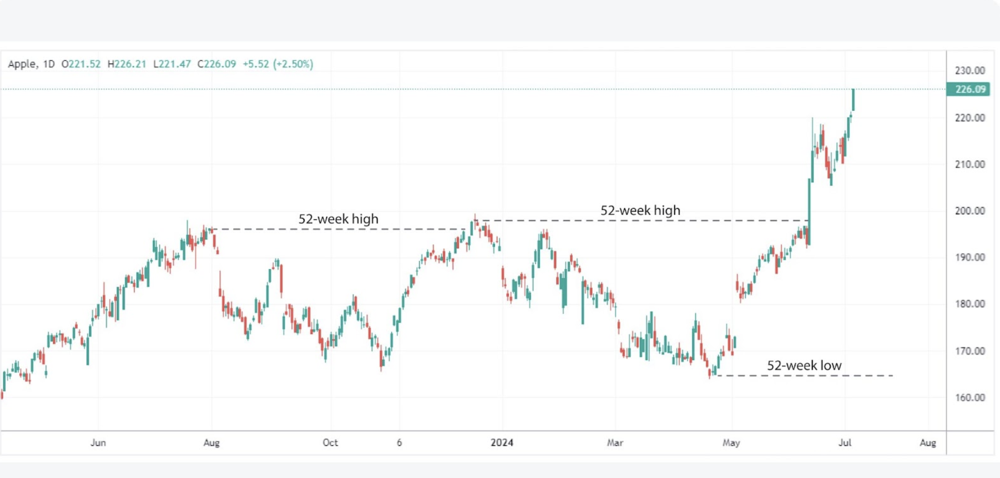

## Table of Contents

## What is the 52-week range of a stock?

The 52-week range of a stock shows the highest and lowest prices at which the stock has traded over the past year. This range helps investors understand how the stock's price has moved over that time. If a stock's current price is near the high end of its 52-week range, it might mean the stock has been doing well recently. If it's near the low end, it might suggest the stock has not been doing as well.

Looking at the 52-week range can help investors decide if a stock is a good buy. For example, if a stock is trading near its 52-week low, some investors might see it as a chance to buy at a lower price, hoping the price will go up later. On the other hand, if a stock is near its 52-week high, investors might be cautious, thinking the price might not go much higher. The 52-week range is just one tool among many that investors use to make decisions.

## How is the 52-week range calculated?

The 52-week range is calculated by looking at the highest and lowest prices a stock reached over the last year. It starts from the current date and goes back 52 weeks, or one year. During this time, the highest price the stock reached is the top of the range, and the lowest price it reached is the bottom of the range.

This range is updated every day. As each new day passes, the oldest day from exactly one year ago is dropped, and the new day's price is added. This means the 52-week range can change every day, depending on the stock's price movements. It's a simple but useful way to see how a stock has been doing over the past year.

## Why is the 52-week range important for investors?

The 52-week range is important for investors because it shows them how a stock has been doing over the past year. By looking at the highest and lowest prices a stock reached, investors can get a quick idea of how much the stock's price has changed. This helps them decide if a stock is a good buy. For example, if a stock is trading near its 52-week low, some investors might see it as a chance to buy at a lower price, hoping the price will go up later.

On the other hand, if a stock is near its 52-week high, investors might be more cautious. They might think the price might not go much higher and could even drop. The 52-week range is just one tool among many that investors use to make decisions. It gives them a snapshot of the stock's performance over the past year, which can help them understand if the stock has been going up or down and how much it has moved.

## How can beginners use the 52-week range to assess stock performance?

Beginners can use the 52-week range to get a quick idea of how a stock has been doing over the past year. The 52-week range shows the highest and lowest prices the stock reached in the last 52 weeks. If a stock is trading near its 52-week high, it means the stock has been doing well lately. On the other hand, if it's near its 52-week low, the stock might not have been doing as well. By looking at where the current price is within this range, beginners can see if the stock is near its peak or if it's closer to its lowest point in the past year.

This information can help beginners decide if a stock is worth buying. For example, if a stock is close to its 52-week low, a beginner might see it as a chance to buy at a lower price, hoping the price will go up later. If the stock is near its 52-week high, beginners might be more careful, thinking the price might not go much higher and could even drop. The 52-week range is just one piece of the puzzle, but it's a simple and useful tool for beginners to start understanding a stock's performance over the past year.

## What are the limitations of relying solely on the 52-week range for investment decisions?

Relying only on the 52-week range to make investment decisions can be risky because it doesn't tell the whole story about a stock. The 52-week range only shows the highest and lowest prices a stock reached over the past year, but it doesn't explain why the stock moved up or down. There could be many reasons, like changes in the company's earnings, news about the company, or big events in the world. Without knowing these reasons, it's hard to decide if a stock is a good buy just because it's near its 52-week high or low.

Also, the 52-week range doesn't show what might happen next. Just because a stock is near its 52-week high doesn't mean it will keep going up, and being near the low doesn't mean it will go back up. Other things like the overall market, the economy, and what's happening in the company's industry can affect the stock's future price. So, while the 52-week range is a helpful tool, beginners should look at other information too, like the company's financial health, news about the company, and what experts are saying, before deciding to buy or sell a stock.

## Can the 52-week range indicate when a stock is overbought or oversold?

The 52-week range can sometimes give a hint about whether a stock is overbought or oversold. If a stock is trading near its 52-week high, it might mean the stock has been doing well and could be overbought. This means the price might have gone up a lot and could be due for a drop. On the other hand, if a stock is near its 52-week low, it might be oversold. This means the price might have gone down a lot and could be ready to go back up.

However, the 52-week range alone isn't enough to know for sure if a stock is overbought or oversold. Other things like the company's news, the economy, and what's happening in the industry can also affect the stock's price. So, while the 52-week range can give you a clue, it's best to look at more information before deciding if a stock is overbought or oversold.

## How do experienced investors incorporate the 52-week range into their technical analysis?

Experienced investors often use the 52-week range as one part of their technical analysis to understand a stock's price movement over the past year. They look at where the current price is within the 52-week range to see if the stock is near its highest or lowest point. If a stock is close to its 52-week high, it might suggest the stock has been doing well and could be overbought, meaning the price might be ready to drop. If it's near the 52-week low, it could mean the stock is oversold and might be ready to go back up. But, they don't rely only on the 52-week range. They also look at other technical indicators like moving averages, relative strength index (RSI), and trading volume to get a fuller picture of the stock's health.

In addition to using the 52-week range for overbought or oversold signals, experienced investors might use it to spot potential support and resistance levels. If a stock has bounced off its 52-week low several times, that price might act as a support level where the stock price could stop dropping. On the other hand, if the stock has struggled to go above its 52-week high, that price might act as a resistance level where the stock price might stop rising. By combining the 52-week range with other technical tools, experienced investors can make more informed decisions about when to buy or sell a stock.

## What are some common strategies that use the 52-week range as a key indicator?

One common strategy that uses the 52-week range is called the "52-Week High Strategy." Investors who follow this strategy look for stocks that are trading near their 52-week highs. They think that if a stock is doing well and is close to its highest price in the last year, it might keep going up. So, they buy these stocks, hoping to make money as the price keeps rising. They might sell the stock if it drops a certain percentage from its high or if it reaches a new high and then starts to fall.

Another strategy is the "52-Week Low Strategy." With this approach, investors look for stocks that are trading near their 52-week lows. They believe that if a stock is near its lowest price in the last year, it might be a good time to buy because the price could go up again. They buy these stocks at a low price, hoping to sell them later for a profit when the stock price recovers. This strategy can be riskier because the stock might keep going down, but it can also lead to big gains if the stock rebounds.

Some investors also use the 52-week range to find stocks that are breaking out of their range. If a stock breaks above its 52-week high, it might mean the stock is starting a new upward trend. Investors might buy the stock right after it breaks out, hoping to ride the upward momentum. On the other hand, if a stock breaks below its 52-week low, it might signal that the stock is starting a new downward trend, and investors might sell or avoid buying the stock.

## How does the 52-week range influence momentum investing strategies?

Momentum investing is all about buying stocks that have been going up in price and selling them when they start to go down. The 52-week range is important for momentum investors because it helps them see if a stock is near its highest price in the last year. If a stock is close to its 52-week high, momentum investors might think it's a good time to buy. They believe that stocks that are doing well will keep doing well for a while. So, they look for stocks that are hitting new highs within the 52-week range and buy them, hoping to make money as the price keeps going up.

On the other hand, if a stock is near its 52-week low, momentum investors might see it as a sign to sell or avoid buying. They think that stocks that are doing badly will keep doing badly for a while. If a stock breaks below its 52-week low, it might mean the stock's price will keep going down. So, momentum investors use the 52-week range to help them decide when to jump into a stock that's on the rise or get out of one that's falling. The 52-week range helps them spot these trends and make decisions based on how the stock has been moving over the past year.

## What advanced statistical methods can be applied to the 52-week range data for deeper analysis?

Advanced statistical methods can help investors get a deeper understanding of a stock's 52-week range. One method is regression analysis, which looks at how the stock's price has changed over the past year and tries to predict future price movements based on this data. For example, investors might use regression to see if the stock's price is likely to keep going up or if it's likely to start going down. Another method is time series analysis, which looks at how the stock's price changes over time. This can help investors spot patterns in the stock's price, like if it tends to go up at certain times of the year or if it's more likely to go down after hitting a certain price.

Another useful method is volatility analysis, which measures how much the stock's price has moved up and down over the past year. By looking at the stock's volatility, investors can get a sense of how risky the stock might be. If the stock's price has been very up and down, it might be riskier than a stock whose price has stayed pretty steady. Investors might also use statistical tools like standard deviation and the coefficient of variation to understand the stock's price movements better. These tools help investors see how spread out the stock's prices have been over the past year, which can give them a better idea of what might happen next.

## How can the 52-week range be used in conjunction with other financial metrics to refine investment strategies?

The 52-week range can be a helpful tool for investors, but it's even more useful when used with other financial metrics. For example, investors might look at the stock's price-to-earnings (P/E) ratio along with the 52-week range. If a stock is near its 52-week high and has a low P/E ratio, it might be a good buy because the stock is doing well and could be undervalued. On the other hand, if a stock is near its 52-week low but has a high P/E ratio, it might not be a good time to buy because the stock might be overvalued even though it's at a low price.

Another way to use the 52-week range with other metrics is by looking at the company's earnings growth. If a stock is near its 52-week high and the company has been growing its earnings, it might be a good sign that the stock will keep going up. But if the stock is near its 52-week high and the company's earnings are not growing, the stock might be overbought and ready to drop. By combining the 52-week range with other financial metrics like P/E ratio and earnings growth, investors can make smarter decisions about when to buy or sell a stock.

## What case studies demonstrate successful use of the 52-week range in various market conditions?

One case study that shows how the 52-week range can be used successfully happened during the bull market of the late 2010s. An investor named Sarah used the 52-week high strategy to pick stocks that were doing well. She looked for companies that were near their 52-week highs and had strong earnings growth. One stock she bought was a tech company that was hitting new highs every few months. By buying near the 52-week high and selling when the stock hit a new high, Sarah made a good profit as the stock kept going up. This shows that using the 52-week range can help investors find stocks that are on an upward trend and make money in a strong market.

Another case study is from the bear market during the early 2020s, when the stock market was going down because of the global health crisis. An investor named Mike used the 52-week low strategy to find good deals. He looked for stocks that were near their 52-week lows but had solid fundamentals, like good earnings and low debt. One stock he bought was a retail company that had dropped a lot because of store closures but had a strong online business. By buying near the 52-week low and holding until the stock recovered, Mike made a profit when the market started to go back up. This case shows that the 52-week range can help investors find bargains in a down market and make money when the market turns around.

## What are 52-Week Range Trading Strategies?

Several trading strategies leverage the 52-week range to exploit market movements and potential price reversals. These strategies focus on identifying key price action signals at crucial 52-week levels, and they are integral for traders aiming to capitalize on market trends.

**Breakout Strategies:** Breakout strategies are predicated on the idea that securities breaching their 52-week highs or lows are likely to continue moving in the breakout direction. When a security breaks above its 52-week high, it suggests strong bullish momentum, often driven by increased investor interest and positive market sentiment. Traders buy these securities in anticipation of continued price appreciation. Conversely, a break below the 52-week low indicates bearish momentum, and traders may sell short, expecting further declines. The formula representing a breakout strategy's potential profit target can be expressed as:

$$
\text{Target} = \text{Breakout Level} \pm \text{(Average True Range)}
$$

where the sign depends on whether it's a bullish or bearish breakout.

**Reversal Strategies:** Reversal strategies aim to exploit situations where a security approaches the upper or lower boundaries of its 52-week range but fails to break through. This strategy assumes that the price will revert to a mean or prior level of stability. Traders watch for signs such as candlestick patterns or oscillators indicating overbought or oversold conditions to enter the market against the prevailing trend. Proper risk management is crucial, as betting on reversals against strong market momentum can be risky.

**Retracement Strategies:** More conservative traders often use retracement strategies. These involve watching for a price pullback to a key level within the 52-week range, which offers a more favorable entry point in the direction of the breakout. This strategy relies on the assumption that the retracement will be followed by a continuation of the original breakout. Fibonacci retracement levels are commonly used to identify potential entry or exit points, calculated based on the preceding price range.

**Volume Analysis:** A critical component of all these strategies is volume analysis. Volume acts as a confirmation tool, validating the strength of breakout or reversal signals. A breakout accompanied by high trading volume is more likely to sustain than one with low volume. Similarly, significant volume at 52-week levels adds weight to reversal or retracement signals, indicating genuine market interest or the exhaustion of existing trends.

By considering 52-week range levels and integrating [volume](/wiki/volume-trading-strategy) analysis, traders can develop robust strategies that enhance their probability of capturing significant market moves. While these strategies are not foolproof, their systematic application—especially when combined with thorough market analysis and sound risk management—can improve trading outcomes significantly.

## References & Further Reading

[1]: [52-Week High/Low: Definition, Role in Trading, and Example](https://www.investopedia.com/terms/1/52weekhighlow.asp)

[2]: [52-Week High Trading Strategy (Backtest And Example)](https://www.quantifiedstrategies.com/52-week-high-strategy/)

[3]: [The Importance of the 52-Week High And Low - A Complete Guide](https://www.earn2trade.com/blog/52-week-high-and-low/)

[4]: [52-Weeks High Effect in Stocks](https://quantpedia.com/strategies/52-weeks-high-effect-in-stocks/)

[5]: [Understanding 52-Week Highs and Lows in Stock Market](https://vestedfinance.com/blog/us-stocks/what-is-52-week-high-low/)

[6]: [52-week high or low - what is it and how to use it in trading?](https://www.truedata.in/blog/52-week-high-or-low-what-is-it-and-how-to-use-it-in-trading)

[7]: [How To Use 52 Week High/Low Levels In Stock Trading?](https://blog.elearnmarkets.com/how-to-use-52-week-high-low-levels/)

[8]: [52-Week Range: Overview, Examples, Strategies](https://www.investopedia.com/terms/1/52-week-range.asp)

[9]: [Backtest 52 Week Highs and Lows Option Strategy](https://blog.optionsamurai.com/backtest-52-week-highs-and-lows-option-strategy/)

[10]: [Is Buying Stocks Trading at 52-Week Highs a Profitable Trading Strategy?](https://www.thetraderisk.com/is-buying-stocks-trading-at-52-week-highs-a-profitable-trading-strategy/)

[11]: [Unlock Proven Profits: Backtest to 52-Week High Success](https://www.pembe.io/blog/52-week-high-backtest)

[12]: [Industry information and the 52-week high effect](https://www.sciencedirect.com/science/article/abs/pii/S0927538X15000347)