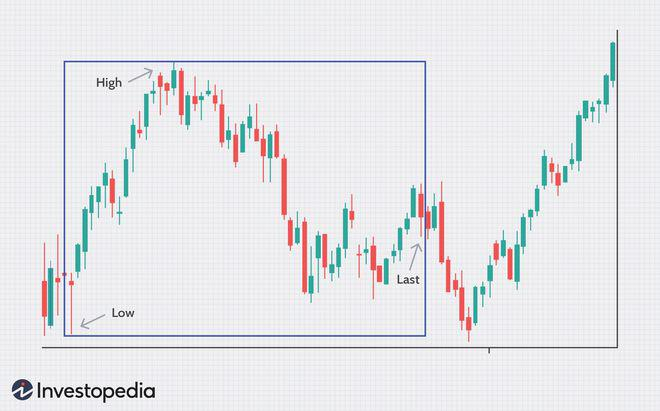

Welcome to our comprehensive guide on investment strategies with a focus on the 52-week range, financial analysis, and algorithmic trading. In today's dynamic financial environment, tools and metrics that offer insights into a security's performance are invaluable. Among these, the 52-week range stands out as it provides an essential snapshot of volatility and potential risk by highlighting the highest and lowest trading prices of a security over the past year.

Understanding and integrating the 52-week range into trading strategies can significantly enhance investment outcomes. It acts as a psychological benchmark often used to gauge whether a security is overvalued or undervalued, influencing traders' decision-making processes. Furthermore, it serves as a critical component of technical analysis, often signaling potential points of support or resistance.



This guide will examine the importance of the 52-week range within financial analysis and discuss ways in which algorithmic trading strategies can be constructed around this metric. With advances in technology, algorithmic trading has become a powerful tool for executing trades based on comprehensive data analysis and pre-defined criteria. By combining the 52-week range with algorithmic trading, traders can automate strategies that capitalize on historical price patterns with high efficiency.

We will extend our exploration to include strategies for deploying the 52-week range across various financial instruments, including stocks, ETFs, and cryptocurrencies. Each of these asset classes presents unique opportunities and challenges. By applying historical price data, investors and traders can strive for improved future performance and risk management.

Our aim is to equip you with the knowledge to leverage past pricing data effectively to achieve better forecasting and informed decision-making. Whether you are an individual trader or part of a larger financial entity, utilizing the 52-week range within a broader strategic framework can provide a considerable advantage in navigating today's fast-paced markets.

## Table of Contents

## Understanding the 52-Week Range

The 52-week range is a fundamental metric in financial markets that encapsulates the highest and lowest prices at which a security has traded over the past year. This key indicator is leveraged by investors to evaluate a security's volatility and potential risks, primarily by analyzing historical price movements. By understanding the fluctuations captured in this time frame, investors gain a clearer picture of the security's price behavior and inherent volatility.

The 52-week range serves a critical role in determining whether a security is currently overvalued or undervalued relative to its historical trading performance. For instance, if a stock is trading near the upper end of its 52-week range, it might be considered overvalued by some investors, indicating possible profit-taking opportunities or resistance levels. Conversely, if it is near the lower end, the stock may be viewed as undervalued, prompting buying interest based on its historical low price points.

In the context of technical analysis, the 52-week range frequently represents psychological levels of support and resistance. Support levels are price points where a downward-trending stock tends to pause due to buying interest, while resistance levels are price points where an upward-trending stock may face selling pressure. Traders often use these levels to anticipate potential [breakout](/wiki/breakout-trading) or reversal opportunities. A breakout occurs when a security's price moves beyond a defined support or resistance level, potentially signaling the start of a new trend. On the other hand, reversals involve a change in the direction of the price trend, often occurring at these critical levels.

Monitoring the 52-week range allows traders to identify signals for trend continuation, breakouts, and reversals. For example, a security approaching its 52-week high may indicate a bullish trend, prompting traders to speculate on continued upward [momentum](/wiki/momentum). Conversely, a security nearing its 52-week low might suggest bearish sentiments, encouraging traders to consider short positions or prepare for potential reversals.

In summary, the 52-week range is not just a simple measure of historical price extremes. It is a vital tool for assessing market conditions, gauging investor sentiment, and identifying key trading opportunities. Traders who understand and apply this metric effectively can better navigate market dynamics and enhance their strategy formulation for improved investment outcomes.

## Significance in Financial Analysis

The 52-week range is an essential metric in financial analysis, as it provides insights into market trends and investor sentiment. By understanding the range between the highest and lowest trading prices of a security over the past year, analysts and traders can better gauge the security's market behavior and potential future movements.

Identifying momentum trends is one crucial application of the 52-week range in financial analysis. Momentum trends signify the likelihood of a continued movement in the price of a security. By observing where the current price sits within the 52-week range, investors can develop strategic entry and [exit](/wiki/exit-strategy) points. When a security's price approaches its 52-week high, it may indicate bullish momentum, suggesting that demand is increasing and that the price could continue rising. Conversely, if the price is near the 52-week low, it may suggest bearish sentiment, pointing to potential downward pressure.

Historical price data from the 52-week range also aids investors in setting realistic profit targets and managing their expectations. Knowing how a security has fluctuated over the past year helps investors anticipate potential price ranges and plan their trades accordingly. This historical context is vital for assessing whether a security is overvalued or undervalued and for predicting its future price movement trajectories.

Financial analysts frequently combine the 52-week range with other technical indicators to enhance prediction accuracy. One common approach is integrating moving averages, which smooth out price data to identify trends over specific periods. For instance, a security trading above its moving average near the 52-week high might reinforce a bullish outlook. Analysts may also use indicator combinations, like the Moving Average Convergence Divergence (MACD) or the Relative Strength Index (RSI), for a more comprehensive analysis. Here is a simple Python example demonstrating how to calculate the moving average in relation to the 52-week range:

```python
import pandas as pd

# Example data: daily closing prices of a security
data = {
    'Date': pd.date_range(start='2022-01-01', periods=365, freq='D'),
    'Close': [100 + i*0.1 for i in range(365)]  # Simulated closing prices
}

prices = pd.DataFrame(data)
prices.set_index('Date', inplace=True)

# Calculate the 52-week range
high_52_week = prices['Close'].rolling(window=365).max()
low_52_week = prices['Close'].rolling(window=365).min()

# Calculate a 50-day moving average
prices['MA50'] = prices['Close'].rolling(window=50).mean()

# Determine if the current price is closer to the 52-week high or low
def trend_indicator(row):
    if (row['Close'] >= row['MA50']) and (row['Close'] >= 0.8 * high_52_week.max()):
        return 'Bullish Trend'
    elif (row['Close'] <= row['MA50']) and (row['Close'] <= 1.2 * low_52_week.min()):
        return 'Bearish Trend'
    else:
        return 'Neutral'

prices['Trend'] = prices.apply(trend_indicator, axis=1)
print(prices.tail())
```

Here, we simulate a data frame with daily closing prices, compute the 52-week high and low, and calculate a 50-day moving average. The trend indicator function then classifies the current trend based on the proximity to the 52-week high and low relative to the moving average.

In conclusion, the 52-week range is a powerful tool in financial analysis, helping traders and investors recognize market trends, gauge sentiment, and inform strategic decisions. By incorporating this metric into broader technical analysis frameworks, investors can better anticipate changes and adapt their strategies to the evolving market landscape.

## 52-Week Range Trading Strategies

Several trading strategies leverage the 52-week range to exploit market movements and potential price reversals. These strategies focus on identifying key price action signals at crucial 52-week levels, and they are integral for traders aiming to capitalize on market trends.

**Breakout Strategies:** Breakout strategies are predicated on the idea that securities breaching their 52-week highs or lows are likely to continue moving in the breakout direction. When a security breaks above its 52-week high, it suggests strong bullish momentum, often driven by increased investor interest and positive market sentiment. Traders buy these securities in anticipation of continued price appreciation. Conversely, a break below the 52-week low indicates bearish momentum, and traders may sell short, expecting further declines. The formula representing a breakout strategy's potential profit target can be expressed as:

$$
\text{Target} = \text{Breakout Level} \pm \text{(Average True Range)}
$$

where the sign depends on whether it's a bullish or bearish breakout.

**Reversal Strategies:** Reversal strategies aim to exploit situations where a security approaches the upper or lower boundaries of its 52-week range but fails to break through. This strategy assumes that the price will revert to a mean or prior level of stability. Traders watch for signs such as candlestick patterns or oscillators indicating overbought or oversold conditions to enter the market against the prevailing trend. Proper risk management is crucial, as betting on reversals against strong market momentum can be risky.

**Retracement Strategies:** More conservative traders often use retracement strategies. These involve watching for a price pullback to a key level within the 52-week range, which offers a more favorable entry point in the direction of the breakout. This strategy relies on the assumption that the retracement will be followed by a continuation of the original breakout. Fibonacci retracement levels are commonly used to identify potential entry or exit points, calculated based on the preceding price range.

**Volume Analysis:** A critical component of all these strategies is volume analysis. Volume acts as a confirmation tool, validating the strength of breakout or reversal signals. A breakout accompanied by high trading volume is more likely to sustain than one with low volume. Similarly, significant volume at 52-week levels adds weight to reversal or retracement signals, indicating genuine market interest or the exhaustion of existing trends.

By considering 52-week range levels and integrating [volume](/wiki/volume-trading-strategy) analysis, traders can develop robust strategies that enhance their probability of capturing significant market moves. While these strategies are not foolproof, their systematic application—especially when combined with thorough market analysis and sound risk management—can improve trading outcomes significantly.

## Integrating Algorithmic Trading

Algorithmic trading harnesses automated software to execute trades based on pre-defined rules, and integrating the 52-week range as an analytical criterion enhances its effectiveness. Algorithms are designed to scan for securities nearing their 52-week high or low boundaries, which are significant markers used to predict potential price movements. These price levels, when combined with analyses of [liquidity](/wiki/liquidity-risk-premium) and [volatility](/wiki/volatility-trading-strategies), provide robust trading signals.

For example, an algorithm might focus on detecting when a stock price approaches its 52-week high. Upon reaching this threshold, it could examine market liquidity to confirm that the upward movement is supported by sufficient trading volume. The liquidity metric ensures that the price action is not merely a result of random fluctuations but shows substantial market interest. Similarly, volatility analysis assesses the likelihood of sustained price movement following a breakout. High volatility might suggest potential for larger price swings, whereas low volatility may indicate a more stable trend.

Backtesting is critical in [algorithmic trading](/wiki/algorithmic-trading) and involves testing the strategy on historical data to evaluate its performance retrospectively. By applying the algorithm over past market data, traders can identify patterns and optimize the algorithm's parameters to enhance future performance. For example, a Python script could be used to backtest a strategy that triggers buys when a stock's price crosses its 52-week high with a trading volume above a specified threshold.

```python
import pandas as pd
import numpy as np

def backtest_52_week_high_strategy(data, volume_threshold):
    data['52_week_high'] = data['Close'].rolling(window=252).max()
    data['Signal'] = np.where((data['Close'] > data['52_week_high']) & 
                              (data['Volume'] > volume_threshold), 1, 0)
    data['Returns'] = data['Close'].pct_change()
    data['Strategy_Returns'] = data['Signal'].shift(1) * data['Returns']
    return data['Strategy_Returns'].cumsum()  # Cumulative returns of the strategy

# Example Usage
# Assuming 'data' is a DataFrame with 'Close' and 'Volume' columns for stock prices and trading volume
# data = pd.read_csv('stock_data.csv')
# volume_threshold = 1000000  # example volume threshold
# strategy_returns = backtest_52_week_high_strategy(data, volume_threshold)
# print(strategy_returns)
```

Integrating [artificial intelligence](/wiki/ai-artificial-intelligence) and [machine learning](/wiki/machine-learning) within trading algorithms can further refine their predictive capabilities. Machine learning models can be trained to recognize complex patterns and adapt to changing market conditions, thereby enhancing the algorithm's adaptability. For example, a [neural network](/wiki/neural-network) might be trained on historical data to predict the likelihood of a 52-week boundary breach leading to a significant trend, allowing the algorithm to adjust its strategies proactively.

Moreover, the cyclic pattern of human behavior in the financial markets often corresponds to the psychological significance of these 52-week benchmarks. Algorithmic strategies utilizing these patterns may exploit repetitive cycles, capturing opportunities from human psychological tendencies surrounding support and resistance levels inherent in the 52-week range. This integration of technology and behavioral insights continues to push the boundaries of algorithmic trading efficacy.

## Conclusion

The 52-week range serves as a critical tool for traders and investors aiming to harness historical price dynamics in their strategies. By offering a snapshot of a security's price extremes over the past year, it aids in understanding market conditions and aids in developing strategies aligned with both momentum and contrarian stances. This metric serves not just as a measure of volatility but also as an indicator of potential support and resistance levels, providing a framework for anticipating market movements.

Integration with algorithmic trading enhances the utility of the 52-week range, allowing for automated and precise execution of strategies. Algorithms analyze securities approaching their 52-week boundaries in conjunction with other market factors, optimizing trade execution with greater consistency and efficiency. By blending this historical data point with automated processes, investors can better manage risks while capitalizing on opportunities presented by market cycles.

Adopting such integrated approaches provides a decisive edge in today's fast-evolving financial markets. The combination of historical data insights with algorithmic power facilitates the formulation of robust trading strategies that can adapt to changing market dynamics. Investors are encouraged to continuously explore and refine their strategies, leveraging the 52-week range as one of several analytical tools for informed decision-making. This iterative process of strategy enhancement ensures resilience and adaptability in diverse market environments, fostering a proactive approach to investing.

## References & Further Reading

[1]: Bergstra, J., Bardenet, R., Bengio, Y., & Kégl, B. (2011). ["Algorithms for Hyper-Parameter Optimization."](https://dl.acm.org/doi/10.5555/2986459.2986743) Advances in Neural Information Processing Systems 24.

[2]: ["Advances in Financial Machine Learning"](https://www.amazon.com/Advances-Financial-Machine-Learning-Marcos/dp/1119482089) by Marcos Lopez de Prado

[3]: ["Evidence-Based Technical Analysis: Applying the Scientific Method and Statistical Inference to Trading Signals"](https://www.amazon.com/Evidence-Based-Technical-Analysis-Scientific-Statistical/dp/0470008741) by David Aronson

[4]: ["Machine Learning for Algorithmic Trading"](https://github.com/stefan-jansen/machine-learning-for-trading) by Stefan Jansen

[5]: ["Quantitative Trading: How to Build Your Own Algorithmic Trading Business"](https://www.amazon.com/Quantitative-Trading-Build-Algorithmic-Business/dp/1119800064) by Ernest P. Chan