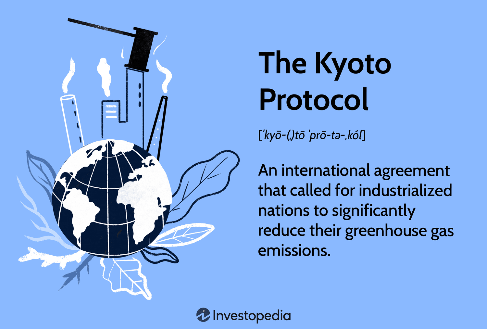

The rapid advancement and global adoption of 5G technology have significantly transformed telecommunications and several industries, notably algorithmic trading. As the fifth generation of cellular networks, 5G offers exceptionally high-speed connectivity and reduced latency, key enhancements that open new possibilities for financial markets. Algorithmic trading, which relies on complex mathematical models and high-frequency data, benefits immensely from 5G's capabilities by allowing trading algorithms to execute transactions in mere milliseconds with unparalleled accuracy and efficiency.

The integration of 5G technology in telecommunications marks a substantial shift where information is transmitted faster and more reliably than ever before. This shift is critical for algorithmic trading systems that depend on swift data analysis and almost instantaneous execution of trade orders. A lower latency means that trading algorithms can quickly respond to market fluctuations, capturing opportunities and minimizing risks more effectively, which is crucial in volatile financial environments.



5G's contribution to algorithmic trading can be understood through its technological features that support enhanced data throughput and a more extensive connection of devices. As a result, financial markets experience improved operational performance, which can lead to better trading outcomes and ultimately, higher profits. This article will explore how the integration of 5G technology is reshaping the telecommunications sector, with a particular focus on its impact on algorithmic trading, drawing on global examples and future trends to illustrate this evolution.

## Table of Contents

## Global Adoption of 5G Technology

Countries around the globe are actively pursuing the deployment of 5G networks, aiming to secure a competitive advantage within the global economy. The adoption of 5G technology is seen as a testament to technological progress and economic foresight. Key nations, including the United States, China, South Korea, and European countries, are at the forefront of building extensive 5G infrastructures.

In the United States, major telecommunications companies have launched aggressive strategies to expand 5G coverage. With a focus on urban areas, they aim to provide high-speed connectivity essential for advancing technological applications. Similarly, Europe is making significant strides in 5G implementation, driven by the European Union's digital agenda which emphasizes high-speed internet access as crucial for economic development.

China, however, remains a dominant force in the 5G race. With several state-backed and private companies spearheading rollout efforts, China has established itself as a leader in 5G network expansion. The country's strategic investments in technology and infrastructure underscore its position as a pivotal player in the global 5G landscape.

South Korea has also achieved substantial progress, frequently cited as one of the first countries to launch a nationwide 5G network. Korean telecommunications companies are pioneering in leveraging 5G for innovative services, such as connected vehicles and smart city solutions.

Projections for the future anticipate a rapid increase in 5G subscribers, with estimates indicating around 1.7 billion users worldwide by 2024. This surge will be prominently led by China, further solidifying its influence and reshaping the technological ecosystem on a global scale. As such, countries are recognizing the necessity of robust 5G networks to facilitate economic growth, technological innovation, and maintain competitive parity in the modern digital age.

## 5G in Telecommunications

Telecommunications companies are leveraging 5G networks to offer superior services, including high-speed internet and enhanced mobile connectivity. The fifth generation of wireless technology, 5G, represents a significant leap forward, providing speeds up to 100 times faster than 4G networks. This increased speed and enhanced connectivity enable telecommunications companies to offer new and improved services that meet the demands of modern digital consumers.

The deployment of 5G opens the door to a wide array of applications across various domains. In the context of smart cities, 5G facilitates the integration of connected devices, known as the Internet of Things (IoT), enabling real-time data collection and processing to enhance urban management and efficiency. For example, 5G can support the deployment of smart traffic systems that reduce congestion by adjusting traffic signals based on real-time traffic flow data. In the automotive industry, the low latency and high reliability of 5G networks are essential for autonomous vehicles, which require instantaneous vehicle-to-vehicle and vehicle-to-infrastructure communication to ensure safe and efficient operation.

Telecommunications giants such as AT&T, Verizon, and China Mobile are leading the charge in the 5G revolution. These companies are investing heavily in 5G infrastructure to enhance their service offerings and maintain competitive edges in the global market. AT&T and Verizon have both earmarked billions of dollars for 5G network expansion in the United States, focusing on enhancing network capacity and coverage to provide unparalleled service quality. Similarly, China Mobile is rapidly deploying 5G infrastructure, capitalizing on China’s support for advanced telecommunications technologies as part of its broader economic strategy.

The transformative shift to 5G is not merely an evolution of existing technologies but a revolution that is reshaping the telecommunications landscape. This shift is fostering innovation, creating opportunities for new applications, and setting the stage for advanced technological capabilities across multiple industries. As 5G networks continue to expand, telecommunications companies will unlock the potential to offer unprecedented services, enhancing connectivity and efficiency in ways previously unimagined.

## Impact on Algo Trading

Algorithmic trading, a cornerstone of modern financial markets, hinges on the swift processing of high-frequency data to make rapid and precise trading decisions. One of the salient features of 5G technology is its low-latency networks, which are pivotal in enhancing the speed and accuracy of these operations. Low latency, defined as the time it takes for data to travel from its source to its destination, is crucial for [algorithmic trading](/wiki/algorithmic-trading) strategies such as high-frequency trading ([HFT](/wiki/high-frequency-trading-strategies)), where decisions to buy or sell are made within milliseconds.

The ultra-fast data transmission capabilities of 5G technology amplify the efficacy of [backtesting](/wiki/backtesting) processes. Backtesting, a method used to test the viability of a trading strategy by applying it to historical data, demands high-speed data retrieval and processing. This enables traders to simulate trades and optimize strategies before applying them to live markets. With 5G, the latency reduction allows for more rigorous and expansive backtesting, improving the predictive accuracy of trading algorithms. Enhanced backtesting supports complex models that can process vast datasets more efficiently, leading to more robust trading strategies.

Furthermore, financial institutions are increasingly integrating 5G technology to refine their trading operations. The competitive environment of financial markets necessitates a strategic edge, often achieved through technological advancements. 5G provides such an advantage, enabling instantaneous access to market data and rapid execution of trades. This capability is vital for executing complex algorithms that require real-time data analysis, such as those used in [arbitrage](/wiki/arbitrage) and [market making](/wiki/market-making).

For instance, in high-frequency trading, where the speed of transactions is paramount, reduced latency provides a distinct competitive benefit. A trading algorithm that leverages 5G's speed can react to market shifts in real-time, making decisions based on the most current data available. This can lead to improved trade execution and increased profitability through the capture of fleeting market opportunities that are not accessible with slower data transmission technologies.

In summary, the adoption of 5G technology in algorithmic trading enhances data processing speed, reduces latency, and supports the development of more accurate and responsive trading algorithms. By integrating 5G networks, financial institutions can achieve a substantial competitive edge, contributing to the evolution and sophistication of trading strategies in today's fast-paced financial markets.

## Case Studies and Applications

South Korea and the United States have emerged as pioneers in the integration of 5G technology in financial markets, with substantial implications for algorithmic trading. These countries have demonstrated successful deployment and innovative use of 5G, addressing both opportunities and challenges in financial sectors.

### South Korea

South Korea, known for its rapid tech adoption, has leveraged 5G to enhance real-time market analysis and automated trading systems. South Korea's Financial Services Commission has facilitated the rollout of smart financial services that utilize 5G networks to process high-frequency data with minimal latency. An example is the Korea Exchange (KRX), which uses 5G for faster data dissemination to trading systems, thus helping in achieving near-instantaneous order executions and market data updates. This adoption has improved [liquidity](/wiki/liquidity-risk-premium) and market efficiency.

A significant opportunity presented by 5G in South Korea involves the enhancement of backtesting trading algorithms. By employing faster data transmission capabilities, firms can conduct historical analysis and strategy testing in reduced time, optimizing predictive models and decision-making processes.

### United States

The United States, led by financial hubs like New York and Chicago, has also experienced significant 5G integration. Major firms and exchanges exploit 5G to optimize high-frequency trading (HFT) operations. For instance, Nasdaq has explored 5G’s potential to improve data processing speeds and trading system integrations. The enhanced bandwidth reduces the time required for trade execution, giving traders an edge in competitive markets.

However, challenges must be addressed, such as ensuring data security and network reliability, which are critical in financial applications. The United States is working towards robust regulatory frameworks to mitigate risks associated with 5G usage in financial markets.

### Applications in Algorithmic Trading

5G technology supports various innovative applications in algorithmic trading beyond the traditional uses. Real-time market analysis benefits significantly as 5G facilitates the rapid collection and processing of vast datasets, aiding in more accurate trend predictions. Automated trading systems take advantage of 5G's low-latency features, enabling them to execute trades swiftly in response to market triggers.

The synergy of Machine Learning (ML) with 5G enhances trading strategies through sophisticated data analysis. Python code can be used to leverage 5G data speeds in an ML context:

```python
import pandas as pd
from sklearn.model_selection import train_test_split
from sklearn.ensemble import RandomForestClassifier

# Load data
data = pd.read_csv('market_data.csv')

# Preprocess data
X = data.drop('target', axis=1)
y = data['target']

# Split data into training and test sets
X_train, X_test, y_train, y_test = train_test_split(X, y, test_size=0.2, random_state=42)

# Train model
model = RandomForestClassifier(n_estimators=100)
model.fit(X_train, y_train)

# Predict and evaluate
predictions = model.predict(X_test)
```

### Challenges and Opportunities

Despite 5G's transformative potential, several challenges persist. The financial sector must navigate issues such as network coverage limitations, which can affect the reliability of real-time trading applications. Furthermore, the increased capability for data handling necessitates enhanced cybersecurity measures to protect sensitive financial information.

Opportunities abound for entities that capitalize on 5G technology, including improved client services through faster and more reliable trading platforms. Success stories in South Korea and the USA illustrate the strategic advantages of adopting 5G, positioning these countries at the forefront of financial innovation. As 5G technology matures, its applications will likely continue to evolve, offering new avenues for algorithmic trading advancements.

## Future Trends and Predictions

5G technology is poised to continue influencing financial markets and trading technologies significantly. As 5G networks become more widespread, the trading landscape will likely experience notable changes. One key trend in 5G adoption will be its integration with artificial intelligence (AI) to enhance algorithmic trading systems. The combination of AI and 5G is expected to enable trading algorithms to process vast amounts of real-time data more efficiently, leading to improved decision-making capabilities and enhanced predictive accuracy.

Potential advancements in 5G technology, such as millimeter-wave spectrum and massive Multiple Input Multiple Output (MIMO) systems, promise even higher data transmission rates and lower latencies. These improvements could allow for more complex trading strategies, including those relying on [machine learning](/wiki/machine-learning) models that need to process large datasets rapidly. The ability to access real-time data streams with minimal delay will be crucial for traders aiming to capitalize on fleeting market opportunities.

Despite these advancements, the increased reliance on 5G networks presents potential risks and regulatory challenges. One significant concern is the risk of cyberattacks targeting 5G infrastructure, which could disrupt trading activities and financial markets at large. Financial institutions may need to invest in robust cybersecurity measures to mitigate such risks, ensuring that their trading platforms remain secure.

Furthermore, as financial institutions depend more heavily on 5G networks, regulatory bodies may impose stricter guidelines on data handling and privacy. Compliance with these regulations can be complex, requiring financial institutions to maintain transparency and protect sensitive information. The dynamic nature of 5G technology evolution necessitates adaptive regulatory frameworks that can address both current and future challenges.

In conclusion, as 5G technology evolves, it will continue to reshape financial markets and trading technologies, presenting both exciting opportunities and significant challenges. The future will likely see further integration of advanced technologies, necessitating adaptive strategies and robust regulatory oversight to fully harness the benefits while ensuring security and compliance.

## Conclusion

The integration of 5G technology within telecommunications has significantly transformed the landscape, creating profound impacts across various industries, notably in the realm of algorithmic trading. By providing high-speed connectivity and remarkably low latency, 5G has enhanced the performance of trading algorithms, facilitating more swift and precise trading decisions. This advanced capability has enabled financial institutions to optimize their trading strategies, ensuring they remain competitive in increasingly fast-paced markets.

Investments in 5G infrastructure are vital to sustaining economic growth and fostering innovation. The continuous evolution of this technology will spearhead advancements in telecommunications, allowing other sectors such as smart cities, autonomous vehicles, and healthcare to also reap its benefits. As global economies strive for enhanced connectivity and technological superiority, the focus on expanding and upgrading 5G frameworks will be crucial.

Furthermore, ongoing research and development are imperative to fully realize the potential of 5G across different industries. As new applications and efficiencies are realized, entities that harness 5G effectively are likely to secure a competitive edge on the global stage. The journey towards fully leveraging 5G's capabilities calls for a concerted effort from both the public and private sectors to push the boundaries of innovation and establish a sustainable, technologically advanced future.

## References & Further Reading

[1]: Ericsson. (2021). ["5G for Industries – Transforming Business with 5G Networks."](https://www.ericsson.com/en/blog/2021/4/defining-the-business-value-of-industrial-5g) Ericsson.com.

[2]: GSMA. (2019). ["The 5G Guide: A reference for operators."](https://www.gsma.com/wp-content/uploads/2019/04/The-5G-Guide_GSMA_2019_04_29_compressed.pdf) GSMA Future Networks.

[3]: Nasdaq. (2020). ["The Impact of 5G on Market Structures."](https://www.nasdaq.com/articles/world-reimagined%3A-the-future-of-5g-technology-and-how-to-invest-in-it-2020-10-29) Nasdaq.com.

[4]: Lopez de Prado, M. (2018). ["Advances in Financial Machine Learning."](https://www.amazon.com/Advances-Financial-Machine-Learning-Marcos/dp/1119482089) Wiley.

[5]: International Telecommunication Union. (2020). ["Setting the Scene for 5G: Opportunities & Challenges."](https://www.itu.int/hub/2020/03/setting-the-scene-for-5g-opportunities-challenges/) ITU.