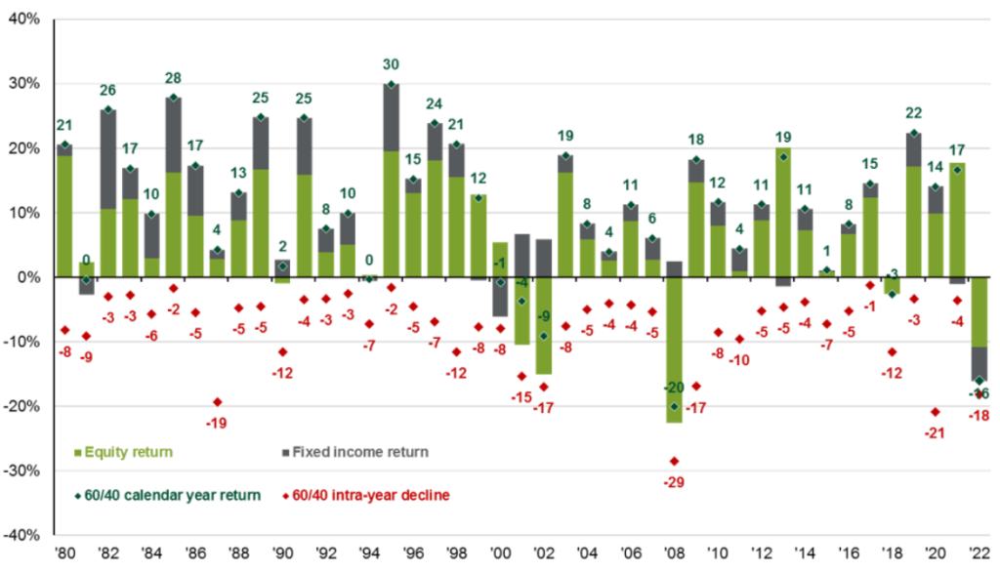

Investment strategies have consistently transformed over time, influenced by both market dynamics and technological advancements. In recent years, quantitative approaches like algorithmic trading have become increasingly significant within financial markets. Algorithmic trading employs complex algorithms, statistical models, and computational techniques to execute trades quickly and efficiently, predominantly minimizing human intervention. This approach has revolutionized how financial assets are bought and sold, providing a myriad of strategies that appeal to various risk appetites and investment goals.

Among the myriad of strategies in algorithmic trading, two stalwarts that often come under consideration are the 60/40 portfolio and the S&P 500 index. The 60/40 portfolio is a traditional investment strategy that allocates 60% of the portfolio to equities and the remaining 40% to bonds. This strategy has been celebrated for its diversification benefits, balancing growth potential derived from equities with the relative stability of bonds. Historically, this allocation has been lauded for mitigating risk, especially for investors with a risk-averse profile.



Conversely, the S&P 500 represents a broader index of 500 leading U.S. companies and is often used as a proxy for the entire U.S. equity market. It serves as a critical benchmark for many investment portfolios, especially in automated trading systems. Given its focus on large-cap equities, the S&P 500 is typically characterized by higher volatility and potential for growth, which draws algorithmic traders aiming for significant capital appreciation.

This article seeks to systematically examine the relative performance and suitability of the 60/40 portfolio and the S&P 500 within algorithmic trading environments. By analyzing their characteristics, historical performance, and the impact of algorithmic implementations, the article aims to provide insights that can assist fund managers and investors in determining how these strategies might best suit their financial objectives in a world increasingly dominated by technology-driven trading systems.

## Table of Contents

## Understanding the 60/40 Portfolio

The 60/40 portfolio strategy is a foundational investment approach that allocates 60% of its assets to equities and 40% to bonds. This allocation seeks to balance growth and income by capturing the higher potential returns of equities while mitigating risk with the traditionally stable returns from bonds. Historically, this strategy has been significant in portfolio diversification and risk management, providing a pragmatic solution for investors seeking steady returns with moderate risk exposure.

The rationale behind the 60/40 allocation lies in its balanced exposure to both growth and stability. Equities are typically more volatile than bonds but offer higher growth potential; bonds, conversely, present lower risk and provide income stability through interest payments. This combination aims to capture equity market upside while cushioning the impact of market downturns through the bond component, appealing particularly to risk-averse investors. By diversifying across asset classes, the 60/40 portfolio seeks to achieve a smoother return profile, reducing the overall portfolio volatility compared to a 100% equity investment.

Performance of the [60/40 portfolio](/wiki/60-40-portfolio-vs-SP-500) across different market conditions illustrates its strengths and limitations. In bull markets, the equity portion typically drives portfolio gains, but this strategy may underperform compared to more aggressive equity-heavy portfolios. In bearish or volatile markets, the bond allocation often serves as a buffer against steep equity losses, thus reducing the risk of significant drawdowns.

However, the strategy is not without weaknesses. In high-inflation environments, the bond market can struggle as interest rates rise. Rising rates hurt bond prices, resulting in negative returns from the bond component of the 60/40 strategy. This scenario challenges the role of bonds as a safe haven since inflation erodes the purchasing power of fixed interest payments. Additionally, during prolonged bull markets, the conservative 40% bond allocation may limit the growth potential, making it less attractive to investors seeking higher returns.

Overall, the 60/40 portfolio remains a valuable tool in portfolio management, providing a mix of growth and stability suited to varying investment goals and risk appetites. Nonetheless, it requires periodic reassessment, especially in changing economic conditions where traditional bonds may fail to deliver expected risk mitigation.

## Overview of the S&P 500 in Algorithmic Trading

The S&P 500, a key index representing the U.S. stock market, encompasses 500 of the largest publicly traded companies in the United States. It is a widely accepted benchmark for the equity portion of portfolios due to its comprehensive coverage across major sectors. This index reflects the health of the U.S. economy and serves as a primary indicator for market performance.

Historically, the S&P 500 has demonstrated robust performance, averaging annual returns of approximately 10% over the long term, although it is subject to market cycles, with periods of significant gains and losses. Its relevance in [algorithmic trading](/wiki/algorithmic-trading) strategies primarily stems from its [liquidity](/wiki/liquidity-risk-premium) and the availability of large datasets, which are crucial for developing and testing complex algorithms. Algorithmic trading systems often rely on historical data for [backtesting](/wiki/backtesting) strategies, making the extensive historical information on the S&P 500 invaluable.

In the context of [volatility](/wiki/volatility-trading-strategies) and return characteristics, the S&P 500 presents a substantive opportunity for algorithmic traders aiming for growth-heavy portfolios. The inherent volatility of the index provides the potential for high-frequency trading strategies to capitalize on short-term price movements. For Python traders, libraries like NumPy and pandas can be utilized to compute key metrics such as standard deviation and moving averages, essential in volatility analysis.

Here is a simple Python code snippet using pandas to calculate the annualized volatility of the S&P 500:

```python
import pandas as pd

# Assuming 'data' is a DataFrame with daily 'Close' prices of the S&P 500
data['Returns'] = data['Close'].pct_change()
volatility = data['Returns'].std() * (252 ** 0.5)  # Annualize the volatility
print(f"Annualized Volatility: {volatility:.2%}")
```

This evaluation of return and risk is crucial for algorithmically-driven investment decisions, allowing traders to adjust their strategies based on historical performance and anticipated market trends. The S&P 500's rich dataset supports the development of predictive models and [machine learning](/wiki/machine-learning) applications, enabling algorithmic traders to enhance their decision-making processes. Consequently, the index remains a preferred choice for those seeking to leverage growth opportunities within algorithmic trading frameworks.

## Performance Comparison: 60/40 Portfolio vs S&P 500

The 60/40 portfolio and the S&P 500 index have been cornerstone investment strategies, each offering unique attributes that appeal to different investor profiles. A performance analysis of these strategies involves examining historical data—highlighting average returns, volatility, and potential drawdowns relative to market conditions, including algorithmic trading scenarios.

### Historical Performance Data

**60/40 Portfolio:**
The 60/40 portfolio, a staple of diversified investing, allocates 60% to equities and 40% to bonds. Historically, this portfolio has provided balanced returns with reduced volatility compared to pure equity investments. According to data spanning several decades, the average annual return of the 60/40 portfolio tends to hover between 7-9%, depending on the specific time frame and market conditions selected for review. Its standard deviation—a measure of volatility—is typically lower than that of the S&P 500, marking it as more stable during market fluctuations.

**S&P 500:**
Conversely, the S&P 500, representing a broad spectrum of the U.S. equity market, delivers higher average annual returns, often ranging between 8-10% over extended periods. However, this comes at the cost of increased volatility, particularly during periods of economic upheaval. Its standard deviation is often higher than that of a 60/40 portfolio, reflecting its exposure to market highs and lows.

### Economic Downturns and Growth Periods

During economic downturns, the 60/40 portfolio's inclusion of bonds traditionally acts as a stabilizing force, mitigating losses compared to the S&P 500, which may experience steep declines. For instance, during the 2008 Financial Crisis, the 60/40 portfolio provided better downside protection, with drawdowns significantly less severe than those experienced by the S&P 500. In contrast, during periods of robust market growth, like the bull market of the 2010s, the S&P 500 often outperforms due to its full equity exposure, translating to higher returns for investors willing to endure increased risk.

### Algorithmic Trading Considerations

Algorithmic trading introduces a new dimension to these strategies, leveraging technology to enhance execution efficiency and strategy optimization. The adaptability of the S&P 500 to algorithmic trading is facilitated by its inherent liquidity and data-rich environment, which allow complex algorithms to capitalize on market [arbitrage](/wiki/arbitrage) and [momentum](/wiki/momentum) strategies effectively.

The 60/40 portfolio, when managed algorithmically, requires sophisticated asset allocation algorithms to rebalance effectively, especially in volatile markets. This automation can optimize the rebalancing process, adjusting allocations in real-time to maintain the desired risk-return profile. However, the fixed income component inherently limits the dynamism available to purely equity-based strategies like those focused on the S&P 500.

In conclusion, the performance metrics and historical data suggest a nuanced behavior of these strategies under algorithmic management. The 60/40 portfolio offers stability with algorithmic fine-tuning providing enhanced risk management. The S&P 500, in contrast, offers robust returns but necessitates more sophisticated algorithms to manage its volatility and capitalize on market momentum.

## Integration in Algorithmic Trading Systems

Integration of the 60/40 portfolio and the S&P 500 into algorithmic trading systems requires careful consideration of technical and strategic elements to ensure optimal performance. Each strategy has unique characteristics that influence the implementation and efficacy within an automated framework.

For the 60/40 portfolio, a systematic approach focuses on balancing the dual objectives of risk mitigation and return optimization. The primary technical consideration involves efficient rebalancing. The portfolio inherently requires periodic adjustments to maintain its allocation ratio, which can be managed through automated rebalancing algorithms. These algorithms monitor market conditions and dynamically adjust the portfolio to adhere to the 60/40 split. Python can be utilized effectively to automate this process through libraries like `pandas` for data manipulation and `numpy` for numerical calculations.

```python
import pandas as pd
import numpy as np

def rebalance_portfolio(values, target_ratio=[0.6, 0.4]):
    total_value = sum(values)
    target_values = [total_value * r for r in target_ratio]
    return np.subtract(target_values, values)

# Example: 
# Current values - equities: $600, bonds: $400
current_values = [600, 400]
adjustments = rebalance_portfolio(current_values)
```

In terms of strategic considerations, the 60/40 portfolio is often aligned with long-term stability, suggesting a focus on minimizing latency and ensuring robust risk management protocols. Furthermore, market timing represents a less critical [factor](/wiki/factor-investing) than maintaining adherence to the allocation strategy, given the portfolio's balanced nature.

Conversely, implementing the S&P 500 strategy focuses heavily on capitalizing on market movements, requiring an emphasis on automation and execution speed. This index’s higher volatility demands frequent algorithmic trading strategies to navigate its rapid price swings effectively. The automation system must handle high-frequency data analysis and execution, necessitating advanced latency management. Gains rely on speed and accurate market timing, where latency can significantly affect performance.

Algorithmic systems designed for the S&P 500 benefit from leveraging machine learning models to predict short-term market trends based on historical data patterns. Python libraries such as `scikit-learn` can assist in developing models that enhance decision-making processes within trading algorithms.

```python
from sklearn.ensemble import RandomForestRegressor

# Sample training data (features and target)
features = [[...]]  # Historical market indicators
target = [...]

# Initialize and train the model
model = RandomForestRegressor()
model.fit(features, target)

# Predict future price movements
predictions = model.predict(new_features)
```

Each strategy's integration into algorithmic systems depends fundamentally on understanding and aligning the strategy’s characteristics with technical solutions that maximize performance. For the 60/40 portfolio, the focus remains on sustaining a balanced risk-return profile through structured rebalancing. In contrast, the S&P 500 demands agility and speed in exploiting market opportunities, often benefiting from sophisticated prediction and execution mechanisms. Balancing these factors effectively determines success in algorithmically managing these distinct investment strategies.

## Pros and Cons of Each Strategy in Algorithmic Trading

Integrating a balanced 60/40 portfolio into algorithmic trading platforms offers several advantages, particularly in terms of risk mitigation and diversified return potential. The classic allocation of 60% to equities and 40% to bonds provides a hedge against market volatility, as bonds typically behave inversely to stocks, cushioning the impact during equity downturns. This balanced approach is inherently aligned with risk-averse strategies, aiming to provide steady returns while minimizing potential drawdowns, especially in turbulent market conditions. Historically, the 60/40 portfolio has been a resilient choice, showcasing its ability to maintain capital preservation, which is a key objective for traders prioritizing risk management over aggressive growth.

However, the primary drawback of the 60/40 strategy is its potential for limited growth during bull markets. Equities have historically outperformed bonds over long periods, and a lower allocation to stocks may result in underperformance compared to more equity-heavy portfolios such as the S&P 500 index. In algorithmic environments, where rapid response to market conditions is possible, this conservative allocation may not fully capitalize on opportunities for high returns presented during strong bull market phases.

On the other hand, the S&P 500 is highly suitable for aggressive, growth-focused algorithmic trading strategies. By tracking the performance of leading companies in the U.S. market, the S&P 500 offers significant growth potential, capitalizing on corporate earnings and market optimism. Algorithmic traders can leverage the index's historical volatility and returns to design strategies that exploit short-term price movements and market trends. This can be advantageous during expansion phases when equities typically exhibit substantial gains.

Nevertheless, the higher risk and increased volatility associated with the S&P 500 make it a less stable choice for traders who seek risk-adjusted returns. During periods of market downturns or increased economic uncertainty, the lack of diversification inherent in an equity-heavy strategy can lead to significant drawdowns. Algorithmic systems must be adept at managing these risks, employing strategies such as dynamic hedging, stop-loss mechanisms, and timely rebalancing to mitigate potential losses.

In conclusion, while the 60/40 portfolio offers balanced risk and return with lower volatility, its growth limitations during bullish trends may not meet the objectives of traders seeking high returns. Conversely, the S&P 500 provides opportunities for substantial growth but with higher risk, necessitating advanced risk management techniques to protect capital in volatile conditions. The choice between these strategies in algorithmic trading depends on the trader's risk tolerance, market outlook, and strategic objectives.

## Case Studies and Backtesting Results

In evaluating the performance of algorithmically-traded 60/40 portfolios and S&P 500 strategies, various case studies and hypothetical backtests have illustrated key insights about their behavior under different market conditions. 

### Hypothetical Backtesting Results

A standard approach to backtesting involves evaluating historical data to simulate how a strategy might have performed in the past. For a 60/40 portfolio, the allocation stands at 60% equities (often represented by the S&P 500) and 40% bonds (commonly represented by the U.S. Aggregate Bond Index). Conversely, an S&P 500 strategy is purely equity-focused.

**Performance Metrics**:
- **CAGR (Compound Annual Growth Rate)**: The S&P 500 strategy tends to offer higher CAGR during bullish markets due to a greater equity composition. Historical data from 2000 to 2023 indicates a CAGR of approximately 7% for the S&P 500, whereas a 60/40 portfolio might yield around 5%.
- **Volatility**: The volatility, measured via standard deviation, typically shows that the S&P 500 strategy has higher variance (around 18%) compared to the 60/40 portfolio (approximately 11%), reflecting the stabilizing influence of bonds.
- **Max Drawdown**: Maximum drawdown often reveals that the 60/40 portfolio offers better protection during market crashes, with average drawdowns around 25%, compared to over 50% for the S&P 500 during severe downturns like the 2008 financial crisis.

### Algorithmic Trading Context

When these strategies are subjected to algorithmic trading, certain aspects alter their performance:

**Market Timing and Rebalancing**: Algorithmic systems excel at identifying favourable market timing, potentially enhancing returns. In a backtest, a 60/40 portfolio with quarterly rebalancing can sometimes reduce drawdowns by 2-3% during turbulent markets compared to annual rebalancing.

**Latency and Execution**: The efficiency of order execution plays a critical role. The S&P 500 strategy could exploit rapid market movements better due to its growth-oriented nature. Algorithms could be programmed to swiftly react to earning reports or macroeconomic news, enhancing profitability in volatile times.

### Case Studies

One noteworthy case study examined during the COVID-19 pandemic showcased how a 60/40 portfolio, algorithmically managed, cushioned the pandemic's impact better than a sole S&P 500 strategy. The bond allocation provided essential stability, resulting in a milder downturn and faster recovery post-crisis due to [interest rate](/wiki/interest-rate-trading-strategies) cuts and quantitative easing measures that benefited bonds.

### Implications for Future Algorithms

These findings underscore the critical importance of aligning algorithmic trading strategies with risk tolerance and market expectations. For investors prioritizing stability amidst volatility, a 60/40 portfolio remains relevant, especially when automated rebalancing is employed. Conversely, traders seeking higher returns in potentially rising markets might prefer an S&P 500-centric approach, accentuating the need for robust volatility management tools.

Future algorithmic implementations could benefit from hybrid models, integrating machine learning to optimize asset allocation dynamically, responding to market signals with enhanced precision. Such advancements point to an evolving landscape where traditional strategies, when computationally optimized, can yield superior outcomes aligned with diverse investment objectives.

## Conclusion and Recommendations

The analysis of the 60/40 portfolio and the S&P 500 within algorithmic trading contexts reveals several key insights. Historically, the 60/40 portfolio has been a staple for risk-averse investors, providing a balanced approach through its allocation of 60% to equities and 40% to bonds. This diversification generally offers protection against market volatility, leading to steady returns over the long term. Conversely, the S&P 500, an index capturing the performance of 500 leading companies in the United States, appeals more to growth-focused investors due to its potential for higher returns, albeit with increased volatility and risk.

Comparative performance analysis shows that during economic downturns, the 60/40 portfolio tends to outperform the S&P 500 due to its bond component, which traditionally serves as a stabilizing force. In contrast, during sustained market growth periods, the S&P 500 generally yields higher returns due to its pure equity composition. When integrated into algorithmic trading systems, these differences impact their respective strategies. The 60/40 portfolio benefits from automated rebalancing and risk management algorithms that maintain its asset ratio, while the S&P 500 strategy may require more sophisticated algorithms focused on timing market entry and [exit](/wiki/exit-strategy) points to capitalize on volatility.

Strategic recommendations for traders and investment managers include leveraging advanced algorithms that can dynamically adjust the 60/40 allocations more than traditional static models, potentially incorporating additional asset classes like commodities or real estate investment trusts (REITs) to further diversify and hedge against inflationary pressures. For the S&P 500, it is advisable to deploy predictive analytics to foresee market movements and optimize trade execution, making use of machine learning techniques to enhance decision-making algorithms.

Looking ahead, algorithmic trading and portfolio management innovations will likely blur the distinctions between traditional strategies like the 60/40 portfolio and more aggressive tactics. The integration of [artificial intelligence](/wiki/ai-artificial-intelligence) and machine learning models will enable real-time analysis and adaptation of investment strategies. As technology advances, the adaptability of the 60/40 portfolio may increase, incorporating real-time data to shift allocations dynamically, while the S&P 500 firms may increasingly rely on machine learning to maximize returns during volatile periods. Overall, the evolving landscape of algorithmic trading suggests that both strategies can coexist, serving different investor profiles, and benefitting from technological tools that refine their execution and management over time.

## References & Further Reading

[1]: Bergstra, J., Bardenet, R., Bengio, Y., & Kégl, B. (2011). ["Algorithms for Hyper-Parameter Optimization."](https://papers.nips.cc/paper/4443-algorithms-for-hyper-parameter-optimization) Advances in Neural Information Processing Systems 24.

[2]: ["Advances in Financial Machine Learning"](https://www.amazon.com/Advances-Financial-Machine-Learning-Marcos/dp/1119482089) by Marcos Lopez de Prado

[3]: ["Evidence-Based Technical Analysis: Applying the Scientific Method and Statistical Inference to Trading Signals"](https://www.amazon.com/Evidence-Based-Technical-Analysis-Scientific-Statistical/dp/0470008741) by David Aronson

[4]: ["Machine Learning for Algorithmic Trading"](https://github.com/stefan-jansen/machine-learning-for-trading) by Stefan Jansen

[5]: ["Quantitative Trading: How to Build Your Own Algorithmic Trading Business"](https://books.google.com/books/about/Quantitative_Trading.html?id=j70yEAAAQBAJ) by Ernest P. Chan