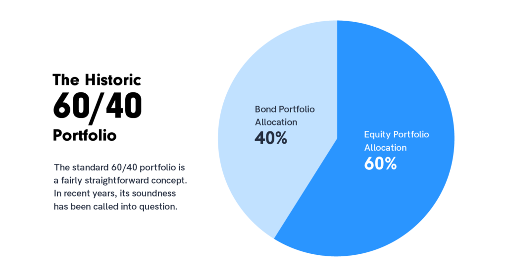

The 60/40 portfolio is a classic [investment strategy](https://paperswithbacktest.com) characterized by its allocation of 60% of assets in stocks and 40% in bonds. This approach aims to strike a balance between the growth potential of stocks and the relative safety of bonds. The 60% allocation in stocks is designed to provide appreciation and dividends, while the 40% in bonds can offer regular interest income and potentially reduce the portfolio's overall volatility.

The S&P 500, on the other hand, is a stock market index comprising 500 of the largest companies listed on stock exchanges in the United States. It's widely regarded as a benchmark for U.S. equity performance, reflecting the health of the stock market and, by extension, the U.S. economy.

Comparing the 60/40 portfolio with the S&P 500 is relevant for investors because it offers insights into the trade-offs between a diversified, balanced investment approach and a purely equity-focused strategy. While the S&P 500 can give a snapshot of the high-growth potential of equity investments, the 60/40 portfolio provides a lens through which to view the benefits of risk mitigation through diversification, particularly in volatile or bear markets. This comparison is especially crucial for investors seeking to understand the potential impact of different asset allocation strategies on their investment returns and risk exposure.

## Table of Contents

## Overview of the 60/40 Portfolio

The 60/40 portfolio, a longstanding staple in the investment world, is rooted in a balance between growth and stability. Historically, this portfolio model emerged from the traditional investment philosophy that advocates for diversification as a hedge against market volatility. The 60/40 split between stocks and bonds is designed to provide investors with a blend of growth potential through equities and income generation, along with capital preservation through bonds.

**Composition and Strategy**

The strategy allocates 60% of the portfolio to stocks, which are generally higher in risk and return potential, aiming for capital appreciation. This portion is typically invested in a diversified mix of equity assets, ranging from large-cap to small-cap stocks, and may include international equities as well.

The remaining 40% is invested in bonds, which are lower in risk and offer more stable returns. This portion is primarily aimed at preserving capital and generating income. The bond allocation may include government bonds, corporate bonds, and other fixed-income securities, with varying maturities and credit qualities.

**Investment Objective**

The primary goal of the 60/40 portfolio is to achieve a balance between risk and return, making it particularly suitable for moderate-risk investors. It aims to capture the growth potential of the stock market while cushioning against significant downturns through the stability provided by bonds.

This balanced approach is designed to weather various market conditions, mitigating the impact of stock market corrections while still benefiting from the upward potential of equities. The bond allocation provides a buffer during times of [stock market volatility](https://paperswithbacktest.com/paper/the-volatility-effect-lower-risk-without-lower-return), generating income and preserving capital when equity markets underperform.

The 60/40 portfolio is often considered a benchmark for a diversified, moderate-risk investment strategy. It's a favored choice for long-term investors, including retirement savers who seek growth but are cautious of excessive market risk.

In essence, the 60/40 portfolio represents a middle ground in [investment strategies](https://paperswithbacktest.com), offering a mix of growth and income with a moderate level of risk. This traditional asset allocation model has stood the test of time, adapting to changing market conditions and continuing to be a cornerstone of investment planning.

## Understanding the S&P 500

The S&P 500, a renowned benchmark in the financial world, is a stock market index comprising 500 of the largest companies listed on U.S. stock exchanges. Its composition reflects a broad spectrum of industries, making it a comprehensive indicator of the U.S. equity market's health and performance.

**Composition of the S&P 500:**

- The S&P 500 is made up of 500 leading publicly traded companies in the United States, covering about 80% of the American equity market by capitalization.
- The index is weighted by market capitalization, meaning companies with higher market values have a larger impact on the index's performance. This structure leads to a dominance of large-cap stocks, including technology giants, healthcare leaders, and consumer staples companies.
- Diverse Sectors: The index spans across major sectors of the economy such as technology, healthcare, financials, consumer discretionary, and industrials. This diverse sector representation provides a broad view of the economic and market trends in the U.S.

**Investment Characteristics of the S&P 500:**

- **Risk-Return Profile:** Investing solely in the S&P 500 typically carries higher risk and higher potential returns compared to a diversified portfolio like the 60/40. The index's performance is directly tied to the stock market's fluctuations, making it more volatile.
- **Growth Potential:** The S&P 500 is known for its growth potential, primarily driven by the performance of large-cap stocks. Historically, the index has provided robust returns over the long term, although it's subject to short-term market swings.
- **Dividend Yield:** The index also offers dividend yield, which contributes to the total return for investors. The yield varies depending on the prevailing interest rates and company profits.
- **Market Representation:** Given its composition, the S&P 500 is often used as a benchmark for U.S. equities. It's a popular choice for investors seeking exposure to the U.S. stock market and is frequently used to gauge the performance of mutual funds and other investment vehicles.

Investing solely in the S&P 500 provides a more focused approach to equity investment, targeting growth through exposure to some of the largest and most influential companies in the United States. However, this approach also entails a higher level of market risk and volatility compared to more diversified strategies like the 60/40 portfolio.

## Performance Comparison

**Performance Comparison**

The comparison between the historical performance of the 60/40 portfolio and the S&P 500 is crucial for investors seeking to understand how these strategies have fared over time, particularly in different market conditions.

**Historical Performance Analysis**

- **Returns:** Historically, the S&P 500 has tended to offer higher returns compared to the 60/40 portfolio due to its full exposure to the equity market. However, these returns come with higher volatility.
- **Volatility:** The 60/40 portfolio typically exhibits lower volatility than the S&P 500. The bond allocation in the 60/40 portfolio serves as a cushion during market downturns, reducing the overall portfolio volatility.
- **Drawdowns:** In periods of market downturns, the S&P 500 has experienced larger drawdowns compared to the 60/40 portfolio. The diversification and the stabilizing effect of bonds in the 60/40 portfolio help mitigate significant drops in value.

**Year-by-Year Performance**

Analyzing the performance year-by-year reveals that during bull markets, the S&P 500 often outperforms the 60/40 portfolio, given its full exposure to stock market gains. In contrast, during bear markets or times of increased volatility, the 60/40 portfolio often holds its value better, thanks to its bond component.

The performance in different market cycles also shows the resilience of the 60/40 portfolio during economic downturns, while the S&P 500 can offer more robust growth during market recoveries and expansions.

**Dividend Yield Comparison**

- **S&P 500:** The dividend yield of the S&P 500 can be a significant contributor to its total return. These dividends vary depending on the profits of the constituent companies and overall market health.
- **60/40 Portfolio:** While the stock component of the 60/40 portfolio also generates dividends, the bond portion provides regular interest income. This income component can be particularly appealing during times of low dividend yields in the equity market.
- The combined dividend and interest income from the 60/40 portfolio often results in a more stable and predictable income stream, compared to the potentially higher, but less consistent, dividend yield of the S&P 500.

In conclusion, the historical performance comparison of the 60/40 portfolio and the S&P 500 indicates a trade-off between higher potential returns with greater volatility (S&P 500) and more balanced, lower volatility returns with income stability (60/40 portfolio). This analysis is essential for investors to align their investment choices with their risk tolerance, investment horizon, and income needs.

## Risk and Diversification Analysis

In investment strategy, understanding and managing risk is as crucial as aiming for returns. In this section, we compare the risk profiles of the 60/40 portfolio and the S&P 500 and explore the diversification benefits of each approach.

|  | **60/40 Portfolio** | **S&P 500** |
| --- | --- | --- |
| **Risk Profile Comparison** | Traditionally, a 60/40 portfolio, with its blend of 60% stocks and 40% bonds, is seen as a balanced approach. Stocks offer growth potential but come with higher volatility. Bonds, typically less volatile, provide income and act as a buffer during stock market downturns. This blend aims to moderate the overall risk. | Investing solely in the S&P 500, which is fully exposed to equities, usually presents a higher risk profile. The S&P 500's performance is directly tied to the stock market's swings, leading to potentially higher volatility. |
| **Diversification Benefits** | The core advantage of a 60/40 portfolio lies in its diversification. By combining stocks and bonds, it can reduce the impact of market volatility. When stocks underperform, bonds often hold steady or even increase in value, thereby reducing the portfolio's overall risk. | The S&P 500, while diversified across various sectors and companies, is still solely invested in equities. Therefore, it lacks the asset class diversification that bonds or other securities could provide. In a market downturn, this lack of diversification can lead to larger portfolio declines. |
| **Diversification Across Market Cycles** | During bull markets, a 60/40 portfolio may not capture the same level of gains as the S&P 500 due to its bond allocation. Conversely, in bear markets, the bond allocation can protect against more significant losses. | Understanding market cycles is vital in evaluating which investment strategy may perform better. While the S&P 500 can offer higher returns during market upswings, a 60/40 portfolio can provide a more stable journey, especially in volatile or declining markets. |

In summary, the choice between a 60/40 portfolio and investing solely in the S&P 500 depends significantly on an investor's risk tolerance, investment horizon, and financial goals. The 60/40 portfolio, with its blend of stocks and bonds, offers a diversified approach aimed at balancing growth with risk management, whereas the S&P 500, fully invested in equities, offers higher growth potential but with increased volatility.

## Correlation and Market Dynamics

Understanding the correlation between stocks and bonds is crucial when evaluating the 60/40 portfolio. Historically, stocks and bonds have shown a negative correlation, meaning when stocks go up, bonds tend to go down, and vice versa. This negative correlation is the foundation of the 60/40 portfolio, providing a balance that aims to reduce overall portfolio risk while maintaining a reasonable return. When the stock market is bullish, the equity component (60%) of the portfolio captures the growth, whereas in bearish or volatile markets, the bond component (40%) offers a cushion against significant losses. This dynamic works well in traditional market environments where bonds serve as a reliable hedge against stock market downturns.

However, the efficiency of this correlation can vary based on market conditions. In periods of low interest rates and quantitative easing, like those seen in the past decade, bonds and stocks have occasionally moved in the same direction. This positive correlation diminishes the diversification benefit of bonds in the portfolio. Similarly, in times of rising interest rates, bonds may not provide the expected level of protection against stock market declines, as both asset classes might experience simultaneous drops in value.

The performance of the 60/40 portfolio is also influenced by broader market dynamics. In a thriving economy, where corporate earnings and consumer spending are high, the stock component of the portfolio is likely to perform well. Conversely, during economic downturns, recessions, or periods of high inflation, the bond portion can offer some level of defense, albeit not always sufficient to completely offset stock losses. The recent trend towards synchronized global economic cycles also impacts this, as it leads to more correlated movements in global equity and bond markets, potentially reducing the diversification benefit of the 60/40 portfolio.

In contrast, the S&P 500, being purely composed of equities, is more directly influenced by market conditions affecting the corporate sector. In bullish markets, the S&P 500 tends to offer higher returns compared to the 60/40 portfolio, as it is fully invested in equities. However, during market downturns or recessions, the S&P 500 can experience significant declines without the cushioning effect of bonds. This makes it more vulnerable to short-term market volatility compared to the 60/40 portfolio.

## Current Trends and Future Outlook

The vitality of the 60/40 portfolio strategy, long considered a cornerstone of balanced investing, has recently come under scrutiny. In the context of prevailing market trends, such as historically low interest rates, increased market volatility, and unprecedented global economic shifts, the traditional dynamics underpinning this strategy have evolved. The pressing question now is whether the 60/40 portfolio can still deliver the diversification and risk mitigation benefits it was once known for.

In recent years, the low yield environment has challenged the bond component of the 60/40 strategy. With interest rates at near-zero levels in many parts of the world, the income-generating capability and the cushioning effect of bonds have diminished. This change has prompted concerns about the ability of the 40% bond allocation to provide adequate protection against stock market downturns. Additionally, as central banks contemplate interest rate hikes to combat inflation, bond prices may face downward pressure, potentially leading to capital losses in the short term.

The equity portion, while benefiting from the prolonged bull market, faces its own set of challenges. High valuations, geopolitical tensions, and the potential for regulatory changes are factors that could impact future stock market returns. This scenario necessitates a re-evaluation of the traditional 60% allocation to stocks, as investors may need to brace for increased volatility and potentially lower returns.

Looking forward, investors might consider adapting the classic 60/40 model to align with the current economic landscape. This could involve diversifying into alternative asset classes such as real estate, commodities, or even cryptocurrencies to enhance yield and diversification. Adjusting the bond allocation to include a mix of short-term, inflation-protected, or high-yield bonds could also help in mitigating interest rate risk and enhancing returns.

Another perspective involves rethinking asset allocation strategies altogether. Dynamic asset allocation, which adjusts the mix of stocks and bonds based on market conditions, could offer a more responsive approach to managing portfolio risk. Similarly, factor-based investing, focusing on investment factors like value, size, or [momentum](https://paperswithbacktest.com/paper/fact-fiction-and-momentum-investing), may provide a more nuanced method for constructing the equity component of the portfolio.

In summary, while the traditional 60/40 portfolio may no longer be the one-size-fits-all solution it once was, it is not necessarily obsolete. Instead, its principles need to be reinterpreted and adjusted in light of the current economic environment. Investors should consider a more flexible, diversified approach to asset allocation, staying attuned to market shifts and emerging investment opportunities. This adaptability will be crucial in navigating the complexities of modern financial markets and achieving long-term investment goals.

## Alternatives and Variations

The traditional 60/40 portfolio, while a staple in investment strategies, isn't the only path investors can take. Alternatives, like the **more aggressive 80/20 allocation**, and other diversified strategies, offer different risk-reward balances tailored to individual investor preferences and market conditions.

Comparing the 60/40 portfolio with an 80/20 allocation highlights a shift in risk tolerance and potential returns. The 80/20 portfolio, with 80% in stocks and 20% in bonds, leans more towards capital appreciation and is suitable for investors with a higher risk tolerance. This allocation tends to perform exceptionally well in bullish markets, as the larger equity component captures more of the market upside. However, it also means greater volatility and potentially steeper drawdowns during market downturns, unlike the more balanced 60/40 approach, which offers a steadier, albeit possibly lower, return trajectory due to its significant bond holding.

Beyond these traditional mixes, other portfolio alternatives have gained traction. **The All-Weather Portfolio**, for instance, is designed to perform well across various economic conditions. It typically includes a mix of stocks, long-term and intermediate-term bonds, commodities, and gold. This portfolio aims to provide a balance of assets that react differently to economic environments, ensuring a smoother return curve.

**Adding gold and cryptocurrencies** into a portfolio introduces new dynamics. Gold has historically been a hedge against inflation and currency devaluation, offering a safety net during times of economic uncertainty. Cryptocurrencies, while relatively new and highly volatile, offer potential for high returns and are increasingly considered a diversification tool, albeit with a significantly higher risk profile.

Investing in international equities opens up opportunities for geographic diversification. It allows investors to tap into growth in different economies, which can be particularly beneficial when the domestic market is underperforming. However, this also introduces risks related to foreign exchange rates, political instability, and differing regulatory environments.

Tail risk strategies, focusing on hedging against rare but catastrophic market events, can also be integrated into a portfolio. These strategies often involve options and other derivatives to protect against extreme market downturns, providing a safety net in scenarios where traditional assets might fail.

Each alternative or variation to the 60/40 portfolio comes with its own set of advantages and challenges. Investors need to consider their risk tolerance, investment horizon, and market outlook when choosing the right mix. The key lies in understanding that no single strategy fits all and that portfolio construction should be a dynamic process, adjusting to changing market conditions and personal circumstances.

## Practical Application

Constructing and managing a 60/40 portfolio requires strategic selection of assets and continuous monitoring. The fundamental approach involves allocating 60% of the portfolio to stocks and 40% to bonds, but the specifics can vary based on individual risk tolerance, investment goals, and market conditions.

## Building a 60/40 Portfolio

**Asset Selection for Stocks (60%):** Diversify across different sectors and market caps. Include a mix of growth and value stocks. Utilize index funds or ETFs to gain exposure to a broad range of equities, such as those tracking the S&P 500 or other major indices. For individual stocks, consider companies with solid fundamentals and a history of stable performance.

**Asset Selection for Bonds (40%):** Diversify across different types of bonds, including government, municipal, and corporate bonds. Consider bond maturity lengths, opting for a mix of short, intermediate, and long-term bonds to balance risk and return. Inflation-protected securities (TIPS) can be a prudent addition to guard against inflation.

**Geographical Diversification:** While focusing on U.S. stocks and bonds, consider adding international exposure to both equity and fixed-income assets for broader diversification.

**Regular Rebalancing:** Periodically adjust the portfolio to maintain the 60/40 allocation. This might involve selling some equities in a bull market or buying more when stocks decline, and similarly adjusting the bond holdings.

## ETFs and Funds for Implementation

**Equity ETFs/Funds:** Look for ETFs that track major equity indices like the S&P 500, NASDAQ, or Dow Jones. These provide broad market exposure. Sector-specific or thematic ETFs can be added for targeted exposure.

**Bond ETFs/Funds:** Consider ETFs or mutual funds that invest in a diversified mix of bonds. Options include total bond market funds, municipal bond funds for tax-free income, corporate bond funds, and international bond funds.

**Diversified Funds:** Some funds are designed to maintain a 60/40 allocation, adjusting automatically with market changes. These balanced or target-date funds can be a one-stop solution for investors seeking simplicity.

**Alternative Investments:** For more sophisticated investors, adding alternative investments like REITs (Real Estate Investment Trusts) or commodities through ETFs can enhance diversification.

**Monitoring and Adjustment:** Keep track of performance, fees, and changes in the investment landscape. Use online tools and platforms for portfolio analysis and consider consulting with a financial advisor for personalized advice.

In summary, building and managing a 60/40 portfolio involves thoughtful asset selection, diversification across sectors and geographies, and regular rebalancing. Leveraging ETFs and mutual funds can simplify the process, providing access to a wide range of assets with the ease of trading a single security. As with any investment strategy, it's important to align the portfolio with individual investment goals and risk tolerance, and to stay informed about market developments.

## Conclusion

The comprehensive comparison between the 60/40 portfolio and the S&P 500 illuminates key insights into investment strategies tailored for varying investor profiles. The 60/40 portfolio, blending 60% stocks and 40% bonds, has historically been a beacon of balanced investing, offering a middle ground between risk and return. Its strength lies in diversification, with the bond component providing a buffer against stock market volatility, thereby appealing to investors who prioritize stability and steady income.

Conversely, the S&P 500, a benchmark for U.S. equities, presents a pure equity play, offering higher potential returns but with increased risk and volatility. It suits investors with a higher risk tolerance, primarily benefiting from bullish market trends but also facing steeper declines during downturns.

Our analysis revealed that while the 60/40 portfolio generally offers lower volatility and drawdowns, its returns could be modest compared to the S&P 500 in strong equity markets. However, in turbulent times or bear markets, the 60/40 portfolio's bond allocation can significantly mitigate losses, underscoring its role in risk management.

The evolving economic landscape, characterized by low-interest rates and changing market dynamics, has raised questions about the continued efficacy of the 60/40 strategy. This necessitates a dynamic approach to portfolio management, considering alternative allocations, and diversification into other asset classes like international equities, real estate, and even emerging sectors like cryptocurrencies.

In conclusion, the choice between the 60/40 portfolio and investing solely in the S&P 500 depends on individual investment goals, risk tolerance, and market outlook. While the 60/40 strategy remains a viable approach for those seeking a balanced and diversified portfolio, the S&P 500 is more aligned with investors seeking higher growth potential. The key takeaway is the importance of understanding one's investment objectives and risk appetite, coupled with the need for adaptability in an ever-changing investment landscape.

## References & Further Reading

- ["The Intelligent Investor"](https://en.wikipedia.org/wiki/The_Intelligent_Investor) by Benjamin Graham: This classic book offers foundational knowledge in value investing, essential for understanding stock market dynamics.
- ["A Random Walk Down Wall Street"](https://en.wikipedia.org/wiki/A_Random_Walk_Down_Wall_Street) by Burton Malkiel: Malkiel's work provides an in-depth look into various investment strategies, including index investing, which is closely related to S&P 500 investments.
- ["Principles"](https://en.wikipedia.org/wiki/Principles_(book)) by Ray Dalio: Dalio discusses risk management and portfolio diversification strategies, offering insights that are relevant to both the 60/40 portfolio and S&P 500 investments.