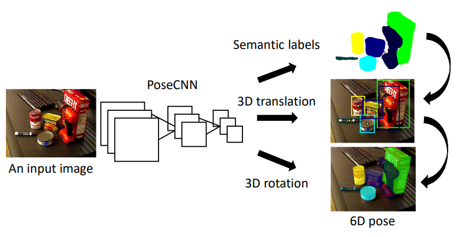

## Table of Contents

## What is 6D pose estimation in the context of machine learning?

6D pose estimation in machine learning is about figuring out the exact position and orientation of an object in 3D space. Imagine you have a toy car, and you want to know not just where it is but also how it's tilted or turned. In 6D pose estimation, the "6D" stands for six degrees of freedom. This includes three for the position (x, y, z coordinates) and three for the orientation (rotation around these axes). By estimating these six values, we can understand the full pose of an object in a 3D world.

This technique is very useful in areas like robotics, where robots need to interact with objects in their environment. For example, a robot arm in a factory needs to pick up parts and place them correctly. To do this, it must know the exact 6D pose of the parts. Machine learning models, often using deep neural networks, are trained on large datasets of images or sensor data to predict these poses accurately. These models learn to recognize patterns and features in the data that help them estimate the 6D pose of objects, even when they are partially hidden or in complex scenes.

## Why is 6D pose estimation important for applications like robotics and augmented reality?

6D pose estimation is crucial for robotics because it helps robots understand where objects are and how they are oriented in 3D space. Imagine a robot in a factory that needs to pick up a part and place it in a machine. The robot must know the exact position (x, y, z coordinates) and the rotation of the part (how it's tilted or turned). This is where 6D pose estimation comes in. By accurately estimating these six values, the robot can perform tasks like picking and placing objects with precision, avoiding mistakes that could slow down production or cause damage.

In augmented reality (AR), 6D pose estimation is equally important. AR applications overlay digital information onto the real world, and for this to look realistic, the system needs to know the exact position and orientation of the camera or the device. For example, if you're using an AR app to see how a new couch would look in your living room, the app needs to understand where the floor is and how the camera is tilted. With accurate 6D pose estimation, the digital couch can be placed correctly in the virtual space, making the AR experience seamless and believable. Without it, the digital objects might appear misaligned or floating, ruining the immersive experience.

## What are the basic components of a 6D pose estimation model?

A 6D pose estimation model usually has a few key parts that help it work well. First, there's the input data, which can be images or sensor readings from devices like cameras or depth sensors. The model uses these to figure out where and how objects are positioned in 3D space. Then, there's a neural network, which is like a brain that learns to spot patterns in the data. This neural network is trained on lots of examples to get good at guessing the 6D pose. It's made up of layers that process the data step by step, getting better at understanding the position and rotation of objects.

The other important part is the output of the model, which gives us the 6D pose. This includes the x, y, and z coordinates for the position, and three numbers for the rotation, often described using something called quaternions or rotation matrices. For example, if we use quaternions, the output might look like this: $$[x, y, z, q_w, q_x, q_y, q_z]$$, where $$x, y, z$$ are the position coordinates and $$q_w, q_x, q_y, q_z$$ are the quaternion components for rotation. The model's goal is to make these numbers as accurate as possible so that robots or AR systems can use them to do their jobs right.

## How does FFB6D approach the problem of 6D pose estimation?

FFB6D, or "Fully Convolutional Feature Boosting 6D", is a method that helps computers figure out the exact position and orientation of objects in 3D space. It does this by looking at images and using a special kind of neural network called a fully convolutional network. This network breaks down the image into smaller parts and looks at each part closely to find important features. Once it finds these features, FFB6D uses them to guess where the object is and how it's rotated. This method is good at handling situations where parts of the object might be hidden or the lighting is not perfect.

The way FFB6D works is by using a two-stage process. In the first stage, it finds key points on the object, like corners or edges, and uses these to get a rough idea of the object's pose. Then, in the second stage, it refines this guess by looking at the features again and making small adjustments. This makes the final estimate more accurate. FFB6D's approach is helpful because it can work well even when the object is partially hidden or in a cluttered scene, which is common in real-world situations.

## Can you explain the key features and advantages of the PixLoc model?

PixLoc is a model that helps computers figure out where things are in pictures, especially where the camera was when the picture was taken. It does this by looking at the pixels in the image and using a neural network to understand the scene. One of the main features of PixLoc is that it uses a two-step process. First, it guesses where the camera might be, and then it refines that guess by looking more closely at the image. This makes it really good at finding the exact spot and direction of the camera, even if the scene is complicated or the lighting is not perfect.

The advantages of PixLoc are that it works well with all sorts of images, from city streets to countryside views. It's also fast because it can process images quickly, which is important for things like self-driving cars or virtual reality where you need answers right away. Another big advantage is that PixLoc doesn't need a lot of extra information to work; it can do a good job with just the pixels from the image. This makes it easier to use in different situations without needing special equipment or setup.

## What unique aspects does ARShoe bring to 6D pose estimation?

ARShoe brings a unique approach to 6D pose estimation by focusing on the specific task of shoe pose estimation for augmented reality applications. Unlike general 6D pose estimation models, ARShoe is tailored to understand the complex shapes and angles of shoes, which can be particularly challenging due to their varying designs and materials. By using a specialized dataset of shoe images, ARShoe trains its neural network to recognize and accurately estimate the position and orientation of shoes in 3D space. This makes it highly effective for AR applications where users want to see how different shoes would look on their feet in real-time.

One of the key advantages of ARShoe is its ability to handle the unique geometry of shoes, including the way they bend and flex when worn. This is important because shoes don't stay in a static position; they move and change shape with each step. ARShoe's model takes these dynamics into account, providing more realistic and accurate pose estimations. By doing so, ARShoe enhances the user experience in AR shopping apps, allowing customers to virtually try on shoes and see how they would fit and look from various angles, making the virtual try-on process more lifelike and convincing.

## How does PO3D-VQA differ from traditional 6D pose estimation models?

PO3D-VQA, or "Pose-Oriented 3D Visual Question Answering," takes a different approach to 6D pose estimation by combining it with visual question answering (VQA). Instead of just trying to figure out where an object is and how it's turned in 3D space, PO3D-VQA also answers questions about the object's pose. For example, if you ask, "Is the cup tilted to the left?" PO3D-VQA can say "yes" or "no" based on its pose estimation. This makes it useful not just for robotics or AR but also for interactive systems where users might want to ask about the objects they see.

Traditional 6D pose estimation models focus on giving you the exact numbers for an object's position and rotation, like $$[x, y, z, q_w, q_x, q_y, q_z]$$. They don't usually answer questions about the pose in a way that's easy for people to understand. PO3D-VQA, on the other hand, bridges this gap by providing both the numerical data and human-readable answers to questions about the pose. This makes it more versatile and user-friendly, especially in applications where human interaction with the system is important.

## What are the common datasets used for training and evaluating 6D pose estimation models?

Common datasets used for training and evaluating 6D pose estimation models include the LineMOD dataset and the YCB-Video dataset. The LineMOD dataset is popular because it has images of different objects like a camera, a cup, and a toy car, taken from various angles and under different lighting conditions. This helps the models learn to recognize objects even when they're seen from new viewpoints or in different environments. The YCB-Video dataset, on the other hand, includes videos of everyday objects like bowls, mugs, and scissors. These videos show the objects being moved around, which helps the models understand how objects look when they're in motion.

Another useful dataset is the T-LESS dataset, which is designed for texture-less objects, making it harder for models to estimate pose but more realistic for certain applications. It contains images of industrial parts that don't have clear patterns or colors, challenging the models to rely on shape and geometry instead. Each of these datasets provides a variety of scenarios and object types, allowing researchers to test their models thoroughly and improve their performance in real-world situations.

## What are the main challenges faced when implementing 6D pose estimation in real-world scenarios?

One of the main challenges in implementing 6D pose estimation in real-world scenarios is dealing with occlusions. This means that objects can be partially hidden by other things in the scene, making it hard for the model to see all the important parts needed to estimate the pose accurately. For example, if a robot is trying to pick up a cup that's behind a book, the model might not see enough of the cup to know its exact position and rotation. Another challenge is dealing with varying lighting conditions. The way light hits an object can change how it looks in the camera, and the model needs to be good at understanding the object's pose no matter if it's bright or dark.

Another big challenge is handling different kinds of objects. Each object has its own shape and texture, and some objects are easier to recognize than others. For example, a smooth, round ball might be harder to estimate than a box with clear edges. Models need to be trained on a wide variety of objects to be good at estimating the pose of anything they might see. Also, real-world scenes can be cluttered with many objects close together, making it tough for the model to tell them apart and estimate their poses correctly. These challenges make it important for researchers to keep improving their models to work well in all sorts of situations.

## How do you evaluate the performance of a 6D pose estimation model like FFB6D or PixLoc?

To evaluate the performance of a 6D pose estimation model like FFB6D or PixLoc, researchers use specific metrics that tell them how well the model is doing. One common metric is the average distance between the estimated pose and the true pose of an object. This is often measured as the average distance error (ADE) for the position and the average rotation error (ARE) for the orientation. For example, if the model estimates that a cup is at position $$[x_1, y_1, z_1]$$ and the true position is $$[x_2, y_2, z_2]$$, the ADE would be the average of the differences in each coordinate. Similarly, the ARE measures how much the estimated rotation differs from the true rotation, often using quaternions or rotation matrices.

Another important way to evaluate these models is by looking at how well they work in real-world situations. This means testing them on different datasets that include various objects, lighting conditions, and levels of occlusion. Researchers might use datasets like LineMOD or YCB-Video to see if the model can handle different scenarios. They also check how fast the model can process images, which is crucial for applications like robotics or augmented reality where quick responses are needed. By combining these metrics and real-world tests, researchers can get a good picture of how reliable and accurate a model like FFB6D or PixLoc is in practical use.

## What are some advanced techniques used to improve the accuracy of 6D pose estimation models?

One advanced technique to boost the accuracy of 6D pose estimation models is called "refinement." After the model makes its first guess about an object's position and rotation, it uses extra steps to fine-tune this guess. For example, it might look at the image again and make small adjustments to the initial estimate. This helps the model get closer to the true pose, especially when parts of the object are hidden or the lighting is tricky. Another technique is "data augmentation," where the model is trained on a wider variety of images. By showing the model pictures of objects in different positions, rotations, and lighting, it learns to recognize objects better, no matter the situation.

Another way to improve accuracy is by using "multi-view pose estimation." This means taking several pictures of the same object from different angles and combining the information from all these views. By doing this, the model can get a fuller picture of the object's pose, reducing errors that might come from seeing it from just one angle. Researchers also use "uncertainty estimation" to make models more reliable. This technique helps the model know when it's not sure about its estimate, so it can either ask for more data or tell the user to be cautious. By combining these advanced techniques, 6D pose estimation models can become more accurate and useful in real-world applications like robotics and augmented reality.

## How can one fine-tune a pre-trained 6D pose estimation model for a specific application?

To fine-tune a pre-trained 6D pose estimation model for a specific application, you start by gathering a dataset that closely matches the conditions and objects you'll be working with. For instance, if you're fine-tuning for a robotics application that involves picking up specific industrial parts, you'll need images of those parts in various positions and lighting conditions. You then use this dataset to further train the model, adjusting its weights and parameters to better recognize the new objects or scenarios. This process often involves setting a lower learning rate to make small, precise changes to the model's existing knowledge without losing its general understanding.

During fine-tuning, you can also use techniques like transfer learning, where you take layers from the pre-trained model and add new ones tailored to your specific task. For example, if you're working with shoes for an AR application, you might add layers that focus on the unique shapes and textures of shoes. You'll monitor the model's performance using metrics like the average distance error (ADE) for position and the average rotation error (ARE) for orientation, ensuring that the model's estimates get closer to the true poses of the objects. By carefully adjusting the model and testing it on your specific dataset, you can make it more accurate and reliable for your particular application.